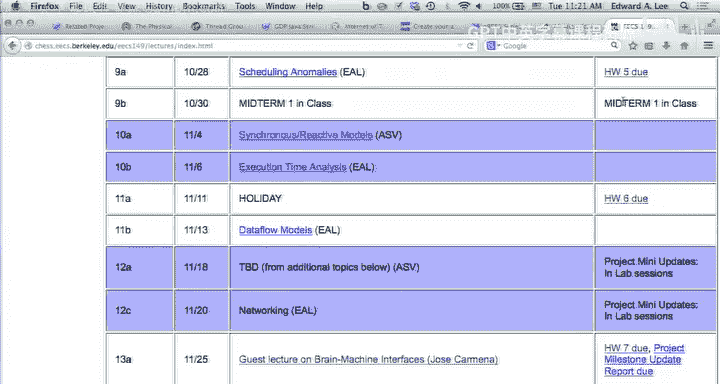
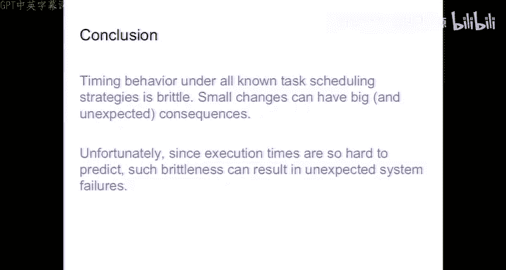

# 嵌入式系统：第20讲：期中复习与调度问题深入探讨

在本节课中，我们将回顾期中考试的相关安排，并深入探讨嵌入式系统中的实时调度问题，特别是考虑任务间依赖关系和互斥锁时，经典调度理论面临的挑战与局限性。

## 课程公告与项目安排

今天是10月28日。作业提交截止时间为今晚午夜。我们将在午夜发布作业答案，因此不接受任何迟交的作业。请按时提交。发布答案的目的是为了帮助大家复习即将在周四举行的期中考试。

关于办公时间，由于明天下午有年度评审会议，我明天的办公时间将从上午10点调整到11点，而非原来的11:30到12:30。今天的办公时间照常，为下午2点到3点。欢迎大家前来咨询期中考试或项目相关问题。

关于项目，我们已经审阅了所有团队的项目章程并提供了反馈。接下来，请各团队与一位GSI会面。建议你们选择一个本周（或下周一）的实验课时间段，并尝试固定下来，以便团队能每周与GSI定期会面。GSI将在常规安排的实验课时间段提供办公时间支持。每个团队将被分配一位GSI作为主要联系人，协助处理订购零件、解决问题等事宜。

由于本周的年度评审和其他活动，实验课时间有所调整：今天下午的实验课将从3点持续到5点；周三的实验课将提前一小时，从9点开始到12点结束。

项目章程整体质量很高，许多项目颇具雄心。我们鼓励大家采取科学的工程方法。例如，如果你的项目计划使用传感器识别人脸并与同学进行自然语言对话，请制定备用方案。一个好的通用备用方案是：针对一个问题陈述，评估一系列候选解决方案的有效性。这意味着你需要对传感器进行测量、表征和建模，并确定它们解决该问题的适用性。以这种方式构建问题，即使所选传感器无法解决问题也是完全可以接受的，因为你构建了一个科学实验来评估该问题。请以此为目标，进行高质量的工程分析，这比仅仅做出一个炫酷的演示更重要。

关于订购零件，如果项目章程中提出使用特定处理器板但没有给出充分理由（例如“我上学期用过”或“我抽屉里有一个”），这不是一个充分的理由。如果学校已有的平台具备同等能力，我们将不会批准使用教学资金购买功能重复的平台。如果你有充分的理由，请务必说明。

## 调度理论回顾与深入

上一节我们介绍了实时调度的基本概念，本节中我们来看看在更现实的场景下调度理论面临的挑战。

实时调度是一个庞大的研究领域。我们课程的目标是让大家了解基本术语，并对这些理论结果保持一定的审慎态度。理解这些调度结果的关键在于，要明白它们所解决的问题往往并非现实场景。

### 单调速率调度

单调速率调度定理假设有n个周期性调用的独立任务，周期明确，且所有任务都有最坏情况执行时间。任务之间没有交互、互斥锁或优先级关系。这并非一个非常现实的场景。

尽管如此，该定理提供了一个有用的指导原则。定理指出：如果存在任何固定优先级分配能产生可行调度，那么按周期排序优先级（周期越短，优先级越高）也能产生可行调度。重要的是要理解，这并未说明这是“最佳”调度，它只说明在满足每个周期执行一次任务的所有调度中，如果存在可行调度，那么单调速率调度也是可行的。这就是其在“可行性”意义上的最优性。

### 最早截止时间优先调度

最早截止时间优先调度与单调速率调度有几个关键不同：首先，它允许优先级动态变化；其次，它不需要预先知道所有任务；第三，任务不需要是周期性的，它们可以在任意时间点到达并准备执行，每个任务都有一个关联的截止时间。

霍恩定理指出：对于一组具有任意到达时间的独立任务，在任何时刻执行所有可用任务中绝对截止时间最早的任务，这种算法在最小化最大延迟方面是最优的。这是一个更强的结果，因为它对不可行调度也说了些内容：如果最大延迟被最小化，且该值为负，则调度是可行的。因此，如果存在任何可行调度，最早截止时间优先调度也能找到可行调度。

## 引入现实约束：优先级关系

现在，我们通过增加更多现实因素来扩展这些结果。我们将考虑两个问题：优先级关系和互斥锁。

首先考虑优先级关系。假设我们有一组六个任务，需要执行一次（非周期性）。任务间存在优先级约束，例如任务1必须在任务2或3之前执行，任务2必须在任务4或5之前执行。这些关系可以用有向无环图描述。

在这个例子中，任务2的最坏情况执行时间为1，截止时间为5；任务4的执行时间为1，截止时间为3。这里存在一个奇怪的情况：任务4的截止时间（3）早于其前置任务2的截止时间（5）。如果我们盲目应用最早截止时间优先调度，由于任务3的截止时间（4）早于任务2（5），调度器会先执行任务3，导致任务4错过截止时间。然而，存在一个可行的调度：先执行任务2，再执行任务3。

这并不违反霍恩定理，因为霍恩定理针对的是独立任务。这里的任务存在依赖关系。

解决此问题的一种方法是“最晚截止时间优先”反向调度，由Gene Lawler提出。其思想是反向时间线做决策：首先决定哪个任务最后执行（选择截止时间最晚的），然后反向工作。另一种方法是修改最早截止时间优先调度：根据优先级关系修改任务的“释放时间”（即任务可开始执行的最早时间），并基于后续任务的截止时间和执行时间修改任务的“截止时间”。经过这样的修改后，最早截止时间优先调度在最小化最大延迟方面仍然是最优的。

在实践中，截止时间往往是通过合同谈判确定的，可能并不完全合理。例如，在波音787梦幻客机的电气系统中，关键负载不允许断电超过50毫秒。这个数字源于子系统供应商之间的合同约定，而非纯粹的工程考量。

## 互斥锁与优先级反转

接下来我们看看互斥锁可能对调度产生的影响。互斥锁确保一段代码（临界区）不会被多个线程同时执行。当一个线程持有锁时，任何其他尝试获取同一锁的线程都会被阻塞。

优先级反转是一个经典问题，曾导致火星探路者号频繁重启。场景涉及高、中、低三个优先级的任务：
1.  低优先级任务3持有锁。
2.  高优先级任务1就绪，抢占任务3并开始执行。
3.  任务1尝试获取任务3持有的锁，因此被阻塞。
4.  此时，中优先级任务2就绪。由于任务2优先级高于任务3，它抢占任务3并开始执行。
5.  任务2可以执行任意长的时间，实际上阻塞了更高优先级的任务1。

这就是优先级反转：低优先级任务间接阻塞了高优先级任务。

解决方案是优先级继承协议：当一个低优先级任务因持有锁而阻塞高优先级任务时，低优先级任务临时继承高优先级任务的优先级。这样，当中优先级任务就绪时，无法抢占已继承高优先级的低优先级任务，从而避免了无限制的阻塞。

## 互斥锁与死锁

另一个问题是互斥锁与优先级交互可能导致的死锁。考虑两个任务（任务1优先级高于任务2）和两把锁（A和B）：
1.  任务2先获取锁A。
2.  任务1抢占任务2，获取锁B，然后尝试获取锁A（被阻塞）。
3.  任务2恢复执行，尝试获取锁B（被阻塞）。
4.  双方互相等待，形成死锁。

优先级天花板协议可以预防此类死锁。该协议为每把锁分配一个“优先级天花板”，其值等于可能获取该锁的所有任务中的最高优先级。一个任务仅当其优先级严格高于当前被其他任务持有的所有锁的优先级天花板时，才被允许获取一把锁。在上例中，锁B的优先级天花板是任务1的优先级。因此，当任务2持有锁A时，任务1（其优先级不高于锁B的天花板，即它自己的优先级）在尝试获取锁B时会被阻塞，从而让任务2有机会完成并释放锁，避免了死锁。

然而，确定“哪些任务可能获取哪把锁”需要进行静态代码分析，对于像C这样允许任意指针操作的语言，这可能是不可判定的。因此，在安全关键系统中（如航空电子设备），工程师常常选择完全避免使用线程，转而采用更可分析的并发编程模型。

## 调度算法的脆弱性

总的来说，基于优先级的线程调度算法是脆弱的。“脆弱”意味着微小的变化可能导致巨大的、非预期的后果。理查德·格雷厄姆提出的“格雷厄姆异常”清晰地说明了这一点。

他展示了在多处理器调度中，存在以下反直觉现象：
1.  **增加处理器数量可能导致完成时间变晚**。
2.  **减少所有任务的执行时间可能导致完成时间变晚**。
3.  **放宽优先级约束（给调度器更多自由）可能导致完成时间变晚**。

这些是非单调性的例子：提前完成反而可能导致最终截止时间被错过。这种脆弱性使得系统在安全验证方面异常困难。在实践中，大型复杂系统（如联合攻击战斗机）的软件也遇到过类似问题：看似无关的代码微小改动，会导致其他部分错过截止时间。

## 总结与审慎态度

本节课中我们一起学习了实时调度在引入任务依赖和互斥锁后遇到的复杂问题。我们回顾了优先级继承和优先级天花板协议等解决方案，也通过格雷厄姆异常了解了调度算法的内在脆弱性。

这些调度理论结果提供了有价值的工程指导原则，但必须谨慎应用。理解每个定理的前提假设（什么没说）与实际系统的差距至关重要。对于安全关键系统，仅依赖这些调度理论是远远不够的，需要更严格的设计、分析和验证方法。希望本课程能帮助大家在未来的工程实践中，既懂得利用这些理论工具，又对其局限性保持清醒的认识。

祝大家期中考试顺利！