# UCB《嵌入式系统｜EECS 149  249a Introduction to Embedded Systems fall 2014》中英字幕 - P11：-11-Execution Time Analysis - Lecture 6.zh_en - GPT中英字幕课程资源 - BV1rBgDzRE2s

好。So I'm talking with people in the back。Can you hear me？嘅 o。Well。Okay， thanks it work。 So okay。

 so thanks it work for the introduction。 So I'm going to talk today around this。

This autograder that we designed originally for the MOC version of this class that ran from May to June last yesterday and then that you have been using during the previous lab。

Okay， so the title of this title is integrating a CP lab with the generic。Title using S topology。So。

 essentially， I'm going to introduce。也这'支持。然后那话。Again can。No。But I do。

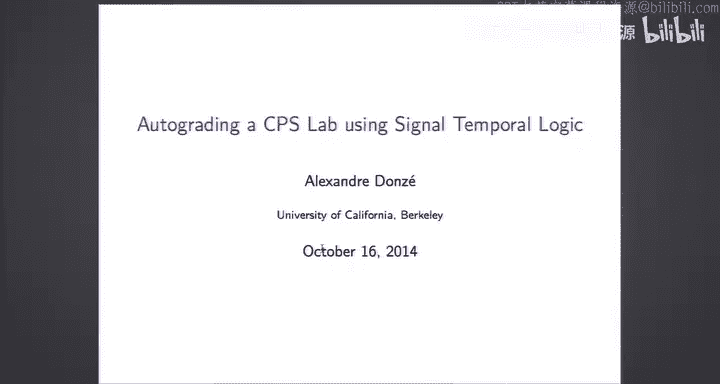

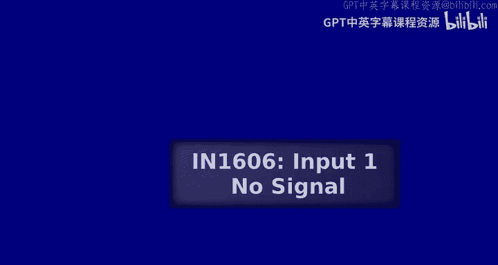

可是啊。Okay。So that is the microphone works now。I'm thinking the by the back。Its what？Okay。

 it has to be very close。I thought this thing wasn。ok。Okay， I'm going to talk like this。

 I don't take it that anyway。嗯O so呃。And put it under the。Yeah。Okay， I'm going to go ahead and。

Tk like this and interrupt me if you cannot hear me。Okay， so。

I'm going to start trying to make a connection with the previous lecture Bi Alderto。

What does it mean to grade a CP model design？So I mean the purpose of grading one。

 there are two proposal， so first purpose is two， okay。

 that's a design we assignment of the lab so you have an assignment you should build the design that does this or that。

 and so does it mean this assignment。And of course， students are not perfect。And they make mistakes。

It's our job or the job of instructors to have them understanding what went wrong。

 So grading is not only verifying that design work or the program was solve， but also about。

Even benefits if it works。I mean if it's imperfect， if it doesn't work， or even if it works。

 finding the imperfection in this design and trying to give feedback to the students。

 so if you have an imperfect design， then provide some explanation of what went wrong。All right。

 so last week。Alberto or La Albertto talked about a technique to automatically verify that the design satisfied our requirements one。

So that can be used for the first purpose， like does a design mean there's assignment。

 it's more than checking。And Ma chicken comes with。We is a nice feature。

 which is that if the design does not meet a requirement， then you get a pun for example。

 so this can be taken as an explanation。はい。Now， okay， so mother shaking is about model。

 does a model satisfy some specification？And what we got to presented is a model in the case where a model a fine state machine and specification LTF formulas。

In the case of the cyber sea。The Irobo creates， what we have actually is some hybrid system。

It's not really directly in an fine suit machine。And。

The specification I'm going to talk about are an extension of ATL。

 which is called signal compo logic， which is more adapted to。スケセ対。

So one problem is that model checking STL is intractable for complex CP。And that's。

That's the case of cybering， this is a complex。Cber security system， this is a complex system。And。So。

In that case， we resort to what we call lightweight verification or sometimestime runtime monitoring。

 which is a more tractable approach。Which results in simulation。And monitoring。That is the model。

Produce some trays。And we have some monitor that's going to say， okay， this stress is true or false。

And we didn want to。Verify model check this model， we would like to do this for every possible trace of the。

So。Think of it as an incomplete like depth first search for mother checking。

Like you're doing simulations and if you're doing an infinite number of simulation。

 then you're going to model check yourself。But。If you're not， so the nice thing about it is that。

If you cannot do an infinite number of simulation， obviously。

You already have a results over a the finite number of simulation that you have。

So you already know for the final conversation that you did gives this for satisfy。

So you have information， and it's particularly useful。

 so you can still easily define contra example in that case。

 because if anyone of the simulation did not satisfy the。This situation that you， if you have your。

来居住人一区。Usually cannot prove that the C court because it cannot do this。Theres manyテジ。Okay， so。

If you come back to another tail。What does it mean to monitor an NTF formula。

 so it means that you have a trace？So Is say you have a trace， which some AA。你你别你你你你你。Right。

And as we know， the simplest LL formula are predcate like A or B。

So monitoring this is just finding the true value of this。prediiccate on this sequence。

 So it is true。To to否责。Now， how do you monitor NA B？Well， as you know， the formula x next V is true。

If they is true at the first time point of the segments。So。And the next says the time。

The event after。So if you look at the first event and the event after you look at the validity of B and you get。

The satisfaction of next。you can monitor。And you can do this for subsequent time。Okay。

 so now what's the validity of always a。Well， you look get。

You look at two six ones and always A says that for every event。A should be true。So it's true， true。

 true， and then at some point it's false， so this false just provides you printer example for you always。

Okay， so my formula。那我方确的异议。Sa you look in the future。也就。Then。

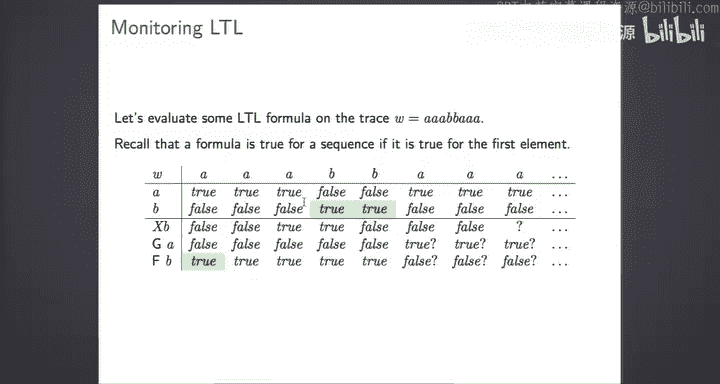

嗯。And then。So it there and same thing for M toB。Okay。Yeah， so this is， I mean。

 briefly how you will monitor。And that's a formula of our discrete sequence of。啊，そ。

Please interrupt me if you have any question。因为他是。So are you talking about this。都。Okay。

 so you can look at。Here。Can you evaluate this on this surface of this format？Well。

 because you're in a monitoring situation， maybe you don't have all information。

 you have a finite observation of your system。せ？Okay， it said it to always be true。

 but you don't know because。You don't know the future。现在上诉。What I do so far。

 what I've seen is two so far。But actually you cannot tell。觉得 very。好了。就是。So。Both。各有意。

There's like this limit。This is Veriz hurricane。ああ。

O good value that I showed here without the question mark are de true value。It does not depend。对。

当在三放的。Whatever happens happened after。就以这。So。I mean， what this it illustrate is that in the brain。

Because could have funny trace。那个 bank。关。You have places where you cannot decide。

Because some formula you can only decide them on infinitefin。Mor。Every。Even you。We don't have things。

Yeah， we don't have the series。こくれの。Yes。You直为改。This I is what I can to against the。Because。

You and then me。来。Because I don't know whether there will be week。Okay。

 so here I put the truth value of K and B that on the trace。ラピピし。第二。It should be true at the first。

最近。我你这是。なんです。Semantics。It has to be true of this。O。So after this first small reminder atTL。

 I'm going to switch to the rest of the talk， I'm going to talk about STL so signal term logic。

And then I will switch to a CP grade to the autograding system that you use in cybery。All right。

 so StL is an extension of FTL with real time and real value。

So to give you a first supporting example。Running example， if you wish。

 so the classic property in HTL request brand property in HTL is。Like always。

 when you have a request then eventually。You get the grant。So in this。LTL formulala。

 we have gu and prediiccate errors true or false， grant is true or false。

 and we have discrete time that is we observe sequence。Disreet discretereet events。

The first extension of this is with real time where now。We say always when we have a request。

 then eventually in 05 seconds we get the grant。So here we still have million credit errors through。

A false rates were false。 And we have the。The requirement of that G happens in 0，5 seconds。

 and it could be like any。Real value， real time value。And STR has a layer on top of this。

For the pretty kids， you can specify。You can talk about the signal values themselves。

 so x and y are signals， now we have predicted that over signals from the Z values。

And we have real time。ok。So and if I detail a little bit more about the syntax。

So talking we assume that we have signals which are function from R to。RSo that is turnstime signal。

And for example， in our case， we have position， X， Y， Z， orientation， sensor of values。

 is the whole function of time。That goes into the de。Then we did by x of to。

 the value of x at the time to。The atomic predicates our inequalities over single values at the symbolic time key。

So okay， so x of t greater than 05，0 of t greater smaller than4 AWS is in our cases is left wind speed and right wind speed。

Andm great there's than onem right。And when I say symbolic time T。

 I mean that when I evaluate this formula， I'm going to replace this T by a concrete value。

Become here。这别。である。都没创错。Yeah。We still in the syntax of his steel， we explicitly。

Use the values of the signals。Yeah。Yeah， I see the Boolean function， still。

T it to MTL once you you get to Juliaan。Right。Okay， so Tom call period， or we have。

We have future globally and until as for LTL， except that now they are equipped to the time interval。

 so for example。Fture in 02 second， xFT greater and 05。

 always 040 Y of T is smaller than 03 feehi until in one， 2 to5， et cetera。Yeah。でてまで。我的。し大臣。

So the semantics of this until formula there will be。Yeah， it really be by issue。按接十单。The five大ュ。

C in this cinema it has to be true。Okay， so wed like to make the formula like fall tell you evaluate for the first。

So the first event for nestal formula we evaluated at drawing zero。

And we evaluate to soup formula and future value depending on some operators。So for example。

 this atomic prediiccate of T is greaterters on  zero5。一応？It actually。If we rip this c by0。

 then we get something else to。So x of 0 is greater than 05 than x of t greater to0 5。です。Now。

 eventually， our01。X of keep under five。你处一批法院以来。0，1 in in one0 and one the three。好回事。Re places。

If that accept never five。Yeah， there exists。There exists at2。

 there exists some a value in 01 that three so x of zeros value。Okay。Then always。

 if you have always 01 to3， some set formula psi， this is true if psi is true at all time between 0 and 13。

 and psi is true at all time between 0 and 1 to three mean that we will evaluate psi。

On the cis of the trace。Which will start between you and one。嗯。Right， so some visual example。呃，要这一下。

Read go there。And you want to say that it's never the case that the signal is above 3。5。

 then you would say always x of t is smaller than 3 to5。And。一。TheRe where you're。

Your singer should lie in order to satisfy the phone。あ、ビろ中。That case is true。All right。

 so between two second and six second， the signal is between minus 2 and 2。啊等。Again， always2 secs。

 26， or global E26， x absolute value of x smaller than two。We went for two seconds from Tanjiro。70。

In order to satisfy the property。And maybe a more interesting program。

This is a stabilization property that's often used in control systems。

Is whenever X is like overhooted。Okay。It should settle back。

It should stabilize at some region and stay this region for some time。

 so always x of t greaters than 05， then eventually 006 second。Always。For once。

 the five second XFT is more than 05。And that should be an absolute bad。多少钱。Now。

 once I something that it's a bit more complex， but。你性啊。你是个账。that准没 get。mean that has go back。

And stays there for for long enough。感个。Here， I need game my re。The back。On the fact。So again。

 these properties satisfy on this signal。Questions。Yeah。所以在这个不是。So you havet no。

I a dog form not here。So this means that the sub formula should be evaluated at all times。那意思。

X of t greaters than05 lies something like all times。我我那份我。some05。第二。本然。Because it'splication。

From the times。一推避回来提。To the time where it exists this patient， right？For the 95 Division region。35。

second always。Not just here。What more。This is just equivalent。Testing。So this hallway。

 I mean hallway。you be equivalent to a report put the formula on all of the formula alls of the。

And if you have an eventually， then there exist one theix of the formula。

 such that the formula is true。All right， so this is my overview of STL that's been used in the。

In the greater。So now a little bit about。The architecture of the tool。OfWhat we did。So weorgan that。

With the grading system inside cyber team around what we call are called test planss。

And those test plans。Like I said， so this is runtime monitoring。Verification， so。

The test are comprised of。It test cases or test traces。But there are a second number of。

Different traces。That are obtained in specific environment settings。 So you design。

 So this is a simple part of the system。That everybody can understand。 So you make test cases in。

And ideally， those test cases should cover like all situation advantage to design performance。

 every situation that can trigger。And there are。Or something， some bad behavior that can。

Po situation where you can detect a problem with your system。And这是加证一。其实存的上了他这己。And for each。

 for each of these test cases， then we have what we call four monitors。And food monitors are。

Essentially essential properties that characterize。Fal in the design。

 so we have traces and for each trace， we have a certain number of STL properties。

And each of these STL properties。If it is true。It means that an error was detected in your design。

But that's the way we are protectinging the。Now。This should detect any behavior that indicates some known force。

And again， this is not easy to come up with a library of known folds of interesting relevant fold。

 et cetera， but the first fold that we have。Is that it' is not satisfying the design requirements。

So the default， like the default test test plan that we designed have。Simple dis cases。

And a simple property that just encode what was required from you。Okay， and so。

So the general structure of follows this ID， so you have declaration of signal parameters and formulas。

And then you have the of tests。So you did got test one， and for each test you have fault one for two。

There's two are fall， et cetera。Okay。Greater will just go through， and I think you observe this。

 it will just go through the different test cases。So the different simulations。

 so you saw that the system was simulated for different environments。And for each of this simulation。

So for each stress， you get the stress。From the simulator and for each folks for each you check the SD monitor。

 the STL formula。And you print some feedback at hunting of whether's formula satisfied on it。

And we have a small conditional， which is if the fault is critical。

 meaning that it's not really the fault is critical， like the feedback。If we feel that the feedback。

Provided by this fault is a。Should be addressed right away。We just thought we don't go over all。

This is very simple。We感。啊。Okay， so let's go through a complete example。

 and then I'll go to the wheel thing。Again。Okay， so。First thing that we declare signals。

Parmeterters and STF formula and chip formula。 So and in the sameax of this file。

 I'm just saying okay。I me just use XMY signals。在来的反应。The language supports parameters。

 so I'm going to define y mean and x max， which are just constant parameters。

And I'm defining a sub formulaula， and when designing a test。

 this is very important to decompose your test and your formula into sub formulaula that are easily understandable。

I mean， designing an STL property is not something。

So you have ready to decompose it in simple elements。Writing a very simple pre。再见。

A formula without visual comp operator。Which。A region of this place。And I'm calling this version。

I'm going this predicate inreently。So which means that when this is true。

 my robot is going to be in the region that it has to do。And this is Y T is smaller than Yin or。

So if either Yt is more than one mean or xt greater than x max， then I mean the that region。

And the top formula， which we encode that the goal is missed actually， is okay， always。

020 in to lead。 So basicallyly， what I'm saying here is I'm setting a goal。

I'mco the assignment that my robot should leave a region in 22nd。So if this formula。

 always the would in region is true。It mean that the robot failed。

Now I'm defining a death in the syntax for cyber team， but we had this syntax， we said， okay， test。

 we declared a test NAV one。And we use environments。Obstacles south left。So this is one of the。

If you look at the file that you have there are certain XML files and Rmon files。

So this is one of the environment that comes with cyberin。

And I have a- so this parameter in that case is a time of simulation。

The simulation time so I'm asking cyberstein to give me a simulation from  zero to 20 litter fan。

And notice that it's like he's。This is slightly longer than the horizon of my formula。

 My formula was always 020。 and I'm just saying okay， I I want。A trace which goes until 20。

1 so that I'm sure that I can。Again。Decide whether my formula is true or false because I have all the data。

😔，I'm not interested， I'm looking from time zero until time 20。

 so I'm not interested into anything that's goes。Okay。I now my fault。

 which is like the basic first fault。As cold needs for goes needs will。This is name of fault。

 and it will use the property。We'll use property if you don' need that I just。

And the feedback that I。Provide the user。Because it just happened that。嗯。

So this is one way of cocoing the the。The generic requirement that I want to avoid this obstacle。

 I know that in my environment。In this environment。

 the robot starts at a given position with respect to the obstacle。

 So if it tests in the region that I define， it mean that it didn't go over the。Okay， so yeah， let's。

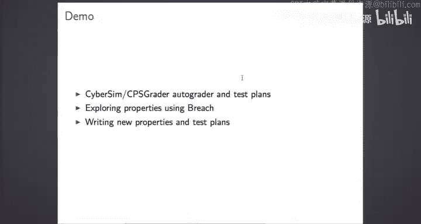

这子。M Park。

All right， so this is the our familiar。诶咪。Okay， I'm using my own spatial graphiced solution there。

Okay， so if you remember。只管他跟第二。Okay， exactlys about exactly what I just described。

So I stopped I kicked press stop button。佢嗰先。So。现在。The thing you read it read。

 the test land and it loaded is a special test environment where there is just my robot and that what I' pick up。

And my robot staff front。From facing the depthtacle in the left direction。And I'm saying that。

I should leave this region here。Very good。And so my robot did that。呃，租。

And I got to the feedback the program was passed。Stover was about you。you have questions so far。

It's not to you。So now let's look at the actual test plan that was。That was used there。

This Baham this release we had。The feedback mode had at like four。Most possible given navigation。

 they hill time and auto grid。Nation of the done。So in Dbug mode， in Dbug mode， purpose。

Was to try to provide you some useful feedback by checking。

As many properties as possible that could indicate a force that you could have done。And。

So each of these modes correspond to one different testpan。And the autograde more than we。

Just remove those tests for。And that giving you feedback in just。Tested， but the requirements。

For the， for the problem。Okay， so's。Okay， so if you're curious。Those those。Test plans。

 they're located in your courseware。Or guide or folder， you have a simulator。Se folder。

Cyber seammed a folder， and if you go， it was in cyber seam slash data。

So if you look into the set folder data outsiders， then you will find。You will find those。STL5s。

 feedback now give。Et cetera， let's so get this one。Next once。啊，OK so。

I was expecting one of my two tools。人生をかな。

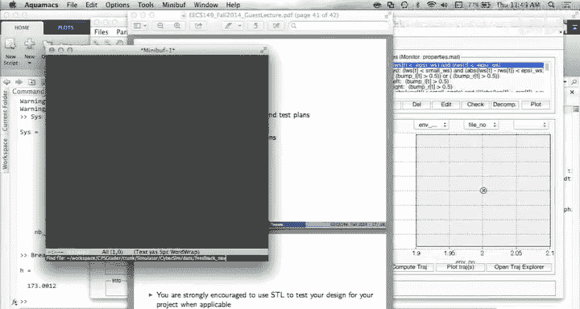

All right， so this is the test panel that was used for the feedback。Nviigation。我。So。

So there are quite a few。Few properties and a few tests that implemented on it。

And so I'm going you to go through some of them。Just look at。So this， well， this this is。

During specifically。Yes， sir that I。Inplement。So， this is。Well， STL monitoring to。Yeah， this this is。

相信。So也 has parameter。Okay， so。So we have these simple fold。

 so I don't know how many of you are bound into this simple fold。

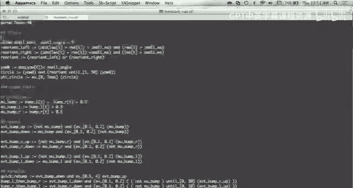

This is the strip of fault。 So this is the footwear。 Okay， let me show you。

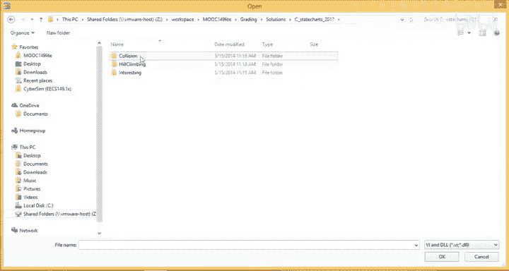

have this behavior。Did you see what happens here？Can， can anyone tell me what's happening here。有孩子。

So this is the。Okay， so what do异议。This is our example。But。Okay， so what we have here in that case。

 what happens is。2 says first。对二。The robot did not avoid those take on time。It is sad in this region。

But to use assume maybe the previous simulation it actually could go over。

 so the previous simulation it could go over。So the Ro sticky speaking was met。

But here its imp perfect。And that case didn't work at all， he didn't manage， didn't did it at all。

 and what we identified as a fault。翻。The that是。反院说明单。Was a circle this kind of behavior。いポこ。我没有这样。

个黑有杨子若把。You make a treaty quality check for the angle。

Where you want to go and because it' sample the thing。

It has to do several circles before actually reaching， hittingating this exact value different。

So that's the feedback we provide。That's tool can provide you。And we consider that this is。

F that should be 15 now， so it just stops the testing。嗯。And then say， okay， just go deeper good back。

don大。So actually。We designed most of those falls before。And based on the previous it of this class。

 a few guys last year。So we collected last year。The full edition of the。We corrected all the。第子。

Solutions of the。And the garbage and all work on this to。My observe like this is G I observed。

We tried to make a librarian of those。Inコ。behind子都不要点。So maybe in该 want control。

So this one is for the head climbing test。Okay， so we real time in test。 Okay， what we have。

 what we have here。Okay， we have a。But you have here the robot just go there and instead of going up goes down and this happens sometimes you just reverse if you reverse the X and Y axis in that perimeter。

Then this is what happens， so maybe you can check the sign effects text。呃。

So we try to encode this so I can go through this plan and so this plan tried to encode these different things。

So for the circle， the way we did it there。Was we define。

We define prediates that says whether the robot is reorienting itself cell format。

So I'm we arounding。That is I'm turning left or I'm turning right。

And the way I do this is I'm looking at the absolute value of the。The that's why we speed。So。Okay。

 basically， it's the。Yeah to do that。 Okayー， yeahや， if the。If the sum of the left white will speed。

 then will right will speed。Is smaller than some value。

 which mean that they have a different value an opposite value。Very给り。And if read， it still is a。

But greater than something I know that I'm turning right。And same thing for right。

Le we speak is better than something that I knowm telling has。

So now I have two predicates which tell me， okay， I'm turning after I'm。We want less we that。

And then I combine those two to make an abstract indicate that combines both of them。

 so' either it's left or or right。ok。Then I'm checking。I'm checking whether I'm heading。

In a given direction， so I'm heading zero。This is your。And now my central property says。

At some point， I'm heading。In this direction。And I will young。Until so I do a full circle。

 so I reient。The until reach again this value。Do you see why these works？れで？没有。Okay。

 so you is the orientation of your robot。So absolute value of few is smaller as some angle mean basically that you're heading directions zero。

I think you is。So youre beginning to detect this。So end。

So this predicate says my robot is heading this direction。Do you' assuming in his。So yeah。

 then this preates says I'm adding this direction and then I'm constantly turning until I reach again this position I never stop turning。

你这边。This is what it does。And the typical property。How did the property the detective behavior is going to check this？

At every time and see if there is any time in0 T max where this。And okay， I can't make this。

I think I can make this more visual。😔，嗯。Iing another to。実生？So。

So this is a meta tool where you can collect signals and verify C properties and check and C properties。

So I think I won't go into the details of this。If you were interested。So more of it。

But here in this interface， what I can do is that I can explore single values。

And then I can explore the satisfaction of the properties。Here。

 just the single values correspond to one recorded simulation。Of cyber scene， sometimestime。Okay。

 and this is one that does exhibit thecibehavior。And this you can observe。So， okay， so X Y basically。

This is the position of the robot if you plot。嗯。She brought this in the X， Y axis。

Then you can more or less reconstruct the trajectory of your robots。When。Back。This is。

Ticory that the robot。その場合。Yeah， these more or less。Okay， and you also there the。我样。

Have you we are thank of。G idea would what the difference between you and Mongo。

U is actually the thing that's written by the simulator。An angle is the simulated。

Value of the robot that's definitive。Engo day take。Yeah， so angle is what is measured by the robot。

And you is the absolute thing iss a good thing that the simulator knows， but anyways。Well。

 that's not go to do。 it's let' see the same。So angle。So okay。

 so what you' see here is that the end is gr。Fun benefits but country increasing， right？そいつで、すね。So。

 if you。Look at this。Okay， so we have the angle there。Now we have the proper TV。未な没用が。Okay。

 so what I represent here。Yeah can z me introduce。Is the V Y property？So yeah， just look at the Red。

And the bullan， the red single is the boolean value of this certificatecate， so what you can see。

To from this time。And第单。And through there。收。Well， if you look at three ors。

 this is the William paint， so this is variant left。This is Leoion right， the real young right。

was which your time。And。So what were the other components？This was。啊，有。

U role with the other predicate， should。And。You can see the。出证证明。Okay， so and it's calibrated to the。

The initial orientation。住めて。We安静。当方。Don't just making circles。So， my single property。Yeah。

 nice see put property is there。Okay so this is my sacred program now。那还是给你再开庭。一二。没错。

ThisIn in the orientation。The only answer was two。Okay， that's why。So this this。This school here。

Then。And thenon。对。So this simple property。And then the top， again。

 the top property should be true at time zero so my。If you look at C circle。All right。

 so now the goal is two。What I'm interested in。そう感じを。That。嗯。So。So we can。

 we can look at at other properties。 Okay， this， I mean， this one。This one is important。

In the slides， I said that there is no next operator。STL。Duringre any。Yeah。

 this is because it's because we have dance time， so there is no next。

 so we consider them to the next。Next event would be。呃。Yeah。

Would be something that happens in a small amount of time。

 so it so basicallyically the way it would encode this。

 it would be say eventually zero epsilon for epsilon very single。So know what you want to detect。

If you want to include events。In STL， then it takes a little bit of thinking because there is no next。

み感ですね。So here I encoded an event。Then at。Meaning that。

So you want to check that the bump sensor was down and at the kind of next tenant it was。

And so the way you do it is。First， first you define preates which define the state。呃，端。M bump。

 so you have mu bump L and mu bump L R。And in that case， there's a so treat with this cell。

 which is not so nice。That signalss are all considered to have real values。We don't have type signal。

 We don't have William single and wheel signals。 We have only wheel signals。So， that's 0。

A01 signal is considered to be well。It's a single that takes value， 0， R value 1。

And the way you detect if it's01， then you have to write a property bump L greater than 050。

それたいじなですか。さが務さ。那。人生が？Now for the Aund app， then you have notes。So。At some point in time。

 not than them。And。In 0，1 second， after 01 second。You get。New guarantee physics is true。

And this is a relatively safe way to encode， but then you have to be carefully are those。

Parmeterters here， depending on the。担子第要走秀。Okay， and so this is something we can。いえないし。

Can be useful to。So there。All right， so this is the actual。How don long is it that。收。Okay， so here。

And they dis simulate it well。Okay， so the simulator will sample each time it will look at the state of the thing element。

It's basically that the bump signal is if you're close to the wall。It will be up。

 so you you stay close as long as you stay close， I think it will stay up。So here we have one case。

I don't know exactly what happened。Where we have empty bullet bankss。We vote on that。

So while here you can look at it。0，3。2，2，5。So now if I want to check that。Smaり my。And here's what。

I guess。We get the red signal。So with this， that idea that I encoded the thought。

Where I do take word。This is the robot pump。Like frequently。でで work。いてない。でたい。

We return something that PSSA is something。Might be wrong because maybe you're not backing up enough。

We O when you try to avoid those stakeholders， so maybe you got this poll at some point。

But I call this quick revamp。So it means that we have a damp。有。I mean， the bump signal is down。

 so you just backed up。And in 05。0，5 second， less。So between 05 second and four second after this。

 you again have a done。So basically， I'm detecting this fault。I just set this parameter to say， okay。

If less is than four second after my bump， I bump again then something is wrong。没病 not。他。

Just the money to。This raises another。

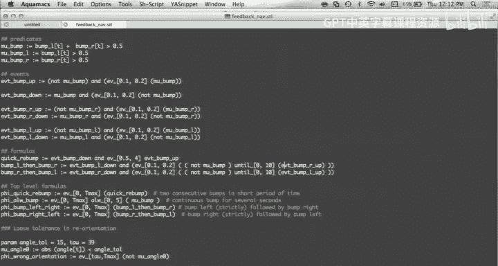

And okay。So this one is okay， this is relatively basic。

 so we bump and rubber bump immediately and the second one is more interesting。

 this one is more interesting， it says bump L than redb R， which means you bump in a。On one side。

And after that， you book on the other side。And this can detect the fact that your algorithm maybe is not preventing。

In the right direction。So normally you back up。And then you move in the same direction to try to avoid the stake in liquid good direction。

 so you should not be。One behavior。Here have one example。

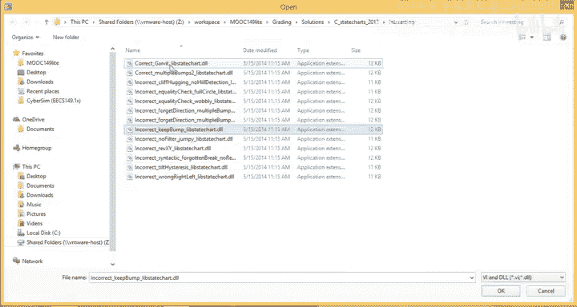

通した。Okay， anyway so。I think you get。Right， so now what I wanted to say is。

This language you can use with the release that you have with the rein。

 you can write your own test scan。So if you're interested in developing some new controller。

You were robot。For the I to create。Then you can write a controller。

And then write such test plan to see if it meets your design。

 and I think this would be a very nice project。Theres an explanation with the， et cetera。

So we do encourage you to do this and so with the Q， early that you have a cyberce。

 you can already do it and we plan to make it more flexible so that wet do not limit it to just one robot of our。

You can have more interesting environment。Or even many different simulators， not just diversity。

This is something that we are working on。Ready yet， but we be。

And so the way we can do already now is that you can replace those files。

 the feedback graphs are now you you know where this is。

 so this is a feedback N file in the data cyber data folder。So let's say， instead of。

If you want to write a new one。です。So this is the simpler one that I presented in the slides。あオケする。

Where I just。To find this vision that to be。Okay， I define my test。I thought。

Yeah I just just replace。Now I'm just going to replace that this。There。

So now I'm writing this into a background of this scale。を。Now if you do this。Yeah， so just executed。

嗯。If you want to。You。Like I said， designing is still proposition not toita。

 so you can also use my tool glosss， which called。

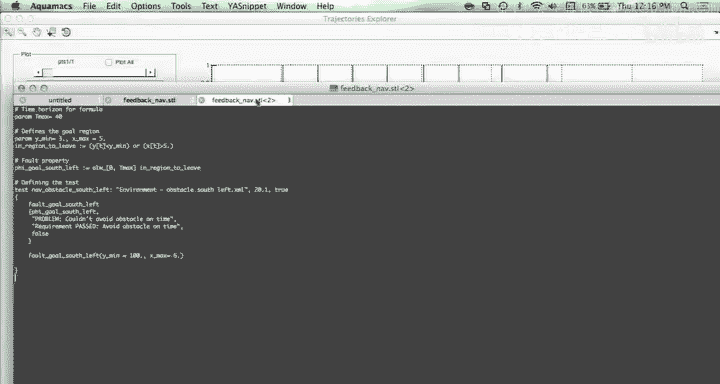

There's a bit of a learning curve， so。If you're interested in doing this。

 I encourage you to not wait until you're asking any question about it。Like what I just said。

Some employees to do this。And for your product， if you can。It provide support。In。Okay。

 do you have more。questions。啊，样。也都我没。I think we have， okay， we have like 13 million deaths。And one。

I think we had a visitor that wanted to make an announcement。

I think we we had a visitor that wanted to make。An南方。at the end of the class。tel the个。

I think I have to hold you there。Until2 already。

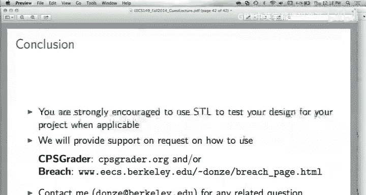

その今一番まで。There's more to you。Certainly。Th you can do at one and more examples。So， this work。Okay。

 so we had。そしてカさ。So the requirement of that。OnThe first。

The first navigation lab was that you pass the obstacle and then keep the rotation after the obstacles。

一这都是要进行。じあ。You just check the。A there just no more questions？

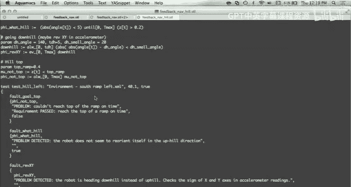

We got email。

So。ま円として。电。San Francisco？Really know much about it。対ビ。I'm here to tell you about it。と answer。

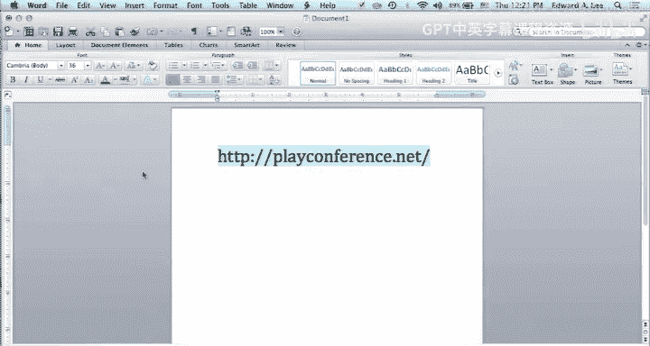