# 嵌入式系统：13：规范与时序逻辑

在本节课中，我们将学习状态机之间的等价与精化关系。我们将探讨语言等价、模拟关系以及精化的不同概念，并理解它们在系统设计和验证中的重要性。

## 等价与精化

上一节我们介绍了状态机的基本概念，本节中我们来看看如何比较两个状态机。等价意味着两个机器可以相互替换而不改变系统的可观察行为。然而，存在比简单的语言等价更强的概念，即模拟。

如果两个状态机是确定性的，那么语言等价和双向模拟是相同的。如果机器是非确定性的，情况则不同，我们稍后会看到这是如何可能的。

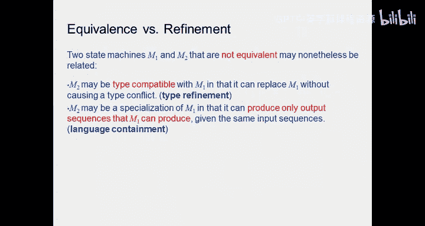

## 精化的概念

那么，等价和精化之间有什么区别？等价，如前所述，是指两个机器可以做相同的事情。而精化则不同。

当你有一个规范时，它通常告诉你需要做什么，但不会说明你不关心的事情。因此，当我进行实现时，我可能需要指定所有细节。那么，我是在复制规范告诉我要做的事情吗？实际上，我做得更少。这就是精化的概念。

为什么做得更少？因为如果规范只关心“向右直走”，而不指定步幅，那就意味着无论我迈大步还是小步都无关紧要。在实现时，我需要决定我的步幅。这就是我的实现。因此，实现是规范的一个子集，它包含的行为更少，因为规范包含了所有正确的行为，而实现只是从中选取一个。

精化可以有多层。通常，你有一个规范，然后进行第一次精化、第二次、第三次，直到得到实现。最终的实现必须是确定性的。无论你做什么，它都必须在物理空间中移动，因此必须是确定性的。模型可能是非确定性的，但实现本身必须是确定性的。

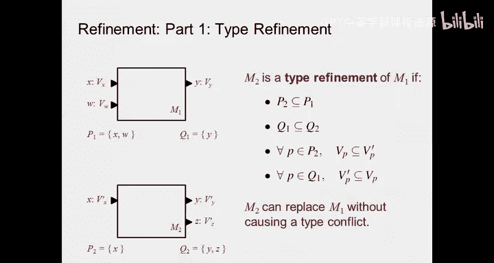

## 精化的类型

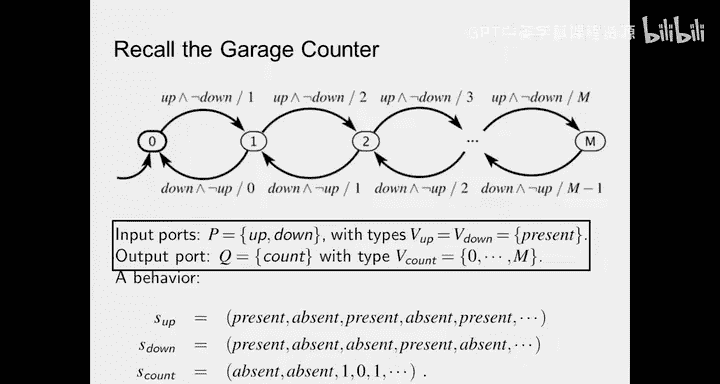

两个可能不等价的状态机 M1 和 M2 可以通过包含关系联系起来。M2 的行为全部包含在规范 M1 中。以下是几种精化关系：

*   **类型精化**：M2 可能与 M1 类型兼容，意味着它可以在不引起类型冲突的情况下替换 M1。例如，如果 M1 的输入/输出空间是实数，而 M2 使用自然数，那么 M2 是 M1 的类型精化，因为自然数是实数的子集。
*   **语言精化（行为精化）**：M2 可能是 M1 的特化，M2 只能产生 M1 能产生的输出序列，反之则不然。正如之前所说，规范要求“从这里到那里”，而我选择了一个特定的步幅，因此我的所有行为都包含在规范中，但规范能做的更多。
*   **模拟精化**：M2 可能是 M1 的模拟精化，即在每个反应中，M2 可以产生 M1 能产生的所有输出值。这意味着 M1 可以模拟 M2，M1 可以做 M2 能做的一切。

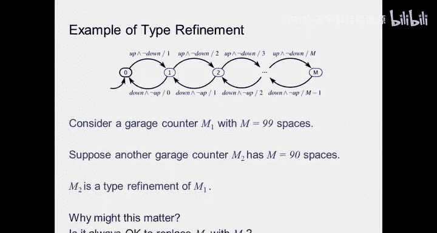

在所有情况下，如果 M1 在系统中是有效的，那么 M2 也是有效的，因此可以替换它。但这里的关键在于“有效”的定义取决于我们使用的度量标准。例如，比较手机时，“更好”本身没有意义，必须定义衡量标准（如速度、开放性、应用生态）。

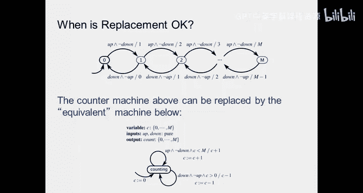

因此，精化的概念与用于判断两个事物是否相同的特定度量标准相关。通常，我们说 M2 实现了 M1，M1 是行为更丰富的规范，M2 是一个受限制的版本，不会超出 M1 要求的空间。

## 类型精化示例

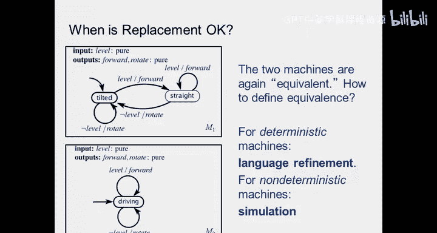

现在的问题是，如何判断一个特定机器相对于类型是否是另一个机器的精化？这很简单。

M2 是 M1 的类型精化，如果 M2 的输入类型是 M1 输入类型的子集，并且 M2 的输出类型包含 M1 的输出类型。输入类型需要是子集，以确保 M2 接受的任何输入也能被 M1 接受。输出类型可以更丰富，只要 M1 能产生的任何输出值，M2 也能产生即可。

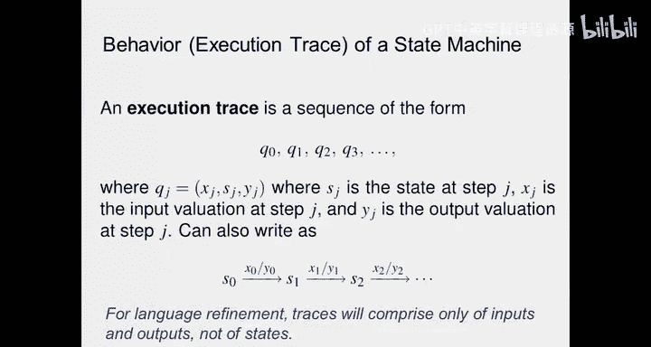

让我们看一个车库计数器的例子。我们知道原来的状态机是冗余的，可以简化为单一状态。状态 0, 1, 2... 对应于输出，输出和状态（计数器值）之间存在一一对应关系。

输入端口是 `P_up` 和 `P_down`，类型为 `{present, absent}`。输出端口是 `count`，类型 `V_count` 是从 0 到 M 的自然数。

现在，`P_up` 的序列可以是 `present, absent, present, absent...`，`P_down` 是另一个序列。根据这些输入序列，计数器输出 `count` 序列，例如 `0, 1, 0, 1...`。

一个类型精化的例子是：假设我有一个车库计数器，显示数字最多到 99（即计数 1, 2, 3... 直到 99）。我有另一个车库计数器，只有 90 个空间。由于自然数的输出空间包含在前一个计数器的自然数空间内，我们可以说存在类型精化。

因此，每次我进行类型精化时，我知道可以用 M2 替换 M1。然而，这并不总是可行的。什么时候不行？例如，如果有 92 辆车（或车位），而我的机器只能数到 90，那么当第 91 辆车进来时，我的计数器就无法给出正确答案，因此我不能用那个计数器来代表系统的行为。

## 语言等价与模拟

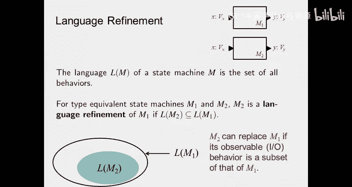

回顾简单的机器人模型，我们问：何时可以安全地用一台机器替换另一台？我们说，对于确定性机器，语言等价就足够了。对于非确定性机器，则需要模拟的概念。

但请记住，模拟是单向的。语言精化也是单向的。语言等价则是双向的：如果 A 与 B 语言等价，那么我可以互换它们，选 A 或选 B 都一样。如果是精化关系，则不能这样做：我可以用更受限的机器替换更丰富的机器，但不能反过来。

在非确定性机器的情况下，问题在于一台非确定性机器根据你做出的选择，可能比另一台机器有更多的行为。因此，我可以匹配它所做的任何事情，但即使看起来我们能产生相同的序列，如果我先行动，它可能无法跟上；如果它先行动，我总是可以跟上，但反之则不然。这就是为什么我们说模拟与语言等价的概念绝对不同。

## 执行轨迹与行为

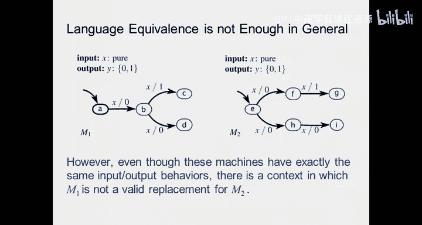

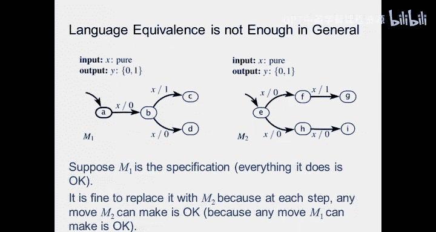

我们如何区分这些情况？我们将讨论执行轨迹。之前我们说行为代表了机器对环境的影响。执行轨迹意味着我有一个输入序列和相应的输出序列，我们称之为轨迹。

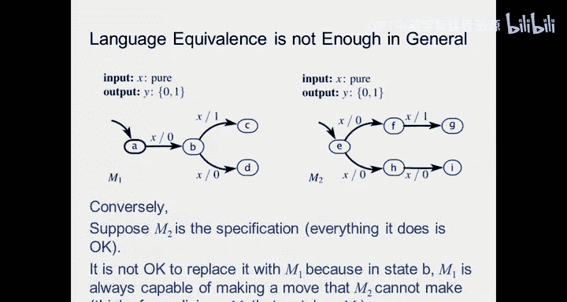

轨迹不仅包含输入和输出的信息，还包含状态信息。它不仅说明我给出了这个输出，还说明我从某个状态转移到另一个状态。因此，它比单纯的输入输出对包含更多信息。例如，我可以区分两个不同机器的响应，因为它们的状态序列不同。这就是轨迹包含更多概念的原因。

状态机 M 的行为实际上是所有可能轨迹的集合，即机器可以做的所有事情。这就是机器的语言。如果你了解一些语言理论，你会知道有些语言可以被有限状态机接受。这里，语言是机器可以产生的所有可能行为（输入输出序列）的集合。

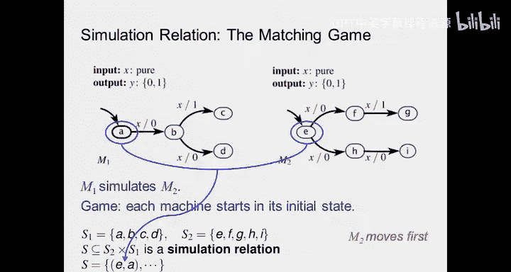

对于类型兼容的状态机 M1 和 M2，如果 M2 的语言包含在 M1 的语言中，则 M2 是 M1 的语言精化。这意味着我的行为比另一个机器少，但我的所有行为都包含在更丰富的机器中。因此，如果 M2 的可观察 IO 行为是 M1 的子集，M2 可以替换 M1。

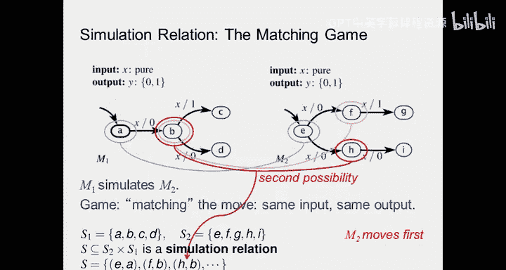

我们谈论可观察行为是因为，如果我关心有限状态机对环境的作用，我必须观察从该机器输出什么。任何不可观察的、不输出的东西我都不知道，因此相对于系统做什么而言，我不关心。

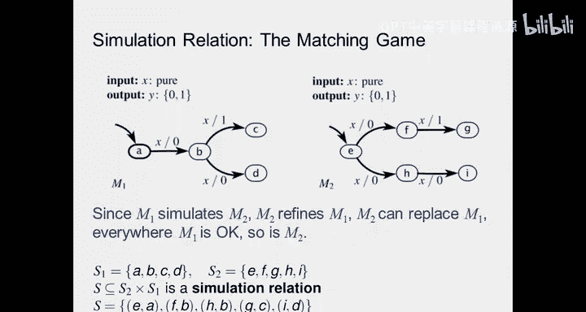

## 语言等价不足的例子

我们之前说过，语言等价通常不足。只有在确定性机器的情况下是完美的。对于非确定性机器则不然。

例如，考虑左边的确定性机器 M1 和右边的非确定性机器 M2。对于特定的输入，M2 可以进入两个状态（F 或 H），F 只能产生输出 1，H 只能产生输出 0。如果你输入任何序列，得到的输出是相同的。

但问题在哪里？让我们看看机器的行为。假设我从 M1 的 A 到 B，从 M2 的 E 到 F（这是一种可能的行为）。接下来，M1 的行为是走分支到 D，输出 0。在 M2 中，如果我在 F，我能产生 0 吗？不能。

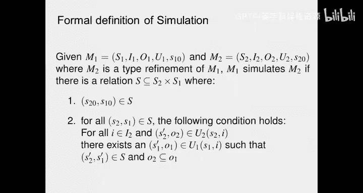

所以，由于非确定性，它们语言等价，但并非模拟等价。如果我让一个机器先选择方向，另一个机器后选择，我可以匹配行为；如果我调换选择顺序，则无法匹配。这意味着一个机器可以模拟另一个，但反之则不然。这只在非确定性机器的情况下成立，因为存在选择以及由此产生的大量行为。

因此，即使这些机器具有完全相同的输入输出行为，在上下文中，M1 并不总是可用于替换 M2。

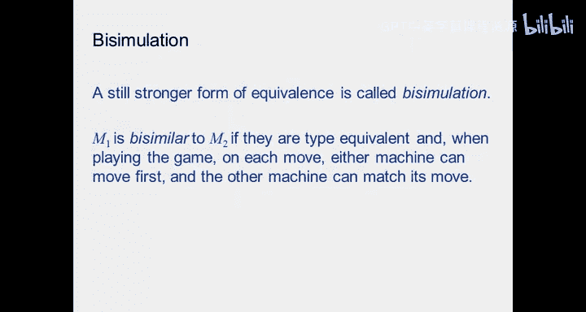

## 模拟关系

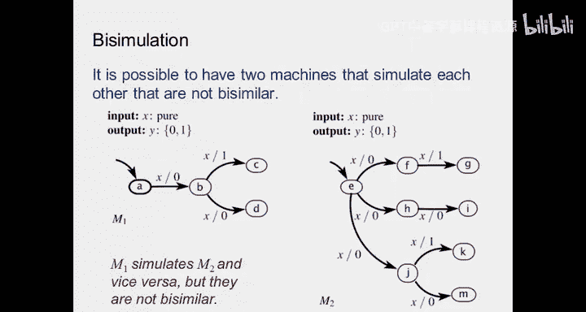

假设 M1 是规范。它做的一切都是可以接受的。那么，如果我用 M2 替换 M1，是可以的，因为 M2 能做的任何动作都是可以接受的。但反过来则不行：如果 M2 是规范，用它替换 M1 可能不行，因为 M1 在状态 B 总是能做出 M2 无法匹配的动作。

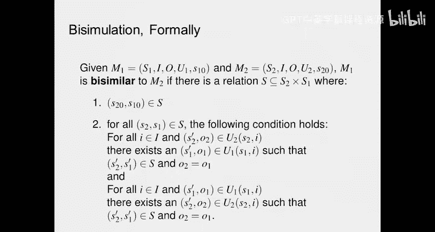

所以，一个方向是可以的，另一个方向不行。这是一种匹配游戏：你走一步，我匹配；你走一步，我匹配。无论你给我什么，我都有答案。

模拟关系是一种状态对应关系，确保无论我输入什么，这两台机器都能产生相同的输出。如何建立这种对应关系？我们通过构建状态对集合来定义模拟关系。

从初始状态对开始（例如 M2 的 E 和 M1 的 A）。然后，考虑 M2 先行动（在游戏中），它可能走到 F。M1 必须能够响应，走到 B。所以 (F, B) 成为一个状态对。或者，M2 走到 H，M1 走到 B，则 (H, B) 是另一个状态对。继续这个过程，我们可以得到所有可能的状态对集合，如 (G, C), (I, D) 等。

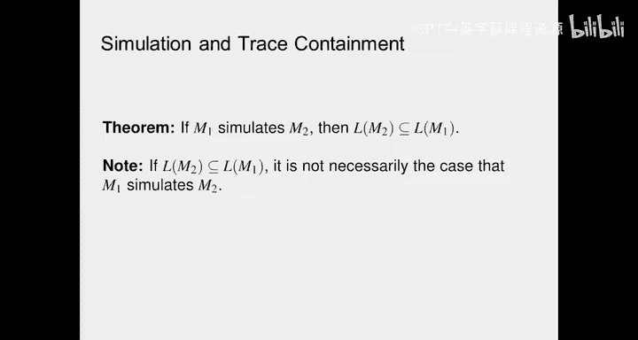

这个状态对集合被称为模拟关系。为什么关心模拟关系？因为这样一个集合的存在，可以通过算法分析并保证一台机器可以模拟另一台。因此，如果 M1 模拟 M2，则 M2 精化 M1，M2 可以替换 M1，M1 可以接受的一切，M2 也可以。

## 双向模拟

比模拟更强的概念是双向模拟。双向模拟意味着机器 M2 模拟 M1，同时 M1 也模拟 M2。在游戏中，这意味着我可以先走，它可以跟随；它也可以先走，我可以跟随。

但是，双向模拟是否等同于语言等价？不是。我们稍后会看到，你可以有两台机器相互模拟，但却不是双向模拟。例如，如果游戏是交错进行的（一步我主导，下一步它主导），可能会得到不同的行为。

形式上，给定 M1 和 M2，如果存在一个模拟关系 S，起始于初始状态对，并且对于 S 中的所有状态对 (s1, s2) 和所有输入 i，满足以下两个条件，则 M1 与 M2 是双向相似的：
1.  对于 M2 的每个可能转移 (s2, i) -> (s2‘, o2)，存在 M1 的转移 (s1, i) -> (s1‘, o1)，使得 (s1‘, s2‘) 属于 S，且 o2 等于 o1。
2.  反之亦然，对于 M1 的每个可能转移，存在 M2 的相应转移，且输出相等。

这与之前模拟的定义不同，之前只要求 M2 的输出包含在 M1 的输出中，且是单向的。双向模拟要求输出完全相同，并且关系是对称的。

## 模拟与包含

如果 M1 模拟 M2，那么我可以确定输出序列是相同的。但是，如果两台机器的输出序列相同，我不能断言它们之间存在模拟关系。这是因为在有限状态机中移动时，输出序列并不能讲述完整的故事，状态的变化有时也很重要，而这正是模拟所捕获的，但输出等价没有捕获。

模拟关心的是状态的对齐。这就像著名的“帷幕”比喻：语言等价就像帷幕后的机器，我不关心这家伙在里面做什么，只要最终答案一样。模拟概念则意味着它们遵循相同的步骤序列，就像人类思维遵循的步骤一样。它更强，因为它关心如何得到解决方案，而不仅仅是拥有相同的输入输出。

## 总结

本节课中我们一起学习了状态机精化与等价的核心概念。

*   **类型精化**：确保 M2 可以替换 M1 而不会引起输入输出空间的冲突。这是最基本的要求，但在实际设计中，因疏忽造成的类型错误可能导致严重后果。
*   **语言精化**：M2 的行为（语言）是 M1 行为的子集。这意味着 M2 能做的任何事情，M1 也能做（在行为层面）。
*   **模拟精化**：在每个反应步骤，M2 只能产生 M1 也能产生的输出，并且存在状态对应关系（模拟关系）来保证这一点。它比语言精化更强，考虑了内部状态路径。
*   **双向模拟**：M1 和 M2 可以相互模拟，输出完全相同，且状态转移路径相对应。这是最强的等价形式之一。

在所有情况下，如果 M1 在某个系统中是有效的（根据所选度量标准），那么 M2 也是有效的。这就是精化的概念，在自上而下的设计过程中，会经历一系列精化步骤，从规范最终得到实现。

理解这些不同的等价和精化关系，对于正确进行系统设计、验证和组件替换至关重要。