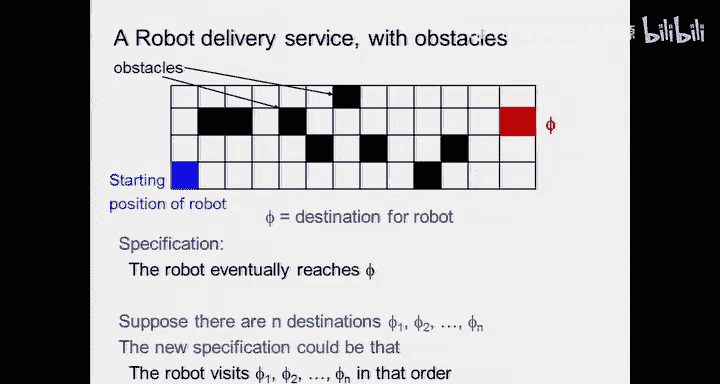
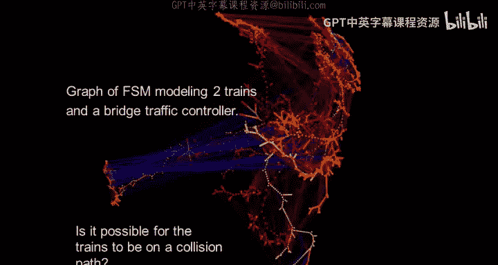
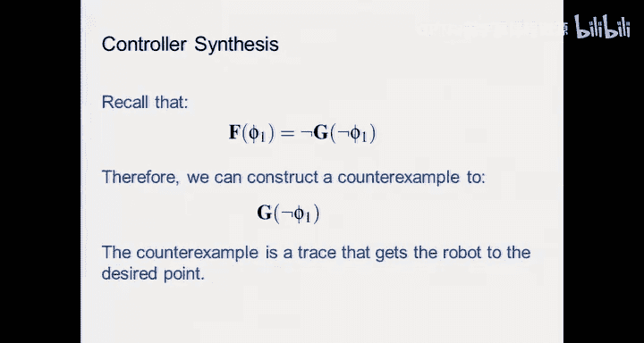
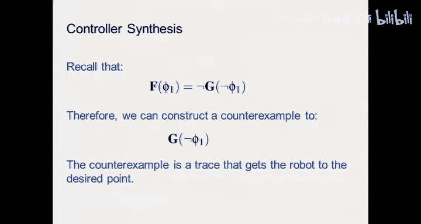

# 嵌入式系统：14：可达性分析 🧭

在本节课中，我们将学习可达性分析，这是一种用于验证系统设计是否满足特定安全性和活性属性的关键技术。我们将探讨其基本概念、算法实现以及在实际应用中的挑战。

## 课程概述与项目安排

在开始正式内容之前，我们先回顾一下课程相关的实验和项目安排。

以下是关于项目的重要时间节点和指导原则：
*   **项目组队**：团队由3-4人组成，可以自由选择队友。
*   **项目范围**：可以是研究型或应用型，但必须基于课程提供的硬件平台列表，并遵循嵌入式系统的设计方法学。
*   **设计方法**：鼓励使用模型进行设计和仿真，避免临时拼凑。需要构建良好的软件架构，包括模块化分解、测试策略和代码注释。
*   **关键时间点**：
    *   **10月21日**：提交项目章程（组队和项目大纲）。
    *   **11月4日**：与助教和导师进行项目评审。
    *   **11月17日**：项目进度迷你更新。
    *   **11月25日**：项目里程碑检查。
    *   **12月17日**：项目成果展示（每人约15-20分钟）。
    *   **12月19日**：提交最终报告、演示视频和同行评价。
*   **项目激励**：优秀项目有机会获得奖励，并可能被推荐发表会议或期刊论文。





## 可达性分析简介

上一节我们介绍了如何使用时序逻辑来形式化地描述系统属性。本节中，我们来看看如何验证一个设计是否满足这些属性，这就是可达性分析的核心目标。

在机器人学或其他嵌入式系统应用中，一个典型问题是：我们希望系统能够到达某个目标状态，同时避免进入一系列“坏”状态。可达性分析正是解决这类问题的工具。通过分析系统所有可能到达的状态集合，我们可以判断：
*   如果任何可达状态是“坏”状态，则系统存在隐患。
*   如果目标状态包含在可达状态集合中，则系统能够达成目标。

## 模型检验与形式化验证

可达性分析是模型检验算法的基础。模型检验是一种用于验证形式化属性的算法，它通过系统地探索系统的状态空间来工作。该技术的发明者曾因此获得图灵奖，这凸显了其重要性。

形式化验证的流程如下：
1.  **建立模型**：需要同时为**系统**和其**运行环境**建立模型。
2.  **组合成闭系统**：将系统模型与环境模型组合，形成一个没有外部输入的“闭系统” **M**。
3.  **定义属性**：用时序逻辑公式 **P** 描述需要验证的属性。
4.  **验证引擎**：运行验证引擎，检查属性 **P** 是否对模型 **M** 成立。如果成立，则系统满足属性；如果不成立，验证器会提供一个**反例**，即一条导致属性失效的状态路径，这对于调试和后续的控制器综合至关重要。

## 显式状态模型检验

为了验证一个形如 **G P**（全局属性 **P**）的公式，我们需要枚举所有可达状态，并检查属性 **P** 在每个状态上是否成立。

系统的行为通常用状态图（或可达图）来表示。从初始状态开始，根据状态转移关系一步步探索，就能构建出这个图。探索策略主要有两种：

以下是两种主要的图搜索策略：
*   **广度优先搜索**：从初始状态开始，先探索所有一步可达的状态，然后是两步可达的，依此类推。它像扇面一样展开。
*   **深度优先搜索**：从一条路径深入探索到底，再回溯探索其他分支。

在显式状态模型检验中，深度优先搜索常使用栈来记录当前路径。当发现一个状态违反属性时，栈中记录的就是导致该问题的反例路径。

## 符号化模型检验

显式遍历状态图在状态数量爆炸时会失效。符号化模型检验采用了一种不同的思路：它使用高效的数据结构（如**二叉决策图**）来隐式地表示和操作**布尔函数**，从而表征状态集合和转移关系。

其核心思想是将状态编码为布尔变量，将状态集合表示为其特征函数（一个布尔函数），将状态转移关系也表示为一个布尔函数。这样，集合运算（如并集、交集）和状态转移就可以通过布尔运算来完成。

符号化广度优先搜索的算法伪代码如下：
```
R = S0 // 初始可达集合
R_new = R
while (R_new != ∅) {
    // 计算从R_new出发一步可到达的新状态，并去掉已访问过的
    R_new = next_states(R_new) \ R
    R = R ∪ R_new
}
```
当 `R_new` 为空集时，说明所有可达状态均已找到。

## 状态空间爆炸与抽象技术

可达性分析面临的主要挑战是**状态空间爆炸**问题。即使对于中等复杂度的系统，其可能的状态数量也会随着变量增加呈指数级增长，使得完全分析变得不可能。

解决这一问题的关键策略是使用**抽象**。通过创建系统的简化模型来减少状态空间。一种常见的方法是**局部化抽象**，即移除与待验证属性无关的变量。然而，这种抽象可能会引入原本不存在的非确定性，导致验证时出现“假反例”。因此，当在抽象模型中发现反例时，必须回到原始模型中去验证该反例是否真实存在。

## 安全性 vs. 活性属性

在时序逻辑中，属性主要分为两类：
*   **安全性属性**：表示“坏事永远不会发生”，例如“交通灯永远不会在行人通行时变绿”。这类属性通常更容易验证，并且如果违反，总会有一个有限长度的反例路径。
*   **活性属性**：表示“好事最终会发生”，例如“机器人最终会拾起物体A”。验证活性属性通常比安全性属性更复杂。

有趣的是，某些活性属性可以转化为安全性属性来验证。例如，属性“最终 P 成立”（**F P**）等价于“并非永远非 P 成立”（**¬(G ¬P)**）。因此，我们可以通过验证安全性属性 **G ¬P** 是否被违反来间接验证 **F P**。

## 验证与综合

可达性分析不仅用于验证，也与控制器**综合**紧密相关。验证告诉我们系统是否可能进入坏状态或无法到达好状态。而综合则是主动设计一个控制器，通过生成适当的输入来引导系统，确保它避免坏状态并到达好状态。




从某种意义上说，控制器的作用是“覆盖”或“重塑”原始系统的动态行为，使其按照我们的期望运行。先进的控制器（如战斗机飞控系统）正是通过这种方式来管理高度不稳定的被控对象。

## 课程总结



本节课我们一起学习了可达性分析的核心内容。我们了解到，可达性分析是模型检验的基础，用于验证系统是否满足形式化规约的属性。我们探讨了显式状态和符号化状态两种分析方法，并认识了状态空间爆炸这一主要挑战及其应对策略——抽象。最后，我们看到了验证与控制器综合之间的深刻联系，两者都是通过分析系统的可达状态来确保其正确行为。掌握这些概念，对于设计和验证可靠的嵌入式系统至关重要。