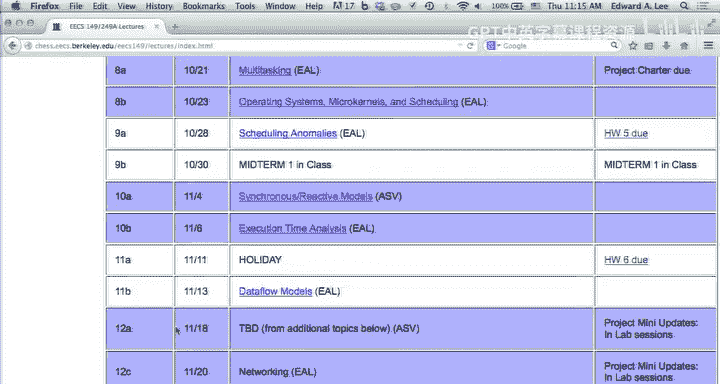
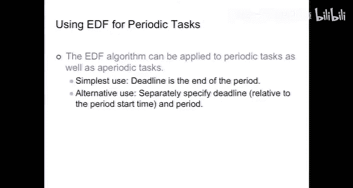

# UCB《嵌入式系统｜EECS 149  249a Introduction to Embedded Systems fall 2014》中英字幕 - P17：-17-Lecture 18 - Scheduling Anomalies.zh_en - GPT中英字幕课程资源 - BV1rBgDzRE2s

So we are here。嗯。And in case you didn't notice we switched gears this week。

 whereas we have been talking about modeling analysis for the last couple of weeks。

 we've switched back to talking about design。But at a somewhat higher level than before。

 whereas before we were looking at design at the very low level software in part to kind of。

Get you ready for the work that you were going to do in the lab。

 now we're more at the operating system level。嗯。And starting now。

 the material that I'm talking about today isn't going to be covered in the first midterm because you won't have had a chance to do a problem set on it。

So you can go to sleep， but you'll pay the price when the second midterm comes around。

And the next problem set。But anyway， this will not be covered on the first midterm。

reminder that the first midterm will be held a week from today in this room and you can bring one eight and a half by 11 inch sheet of paper。

 you don't need a calculator， an iPad， internet connection。Telephone， none of that stuff。Okay。

So any questions for me？Yes。Do， do we have a page of notes。Yeah， one。

 eight and a half by 11 inch sheet of notes， both sides。Part of the reason for doing that。

 by the way， is that I think it's a really good。Study。Aid constructing the piece of paper。

If you do a really good job constructing the piece of paper。

 you won't even look at it during the exam。Yes。Actually。

 so the question was how many problems in the exam and I don't know yet， we haven't written it。

 if anyone has suggestions for exam questions， please email them to me， we might use them。

It's it's actually really surprisingly difficult to come up with good exam questions because。

 you know， I mean， this course is a lot about。The real world and a very imperfect real world， right。

 I mean， part of what we're trying to do is。Kind of show you what the state of the technology is and also what's wrong with the state of the technology so that you're ready for how it's going to change。

嗯。But that means it's a relatively immature subject and you for mature subjects， you know its。

Easy to come up with exam questions because there's lots of。

 you know sort of closed form things where you can very accurately predict how long it will take a well prepared student to solve them。

For less mature subjects， it's pretty hard to do that and sometimes we screw it up and the exams get。

To be much harder than they should be， it's rare that they're much easier than they should be。

It's not entirely uncommon for， you know， I've had situations where I've given true false questions on an exam。

Where I got the answer wrong， and I wrote the exam。Okay， and it was only after you know。

 looking at my goodness， an awful lot of people are saying this is false and I look at their reasons and suddenly realize。

 oh my goodness， they're right。So that can happen and so actually we ask you on we do ask true false questions。

 okay on exams， you sell some in the sample exams。So please write your reasons。

You might actually interpret the question a little differently from what we intended and your answer might be right even if it disagrees with our answer。

Any other questions？Yes。I will post the solutions for the sample midterm this weekend。

So the goal is to you know try to reduce the temptation， you know， try to take a look at the problem。

 see if you can solve them before looking at the solution。

 but then we'll give you our solution to them this weekend so if you don't see them by Sunday。

 ping me by email。Because it means I've forgotten。O。Anything else？

Okay。So。So last on Tuesday， we were talking about threads。And。

Now we're going to sort of abstract threads and talk about tasks。

 which will be typically realized as threads， but not necessarily they could be just procedures that you call。

They could be implemented in a variety of different ways。So that。

The topic for today is covered in chapter 12 and it's a very classical topic in real time systems。

It's been around for a long time。And。There's。A lot of research， some of it。A lot of the work in。

In real time systems is。Actually， very heavily dependent on。

Work that was done in operations research initially。

 so things like job shop scheduling right so if you have a factory floor and you've got some number of machines and you want to allocate the machines to jobs。

 how do you do that optimally？And that field dates back to the 1950s。

 and some of the classical results in real time systems also date back to the 1950s。Personally。

 I'll give you my opinion， I find it to be a slightly boring topic。

And I hope that doesn't come across as lack of enthusiasm in this lecture。

But it is something that you sort of need to understand in if you're dealing with multitasking in embedded systems。

And I guess the most important thing that I'd like to try to convey to you is that there's lots of beautiful theory in it。

Lots of PhD theses have been written， people have gotten famous with algorithms named after them in this field。

 okay？But all of this theory is based on idealizations that are wrong。

Pretty much dead wrong in practice。So we're going to assume things like。

 you know how long it takes a chunk of software to execute。Well， you don't。Actually， usually。

mIt's only under very constrained circumstances that you can really know how long it takes a piece of software to execute。

And。So you idealize， you approximate， you develop a theory。

 and ultimately today you have to use this theory as a guide。

You use it as an aid in making design decisions。But just because you have a theorem that says something is true。

In this field doesn't mean your system in the field will actually behave like the theorem says it will。

Okay， so you have to be a little bit cautious with these things。But nevertheless。

 the theory that is behind this field is useful as a guideline。

 you can use it as a way to help you make decisions。

So there's a very nice book written by Gior Obuthazel。

 he actually has a second edition that just came out of this that I recommend if you're interested in pursuing this further。

He's a really excellent source， writes very well， speaks very well about the subject。

So I give him credit for having taught me much of what I know in this field。

So what we're going to be looking at is scheduling of threads or processes。

 and you know we have to worry about things like creation and termination and the timing of thread activations。

 and really that's going to be a big part of the focus today is on the timing。嗯。

We looked yesterday at mutual exclusion locks， not yesterday， Tuesday。at Mu exclusion locks。

 and one of the things that you're going to see is the first thing we're going to assume in scheduling is that there aren't any mutual exclusion locks。

Whi is generally unrealistic， I mean well。In well written software， it's unrealistic。

 in poorly written software， it's quite realistic。Okay。

 but that's one of the idealizations that the theory has a little bit of trouble dealing with the reality。

 and next Tuesday I'll talk a little bit more about the kind of pitfalls that can occur when the reality creeps in and you actually do have mutual exclusion locks in your code。

So the other role of scheduling here is simply in handling IO。

 So when some external event happens and you've got to deal with that event。

 that's really a scheduling problem also。And so far， you know。

 when we look at interrupt service routines， we haven't treated it as a scheduling problem we've just said。

Well， when a piece of hardware toggles the voltage on an interrupt request line。

 your interrupt service routine executes， there's no scheduling decision to be made。

But if you have work to do in reaction to this external event。

 you probably don't just want to blindly do that in the interrupt service routine because you might have interrupted something very important that's happening。

Okay， so generally in well written software， the interrupt service routine is very， very short。

And all it does is。Post a request in a data structure to handle this event。

 and then a thread scheduler will decide whether that event gets handled now or later。Okay。

 so what we're going to look at is how you design those thread schedulers。

There's a lot of other aspects of operating systems that we're not going to talk about。Jobs。

 scheduling tasks are a central part of pretty much any modern operating system。嗯。

There's a lot of other things an operating system does that we're simply just going to ignore， okay。

 we're not going to talk about memory management， we're not going to talk about the file system。

 we'll talk about networking。Later in a couple of weeks， okay we're not going to talk about security。

 a very big topic。嗯。We're just going to focus on the thread scheduling。

So we can strip down the operating system now to a micro kernelnel that just does scheduling all its only function is to figure out what to do next。

ok。And。Typically， the way a micro kernelnel is set up is the first you set up periodic timer error。

So in the UniX world， as in Linux。The interval between these timer interrupts is called a jiffy interval。

 I love that term because it's so whimsical， right， you do something in a jiffy。

And by default in Linux and most UniX systems， the GIiffy interval is 10 milliseconds。

That's a lot of time in an embedded system， okay， 10 milliseconds is a pretty big chunk of time。So。

If that's the granularity you have to work with， you better be working with applications that can tolerate that level of granularity。

Okay， just to put that to calibrate that， okay， the human auditory system。Is。

Sensitive to events down on the scale of 10 to 30 milliseconds。Okay。So immediately， in Linux。

 you're on the edge of being able to do stuff for the human auditory system。Okay， realistically。

And for that reason， most of the audio software that you deal with on today's platforms。

 you're including much of the functionality in your smartphone， except for the actual phone。

 which does things quite differently。Doesn't do real time audio， really。

It does rather lengthy buffering。Okay， and then uses hardware to play out those buffers。

And doing actual real time hardware is much more challenging on a platform where your time granularity is 10 milliseconds because that's actually for audio just on the edge of the kind of scale at which human perception starts to kick in。

U。So。呃。Last time I talked about P threads， and behind every thread。

 there is a data structure which stores information about the thread。Okay。

 the scheduler is going to need this information。 So the kind of information includes things like。

Whether the thread is blocked on a mutex。Okay， it would be pointless for a scheduler to。

Activate a thread。That is blocked on a mutex。Right。

It's useful for the scheduler to be able to see that， so when you attempt to acquire。

 when you call the P threads procedure to attempt to acquire a mutex lock。If you fail to acquire it。

The thread will be suspended， but in addition， that the thread data structure will。

Contain a pointer to the muttex on which you are blocked。So the thread scheduler now can。

In deciding whether to reactivate your thread， look at the state of that mutex and not reactivate you unless that mutex is available。

ok。嗯。So dispatching a thread is just a procedure call， resuming a thread is more interesting。

 and I talked a little bit about that last time， if you suspend a thread。嗯。

The way that you do it is you mess with the stack。Okay。

You actually take the information about the current thread off the stack。

Copy it into the thread data structure。And then， right。New information onto the stack。Okay。

 would be that's one way to do it anyway。And。Then。You know。

 return from interrupt is actually a much more straightforward way to do it。

If your stack pointer in your architecture is a memory map to register。

Then every thread can maintain its own stack。And all you have to do is update the stack pointer before you return for interrupt。

so that's a much simpler thing than actually rewriting this stack。嗯。All right。

Another thing that is often in the thread data structure is a thread priority。And again。

 the distinction between a real time operating system and a non real time operating system is just whether it pays attention to this field。

That's really almost the only distinction。ok。嗯。There will sometimes be an estimate of the execution time of a task。

Whenever you see this phrase，W case execution time， you should immediately think fiction。ok。

It's a guess。Now there are very sophisticated tools that we'll attempt if you give them a C procedure。

They and a very complete definition of the architecture on which it's going to run。And。

You allow the analysis tool to make a lot of assumptions like。嗯。

You're never going to get a cash mask。Or you're always going to get a cash miss。

Or you make some unrealistic assumptions， you're never going to block on a mutex。

 all kinds of assumptions that you make， okay then these tools will give you a bound on the execution time of that procedure。

But there's so many assumptions that have been made。

 and those assumptions aren't actually usually met in practice that you should really treat this as fiction。

Today's computing infrastructure。Okay， so what happens in the process of dispatching a thread？

You have this timer interrupt that you've set up to go off at say the GIiffy interval every 10 milliseconds。

When the interrupt service routine kicks in。The first thing it should do is determine which thread to execute。

ok。If it determines that the threat that was just interrupted should continue executing。

Then it doesn't have much work to do， it just as a return from interrupt。Okay。

But if it determines that the current threat is not the one that should resume executing。

 then it needs to save the state of the machine。Okay。Because。The interrupt service routine kicked in。

There's a bunch of memory map registers or maybe not memory map registers built in registers that have state。

And the program that's executing expects that state to not change right， remember， you know。

 the conceptual view of multitasking in the thread style， which is what interrupts use is that。

The executing task doesn't see that it was suspended and then resumed。 that's the ideal world。

But its state may change， right， if it has any shared。Data with other tasks。

 then its state will change。So you want to try to protect it against state changing in completely arbitrary ways。

So you have to save the machine registers。In the current thread data structure。

 save the return address。For the current thread or just save the current stack pointer。

which might if the return address is on the stack， you can just store the current stack pointer。

Into your thread data structure。And then pull the stack pointer for the new thread。

From its data structure， write that into the stack point or register of your machine。Okay。

Pull the state of the registers。From the new threads data structure。

 write those into the machine registers and then return for Minim。so an interrupt occurs。

 a thread gets suspended when the interrupt returns。

 a new thread is executing and that new thread ideally has no idea that anything was that it was ever suspended。

 it just keeps going from where it left off so that's the mechanics of how this works。嗯。All right。

So when can a scheduler decide to execute a new threat？In the scheduling literature。

 people make a strong distinction between non- preemptive scheduling and preemptive scheduling。

 and there's actually a slightly fuzzy boundary between these。

 but I'll tell you about that in a minute。With non preemptive scheduling。

 the thread scheduler doesn't have a choice。To start executing a new thread until the current thread is actually finished。

So in that case， you're probably not even using timer interrupts。Okay。

 you're just using when a thread dies， a procedure gets called。

 and that invokes the thread scheduler and the thread scheduler decides which procedure to execute next。

Interestingly。嗯。It's actually not that uncommon to have something sort of halfway between these two。

So under preemptive scheduling。The thread scheduler gets to make a decision at。

Whenever the timer interrupt kicks in， but also possibly any operating system function。

Get's called Okay， so typically an operating system function could。

Invoke the thread scheduler and decide to suspend the current threat。It can go even deeper into that。

 right， it could be that in your architecture， if a cash miss occurs。诶。嗯。At a。

Exception handling routine， which is like an interrupt service routine。

 gets invoked that can invoke the thread scheduler。

So merely having a cash miss could cause you to switch to a， a new thread of execution。O。

Whenever the current thread blocks on a muttex， that's a really good time to switch threads。

 you don't really want to just wait for the next Giffy interval to come along to switch to a new thread if the current thread blocks on a mutex and when you block on a mutex。

 the way you do it is you call a procedure that tries to acquire the lock。

So that procedure needs to be able to invoke the thread scheduler。ok。Now。All right。

 so under preemptive scheduling。If you're executing a threat， it could get suspended at any time。

And you really have very， very little control over this。

There's something halfway in between these and the last mainstream operating system that implemented this was Windows 95。

It's called cooperative multitasking。Okay， so cooperative multitasking says， well。

If your thread starts executing， it can continue executing as long as it likes。ok。嗯。

But there's a certain finite set of procedures that it can call， and when it calls those procedures。

 it might get suspended。 so in Windows 95， you could actually just avoid calling those procedures and hog the machine。

And in fact， it was a very common cause of。Blue screen crashes effectively。

 except if you wouldn't get a blue screen， you just get a freeze。Right。

 because some program would go into an infinite loop and not call any of the procedures that indicate that it's willing to be tasked out。

Interestingly enough， that was also the last Windows machine that was able to do real time audio。

Right because you could actually put。Stuff into the。You know。

 essentially take full control of the machine， not call any of the procedures that could swap you out and get you genuinely very low latency closed loop behavior。

So there's trade offs there， right， but anyway， yeah， okay。So。嗯。

How do you decide which thread to schedule next， so you're in charge of the thread scheduler routine？

And you get called， maybe the current thread blocked on a mutex。Or the GIiffy interval expired。

 the timer interrupt service routine calls you。What should you do？Well。

 you could do something very simple and just do around robin。

 right you have a list of threads that are active because every time a thread gets created。

A procedure in your microconal gets called and it can create a list of all the active threads。Okay。

 so you could just cycle through them that's typically what a non realtime operating system will do。

 which just goes to the next thread in the list whenever the GIPpy interval expires or whenever a thread box on a mutex。

Okay。嗯。But thats not you know that's kind of's as a policy that's completely ignoring any goals that the threads may have。

 whether they have any real time constraints， what are they trying to do。

 so the whole art in realtime scheduling is to try to give the thread scheduler a bit more information about what you'd like to accomplish。

And then put some intelligence into the thread scheduler to enable you to accomplish that。O。

All right， so let's assume preemptive scheduling。And assume that all threads have a priority associated with them。

Okay， so you've got a。嗯。A system， okay so let's talk about。

 you know you're designing an avionic system。ok。And you have a whole bunch of threads。

 there's threads that are maintaining the cockpit display。Based on sensor data。

 you've got threads that are running diagnostics on hardware to make make sure stuff is still working。

 you've got threads that are controlling the temperature of the cabin， the comfort of the passengers。

 okay， all of these things are threads that are running concurrently。

What priorities should you give them？Yes。Okay， yeah。

 that's a really good criterion so probably you want safety critical threads to have higher priority than less safety critical。

 okay， anything else？It's actually not a terribly easy question to answer。And in fact。

 even if I gave you a lot more detail about the application。

It still wouldn't be an easy question to answer how do you pick priorities right on what basis should I decide to give this thread a higher priority than that one？

In fact。In， in。A lot of real time scheduling infrastructure。

 they actually have multiple levels of priorities， so you can give threads priorities。

 but then you can give them also criticalities。And you can give them， you know。

 there's a third level that's commonly used。I forget。But。These are。Huristic ad hoc。

Things that some designer just pulls out of a hat。And says。

h I think this should have higher priority in that， let's see how that works。ok。

And there is theory behind it， and I'll tell you about some of the classic theory results that kind of help a little bit in picking those priorities。

 but they don't help that much， actually。And so ultimately。

 priorities are a very weak way to specify timing property。But nevertheless。

 they're the blunt instrument that we've got with thread scheduling， right？

So there's a distinction between having threads that whose priority can vary dynamically or or is static。

 okay。You might be stuck in a particular micro kernelnal with having to specify the priority when you create the thread。

And then for the entire duration of the thread， it will have the same priority will never change。And。

The reason for doing that is。Frankly， laziness。RightBecause if the priority of threads can change dynamically。

 then you have to maintain a sorded list of。Of threads sorted according to priority。

And there's some cost associated with that。 So that means each time the priority of a thread changes for some reason。

There's a sorting operation that has to happen and it takes a few cycles to do that。But and that。

 of course， can also affect the timing of your system and it can affect it in unpredictable ways。

So if you really want very tight control over timing， very low overhead bread scheduling。

Then you're probably stuck with fixed priorities。Okay， so。

Let's assume further that this micro kernelnel keeps track of which threads are enabled。 okay。

 enabled means it's ready to execute It's not blocking， waiting for a semaphore or a mutex。

We haven't talked about semaphorees， but they're just think of them anything that makes the thread block。

 a mutex is the simplest form of these。Okay。You might also have a thread that's just waiting for a time to expire right that's actually a very common real time usage right so one way to do that。

Okay， if you have a thread that you'd like it to idle until the next Giffy interval。ok。

A brute forest way to do that。Would be to。Do just spin your wheels。You know。

 do nothing in a wild loop。Until something indicates that that GIiffy interval has expired。

But the thread scheduler has no idea that you're doing nothing useful。Right。

So it's going to execute you according to your priority and have you do your spin lock and you know。

 use up battery power， etc。While you're spinning waiting for the GIFy interval to expire。

 so that's a pretty lousy way to wait a certain amount of time， so a better way to do it。Would be。

 in fact， the block on a semaphore。All right。Where the state of that semaphore changes when the GIiffy interval expires。

 and then the thread scheduler knows you're blocked。Because it can see the state of the semaphore。

And so it doesn't schedule you to do nothing。When you're not actually able to do anything， okay？

All right。So under preemptive scheduling， we assume that any instant the enabled thread with the highest priority is executing。

 and of course that's already an approximation because at any instant you might be executing the thread scheduler。

Or the timer interrupt service routine， which isn't。Well。

 I guess you could think of the thread scheduler or the time or service interrupt routine as the highest priority thread。

In that case， I guess this statement isn't so far fetched。嗯。ok。All right。

 so let's look at some of the theory。So the first classic result。

 which is often the most widely cited one is rate monotonic scheduling。

This is due to Liu and Leyland， who first published this in 1973。

 and just to give you a sense of you the classicness of this。

 this is one of the most cited papers in computer science。ok。嗯。So it had a big impact。And it's。

You know， relatively simple in the sense that。The key thing that you and Leland did was to abstract a messy problem。

And say， oh yeah， yeah， it's a messy problem， that's fine。

 let's make a simple problem instead and solve that one。Okay， and that's really what they did。

 and the simple problem is， yeah， kind of unrealistic。

But it turns out that it gives you pretty good guidelines。

For making decisions about how to assign priorities to threads。Okay。

So what are the assumptions in the paper， So by the way， in this literature？

Absolutely the most important thing。In looking at any one of these classical results is to understand the assumptions。

It's more important than understanding the theorem。ok。

Understand the conditions under which the theorem is valid。Right？

Don't even bother understanding the theorem until you've understood the conditions under which it's valid。

 because the conditions are really quite restrictive， typically。嗯。All right。

 so here is the assumption that you and Leyland made first。

They said that they have N tasks that are invoked periodically。Okay。

And the periods are arbitrary numbers。T1 through TN， they can be different。

 they don't have to be harmonically related， you don't have to have one task that's twice the period of the other。

Arbitrary numbers， okay？嗯。They assume also that you know the worst case execution time。

 another word for this is fiction。Okay。But they assume that you know this for each of the tasks。

 so that means when you invoke the task， you know that it will take no more than C1 cycles or time units or whatever your measure is。

 we don't really care what the measure of time is here as long as it's consistent。

They assume that there's no precedence constraints， so you can invoke these tasks in any order。Okay。

嗯。They assume， in fact， actually no interaction between these tasks。 So no mutex locks。嗯。

They have no effect on each other's execution。And they can be invoked in any order。呃。

It constrains the problem to having fixed priorities。

So you're required to assign priorities to these tasks。And it assumes preemptive scheduling。ok。

And with those assumptions， the theorem is really very beautiful。And very simple。

It says that if any priority assignment yields a feasible schedule。

 let me explain feasible right feasible simply means in this case。

 that every task will be executed at least once within its period， well。

 actually exactly once within its period。ok。It can be executed at the beginning of the period。

 in the middle of the period， at the end of the period， doesn't matter。Okay。

 but the schedule is feasible if every task is executed once per period。ok。

So the theorem says if any priority assignment yields a feasible schedule。

 then priorities ordered by period。Also yields a feasible schedule。Okay。It's very carefully worded。

It says that。If you assign periods by giving the task with the smallest period the highest priority。

The task with the next smallest period， the next highest priority。

That that assignment is at least as good as any other。

It doesn't say it's the best assignment in any sense。Of priorities， okay。

 it just says that if any priority assignment works。This one will work， so just use this one。Right。

 yes。So feasible means that every task will execute once per period。ok。

So I'll show you how to prove this for the two task case， which is the simplest one。

 it turns out proving it for multiple tasks is。Intellectually straightforward。

 but mind numbingly tedious。Okay。That's， by the way。

 one of the reasons I don't really like the scheduling literature is that there's a lot of that in the literature。

 mind numbingly tedious proofs。They're good results， and I'm glad someone's doing it。

I don't particularly like it myself， but anyway， that's just a personal thing。嗯。Yeah。

 so the other thing， you know， in addition to understanding the assumptions。

You need to understand what the theorem says and what it doesn't say。

So this doesn't say anything about saying， you know that your highest priority task will always be executed before a lower priority task。

doesnn't actually say that。嗯。It just says it's only talking about feasibility。

 will the task be executed within the period？Okay。So the phrase that you use for such a theorem is this theorem asserts。

That rate monotonic scheduling is optimal with respect to feasibility。Okay。

Optimmal with respect to feasibility means that if any schedule achieves feasibility。

 this schedule will achieve feasibility。Okay。AndPut another way the contrapoitive of that。

Is if rate monotonic scheduling fails to be feasible。

Then there is no scheduling assignment that is feasible。I mean。

 no priority assignment that is feasible。ok。That's an equivalent statement。Okay。

Every task executes a completion once within its designated period。

 So let's look at some simple examples。 So suppose we have。Two tasks。And。

The fiction for the blue task is C1。Meaning， its worst case execution time is some number。

 so the horizontal axis here is time。ok。And it's going to be executed periodically with period T1。

Now， if you were executing it by itself on a processor， you would just start it at time zero。

 execute it， it will be finished by time C1。And then you will execute it again at time， T1。

 and it' will be finished at T1 plus C1。but we're not going to execute it in isolation。

 We're going to execute it along with other tasks。So suppose we have a second task。

 a red task that has a smaller period， T2， and also a smaller execution time。Okay。

So the first question for you is。Is a non preemptive schedule feasible for these two tasks？走完去。

Raise your hand when you know the answer to the question。Okay， this is disturbing。

I don't see any hands。Nobody knows the answer to this question。Okay。

 that's probably because you don't remember what a non preemptive schedule is， okay。

 that would be the first thing I would start。So non preemptive means that if you start executing a task。

You execute it to completion。You won't interrupt it to execute another task。All right。

 now I'm starting to see some hands。More reassuring， still far too few。'Not a difficult question。

It you don't know the answer to this question。O。Let me make it painfully obvious。

If I start executing the blue task。I will lock up the machine until it's finished executing。

Feasibility oh， maybe the second thing is you don't remember what feasibility is， okay。

 so let's try that， right？So for this schedule to be feasible。

I have to execute every task once per period。So the period of the red task is T2。

So I have to execute it once between time 0 and time T 2， Once between T 2 and 2 T 2， once between。

Okay， now let hands， who knows the answer to this question？Okay， a lot more people， okay， good。

So my goal here was to make sure that people understood preemption and feasibility， okay。

 because this is a really simple question。Okay， the answer is no。It's not feasible why， Well。

 because if I start executing the blue task and I have to execute it to completion。

 I have no way to execute a red task within this period。

And since the blue task spans more than one period of the red task。

It's going to cause me to fail to schedule the redDap if I do non preemptive schedule。Right？Okay。

All right， so okay， so hopefully so now we got the terminology， right。

 this is just terminology because it is not an interesting question。Once we've got the terminology。

 it's not an interesting question。嗯。All right， so what about preemptive scheduling？Well。

 how does preemptive scheduling work Well， suppose we have these two tasks， since we have two tasks。

 let's assume let's make New and Leyland's same assumption that it's a fixed priority scheduling problem。

So I can either give the blue task higher priority or the red task higher priority， so intuitively。

 which should I have higher priority？Red right， because for the same reason that non preemptive scheduling doesn't work right if I give the blue one higher priority。

It's going to have higher priority for its whole execution。

 and that's going to give me the same result as non preemptive scheduling。ok。

So I should give the red higher priority， and if I give the red higher priority。

 the preemption will look like this。Okay， in the idealized world。So what happens is at time zero。

 both the blue and the red are enabled。Okay。The task scheduler has to decide what to do。

It decides to execute the higher priority task。While it's executing the red task。

 the blue task is not executing， so its finish time is going to extend out。ok。

When the red desk is finished， the thread scheduler kicks in。And now it says， well。

 the red task is not enabled anymore because I can only execute it once per period and I've already done that。

Okay。So。At that time， so it's not going to become enabled until one full period has expired。

 So during that time， I can execute the blue task。 Is there a question。Yes， that's correct。

 so if the red task execution time is long enough， then this schedule will fail to be feasible。Okay。

 but the Liu and Leland result just tells us that if this schedule fails to be feasible。

 then there is no schedule that is feasible。There is no priority assignment that is feasible。

 so it says all priority assignments will fail if this one fails， yes。That's another fiction。Yes。

I'm assuming here that the context switching time is negligible。And that's generally not true。So。

 there's a lot of。Fictitious assumptions here。Okay。But yes， good observation。Yes。Right。

So the theorem。The theorem has the form of a logical statement， proposition A implies proposition B。

 and proposition A is any priority assignment yields a feasible schedule implies that the rate monotonic priority assignment yields a feasible schedule。

Okay。This proposition is true。If and only if。This proposition is also true。Okay。

That's the contra positiveitive。So this proposition says。

If the rate monotonic schedule priority assignment fails to yield a feasible schedule。

Then every priority assignment will fail to yield the feasible schedule。Okay。

 the statements are equivalent。Sorry。No， in general not A does not imply not B。

 and actually that's perfectly intuitive， I can give you a priority assignment that fails to be feasible。

But that does not imply that the rate monotonic schedule will fail to be feasible。

And this example shows that， right？If I give you the wrong priority assignment here。

 it fails to be feasible， but the rate monotonic assignment is feasible。Okay， so this is a good。

This is a good chance to flex your logic muscles and really understand the equivalentence of these logical statements。

Okay。All right。Hopefully the theorem， what it says and doesn't say is clear。

 it's really important with any theorem to understand what it doesn't say。ok。But。

Let me show you how you and Leyland went about proving this。You'll probably immediately see how it's。

Mine numbingly boring。To work wade through proofs like this。

I'm just going to give you the two task version， which is。Already a little bit tedious。

 but not very much so the first observation that they made is well okay， if you have periodic tasks。

 the alignment of these tasks is arbitrary over time。

Remember that the periods can be any real number。So， you know。

 they're going to drift with respect to one another， so there's arbitrary alignment。

Between the periods of these tasks。So another way to say that is that the periodic scheduling of the red could be shifting with respect to the periodic scheduling of the blue。

And here's a few of the scenarios。With different alignments。All right。

So the major observation that you and Leyland made。

Is that just look at the completion time of the blue。Okay。And they said， well。You know？

It's never worse。 The completion time of the blue is never later。

Then when the two are perfectly aligned。Okay。If they're not perfectly aligned， it might be earlier。

The blue could finish early。呃。Right and even if they're not perfectly aligned， it might finish。

At the same time that it finished when they were perfectly aligned。

But it's never worse than when they're perfectly aligned。Okay。

That created a huge immediate simplification to an otherwise worse than mine numbingly tedious proof。

Okay， because they no longer have to consider all the possible alignments。Now they can just say。

 all right， let's assume all the tasks are enabled at once。

And let's just look at one period of the overall cycle of this。Okay。

So it's sufficient to consider the worst case， all tasks start their cycles at the same time。okay。

Then。嗯。So we have to show that if。嗯。We could actually。

 you could construct the proof using either the original statement or the contra positiveitive。

 it doesn't really matter。O。But the original statement is easier than the contra positiveitive， why？

七てやどて。Right。Right， so the problem here is that you you know。

 proving that there does not exist something。Is often harder than proving that。

The existence of something implies the existence of another thing because proving nonexistence may require exhaustive search of all the possibilities。

Yeah， so the statement here is that if there is a priority assignment that yields a feasible schedule。

Then the rate monotonic priority assignment yields a feasible schedule。Okay。

 so if you can find a priority assignment that yields， you just need to find one though。

 you don't have to look at all the possibilities。Find one that yields a feasible assignment if you can show that the mere existence of that one implies that rate monotonic works。

Then you're done。ok。So。So， so intuitively， here's how we could do it。

 So here's a variant of the problem。 So in the original example that I showed you， this one。Okay。

 there's only two possible priority assignments。喂。Either the red task has the higher priority or the blue task has the higher priority。

That's the only two possibilities。One of those is the rate monotonic assignment。

 which is that the red task has the higher priority。

 The other one is not the rate monotonic assignment。

So that makes these proofs pretty easy because there's only two possibilities to explore。 even then。

 it's the is。Okay， that's about as easy as it gets。 All right， there's just two possibilities。

 And in this case， it's clear that the non rate monotonic assignment is not feasible。

So the non rate monotonic assignment doesn't really help us to prove this。Because。It's not feasible。

 so it says nothing about whether the rate monotonic will be feasible。Okay。

 so let's just look at a variant of the problem where the non rate monoonic assignment is feasible。

And then all we have to do is show that。If we determine under what conditions the non rate monotonic assignment is feasible。

 okay， we find those conditions。And then we show that under those same conditions。

 the rate monotonic assignment is always feasible， then we're done。Okay。So intuitively。

 what are the conditions under which the non rate monotonic？Assignment is feasible for this problem。

Let's do this the same way to try to make sure everyone's on the same page。

 So let me state the question。Clearly， okay？Under what conditions？

Will giving the blue T highest priority still work？Okay。

 so just raise your hands when you know the answer。The question is， again。

 under what conditions will giving the blue task highest priority still result in a feasible schedule？

Okay。Good， so if someone want to give me in the answer， how about back there？Go ahead。Right。

If c1 plus C2 is less than T2。This is going to be the non rate monotonic assignment is feasible。

 and otherwise it's not。And it's pretty obvious in this case， right？ok。So now。

We don't have to worry about the situation when it's not。

 because our theorem doesn't say anything about that。Okay， so we only have to worry about， well。

 if c1 plus C2 is less than T2。Then is the rate monotonic schedule feasible？

And the answer is obviously， yes。Right。So if C1 plus C2。

Is less than T2 then it actually doesn't even matter。Which one I execute first。

 Both options are going to be feasible。ok。So that's something we can prove。Okay。

 so this is the condition。This is a necessary and sufficient condition for the non RMS schedule to be feasible。

Okay。And all we have to do is show that this condition implies that the RMS schedule。

So how to show that。Well。In this case， it's really pretty obvious that the non rate I mean that the rate monotonic schedule is feasible right。

 this is the rate monotonic schedule。And if we。Just some of these two tasks， we realized， oh yeah。

 okay， this is also going to be。The feasibility consideration。嗯。So I'm doing an experiment。

 by the way， the reason my phone keeps beeping is that I have in my pocket a Zigby device。ok。

So Zigby is a radio protocol that operates in the same band as WiF。

 but it's designed for use with extremely low power。tterBattery powered devices。

 so this guy periodically wakes up。And tries to talk to a hub that's in my office at the far corner of Corey Hall。

ok。And， and the hub is then notifying a， a web service。Whether I'm in my office。All right。

And the experiment tells me that I'm right on the edge。Of the range of the Zigby radio。

Because I've gotten in the course of this lecture， several notifications that。I've left my office。

 I've arrived at my office， I've left my office。I've arrived at my office。

 and it's toggling between those things。So I'm pretty impressed because that' like。

Maybe 300 meters line of sight， and there's a lot of stuff between us。Surprised。Yeah， anyway， okay。

 that was an aside。All right， so this proof is pretty straightforward。

You can extend this proof strategy to an arbitrary number of tasks。But it gets tedious。All right。

 so let's talk about some extensions to this work。First of all。One of the things that this。

That you and Leyland's formulation fails to take into account his deadlines。

 it just talks about periods it just says that。That the tasks should execute once within their period。

That might not be enough， right， you might have tasks that you know。

 maybe they have a rather long period。But you need low latency also， you want them to execute early。

ok。So there's a whole family of techniques that are based on deadlines instead of periods。

One of the oldest is Jackson's algorithm， which dates back to 1955。

And this is a classic operations research result。 if you're given n independent one time tasks with deadlines。

And you want to schedule them to minimize the maximum lateness。

 which is defined as the maximum of the finish time of the task minus the deadline。Okay。So。

Maximum late， that's a whole different criterion from feasibility。Okay， minimizing maximum lateness。

 this is probably the criterion that you use with problem sets。And you know， other assignments。

 right， you schedule them to minimize the maximum lateness。And if your maximum lateness is negative。

You got them all in on time。But if your maximum lateness is positive， but if it's a small number。

 you know， maybe you can be forgiven。 but if it's a big number。

You're probably not going to be forgiven because the solutions have gotten posted already。

You're not going to be allowed to turn it in， right。

 so minimizing the maximum late is probably a reasonable。

Optimization criterion to apply for problem sets。ok。Very different question than feasibility。Okay。

So the finish time minus the deadline is the lateness。

And minimizing the maximum lateness is a problem you can solve under idealized circumstances。

 so you have any independent one time tasks according to Jackson。

And you want to minimize the maximum lateness， and Jackson's theorem is that the earliest due date algorithm works。

Execute them in the order of non decreasing deadlines。

 just take the problem set that is due the soonest。And do that one。

And then do the problem set that's due the next soonest。And do that one， do it to completion。

Notice you don't need preemption here。You don't have to stop doing a problem set to start doing another one。

 which is also good multitasking has overhead。So you don't incur that overhead here。O。So。

This can be proven using an interchange argument。嗯。This one。I mean。

 the previous proof was pretty trivial， this one starts to hint at the mind numbingness of these styles of Bruce。

Here here's an outline of how you go about showing this。

 So suppose that task B has an earlier deadline than task A。Okay。

 so you have a problem set that's due on Thursday and a problem set that's due on Friday。

But you decide to solve the one due on Friday first。Before you solve the one that's due on Thursday。

Okay。就。嗯。That's not an earliest deadline first schedule。Right。Our earliest due dates。Okay。

 so if you have any non EDD schedule， then you must have two adjacent tasks that you could reverse。

Because their deadlines are in the wrong order。ok。So pick two of those tasks and reverse them。

And that's hopefully not my office calling。No， it's not。嗯。So。So basically。

 if you have a non EDD schedule somewhere in your schedule， there's two tasks that are out of order。

So all you have to do is show that if you reverse the order。

 you will get a lateness that is no worse。A maximum lateness that is no worse， right？

That's the style of proof。ok。So。Here's an outline of how you do that。

 right if you did the homework assignments in the wrong order。

 the one do Friday before the one due Thursday。Then the maximum lateness is going to be determined exclusively by the completion time of the undo Thursday。

Right。If you missed the Thursday deadline， you could still make the Friday deadline， okay？But。

The maximum of lateness is going to be。The lateness of the Thursday deadline。Right。

And that's what this says that if you compare these two numbers。

The finish time of a minus the deadline of a is always smaller than the finish time of B minus the deadline of B。

 because the finish time of B is greater than the finish time of A because you did them in the wrong order。

And the deadline of B is smaller than the deadline of A。

So you're subtracting a smaller number from a bigger number。

 so clearly this is the bigger of the two numbers。So the maximization becomes a simple expression。

Now， when you reverse them， you can also determine which dominates the maximization。

 but you can see that it becomes a little more tedious to determine that。

There's two conditions that you have to consider depending on。you know。

 your assumptions about these numbers， but you just walk through those， you slog through them， right。

 you look at all the possible cases， and you can show that in all the cases， in fact。

 the lateness is no worse。When you put these in the right order。

 then it is when you put them in the wrong。O。嗯。You can extend this to an arbitrary number of tasks。嗯。

Drink plenty of coffee before you do it。Have lots of paper to write on。It's quite tedious。Okay。嗯。

1974。Horn comes along and extends us。To something called earliest deadline first。

 so this is one year after Liu and Leyland。Okay。Just to put this in perspective。

 So earliest deadline first says if you're given a set of in independent tasks with arbitrary arrival times。

 Oh， remember that I said。You need to understand with any theorem what the assumptions are。Right。So。

Jackson's algorithm assumes you have an independent one time task。

One thing that's not explicitly stated here， but it's kind of implicit is that。

You know all those tasks before you even start trying to solve the scheduling problem。

 you know all the tasks that are going to be done。So if one of your professors pops an assignment on you。

This algorithm no longer applies。 you can't use this theorem to show that the right thing to do is to do the problem set with the earliest due date。

Alright。You have to know the due dates， all of the due dates ahead of time in order to use that theorem。

 Okay， so Horn said， well， what if we don't know all the due dates？Ahead of time。

 so a task can arrive at an arbitrary point。Meaning it becomes enabled at an arbitrary point in time。

So the earliest deadline first says， given a set of unindependent tasks with arbitrary arrival times。

 any algorithm that at any instant executes the tasks with the earliest absolute deadline。

Among all the tasks that are enabled。Is optimal with respect to minimizing the maximum late？ok。

This is a preemptive schedule。So this says that if a professor pops a new assignment on you and it has an earlier due date。

 then the。Assignment that。Came that you already knew about。

You should preempt your work on the assignment that you knew about and start working on the assignment with the earlier due date。

Okay， that's Horn's Theorem。Of course， that fails to take into account the cost of context switching。

You know， you might have had you might have been within Epsilon of finishing the problem set。

With a later due date。Okay， you just add one more part of a 10 part problem to solve。

And you suspend it， you contact switch。You solve the other problem set takes you 10 hours。

 You come back to the first one。 you can't remember what it was all about。

 You got to page all that back in， right， Con switching actually costs costs you right。

 So you got to know what the theorem is actually saying and not saying It's not saying that this is necessarily the right thing to do。

s under these assumptions， which are kind of unrealistic assumptions。

This has the property of minimizing the maximum lateness。Okay。So early is deadline first。

Can be applied to periodic tasks as well as aperioic tasks。And in fact， you could。You just say。

 you know， if you have periodic acid and the deadline is the end of the period。

 then you could apply this theorem to the same problem that view and Leland。Applied their theorem。

Okay， so here's a question for you。What's the difference？

Between applying these two theorems So let me lay out the question for you very explicitly。

In periodic tasks。And you need to execute every task within one period。ok。

And you could either use Liu and Leland， which is you fix the priority assignment。

Based on the periods。Or you could use EDF， which says。Well， actually， the priorities could change。

Because the priority of a task is just going to depend on how。Close， I am to the end of the period。

So its priority increases as you get closer to the end of its period。Okay。

So what's the difference between these two？Will they yield the same schedule？

Start with that question。Yes。Right。It has a shorter period it's due sooner， not necessarily。

 remember the alignments are arbitrary。Right。And moreover。

 the periods are not multiples of one another。 So even if you start all the tasks at the same time。

 the alignments of the deadlines are going to change。Right， is that clear if you have a？

If you have a task。That's executing with this period。That's not very periodic， right？

And you have another task。嗯。Executing with this period。ok。At this time。

 which task has the earlier deadline？The red task， which is the one with the longer period。

 not the shorter period。So EDF， at this time。Well give the red task higher priority。Yes。Yeah。

 in fact， will'll not yield the same schedule。 And actually。

 this is a pretty good illustration of that。嗯。Right。Yeah。

So suppose that the execution time of this task is such that it allows barely enough time for the execution Oh。

Yeah， that the。Actually， this would be easy to illustrate if we allow the execution times to be variable。

 but that were not none of these theorems are doing that so far， I don't know。

 I have to think about how to illustrate it with this two task example but。Yeah。Okay。

 so let's look at what happens if we're barely if we're really right on the edge， so say the red。啊。

It completes in this amount of time。Okay。And then。We execute this guy。Then。Execute the red。

this makes all the deadlines in this。okay。Yeah， I'm sure there's a variant end of this。

 I'll leave it as an exercise。 You guys do it。Okay， find。A two processor version， okay？嗯。

But they don't yield the same schedule。 and in fact。

There's a whole bunch of nuances in comparing these。Favorring rate monotonic scheduling is basically。

 but scheduling decisions are simpler。 because your tasks have fixed priorities and so your task scheduler has a very simple decision to make。

 which is of all the enable tasks， just look at the one with the highest priority。Okay， and you know。

 because it's a fixed priority， you don't have to dynamically sort。These priorities。

But notice that the optimization criteria are different。So rate monotonic scheduling。

Is optimal with respect to feasibility。But。EDF is optimal with respect to maximum lateness。Now。

 what do you think？If an EDF schedule， under what conditions will an EDF schedule yield a feasible schedule？

What do we need from the maximum lateness？Yes。Right。

 as long as your maximum lateness is either zero or negative。ok。Your schedule is feasible。So。嗯。

So E DF， because it minimizes the maximum lateness， is also optimal with respect to feasibility。

If any schedule is feasible， it's going to yield a feasible schedule。But it goes further than that。

It also minimizes maximum lateness， which has this property of reducing latency。Okay。嗯。Okay。嗯。

So this particularly becomes important for infeasible schedules。So in an in schedule。

 rate monotonic scheduling will completely block lower priority tasks， resulting in starvation。

And remember that。Priorities， periods。Worst case execution times。

These are all pulled out of a hat by some engineer。ok。They are not。

Really fixed properties of some physical system， they're pulled out of a hat。

So it is important how your system behaves when。You know。

 these numbers aren't quite right because the numbers aren't quite right， they never will be。Okay。

 so you need to worry about how your system behaves。When your schedule is actually infeasible。

 your deadlines are missed and your， your， your periods are missed。Okay。

And EDF arguably behaves better for some applications than rate monotonic because it doesn't completely block any task。

As the deadline approaches， those tasks become more and more important。

There's a very interesting result， which is that earliest deadline first can achieve full utilization。

 whereas rate monotonic scheduling fails to do that。 that's actually a very subtle result。Right。And。

I'll try to state it for you carefully， but it says there's Le and Leland proved a theorem that says that。

If you have an arbitrary number of tasks。But the total execution time of all of these tasks。

Over the long term。Doesn't consume more than 69。3%。Of the CPU cycles available。Okay。

Then the rate monotonic schedule is always feasible。69。3%。ok。嗯。For。If you have only one task。

 what's the percentage number？So the statement is given some number of tasks。

 if the total execution time over the long run doesn't consume more than X percent of the CPU。

Then the schedule is feasible。If I have just one task， what should x be？在。0%。Yes。

 that's what the percentage will be is the worst case execution time of the task over the period。

So what are the conditions on C&T such that the schedule is feasible？

This is the utilization for the one task case。都。This is the fraction of time。That。One task。

 one periodic task will use the CPU。Yes。Right。You need for C to be less than or equal to t。

 in other words。As long as your utilization is 100% or less。

One task will always be executed once per period。IfYou only have one task。

turns out if you have two tasks。It's about， I think， I forget the exact number， 88%。

 something like that。You have three tasks， it's 82%， four tasks。呃。

80% and it keeps dropping until it gets to right around 70%。Okay， with an arbitrary number of tasks。

It's a beautiful result， and it's actually one of the really classic。

Utilization results that the scheduling theory has。 And it's in that original view in Leyland paper。

 but。It。It turns out that EDF doesn't have that problem。

In the sense that you can show that there exists a feasible schedule as long as your total utilization is 100% or less。

Okay， so as long as your tasks are not trying to use than more CPU than you actually have。Okay。

 then EDF will yield a feasible schedule。Whereas rate monotonic will not。Okay。

 do we have time to talk about precedentnce constraints no？

I'll talk about precedence constraints tomorrow on Tuesday。

 but let me just preface this with you so far these classical results have made a really bold and very flawed assumption。

Which is that there's no interaction between these tasks。

And that's generally not true in interesting systems。

So you might have to execute one task before you execute another because the other uses the results of the first。

For example。We also have to worry about mutual exclusion locks。

We'll look at those kinds of more realistic constraints on Tuesday。Yes， question。Yeah。

If C1 is greater than。C，2。Yeah。A right， that's a good condition。

 that's a condition under which you'll get different schedules。Yes。That's right， we just do tasks。

All right， good。All right， that's it for today then。

