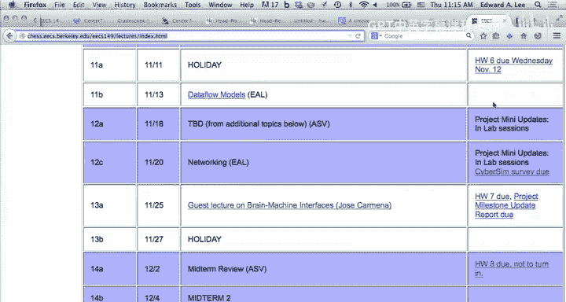
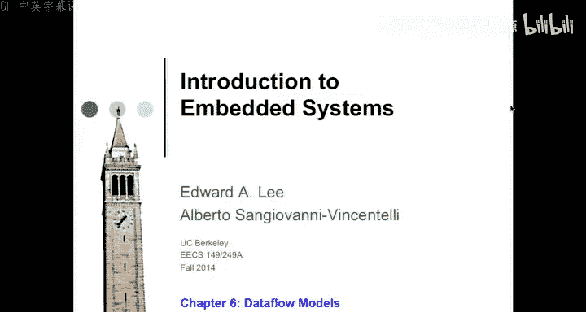
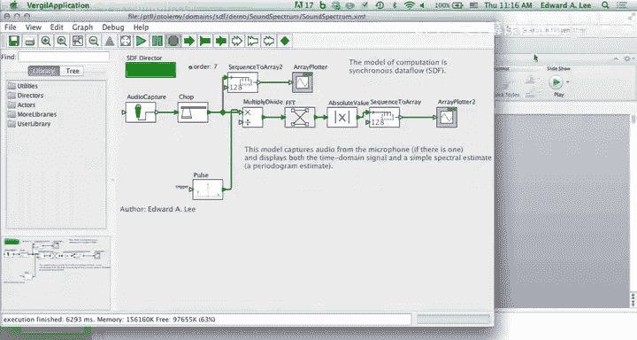

# 嵌入式系统：第21讲：数据流模型 🚀

在本节课中，我们将学习数据流模型。这是一种用于描述异步、确定性并发系统的模型，特别适用于流处理和嵌入式系统设计。我们将探讨其核心概念、分析技术以及如何利用调度理论来设计高效、可预测的系统。

---

## 课程公告 📢

以下是三个重要通知。

*   如果你没有留意邮件，可能错过了这个通知：请使用Doodle投票工具注册下周的项目小型演示。我计划参加所有演示，希望能给大家一些反馈，并期待看到出色的进展。
*   你们在实验室使用的CyberSim工具仍处于实验阶段。实际上，只有少数研究生将其作为主要研究方向，他们非常希望得到你们的反馈。有一份匿名调查问卷，我们会知道你是否填写了它，但无法将反馈与个人对应。
*   明天下午有一场讲座，我认为你们可能会非常感兴趣。Philip Koopman来自卡内基梅隆大学，他曾任职于NASA委员会，负责调查丰田汽车在发生一系列意外加速事故后的软件开发实践。他有一些故事，我认为会非常有趣，并且与本课程高度相关。

---

## 回顾与引言 🔄

上一节我们介绍了使用形式化工具（如Spin和LTL）进行模型验证。本节课我们来看看数据流模型。

我希望你们喜欢假期，也相信大家都享受使用Spin的过程。正如我多次提到的，本课程的目标之一是让你们了解当前的技术前沿，并培养一定的批判性思维。我们希望你们能使用最好的工具。

我真心希望我们在发布期中考试答案之前，能用Spin验证一下题目。我们没有这样做，结果出了问题，这算是自食其果。因为我们一直在强调，使用像LTL这样的形式化语言和状态机这样的形式化模型，可以对它们进行机械化分析。而对于非形式化模型，则无法进行这种分析。如果期中考试的真假判断题是用英文写的，你们也可能犯和我们一样的错误。

实际上，你们更可能犯错，也更难发现错误。直到Antonio准备Spin教程并决定使用我们的期中考试题时，我们才发现其中一个错误。显然，班上那些给出了我们认为错误答案的同学，没有提供让我们信服的解释。直到我们使用了形式化分析工具，才能确定那里到底发生了什么。在某种程度上，我们没有遵循自己所宣扬的原则，即没有使用工具验证我们的期中考试题。

但我希望你们实际创建Spin模型的经历也能带来一些批判性思考。使用这类工具时，有一点让我感到不安：你可以对工具给出的答案有很高的信心。它能明确告诉你，你指定的LTL公式是否被你指定的状态机满足。但它不能告诉你的是，你指定的状态机是否就是你想要指定的那个状态机。实际上，很难确保你指定给Spin的状态机就是你想要的那个。这部分原因在于，我认为Promela语言相当不美观，而不美观的语言可能导致编程错误。当然，美观的语言也可能导致错误。所有语言都可能导致错误。最好使用能让错误更明显的语言。

对于小型状态机，图形化语言或至少能将你的规范图形化呈现的语言可能很有用，因为图形可视化非常有用。但对于大型状态机，这就不太奏效了。所以，这项技术虽然强大，基于非常可靠的理论，但也有其局限性和陷阱。

---

## 问题背景与动机 🎵

现在，让我们进入今天的主题：数据流模型。目标之一是尝试让你们了解如何将我们看过的调度理论（如最早截止时间优先调度和单调速率调度）应用于实践，尽管它们存在各种缺陷和异常情况。

具体来说，我将使用一个调度问题作为例子：一个对音频信号进行频谱分析的系统。我们有一个近似正弦的信号，正在进行实时频谱分析。这是时域信号。我们感兴趣的是对此进行调度，并且场景更复杂一些，因为我关心的是一个对现实世界有反馈的系统。

具体来说，假设你有一些需要低延迟的音频处理。在我刚才展示的应用中，并没有对物理世界的驱动。驱动是对人类视觉系统的刺激。因此，时序要求与人类视觉系统的周期特性有关。为了让显示的频谱分析与音频信号相关联，存在延迟要求，但相当宽松。人类大脑的心理视觉系统可以容忍数十到数百毫秒的延迟，仍然能看到相关性。所以这是一个相当宽松的时序约束。

但你可能遇到延迟要求严格得多的场景。例如，在进行计算机音乐处理时，传感和驱动之间的处理延迟会产生巨大影响。人类听觉系统对大约10毫秒量级的时序现象非常敏感。如果你听到节奏模式，10毫秒的误差就非常明显。因此，当存在这种紧密反馈时，你会得到更严格的延迟约束。

这个应用的有趣之处在于，我们希望将具有严格延迟约束的任务与延迟约束不那么严格的任务结合起来。例如，频谱分析可能100毫秒的延迟是可以接受的，但10毫秒就非常紧张了。我们希望尽可能好，甚至更好。这种不匹配在嵌入式系统中很常见。问题是如何利用我们目前开发的调度理论来设计这类系统？你有一条时间关键路径和一条不那么时间关键的路径。

一种处理方法是创建两个线程，然后祈祷。但如果你在软件上做得非常仔细，也许能让它工作。那么你应该应用哪种调度理论？单调速率调度不适用，因为这些任务之间存在依赖关系。所以不能使用那个定理，必须使用其他方法。

那么，试试带优先约束的最早截止时间优先调度？但我们必须分配截止时间。而且，这类应用实际上是周期性的。所以单调速率似乎应该是正确的方法，因为它直接讨论周期性。而最早截止时间优先调度讨论的是截止时间，所以我们必须分配截止时间。我们可以随意地选择截止时间与周期结束时间对应。但这对于心理视觉方面的任务并不真正适用，因为它的要求更宽松。但如果要应用最早截止时间优先调度，我们必须选择一些截止时间，否则最早截止时间优先调度就没有意义。

在软件设计中，这是一个非常常见的问题：你最终不得不做出一些无法基于任何根本性、基础性理由做出的决定。因此，在提出一些数字时，你必须运用一些工程判断。

---

## 抽象模型与数据流概念 🔄

让我们看看这个问题的抽象版本，并做人们在使用调度理论时通常做的事情：假设不可假设的——所有任务都在已知时间内执行，或者至少有一个最坏情况执行时间。

我们将问题简化为三个任务：蓝色、绿色和红色。红色任务代表频谱分析，它对时间不那么敏感，但计算量大。A和B代表低延迟、时间关键的任务，它们将以更高的频率执行。所以频谱分析执行得较少。通常，进行频谱分析（如我刚才展示的例子）的方式是：收集大量样本，需要大量样本来进行频谱分析，然后对其运行FFT，后处理FFT数据，这需要大量计算，然后创建其视觉呈现。

假设A和B以更高的频率运行，并且有低延迟要求，所以我们希望在A执行后不久，B就能执行。基于这里的数据依赖关系，我们假设进行一个8点FFT。这意味着A每产生一个样本（我们将其视为任务A的一次调用），需要执行该任务8次才能调用红色任务。

这里的模型与同步编程模型有些不同。同步编程模型会说，这些任务在概念上是同时且瞬时执行的。但这里的情况并非如此。这里有一个作为数据源的任务，它必须执行多次，而消费数据的任务在积累了一定量的数据后才被启用。这不再是同步计算模型了。而且，它明显是非同步的，因为消费数据的任务（红色任务）可以被推迟。实际上，如果有足够的缓冲，你可以推迟它很长时间。如果它确实是非时间关键的，例如仅用于日志记录，你可能希望根据机器上的情况任意推迟它。

这明显不再是同步计算模型了。我们今天要做的是形式化一种模型，它既能捕捉这种异步性，又能保持执行中的确定性，这就是数据流计算模型。你们在实验室使用LabVIEW时已经用过这种模型的一个特例，那是一种非常专门化的数据流形式。我会谈谈这种专门化是什么。

这就是这里的场景。由于数据依赖关系，我们需要蓝色和绿色任务调用8次，红色任务调用1次。这些任务之间存在优先关系，我们可以为一个执行周期绘制优先图，这就是我在右边画的。我们可以利用这个优先图来制定调度。我可以通过执行红色和绿色任务8次，然后执行红色任务来调度它们。

这个调度看起来怎么样？它好吗？我们说的“好”是什么意思？我们希望红色和绿色之间的延迟低。我们做到了吗？是的，绿色在红色之后立即执行。我们想要蓝色和绿色的周期性执行。我们做到了吗？算是，但有相当大的抖动。如果你在进行音频处理，音频样本以固定的采样率到达。所以如果采用这样的调度，你将不得不对音频样本进行一些缓冲。如果对音频样本进行缓冲，就会引入延迟，从而增加延迟。现在，不仅仅是调度会影响延迟，抖动也会影响延迟。

尽管如此，我们可以让这个调度工作。数据流模型的一般工作方式是：在源和汇之间使用先进先出缓冲区来缓冲数据。然后，目标任务的调用取决于是否有足够的数据供其工作。因此，我们将形式化定义一个**触发规则**：B需要多少数据才能被启用？一旦它获得足够的数据，它就被启用，这种启用非常类似于我们在讨论最早截止时间优先调度时使用的调度意义上的启用，只有到那时你才能开始考虑调度它。

形式化地讲，连接这两个参与者的信号不再是时域信号，也不再是同步反应模型的信号。时域信号是时间的函数。同步反应信号是抽象时间概念（一系列节拍）的函数。数据流中的信号两者都不是。在这些参与者之间流动的是**流**，它是一个序列，但其中没有时间概念。你有一个值序列，但没有时间概念。你可以将其形式化为从自然数到数据类型的函数。如果是音频样本，可能是实数。这个函数现在表示一个无界的值序列。我们不会将定义域解释为表示时间。这里的自然数不代表时间，也不代表像同步反应模型中那样的全局时钟节拍。

具体来说，如果你在数据流模型中有两个不同的信号，索引n对于这两个特定信号中的特定样本可能是相同的。但这并不意味着它们在某种程度上是同时的。所以这里没有时间概念，只有序列。这是关键。

---

## 数据流参与者与触发规则 ⚙️

我简要提到了触发规则。触发规则规定，计算的启用由输入数据的可用性决定。有几种常见的模式。

在LabVIEW中，基本上只有一种模式：所有输入都必须有一个新数据值。当该模块触发时，它会在所有输出上产生一个新数据值。我们称之为**同构同步数据流**。我为这里的“同步”一词道歉。实际上，这个术语是我很久以前创造的，差不多与同步语言被发明的时间相同。它并不是同步语言意义上的“同步”。它在另一种意义上同步，我稍后会解释。但关键是，同步数据流是一种异步计算模型。术语并不完美，但还可以。

同构同步数据流要求每个输入都需要一个新数据才能被释放（即可被调度）。但我们的频谱分析例子不符合这种模式，它需要八个新的数据块才能被释放。我们可以很容易地推广这一点，说非同构同步数据流模型的触发规则允许你指定需要一些整数个输入，并且在触发时将产生一些整数个输出。这是一个推广。

但你还可以更进一步。例如，这个“选择”是一个数据流参与者，它在底部输入需要一个布尔输入。这是其触发规则的一部分。如果布尔值为真，那么它需要T输入处的一个数据；如果布尔值为假，则需要F输入处的一个数据，只需要一个。所以现在实际上有两个不同的触发规则，执行将在它们之间选择。一个触发规则是：这里有一个真值令牌，这里有一个令牌，现在参与者可以触发。它所做的只是将该令牌复制到输出。第二个触发规则是：这里有一个假值令牌，这里有一个令牌，参与者将把该令牌复制到输出。

在数据流世界中，他们谈论令牌，令牌流是在参与者之间流动的数据。“开关”更简单一些，它的触发规则更简单：每个输入都需要一个令牌。然后根据输入的布尔值，它将令牌路由到T输出或F输出。

你可以使用这些参与者进行令牌的数据相关路由。顺便说一句，这些是非常底层的。在我看来，它们是数据流中的“Goto”。这种令牌的数据相关路由就像命令式程序中的Goto。如果你在构建程序时使用它们，基本上就是在用Goto编程。所以不要使用它们。不过，它们对理论有用，就像Goto一样，你可以理解数据流模型的表达能力。

例如，事实证明，如果你有一个单一的同构同步数据流参与者（与非门），并且只有布尔数据类型，你还有否定门、开关和选择，你就可以构建一个图灵机。这就足够了。这表明，这三个参与者的集合（你还需要另一件事：能够用初始令牌初始化一个流，这是打破循环的方式），用这四个原语，你可以构建一个图灵机。

我们为什么关心这个？因为你不会想用与非门、开关和选择来对音频信号进行频谱分析。我们关心的原因是，它告诉我们关于这些模型可分析性的一些基本问题。它告诉我们，我们可能感兴趣询问这些模型的一系列问题将被证明是不可判定的。我稍后会回到这一点，但请先记住这一点。我们将发现，如果你不允许这些参与者（开关/选择），而只使用这些参与者（同构/非同构同步数据流），所有这些问题都变得可判定。这在嵌入式系统中，特别是设计安全关键系统时，非常有用。

---

## 缓冲区有界性与调度 🧮

例如，在数据流模型中，我们使用先进先出缓冲区。参与者A产生一个令牌，它进入一个队列。当队列中有足够的数据满足其触发规则时，参与者B被启用。我们如何保持队列有界？事实证明，如果你用我建议的那四个原语构建数据流模型，那么能否保持队列有界是不可判定的。这意味着，给定一个数据流模型，没有算法可以分析任何数据流模型并保证其缓冲区使用有限的内存。

这就是基础理论开始重要的地方，因为我们希望能够限制缓冲区，特别是对于安全关键的嵌入式系统，缓冲区溢出是一个问题。如果缓冲区有界，如果它们无界，就需要内存分配和释放，这需要垃圾回收管理。如果你要实现一个具有无界限缓冲区的系统，那么你需要一种分配和释放的机制。这增加了系统的复杂性，如果你研究过这个问题，还会带来内存碎片化的可能性。内存碎片化对于有限的任务来说不是大问题，像大多数信息技术计算机程序，你运行它们，然后它们停止运行就结束了。但在嵌入式系统中，你通常关心的是理想情况下永远不会停止运行的系统。在这种情况下，内存碎片化可能是致命的，因为最终系统会退化到出现严重问题。

因此，在嵌入式系统中，有很多动机去限制这些缓冲区。如果你限制了缓冲区，你可以使用循环缓冲方案非常高效地实现任意长度的缓冲区，这里概述了这种方案。如果你有有界缓冲区，它可以非常高效地完成。

---

## 回到抽象例子：调度策略分析 🔍

让我们回到这个抽象的例子。我们希望限制缓冲区。我提出的这个调度限制了缓冲区吗？是的，因为A的每次调用都有B的相应调用。我们称之为**平衡条件**：产生的每个令牌都被消耗。红色参与者需要八个令牌。在这个调度中，每八次A的调用对应一次红色参与者的调用。所以这个连接也是平衡的。因此，这个调度的优点是保持缓冲区有界，但缺点是我们之前指出的抖动，存在这个暂停时间。如果这是一个繁重的计算，这个暂停时间可能相当长，这意味着你可能需要对传感器和执行器数据进行缓冲，从而导致延迟增加。所以我们想尝试解决这个问题。

这里有一种解决方法：改变调度，使红色和绿色实际上被周期性调用。不再需要缓冲。那么这个方法的缺点是什么？首先，你能够执行此任务的采样率将由你的非时间关键任务决定。这通常不是一个好的特性。你宁愿速率由你的时间关键任务决定，而不是由你的非时间关键任务决定。另一件事是，在计算中浪费资源在道德上是令人反感的。看看所有那些你没有使用的CPU时间。我不确定利用率是否真的是一个大问题，但这里确实存在一个问题：系统成本增加了。因为假设你必须处理特定的采样率，也许你正在进行过采样音频，需要能够处理192，000个样本/秒。你有一大块计算必须完成。现在你设计系统，必须选择一个处理器，它能够在一个采样周期内完成那部分计算。最终，你将选择一个比原则上需要的更昂贵、功耗更高的处理器，如果你能获得更好的利用率的话。

所以这不是一个很好的解决方案。让我们找一个更好的解决方案。如果我们使用多任务处理呢？我们创建两个线程。一个执行高频任务（A和B），另一个执行低频任务。我们误用单调速率定理，给这个线程高优先级，给那个线程低优先级。为什么说我误用？因为这里有数据依赖关系，所以定理不适用。但最早截止时间优先调度在某种程度上适用。给定这个调度，缓冲区会保持有界吗？你根本无法保证它们会保持有界。假设红色任务运行时间很长。红色任务的缓冲区将不断增长。实际上，当模型中存在循环时，这通常是数据流模型的一种可能性。这个系统没有反馈。所以没有什么能阻止A不断产生不被消耗的令牌。

我们可以通过加入一个互锁来修复这个问题。使用一个信号量，我们将阻止蓝色任务的第九次执行开始，直到红色任务的执行完成。这将防止那个缓冲区溢出。这足以防止缓冲区溢出吗？为什么A和B之间的缓冲区不会溢出？在我们生成的调度中，A和B的执行是交错进行的，因为我们把它们放在了同一个线程中，并且我们只是执行一个无限循环：触发A，然后触发B，然后触发A，然后触发B。所以平衡得到了保证。我们通过静态调度该连接所涉及的参与者，保证了该连接上的缓冲区有界。我们使用互锁保证了蓝色和红色之间连接上的缓冲区有界。

是的，在这个方案中你仍然会有抖动。所以现在你需要关心最坏情况执行时间。并且你需要能够验证系统是否能够跟上。这可能会是一个问题。你还有其他选择。一是你可以将其视为故障。如果你的红色任务运行时间比预期长，在安全关键系统中，这实际上可能是一个合理的做法，特别是如果红色任务是非关键任务，比如在进行一些日志记录，你可以将其视为故障，中止该任务。你可能切换到一种降级模式，停止记录日志等。

还有一种“任意时间计算”的概念可能有用。如果你正在进行数据分析，作为一种后台进程，一个结构良好的数据分析算法即使只部分完成，也可能给出有用的结果。例如，有一些频谱分析技术是增量式的，而不是预先决定进行1024点FFT。我先做一个16点FFT，然后用这些结果创建一个32点FFT，再用这些结果创建一个64点FFT。然后当我时间用完时，我就取我得到的FFT结果用于视觉呈现。这被称为任意时间计算，这是一种强制执行最坏情况执行时间的好方法，你只需定义这就是执行时间界限，然后我就取目前得到的结果，并在那时中止计算。

现在，我们这里需要另一个互锁来遵守数据依赖。因为线程2也在一个无限循环中，它只是反复调用红色参与者。但有什么能阻止它过早开始呢？如果它只是反复调用红色参与者，什么也没有。所以你必须在其中加入一些东西，确保红色参与者的第二次执行在其触发规则满足之前不会开始。它需要八个新数据。我认为这些被称为“data”。“data”是“datum”的复数。它需要八个新令牌，这就是为什么数据流中的人使用“令牌”这个词而不是“数据”，因为很多人认为“data”是单数，而不是复数。这让人困惑。

所以红色需要八个新令牌，我们需要另一个互锁来确保它在获得八个新令牌之前不会开始执行。有了这对互锁，我们可以得到确定性的执行。注意，如果蓝色或绿色任务中的一个运行时间很长，一切都没问题。我们不需要另一个互锁来保护这一点。为什么？幻灯片上写着：这个线程具有更高优先级的事实意味着……实际上，我甚至不认为优先级重要。如果我反转优先级，这还能工作吗？这是一个很好的问题。如果我给红色任务比蓝色和绿色更高的优先级，并且有这些互锁，时序约束可能无法满足，但数据流可能是正确的。这是真的吗？这将是期中考试一个非常好的真假判断题。给你一个在特定优先级下工作的调度，问你如果反转优先级，它是否仍然表现正确？在这个例子中，线程1中发生的静态调度（它给出了A和B的固定交错）保证了A和B之间连接上的数据流要求得到满足，无论任何任务执行多长时间。两个互锁保证了从A到C的数据流要求也得到满足。所以数据优先关系将得到满足，即使你反转优先级。唯一受影响的是时序，它会恶化。实际上，它会恶化，因为如果你反转优先级，红色任务将执行完成而不会被抢占，我们又回到了之前的高抖动调度。

---

## 更复杂的数据流模型与调度 🌀

假设你有一个稍微复杂一点的数据流模型。顺便说一下，如果你用过Simulink，不同速率运行的块的表示法是，你为它们指定一个采样时间。你应该将其理解为处理单个样本所分配的时间量。但它并不是真正的时间。所以这个名字有点误导。但无论如何，这意味着B的执行频率将是A的四分之一。在Simulink表示法中，大概消耗A产生的四个令牌。

在这种情况下，如果我在单个处理器上提出一个顺序调度，它看起来会是这样：我需要在能够调用B之前调用A四次。一旦我调用B，假设它在输出上产生四个令牌，那么我可以调用C四次。我得到这样一个调度。现在，如果我关心延迟和抖动，这是一个相当不吸引人的调度。那么有没有办法解决呢？试试多线程怎么样？

这是一个替代调度：将红色放在低优先级任务中，将绿色和蓝色放在高优先级任务中，并设置互锁。一旦蓝色执行了四次，红色就被启用。为什么有一个互锁阻止绿色？绿色需要来自红色的四个数据令牌。所以它将在此时被触发。

现在，在延迟方面问你一个问题。我们可以将延迟定义为A产生一个令牌与C消费依赖于该令牌的某个东西之间的时间。如果A是一个传感器，它进行一次读数。你必须等待多长时间，该读数才能对执行器产生影响？这就是延迟。那么这个调度的延迟是多少？不是很好。传感器读数在这里获取，它可能产生的第一个影响在这里。第一个读数在这里，它产生的影响在这里。实际上，在实践中，这两个延迟最终会是相同的，因为为什么这些东西间隔开，而这些没有？传感器触发四次然后在一段时间内不再触发的唯一方式是，如果有一些缓冲正在进行，这是以规则采样率进行传感。实际上必须有一些缓冲。所以，实际上，通过转向多线程调度，你并没有真正在延迟方面得到任何改善。而且你增加了大量开销，因为有上下文切换。

---

## 数据流模型的历史与同步数据流 📜

首先，数据流模型的研究历史很长，时间上有点断断续续。实际上，这个列表没有更新到现在，但之后还有很多其他工作。最早可以追溯到1966年我们自己的Dick Karp所做的一些工作。我们前系主任David Culler的博士论文就是关于数据流模型的。我的博士论文也是关于数据流模型的，实际上我创造了“同步数据流”这个术语，造成了巨大的混淆，因为差不多在同一时间，Lustre编程语言出现了，并被Paul Caspi描述为一种同步数据流语言。Paul在他关于Lustre的第二篇论文中，引用了我的论文，但没有读过。他只是因为标题中有“同步数据流”就假设我谈论的是和他一样的计算模型。但我不是，它们是两种完全不同的计算模型。所以引用别人的作品时要小心，最好真的读一下论文。

但无论如何，因为这是我最喜欢的话题之一，我要告诉你们这个同步数据流模型，以及一些更具表达力的模型。这个特定模型在表达能力上不是很强，因为它不能描述图灵完备的计算，它不是图灵完备的。但有一类事情它做得非常好，对于这些事情，完全分析模型的能力是一个非常强大的工具。所以这里有一个权衡，就像我们为什么使用有限状态机一样的论点：有限状态机也不是图灵完备的？但我们仍然使用有限状态机，因为我们可以详尽搜索它们的行为以发现异常行为，这就是Spin所做的。Spin查看所有可能的行为，然后给出关于这台机器可能具有的整个行为家族的明确答案。对于图灵完备的计算模型，你通常不能这样做。

所以同步数据流是另一个更受限的模型，就像有限状态机一样，但它与有限状态机非常不同，具有非常不同的特性，它是关于流处理的。同步数据流的关键约束是，每个参与者的触发规则都非常简单：它们需要在输入上有固定整数个令牌才能被启用。当它们触发时，它们将在输出上产生固定整数个令牌。

如果你有两个参与者之间的连接，你可以写下一个非常简单的方程，将这两个参与者的执行关联起来，以保证一切保持平衡。这就是这个特定连接的平衡方程：如果你触发参与者A Q_A次，它在连接C上产生P_C个令牌，那么这应该等于你触发参与者B的次数乘以它消耗的令牌数。非常直接，这就是保持平衡的方式，你产生的所有令牌都应该被消耗。

但这有点奇怪，对吧？这个模型本质上永远不会终止。A可以不断产生令牌，B可以不断消耗令牌。那么Q_A和Q_B不都是无限的吗？是的，它们可能是。理论上，它们仍然会平衡，无穷等于无穷，在某种意义上是这样。至少这两个无穷大会相等。但这不是一个有用的结论，所以我们希望进行更有限的分析。

---

## 平衡方程与矩阵表示 🧮

让我们看一个稍微不那么简单的例子。这是一个由三个参与者组成的数据流模型。这个参与者有两个输出端口，触发时在这里产生一个令牌，在这里产生两个令牌。这个参与者消耗一个并在这里产生两个。这个参与者消耗一个和一个。

那么，这能保持平衡吗？也许是的，这取决于你说的“明显”是什么意思。你必须注意到，参与者3需要执行这些参与者的两倍频率，而这两个需要执行相同的次数才能保持平衡。这些连接的平衡方程会告诉你这一点。

平衡方程可以非常紧凑地描述为一个非常简单的矩阵方程。如果你学过图论，这个方程看起来很像描述图的邻接矩阵。但它不仅仅是描述邻接，还告诉我产生了多少令牌和消耗了多少令牌。构造这样一个矩阵的方法是：为图中的每个连接创建一行。这是连接1，连接参与者1和参与者2。然后为每个参与者创建一列。在矩阵中输入该参与者在该连接上产生或消耗的令牌数。参与者1在连接1上产生一个令牌。参与者2（第二列）从连接1消耗一个令牌，所以你放一个负数。参与者3根本不参与连接1，所以它在该连接上不产生也不消耗任何东西，你放一个零。你可以构造这样一个矩阵。然后构造一个向量，它是每个参与者的调用次数。Q1是参与者1执行的次数，Q2是参与者2执行的次数。然后平衡简单地要求Γ乘以q的矩阵乘积等于0。

这是一个非常紧凑的平衡约束表示。对于这个特定的例子，平衡方程看起来像这样。注意，这个矩阵不一定是方阵，因为连接的数量不一定等于参与者的数量。每个连接一行，每个参与者一列。你可以看到这个方程……我的意思是，这个矩阵代表了这些参与者的生产消费模式，并适当标记了列和行。

回到这个稍微有趣的例子。我们有了这个矩阵方程，一个关键问题出现了：我们是否有任何保证存在解？这是第一个问题。你能找到一个向量Q，使得Γ乘以Q等于0吗？对于这个具体的，你已经给出了解，所以一般来说……是的，如果它是满秩的……嗯，实际上不完全是。总是有一个解。总是有效的解是什么？零。通过根本不触发任何参与者，你总是可以保持数据流模型平衡。但这可能不是你想要的。所以你感兴趣的是找到一个非零解。非零解的存在将取决于这个矩阵的秩。

我们不是在寻找任何解……我们实际上在寻找什么？我们感兴趣的是整数解。如果解说你应该触发参与者1 π次，参与者2 π次，参与者3 2π次，这不是很有用，因为你不能触发一个参与者π次。你也不感兴趣解说类似触发参与者1一次，参与者2负一次，参与者3两次，因为你不能触发一个参与者负一次，就像你必须“取消触发”参与者。所以我们实际上感兴趣的是平衡方程的正整数解。

有理数解就足够了，因为如果你能找到有理数解，你可以找到分母的最小公倍数，然后找到一个整数解。在这个特定例子中，平衡方程有许多解，这个零解有效，非整数触发有效。但在这些解中，只有这两个是有趣的。而这个比这个更有趣，因为它是最小的正整数解。

如果我们对解决调度问题感兴趣，直观上，处理较少的触发次数应该比处理较多的触发次数更容易。但这并不那么明显，因为事实证明，如果你处理更多的触发次数，你在调度方面有更大的灵活性，可以提出更好的调度。但无论如何。

关键结果是：如果这个矩阵不是满秩的，那么平衡方程总是存在一个正整数解，并且总是存在一个最小的正整数解。而且，有一个非常简单的线性时间过程可以找到那个解。这是一个关键结果，实际上很容易看出为什么这个结果成立，因为产生和消耗的令牌数总是整数，而且总是正整数。因此，如果我任意设Q_A为1，那么我可以得到Q_B的有理数解。现在我的向量元素中，我有了一些有理数值。如果图是连通的，那么参与者A或参与者B也将连接到另一个参与者。因此，我可以找到那个参与者的触发次数的有理数解。一旦我有了那个有理数解，我看看它连接了什么，我可以找到那个参与者的有理数解，我就这样遍历我的模型，直到我得到所有参与者的有理数解。现在我有了一个正有理数解。现在我可以遍历并找到所有分母的最小公倍数，然后乘以那个最小公倍数……我感兴趣的是什么，最大公约数？取决于你看的是分子还是分母，是乘还是除。但无论如何，你可以找到一个有理数解，如果存在的话。但如果矩阵是满秩的，那么唯一的解就是零解。这如何体现？当你尝试这样做时，它会简单地体现为：你将不得不有一个循环。所以当你连接到下一个参与者时，你发现，哦，我已经有了那个参与者的解，猜猜看，这个新的平衡方程不满足那个解。发现不平衡也是在线性时间内完成的。

术语：如果平衡方程存在非零解，则称模型是**一致的**。这是一个不一致模型的例子。它与前一个例子只有非常细微的差别：参与者2只产生一个令牌，而不是两个。这是生产消费矩阵的样子。现在平衡方程的唯一解是不触发任何参与者。你可以直观地看到这一点：如果我触发参与者1一次，它将在这里产生两个令牌，在这里产生一个令牌。那时，我可以触发参与者2一次，它将在这里产生一个令牌。所以现在我这里有一个令牌，这里有两个。这个参与者被启用一次触发。它将消耗这里的一个和这里两个中的一个。但现在我有一个剩余的令牌，没有办法消耗它。如果我重复这个过程，最终这个连接上会发生缓冲区溢出。我没有给你证明，但我给了你一个证明草图。你应该读我的博士论文，里面有证明。

你也可以确定，如果秩不是满的，就存在一个解，存在一个最小的正整数解。实际上，证明方法是：我也给你那个证明的草图。如果矩阵不是满秩，那么模型上的一个生成树具有与完整模型完全相同的信息。因为不满秩意味着存在线性相关的行或列，所以那些线性相关的行或列是冗余的。你可以找到一个生成树，然后证明由于矩阵不满秩，生成树具有与原始模型相同的解集。对于树，它总是有效的，树总是有效的……这就是证明的草图。

在这个例子中，没有非平凡解。好处是你可以分析这个模型并拒绝它，认为它是一个错误的模型，并说：我无法用有限内存执行这个东西。注意，能够对程序做出这样的陈述（这是一个程序）是非平凡的。对于图灵完备语言中的任何程序，你通常不能做出这样的陈述。或者更准确地说，没有算法能够回答图灵完备语言中给定程序是否能在有限内存中执行的问题。但对于同步数据流图，有一个算法可以回答它是否能在有限内存中执行的问题。顺便说一下，这证明这不是一个图灵完备的计算模型，因为有界性问题是可以判定的。

所以，一致性是拥有有界内存、无限执行的必要条件。你可以用有限的内存永远执行模型。这也是充分条件吗？换句话说，如果我知道我有一个一致的模型，我是否知道存在一个有界内存的无限执行？你怎么看？如果我知道瓶子是一致的，我能得出结论存在有界内存的无限执行吗？不，它不依赖于时间。有界内存无限执行的存在只与……任务执行多长时间无关。我为你概述的定理说：如果模型不一致，就不存在有界内存的无限执行。但我没有说如果模型一致，是否存在有界内存。问题是，存在吗？我看到一个，你想解释为什么不存在？你可能会有死锁。考虑这个模型。平衡方程有一个解。你可以执行两个参与者各一次。但你无法执行两个参与者各一次，因为最初它们的触发条件都不满足。所以没有无限有界内存执行，实际上根本没有执行。这是一个有界执行，不是无限执行，它执行所有参与者恰好零次。这是一个死锁。

顺便说一下，我想指出，在数据流模型中，死锁被认为是邪恶的。在Carpen和Miller 1966年的第一篇论文中，他们恰恰相反。在经典计算理论中，无法停止是邪恶的。在那篇论文中，他们明确只对死锁的模型感兴趣，那些是唯一有趣的，因为它们指定了一个停止的计算。在图灵-丘奇计算理论中，所有无法停止的计算都是等价的，而且是有缺陷的。这是一个有趣的转变。但在数据流模型的情况下，我们实际上……停止是一种邪恶的属性，所以当停止是邪恶的，我们称之为死锁；当它是期望的，我们称之为停止。但这是相同的现象。所以这个模型立即停止……我的意思是，立即死锁。

现在，死锁可能更难确定。在这里，你可以一眼看出这将死锁。假设你有一些初始令牌可用。这会很快死锁吗？一眼看去，你无法判断，你必须运行一下执行。当然，随着模型变大，回答是否死锁的问题可能变得更加困难。但幸运的是，同步数据流模型是否死锁的问题也是可以判定的。我想我有时间解释一下。

---

## 调度构造与有界性证明 🛠️

确定模型是否具有有界无限执行的一种方法是：首先检查模型是否一致。如果不一致，那么就没有有界无限执行，完成。如果一致，那么你仍然需要担心它是否会死锁。确定是否死锁的一种方法是构造调度，一个可以无限次执行的调度。但你怎么知道构造调度是一个有界过程？这是我们必须能够确定的关键。

以下是构造调度的方法，同时证明构造调度的过程是有界过程，它会终止。所以它属于图灵-丘奇那类有用的程序，因为它终止，而不是死锁。它是如何工作的？我们将通过跟踪缓冲区中有多少令牌来稍微扩充模型。我们引入一个新的向量B，它为每个缓冲区设置一个元素，简单地告诉我该缓冲区中有多少令牌。

在这个特定模型中，我们开始时所有缓冲区中都没有令牌，所以B是0，0，0。我们已经解出了平衡方程，并发现1，1，2是平衡方程的一个解，这意味着参与者1应触发一次，参与者2应触发一次，参与者3应触发两次。有趣的是，当我们触发时会发生什么？如果我们触发参与者1，我们就用掉了一次参与者1的触发。所以我们可以递减向量Q，说：好了，我们已经处理了那次触发。并且我们对缓冲区产生了影响：我们放了一个令牌到缓冲区1，两个令牌到缓冲区3。顺便说一下，从这里到这里的操作，只是将生产消费矩阵乘以一个告诉我触发了哪个参与者的向量。我稍后会展示那个操作，但直观上你可以看到我们可以跟踪缓冲区。

在那一刻，我们可以触发参与者2。顺便说一下，我们做的一件事是：现在触发下一个参与者的可能性有哪些？在数据流理论中，当我的缓冲区是这样时，被启用的参与者是参与者1和参与者2，两者都被启用。但我不会考虑触发参与者1，因为我剩下的触发次数是零，这正是使过程有界的原因。我将排除触发参与者1，因为我已经完成了参与者1所需的所有触发。所以我唯一的选择是触发参与者2。我可以再次更新缓冲区。然后我递减触发向量，这样我就不再需要对参与者2进行任何更多触发。我仍然需要对参与者3进行两次触发，但幸运的是，这两次触发现在都被启用了。我可以将我的缓冲区带回到初始状态，满足了我的平衡方程解中所需的所有触发。这个过程保证会终止，因为这个向量是一个有界的正整数向量。

在数据流模型中，你通常有很多选择。在这个特定例子中，每一步我只有一个选择。但通常你有很多选择，让我给你看一个关于这个非常有趣的例子。就是这个。这是我的一个学生在他的博士论文中研究的一个例子，这是Shuvra S. Bhattacharyya，他现在是马里兰大学的教授。他考虑的问题是将音频信号从光盘格式转换为数字音频磁带。

数字音频磁带，我敢肯定你们对它一无所知，因为它昙花一现，没有持续很久。但它是索尼推出的一项技术，旨在取代盒式磁带。但它失败了。但在开发这项数字音频磁带技术的过程中，索尼决定数字音频磁带录音的采样率应该与光盘的采样率不同。在光盘上，采样率是每秒44，100个样本。所以他们决定在数字音频磁带上使用每秒48，000个样本。为什么？是的，营销论点是更高的采样率更好。所以我们做更高的采样率。这不是真正的原因。真正的原因是，是的，他们想让将CD完美复制到数字音频磁带变得非常困难。你知道，这是在每个人都有CD刻录机之前。CD刻录机在那时是昂贵的机器。所以他们想让它难以将CD完美地数字复制到数字音频磁带上。所以他们选择了一个极其尴尬的采样率比例。

事实证明，你可以通过先进行二比一上采样，然后进行二比三下采样，然后进行八比七下采样，然后进行五比七上采样，将CD转换为数字音频磁带。这是一个数据流参与者，消耗七个令牌并产生五个。这是一个数据流参与者，消耗七个令牌并产生八个。这些数字……数字由于某种原因是反的。平衡方程的解显示在参与者下方。这是这个特定模型的平衡方程的最小整数解。你执行这个参与者147次，这个参与者147次，因为这个产生一个，这个消耗一个。这个产生两个，这个消耗三个，所以这些触发之间存在二比三的比例，所以这个执行98次，这个执行28次，这个执行32次，这个执行160次，这将使你从44.1千赫兹到48千赫兹的采样率。

总之，Shuvra研究了所有你可能为这个模型构造的调度，针对不同的标准。这是最小化缓冲区大小的调度。这里没有模式，这就像混沌。调度很难用编码算法编码，因为它里面没有重复的模式，至少没有重复很长时间的。所以，是的，在调度方面你有很多选择，根据你试图满足的标准（在这个例子中，他专注于最小化缓冲区大小），你可能在构造这些调度时有一个非常有趣的优化问题需要解决。是的，它们都给出相同的数据流计算。所有调度最终都会产生相同的结果。但它们将使用不同数量的资源。我的意思是，他还研究了调度编码大小也有内存成本的问题。所以我们也要考虑这一点，以及缓冲区大小。

关于这个有一本书，由Shuvra领导数据流爱好者们编写，这被称为“绿皮书”，因为它是绿色的。它表明你可以得到非常大的效果。在各种优化不同目标的调度中，用于数据缓冲的内存量可以从1000的高点到32的低点。对于这个相当小的模型