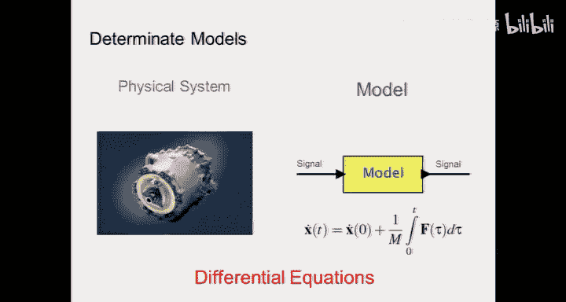
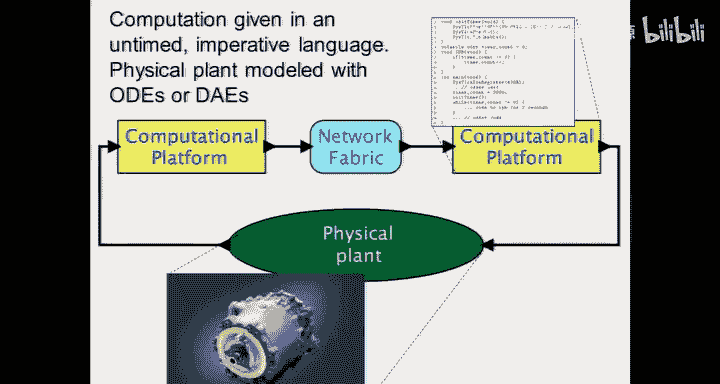
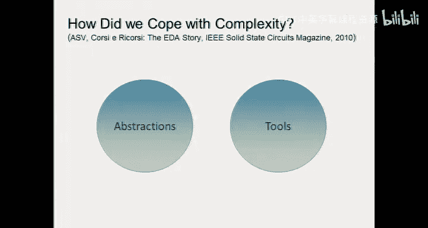
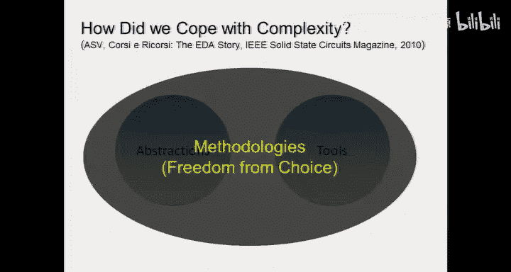
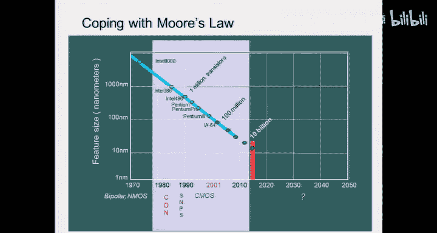
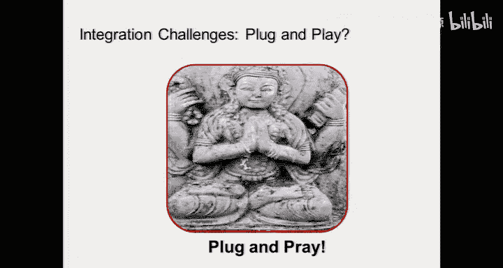
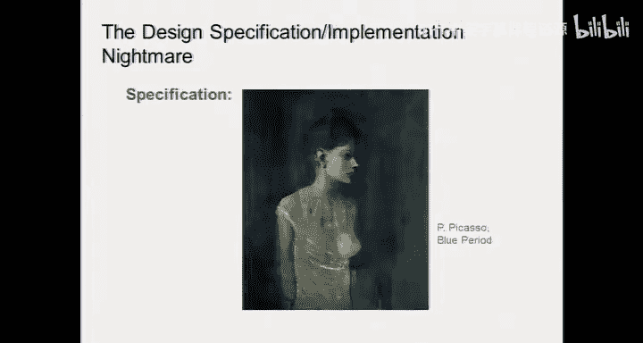
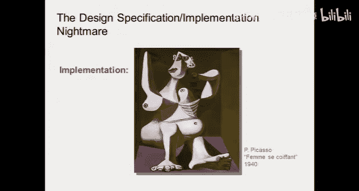
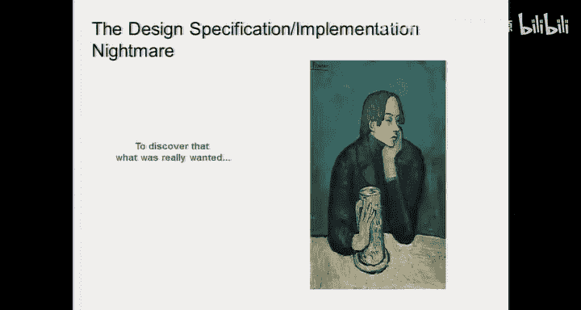
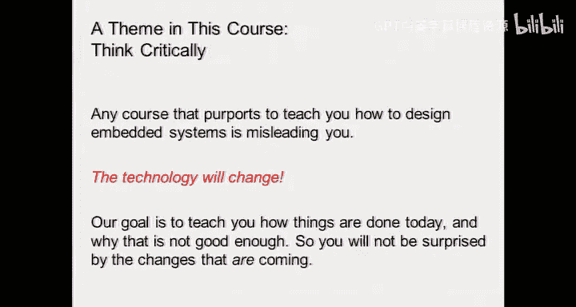

# 嵌入式系统导论：1：信息物理系统概述

在本节课中，我们将学习信息物理系统的基本概念，了解其重要性、设计挑战以及未来的发展趋势。我们将从课程介绍开始，逐步深入到信息物理系统的核心原理。

## 课程介绍与安排

我是Alberto Sangiovanni-Vincentelli，来自瑞典。我将与Edward Lee共同教授这门课程，他也是我们课程用书的合著者。

在开始之前，有几个行政事项需要说明：
*   所有在候补名单中的本校正式学生都将被录取，但无法接收校外进修学生。
*   研究生和本科生需分别注册对应编号的课程。
*   每位学生都必须注册一个实验课。由于人数超额，我们已新增一个实验时段。选课系统将在明天前调整完毕，请务必在周一前完成注册。

现在，让我们进入课程的核心内容。

## 什么是信息物理系统？

上一节我们介绍了课程的基本情况，本节中我们来看看课程的核心主题——信息物理系统。

信息物理系统是**逻辑**（例如运行在微处理器上的计算机程序）与**物理世界**的结合。这与标准计算系统有本质区别。标准计算系统的基本抽象是时间、功耗和操作顺序无关紧要，但这种抽象对于处理与物理世界交互的系统是不适用的。

信息物理系统无处不在，汽车、飞机、生产线、国防系统、航空电子设备等都依赖于内置的电子智能。然而，系统越复杂，出现错误或部件间发生意外交互的可能性就越大，这可能导致严重的后果，例如汽车行业因软件缺陷导致的大规模召回事件。

## 一个复杂案例：四旋翼飞行器

为了理解信息物理系统的复杂性，让我们看一个例子：自主四旋翼飞行器。

要让这个飞行器自主飞行并完成任务（如跟随地面目标或运送物品），需要解决一系列挑战：
*   **建模与控制**：需要对其飞行动力学进行建模和控制。
*   **模式管理**：系统有不同的操作模式（如起飞、巡航、着陆），并需管理模式间的转换。
*   **子系统协同**：需要协调多个交互的子系统的行为。
*   **多机通信**：当存在一个飞行器编队时，需要处理机间通信与协同。
*   **硬件设计**：涉及传感器（感知物理世界）和执行器（作用于物理世界）的接口设计。
*   **软件设计**：需要编写能够处理并发任务和实时调度的复杂软件。
*   **验证与调试**：必须在实际飞行前，通过模型分析和仿真来验证系统的安全性和实时性。

其计算平台可能包含多个并行的微处理器，分别处理低级飞行控制和高级决策任务。它还可能集成了多种传感器（如IMU惯性测量单元、GPS、视觉系统）并采用**传感器融合**技术，以精确获取自身位置和感知环境。

## 课程核心：基础、抽象与模型

面对如此复杂的系统，有两种设计方法：一种是“ hacking”（即试错法），这对于简单系统可行，但对复杂系统则难以调试和维护。因此，本课程的重点是第二种方法：**基于模型的设计**。

本课程的核心是教授**基础**、**抽象**和**组合规则**。技术不断变化，但基本原理是永恒的。我们的教材围绕三个轴线组织：
1.  **建模**：用数学方程描述系统行为（描述性模型）或规定系统应有的行为（规定性模型）。工程设计是自上而下（规定）与自下而上（描述）的结合。
2.  **设计**：创造实现想法的具体方案。
3.  **分析**：理解系统行为及其原因，以便在仿真中发现问题并修正。

## 行业重要性与经济潜力

信息物理系统为何如此重要？它们不仅已渗透到各个工业领域，更代表着未来的巨大经济潜力。

麦肯锡等咨询公司列出的颠覆性技术中，至少有四项与本课程紧密相关：
*   **物联网**
*   **先进机器人技术**
*   **自动驾驶与半自动驾驶车辆**
*   **云计算**（作为支撑技术）

其中，物联网的经济潜力被预估为数万亿美元，远超云计算。谷歌、苹果等科技巨头也正在大力投资这些领域：
*   **谷歌**：通过自动驾驶汽车（Waymo）、智能家居（Nest）、先进机器人（Boston Dynamics）和无人机项目，旨在掌控交通、家庭、制造和通信基础设施。
*   **苹果**：据信对特斯拉感兴趣，意在结合其在电池技术和高端产品生态方面的优势。

这些投资表明，物理世界与信息世界的融合是未来的核心趋势。

## 未来趋势：从个人设备到传感云

计算技术的中心正在转移。过去是大型机时代，现在是个人电脑和智能手机的移动接入时代，而未来将是**传感云**时代。

未来，无数传感器将嵌入我们周围的一切（墙壁、家具、甚至人体），形成一个巨大的传感网络。所有的数据将在云端被收集、合成和分析。这将彻底改变我们的生活和工作方式，例如实现智慧城市管理。同时，**生物信息物理系统**也在发展，例如通过脑机接口，让猴子仅凭思维就能控制远端的机械臂。

## 核心挑战：统一异构模型

设计信息物理系统的根本挑战在于如何统一两种截然不同的模型：
*   **物理系统模型**：通常用**微分方程**描述，是连续、并发的。
*   **计算系统模型**：通常用**C语言**等命令式语言描述，其抽象本身没有时间概念，是顺序、离散的。

传统的数字电路设计通过**同步抽象**（如时钟）成功地将异步的晶体管物理行为与确定性的逻辑功能分离开。我们需要为信息物理系统找到类似的、能够统一连续物理动力学和离散计算逻辑的**抽象**、**方法论**和**工具**。

过去在集成电路设计中，我们通过**组合与分解**（水平方向）、**抽象与细化**（垂直方向）以及**同步设计**等方法论，成功地将芯片复杂度从12个晶体管提升到数十亿个。我们需要将这些原则应用到更复杂的信息物理系统设计中。

## 课程要求与总结

本节课我们一起学习了信息物理系统的基本概念、重要性、设计挑战及未来展望。本课程的目标是培养批判性思维，提供应对技术变化的基础理论和方法，而非教授特定工具或一时的技术。

以下是课程的一些具体要求：
*   **教材**：使用Lee & Seshia所著的《Introduction to Embedded Systems》最新版。
*   **考核**：包括作业、实验和课程项目。
*   **项目**：通常以4人小组形式进行，从给定项目中选择，鼓励团队间竞争。历史上曾有自主飞行、乐高平衡车等项目。

请记住，成功设计信息物理系统的关键在于避免“即插即祈祷”的方式，而是采用严谨的建模、明确的设计方法和深入的分析。

---
**总结**：在本节课中，我们一起学习了信息物理系统的定义、其广泛的应用和巨大的经济潜力。我们通过四旋翼飞行器的例子剖析了其设计复杂性，并指出了课程的核心——学习如何通过建模、设计和分析来应对这些挑战。我们探讨了统一连续物理模型与离散计算模型这一根本难题，并展望了从个人设备到泛在传感云的未来趋势。本课程旨在为你奠定应对这一快速发展的领域所需的基础理论和思维框架。