# 嵌入式系统：22：时间触发架构 🕒

在本节课中，我们将要学习时间触发架构。这是一种在工业界应用日益广泛的架构，其核心思想是利用同步模型来构建分布式系统。我们将探讨其基本原理、实现方式以及与事件驱动模型的对比。

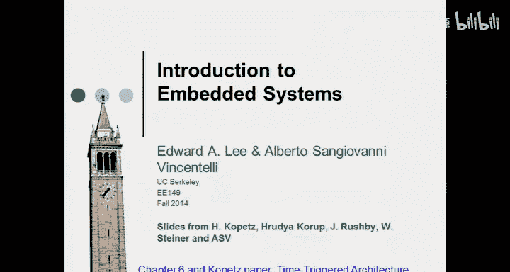

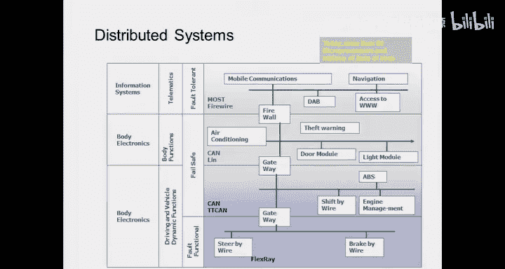

## 概述

时间触发架构是一种用于设计安全关键系统的平台。其核心功能是通过时分多址方案来管理通信。这种架构旨在解决分布式系统中信息传递的准确性和时效性问题，特别是在汽车、航空等安全关键领域。

上一节我们介绍了同步模型在软件和电路设计中的应用，本节中我们来看看如何将这一概念扩展到分布式系统的架构设计中。

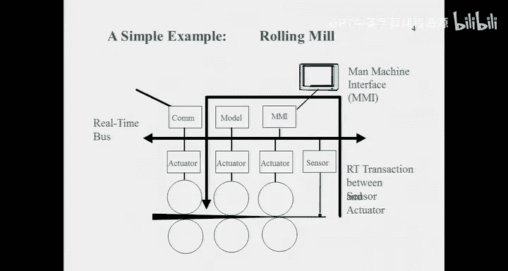

## 现代系统的挑战

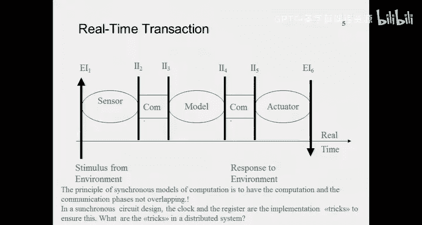

如果你打开一辆现代汽车，你会发现超过80个处理器相互连接，执行不同的任务。这些系统包括信息系统、传感器网络、车身电子设备以及安全关键的控制模块。

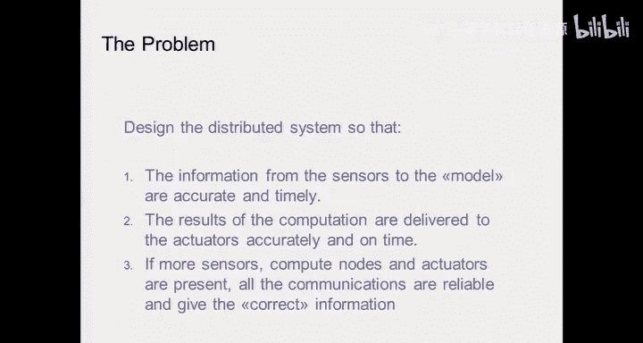

以下是当前汽车架构面临的主要问题：
*   **复杂的连接**：不同功能的组件通过不同的线缆和协议连接，导致系统杂乱无章。
*   **冗长的线束**：一辆大型汽车中可能有多达10公里的线缆，增加了重量和复杂性。
*   **集成的困难**：汽车制造商负责系统集成，而一级供应商制造各个模块，二级供应商提供半导体。这种复杂的供应链使得保证整个系统正确工作变得非常困难。

类似的架构也出现在造纸机、轧机等工业系统中，它们同样是包含传感器、计算节点和执行器的分布式系统。

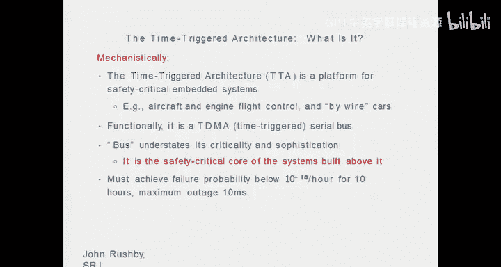

## 同步范式的目标

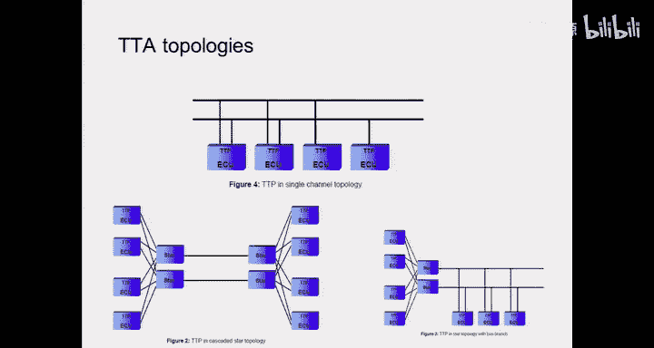

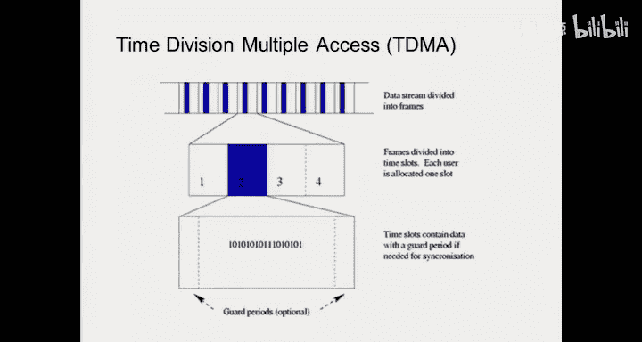

在异步模型中，传感器采集数据后，通信、计算和执行可能随时发生并产生冲突。同步范式的目标是将计算和通信安排在不重叠的阶段。

一个理想的工作周期如下：
1.  **传感器采样阶段**：所有传感器向系统报告状态。
2.  **通信分发阶段**：传感器数据被分发给需要的计算节点。
3.  **计算阶段**：各个节点进行计算。
4.  **执行器通信阶段**：计算结果被发送给执行器。

关键问题在于：我们如何在由时钟和寄存器实现的同步电路设计技巧基础上，在物理分布式系统中实现这种机制？

## 什么是时间触发架构？

时间触发架构是一个用于安全关键系统设计的平台。其核心通信机制是**时分多址**。

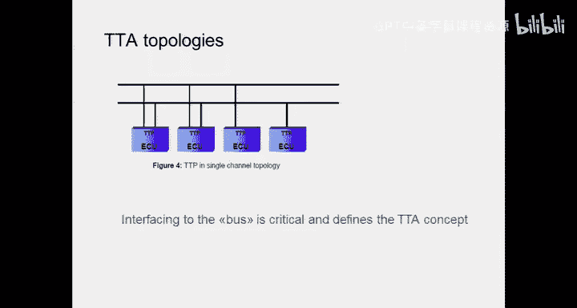

**TDMA（时分多址）** 意味着在一个循环调度周期中，每个节点都拥有自己专属的时间槽。在某个时间槽内，只有对应的节点可以进行操作（如发送数据），从而避免了冲突。

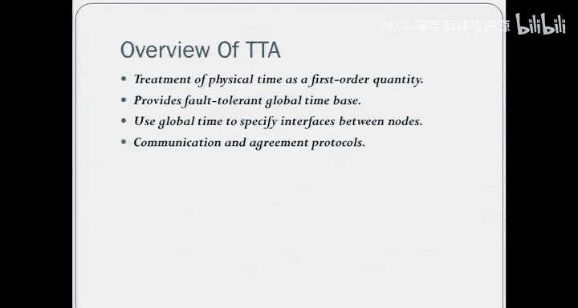

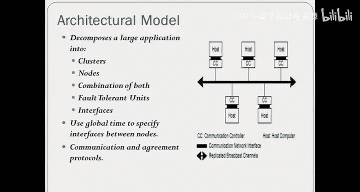

这种通信方式也广泛应用于今天的蜂窝网络。对于安全关键系统，网络需要满足极高的可靠性要求，例如故障率低于每小时10⁻¹⁰，最大中断时间少于10毫秒。

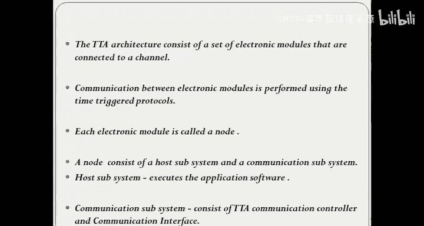

## 拓扑结构与协议

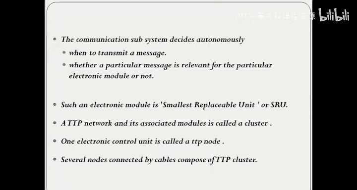

TT协议是构建在物理层（如总线）之上的一个通信层。其实物拓扑结构可以多样化：

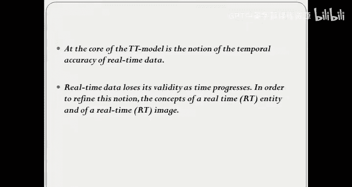

*   **单通道拓扑**：所有节点连接到同一总线上。
*   **级联星型拓扑**：智能传感器连接到网关，网关之间再进行通信。
*   **混合星型总线拓扑**：结合了星型和总线结构。

无论物理拓扑如何，只要通信协议是TDMA，就能实现时间触发的特性。

## 核心机制：接口与时间同步

在分布式系统中实现类似电路寄存器“写入-锁存-读出”的机制，关键在于节点与总线的接口。

**全局时间同步** 是其中最核心的概念。所有节点必须对“当前时间”有一致的认知，否则整个调度就会混乱。这就好比芯片设计中的时钟同步问题，但在长达数百米的飞机或汽车中，这个问题要复杂得多。

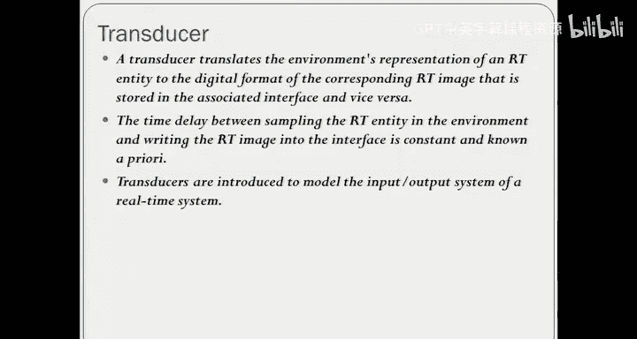

实现时钟同步的一种常见方法是：一个中央主节点收集所有节点的本地时间，计算出一个平均值作为“全局时间”，然后通知所有节点与之对齐。

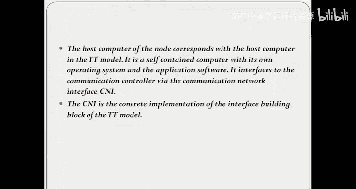

时间触发架构将物理时间的处理视为首要任务，它提供了容错的、基于全局时间的同步服务，并利用全局时间来规定节点访问总线的接口时刻。

## 节点结构与数据流

一个时间触发网络节点由两部分组成：

1.  **主机子系统**：负责计算、测量或执行操作。
2.  **通信子系统**：负责控制数据从节点到网络的传输。

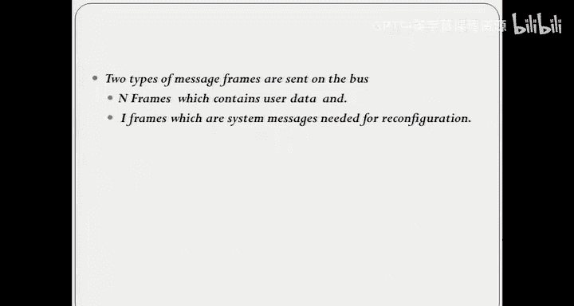

通信子系统包括通信控制器和通信接口。其工作方式类似于双缓冲：
*   主机将计算结果写入一个**发送缓冲区**。
*   在由全局时间确定的专属时间槽到来时，通信控制器将缓冲区数据打包并发送到网络。
*   接收节点根据消息中的地址信息判断是否读取该数据。

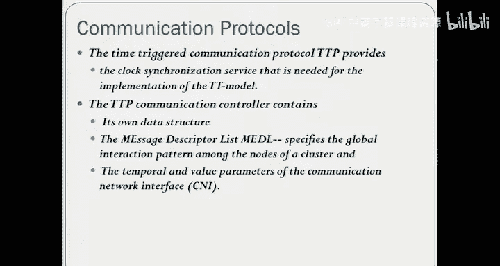

## 实时数据与时间槽设计

实时数据具有时效性。在TDMA调度中，必须确保调度周期足够短，使得节点处理的数据不是过时的“旧快照”。

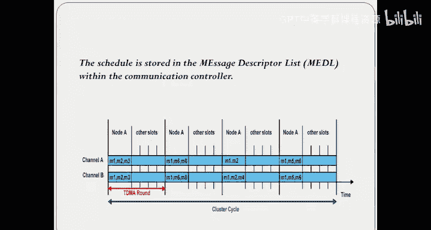

设计一个良好的TTP网络，关键在于决定两个参数：
*   **时间槽的长度**：每个节点发送数据的时间窗口。
*   **整个TDMA循环周期的长度**。

这是一个重要的设计优化问题，需要在数据新鲜度和系统响应能力之间取得平衡。

## 容错与成员关系

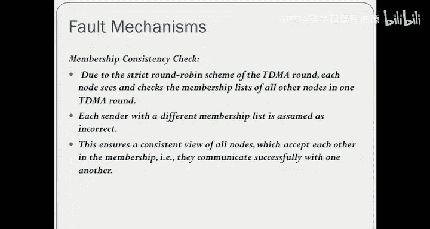

系统必须能够检测和处理节点故障。TTP架构主要考虑两种故障模型：

*   **沉默故障**：节点故障后停止发送任何信息。监控者发现某个时间槽为空，即可判定该节点故障。
*   **唠叨故障**：节点故障后持续发送信息，甚至占用其他节点的时间槽。监控者发现数据溢出指定时间槽，即可判定故障。

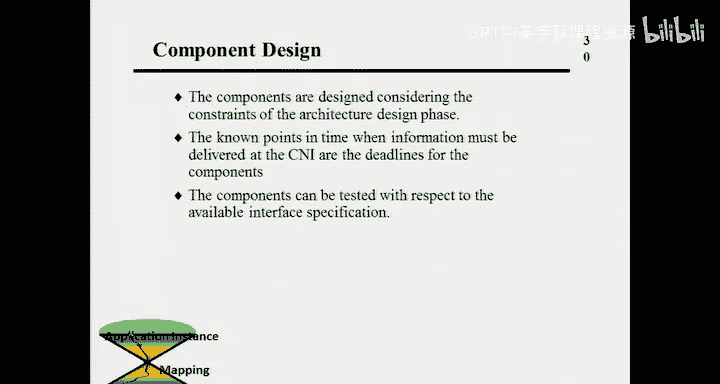

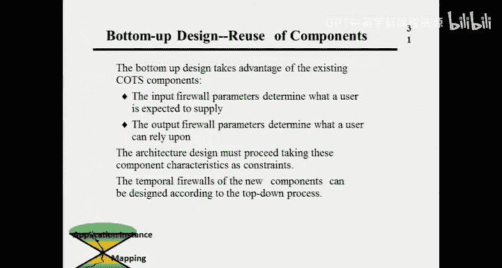

一旦检测到故障，系统可以通过发送重新配置消息，将故障节点的功能分配给其他节点，从而实现**故障容错**。节点的“成员关系”状态（是否在正常通信）被持续监控。

## 设计流程：自上而下与自下而上

时间触发架构支持可组合的设计流程，这与基于平台的设计原则一致。

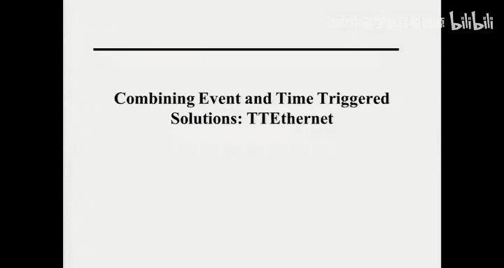

1.  **架构设计阶段（自上而下）**：
    *   将系统划分为近乎自治的组件。
    *   在高层指定功能性和及时的信息流需求。
    *   设计通信控制器的消息描述列表，确定通信激活的时间点。
    *   最终结果是跨越TDMA时间槽的**时间防火墙**规范。

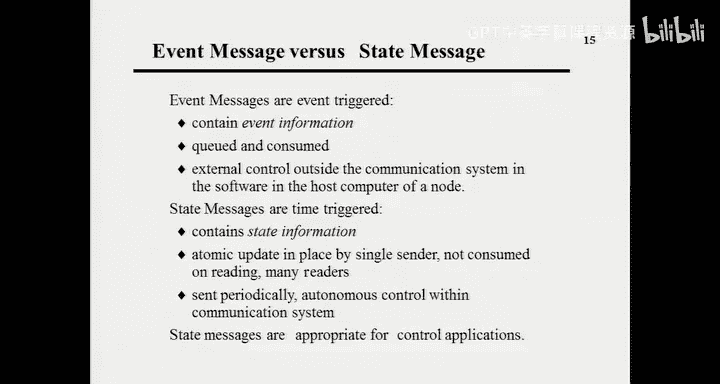

2.  **组件设计阶段（自下而上）**：
    *   组件设计师根据架构阶段给出的约束（如计算必须在指定时间槽内完成）进行设计。
    *   如果组件无法在给定时间槽内完成计算，则需要迭代修改设计（如调整时间槽长度或优化组件）。

## 事件触发 vs. 时间触发

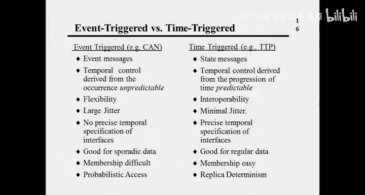

以下是两种通信模式的对比：

| 特性 | 事件触发通信 | 时间触发通信 |
| :--- | :--- | :--- |
| **消息类型** | 事件消息（含事件信息，需队列缓存） | 状态消息（系统在某个时刻的快照） |
| **时序控制** | 由事件发生驱动，不可预测 | 由时间推进驱动，可预测 |
| **灵活性** | 高，易于即插即用 | 低，需要预先规划 |
| **确定性** | 非确定性（可能丢包、覆盖） | 确定性 |
| **时间抖动** | 大 | 小（最大为时间槽长度） |
| **接口规范** | 无精确时间规范 | 有精确的时间规范 |
| **故障检测** | 困难 | 容易（通过时间槽状态） |
| **适用场景** | 稀疏、不规则的数据流 | 规律、周期性的数据流 |

## 未来方向：时间触发以太网

以太网成本低廉、性能极高且技术成熟，但其协议是异步的，具有非确定性。未来的方向是结合两者的优点。

**时间触发以太网** 的构想是：将以太网作为底层物理媒介，在其之上构建时间触发协议层。这样既能利用以太网的经济性和高性能，又能获得时间触发架构的确定性和可靠性。

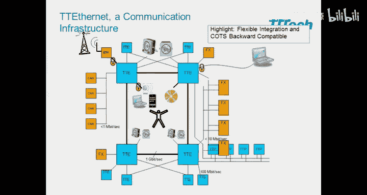

TT以太网可以支持多种流量等级：
*   **时间触发流量**：安全关键，严格按调度传输。
*   **速率约束流量**：保证最小间隔的通信。
*   **尽力而为流量**：标准以太网异步通信。

这种混合临界系统允许关键和非关键消息在同一基础设施上共存，是汽车、航空等领域未来的发展趋势。

## 总结

本节课中我们一起学习了时间触发架构。它是一种在分布式系统中实现同步模型的工程方法，核心是通过**全局时间同步**和**TDMA调度**来保证通信的确定性和时序性。我们探讨了其节点结构、数据流、容错机制和设计流程，并将其与事件触发模型进行了对比。最后，我们展望了结合以太网优势的**时间触发以太网**，这代表了未来安全关键分布式系统的发展方向。实现同步机制需要处理通信、接口、时间同步等诸多复杂问题，但由此带来的确定性和可验证性，使其成为高可靠性系统不可或缺的基石。