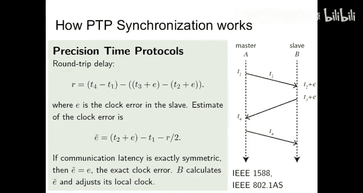
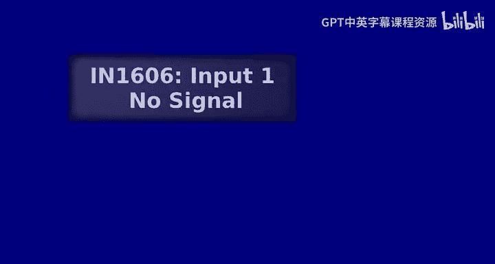
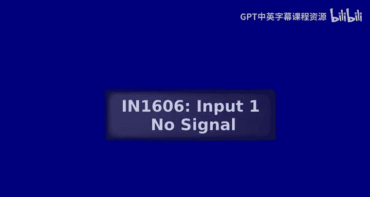
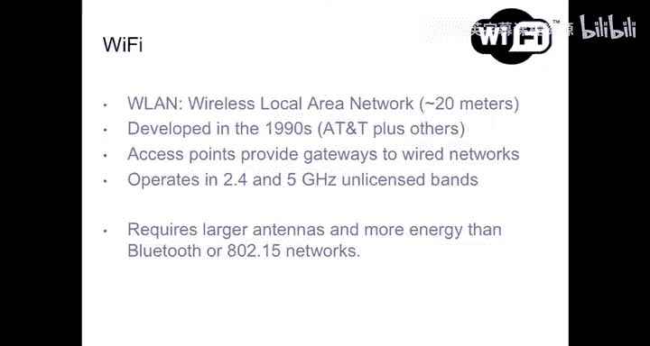

# 嵌入式系统导论：23：网络技术

在本节课中，我们将学习嵌入式系统中的网络技术。我们将从有线网络开始，探讨其确定性访问机制，然后介绍无线网络中的各种协议及其应用场景，最后深入了解实现精确时钟同步的关键技术。课程内容旨在为初学者提供一个清晰、全面的网络技术概览。

---

## 有线网络与确定性访问

上一节我们介绍了嵌入式系统的基本概念，本节中我们来看看网络通信的基础——有线网络。与通用网络不同，嵌入式系统常使用设计上更具确定性的网络技术，以确保在资源争用时的可预测行为。

例如，CAN总线是一种较老但成熟的技术。其关键思想是使用共享总线，并采用一种独特的电气接口：设备只能将总线电压拉低，而不能拉高。当一个设备向总线写入数据时，它会立即读回。如果写入和读回的数据不一致，则表明发生了冲突。这种设计的优点是能立即检测到冲突，但缺点是功耗较高且速度受限，因为信号被视为在整个线路上同时生效，限制了比特率。

相比之下，以太网采用CSMA/CD（载波侦听多路访问/冲突检测）机制。设备在发送前侦听线路，空闲时开始传输整个数据包，传输过程中不持续侦听冲突。如果未收到确认，则重新发送。这种方式允许信号在线路上传播，从而获得更高的比特率，但牺牲了协调性，可能导致数据包在远端发生碰撞而发送方不知情。

另一种重要的访问机制是时分多址（TDMA），即每个设备有预定义的时隙进行传输。这要求设备间时钟高度同步。如果到不同设备的路径长度不同，就会产生时钟偏移，因此必须在时隙间设置保护带，这会导致网络资源利用率降低。

以下是几种网络访问机制的对比：
*   **CAN总线**：立即冲突检测，确定性高，但速度慢、功耗高。
*   **以太网 (CSMA/CD)**：高带宽，但存在非确定性延迟和冲突风险。
*   **TDMA**：确定性时隙分配，需要时钟同步，存在保护带开销。

---

## 时间触发以太网与服务质量

上一节我们讨论了基本的网络访问机制，本节中我们来看看如何将以太网改造得更具确定性，以满足安全关键系统的需求，这就是时间触发以太网（TTEthernet）。

TTEthernet的核心思想是结合以太网和精确的时钟同步。所有连接到同一以太网总线的设备共享紧密同步的时钟，从而可以预先分配传输时隙，避免物理介质上的冲突，甚至能避免交换机中的缓冲区溢出。

TTEthernet的调度表结合了多种访问方案：
1.  **时间触发窗口**：预分配给特定设备，用于确定性通信。
2.  **速率约束窗口**：任何设备都可传输，但有严格的比特率上限，用于非预期但需保证一定服务质量的数据。
3.  **尽力而为窗口**：采用标准TCP/IP方式，无速率约束，服务质量最低。

设置此类网络需要所有设备遵守调度。存在“喋喋不休的故障”风险，即故障设备不遵守调度。因此，一些硬件解决方案会集成保护机制，防止故障设备在错误时间访问网络。这种技术正被考虑用于航空等安全关键领域，以减少线缆重量并提高可靠性。

---

## 精确时钟同步协议

网络中的许多高级功能，如确定性调度和协同工作，都依赖于精确的时钟同步。本节我们将深入探讨实现这一目标的关键技术：精确时间协议（PTP），也称为IEEE 1588。

PTP协议旨在通过网络同步两个设备的时钟，精度可达纳秒甚至皮秒级。其工作原理基于一个简单而巧妙的想法：测量主从设备间的消息往返时间，并假设网络路径是对称的。

以下是PTP时钟同步的基本步骤：
1.  主设备在时间 **T1**（根据其本地时钟）发送一个同步消息给从设备，并将 **T1** 值包含在消息中。
2.  从设备在时间 **T2**（实际时间）收到消息，但其本地时钟记录的时间是 **T2 + E**，其中 **E** 是从设备时钟的误差。
3.  从设备在时间 **T3**（实际时间）发送一个延迟请求消息回主设备，其本地记录为 **T3 + E**。
4.  主设备在时间 **T4**（根据其本地时钟）收到该请求，并将 **T4** 发送回从设备。

此时，从设备拥有四个值：**T1**, **T2+E**, **T3+E**, **T4**。从设备可以计算往返延迟 **R = (T4 - T1) - ((T3+E) - (T2+E)) = T4 - T1 - T3 + T2**。假设路径对称，则单向延迟为 **R/2**。由此，从设备可以推算出实际接收时间 **T2 = T1 + R/2**，进而计算出自身的时钟误差 **E = (T2+E) - T2**，并据此校正本地时钟。

协议的性能高度依赖于连接的对称性。软件实现因中断处理等不对称性，精度比硬件辅助实现差数个数量级。像“白兔”项目这样的高端应用，通过使用同一光纤传输双向信号、温度控制芯片等手段确保极致对称，实现了皮秒级同步。

---

## 无线网络协议概览

前面我们主要关注有线网络，本节我们将视野转向无线领域。无线网络协议种类繁多，根据覆盖范围大致可分为个域网、局域网和广域网。

以下是几种常见无线协议的简要介绍：
*   **SigFox**：一种广域网技术，专为物联网设计。其特点是极低比特率（约100bps）、超长距离和极低功耗，目标是为设备提供每年约1美元的网络接入服务。
*   **蓝牙**：最初设计用于短距离替代线缆（如连接打印机）。现在也广泛应用于信标技术，用于近距离感知和设备发现。
*   **Zigbee**：基于IEEE 802.15.4标准，常用于构建低功耗、低数据速率的无线网状网络。它集成了时间同步网格协议（TSMP），允许设备同步唤醒和睡眠以节省电量。
*   **Wi-Fi**：最常见的无线局域网技术，提供高带宽，但功耗相对较高。

对于资源受限的设备，还有更高层的协议，如受限应用协议（CoAP）。CoAP充当网关，在本地为设备分配16位短地址，并将其映射到IPv6地址，从而减轻了终端设备处理长地址的开销和能耗。

---

## 总结

本节课中我们一起学习了嵌入式系统中的网络技术。我们从有线网络的确定性访问机制（如CAN、以太网CSMA/CD、TDMA）开始，探讨了如何通过时间触发以太网（TTEthernet）在以太网上实现确定性服务。接着，我们深入了解了实现高性能网络基石——精确时钟同步协议（PTP/IEEE 1588）的工作原理。最后，我们概览了从个域网到广域网的各种无线协议（如SigFox、蓝牙、Zigbee、Wi-Fi）及其适用场景，并提到了为低功耗设备设计的CoAP协议。理解这些网络技术的特性和权衡，对于设计和实现可靠、高效的嵌入式系统至关重要。