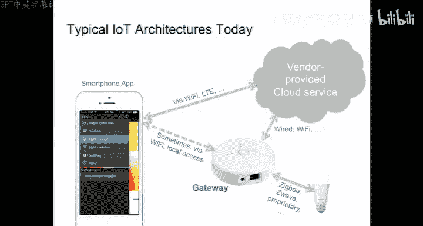
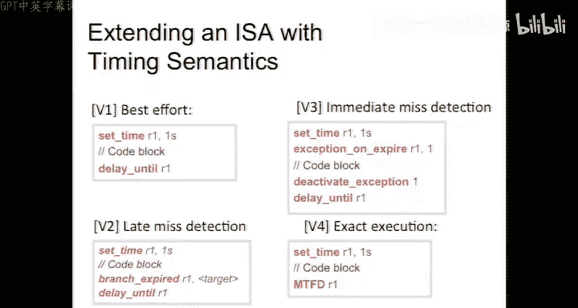

# 嵌入式系统导论：25：期中复习与课程展望 📚

在本节课中，我们将回顾课程的核心内容，并探讨嵌入式系统与信息物理系统领域的关键挑战与未来方向。我们将重点关注确定性模型的重要性，以及当前技术如何应对系统中的不确定性。

## 课程公告与项目安排 📢

以下是关于课程项目与期末安排的重要通知。

*   今天是订购项目所需电子元件的最后一天。请务必在今天联系你的助教。部分供应商的元件可能无法及时送达。
*   期中考试将于本周四在本教室进行。
*   项目展示将于两周后的明天开始。我们将从早上8点开始使用本教室。我们鼓励所有同学前来观摩，届时将提供午餐披萨作为激励。
*   每个团队的展示时间为10分钟，之后会有简短的问答环节。如果你的项目演示不便搬运，请告知助教，以便安排在下午3点之后进行。

## 无线网络技术补充 📡

上一节我们介绍了无线网络的基础分类。本节中，我们来看看两种值得关注的新兴无线网络技术。

无线网络主要分为三类：**个人局域网**（短距离）、**局域网**（中距离）和**广域网**（如手机网络）。其中，专为物联网设计的**SGFox**等技术成本极低，旨在实现泛在连接。

### 网状网络与时钟同步

当前广泛部署的是星型网络，每个设备单独与接入点通信。而**网状网络**允许设备相互通信并为彼此中继消息，这能显著降低平均通信距离，从而节省能耗。但作为中继节点的设备需要持续监听，这会快速耗尽电池。

解决方案是采用**分时隙网络**，节点仅在特定时间窗口唤醒、通信，然后休眠。这需要节点间的**时钟同步**。与有线网络中的IEEE 1588协议不同，无线网络（如802.15.4E标准中的WirelessHART协议）使用更简单但足够精确（毫秒级）的同步协议，使无线传感器节点能够依靠纽扣电池运行多年。

### 受限应用协议

物联网设备数量庞大，32位的IPv4地址空间不足，而128位的IPv6协议栈能耗又太高。**CoAP**协议在局域网内使用16位地址，并通过网关与全功能互联网接口进行转换，从而为低能耗设备提供了可行的网络接入方案。

### Wi-Fi与RESTful接口

Wi-Fi需要更大的天线和更多能量，但能提供完整的互联网接入。目前一个强趋势是使用**Web技术**访问终端设备。例如，Electric Imp设备通过手机屏幕闪烁将Wi-Fi凭证传输给传感器，然后通过HTTP协议将数据发送到云端服务器。

这种使用URL访问资源的方式通常被称为**RESTful接口**。REST的关键原则之一是服务器**不保存客户端状态**，这使得服务器更简单、更具可扩展性，因为请求可以被数据中心内的任何机器处理。

### 物联网架构的挑战

典型的物联网架构是：设备 -> 厂商网关 -> 云端服务器 -> 手机应用。这种架构面临诸多挑战：

*   **可扩展性**：每个设备一个手机应用或一个专用网关的方式难以扩展。
*   **延迟**：云服务的延迟可能很大。
*   **隐私**：数据经过云端，用户失去控制。
*   **可靠性**：环节众多，难以调试。

根据Gartner的“技术成熟度曲线”，物联网在2014年正处于“过高期望的峰值”，随后将不可避免地进入“幻灭的低谷”。这需要技术变革才能走向“启蒙的爬升期”和“实质生产的高原期”。

## 课程核心脉络与确定性模型 🧭

现在，让我们回到课程的主线。本课程不仅关注嵌入式系统的设计，更强调**建模**与**分析**的价值，而分析离不开模型。

信息物理系统包含计算平台、网络结构和物理对象，它们之间存在复杂的相互作用。这类系统充满了不确定性，例如物理噪声、网络延迟、数据包丢失、不可知的程序执行时间以及不可控的调度。

面对如此多的不确定性，我们是否还应该讨论确定性模型？答案是肯定的。因为**确定性模型**是强大工程实践的基础。关键在于区分**模型**和**被建模的系统**。我们可以对模型做出确定的陈述，而物理系统只是尽可能地匹配模型。

我们已有多个成功的确定性模型先例：
*   **同步数字逻辑**：对混乱的晶体管电子行为进行了确定性抽象，是信息技术革命的关键。
*   **单线程命令式程序**：提供了确定性的编程模型，其物理实现（同步数字逻辑）具有极高的保真度。
*   **微分方程**：对物理动力学进行了确定性建模，是工业革命和现代工程的基础。

## 信息物理系统的核心挑战 ⚙️

然而，当我们将这些强大的确定性模型（物理微分方程、单线程程序、离散事件网络模型）组合起来构建信息物理系统时，**确定性就丢失了**。因为程序正确性与时序无关，而物理世界却高度依赖时序。我们缺乏一个统一的、包含时序语义的确定性模型来描述整个系统。

因此，当前的工程实践被迫退回到“原型-测试”的设计模式。课程中探讨的多个主题正是为了理解和尝试解决这个问题：

*   **I/O与中断**：中断服务例程破坏了程序的确定性和可分析性。
*   **多任务处理**：线程通过共享内存交互会引入竞态条件，导致非确定性，使得系统几乎无法分析和充分测试。
*   **调度**：试图控制而非消除非确定性。

相比之下，**同步反应式状态机组合**等模型提供了确定性，可以进行形式化分析和验证。基于确定性模型，我们才能讨论：
*   **组件的可替代性**：在什么条件下一个组件可以安全地替换另一个。
*   **状态空间探索验证**：自动检查模型是否满足某些属性。
*   **定量分析**：在假设基本块执行时间有界的前提下，分析程序路径的执行时间。

## 未来方向：PRET项目 🚀

那么，如何重建软件对时序的控制？**PRET项目**旨在解决这个问题。其核心思想是：底层微处理器基于同步数字逻辑，本身具有可预测的时序能力，但上层的软件抽象（如缓存、流水线优化、动态调度）却隐藏了这种能力。

PRET项目从微架构层面着手：
*   **流水线**：采用**线程交错**技术，让多个线程在流水线中交替执行，每个线程都有自己的寄存器组，从而避免分支预测和推测执行，获得确定性的时序。
*   **内存层次**：采用类似技术管理缓存访问。
*   **I/O**：将中断处理作为新增线程处理，可以精确界定其对原有线程执行时间的最大影响（例如，从4个线程变为5个，每个线程速度减慢20%）。

这种改进带来了**可分析性**和**可测试性**的提升，并使得硬件具有**可替代性**。目前，像波音777这样的安全关键系统，因为无法保证更换处理器后软件行为完全一致，不得不囤积特定批次的芯片，这是工程上的失败。PRET这类技术旨在解决此类问题。

从编程模型上看，未来我们希望能够直接表达时序约束。例如，指定一个代码块必须在500毫秒内完成，否则触发错误处理。在传统C语言中，这需要使用`setjmp`/`longjmp`等复杂且容易出错的技术。而在PRET机器上，我们可以设想使用类似`MTFD`的指令来直接声明“必须满足最终期限”。

## 总结 📝

本节课中，我们一起回顾了无线网络的新兴趋势，并深入探讨了本课程的核心主题：**在充满不确定性的信息物理系统中，追求确定性模型的价值与挑战**。我们分析了当前中断驱动I/O、多线程等主流技术如何引入非确定性，并展望了通过改进机器架构（如PRET）和采用新的计算模型来重建系统确定性、可分析性和可靠性的未来方向。希望这门课能让大家认识到嵌入式系统技术的现状与未来，并为各位今后的学习和职业发展提供有益的视角。