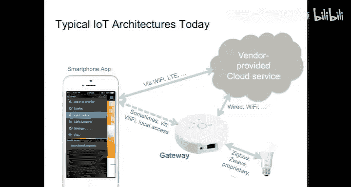
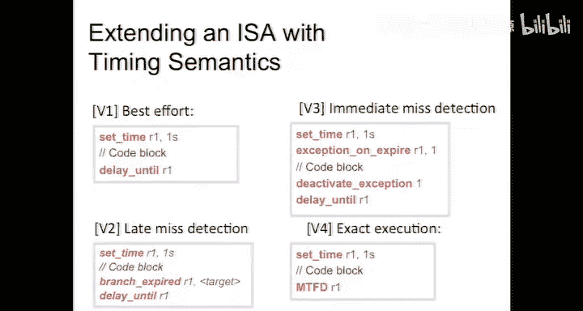

# 嵌入式系统导论：第25讲：期中复习与课程展望

## 概述

在本节课中，我们将首先完成关于无线网络技术的简短讨论，然后回顾本学期课程的核心内容，并探讨嵌入式系统领域当前面临的挑战与未来的发展方向。我们将重点理解确定性模型在构建可靠网络物理系统中的重要性。


---

## 无线网络补充与新兴技术

上一节我们讨论了无线网络的基本分类。本节中，我们来看看两种值得关注的新兴网络技术：无线网状网络和低功耗物联网协议。

### 无线网状网络

无线网状网络与目前广泛部署的星型网络不同，其设备之间可以直接通信并为彼此中继消息。这种架构在能量消耗方面具有显著优势，因为平均通信距离更短。然而，主要挑战在于中继节点需要持续监听，这会快速耗尽电池。

为了解决这个问题，人们开发了时隙网络。节点在同步的时钟控制下周期性地唤醒、监听、通信，然后休眠。这需要节点间的时钟同步。

*   **关键技术**：WirelessHART（后标准化为IEEE 802.15.4e协议的一部分）是一种相对简单的时钟同步协议，精度在毫秒级，足以让无线传感器节点依靠纽扣电池运行多年。

### 低功耗物联网协议

对于电池供电的设备，运行完整的IP协议栈是主要的能量消耗之一。IPv4的32位地址空间（约40亿个地址）已无法满足物联网设备海量连接的需求，而IPv6的128位地址栈能耗更高。

*   **关键技术**：受限应用协议（CoAP）创建了使用16位地址的局域网“飞地”，并通过网关与全功能互联网接口进行转换，从而实现了极低能耗设备与互联网的通信。



### 基于Web的物联网接口

Wi-Fi设备通常提供完整的网络接口，包括HTTP支持。目前一个强烈的趋势是使用Web技术（RESTful接口）来访问终端设备（传感器和执行器）。


*   **RESTful接口核心原则**：
    1.  使用URL（统一资源定位符）访问资源，例如：`http://example.com:8080/sensor?id=1234`
    2.  服务器不保存客户端状态（无状态）。所有必要的状态信息都编码在URL中，这使得服务器端更简单、更具可扩展性。


*   **典型物联网架构**：设备 -> 厂商网关 -> 云端服务器 -> 手机App。这种架构存在延迟高、隐私泄露、调试困难以及服务组合不便捷（需要多个App）等问题。

当前物联网技术正处于“过高期望的峰值”，随后必将经历“幻灭的低谷”。要走向“稳定的生产高原”，需要技术的进一步演进。

---

## 课程核心脉络与挑战

现在，让我们回顾本学期课程的知识地图，并深入探讨网络物理系统设计的核心挑战。

### 课程知识结构

本课程教材围绕三条主线编写：
1.  **设计**：如何构建嵌入式系统。
2.  **建模**：如何抽象和描述系统行为。
3.  **分析**：如何验证和评估系统属性。

与许多只关注设计主线的嵌入式系统课程不同，本课程强调建模与分析的重要性，因为分析离不开模型。

### 网络物理系统的非确定性挑战

网络物理系统包含计算平台、网络结构和物理对象，其交互中存在大量非确定性来源：

*   **物理层面**：传感器噪声、执行器不精确、部件故障。
*   **网络层面**：不可知的延迟、数据包丢失。
*   **计算层面**：不可知的执行时间、不可控的调度。

面对如此多的非确定性，我们是否还应该使用确定性模型？答案是肯定的。历史证明，确定性模型是技术成功的关键。

### 确定性模型的威力

以下是三个成功的确定性模型范例：

1.  **同步数字逻辑**：对底层混乱、模拟、随机的晶体管电路进行了确定性抽象，使得物理电路能够以极高的保真度模拟该模型，这是信息技术革命的关键使能器。
2.  **单线程命令式程序**：构建在同步数字逻辑之上的确定性模型。其正确性与执行时间无关，物理实现也能高度忠实地模拟该模型。
3.  **物理动力学微分方程**：对物理系统的确定性建模，是工业革命和许多现代工程系统（如飞机、汽车）可靠运行的基础。

**关键洞见**：工程师的创造性在于，他们可以构思出有用的模型，然后想办法让物理系统去匹配这个模型，而不是让模型去匹配一个不可控的物理世界。

### 当前网络物理系统模型的问题

当我们尝试将上述优秀的确定性模型组合起来构建网络物理系统时，问题出现了：**组合后的模型失去了确定性**。

*   **根本原因**：网络模型和程序模型缺乏对时间的描述。程序正确性独立于时间，而物理世界高度依赖时间。当我们通过内存映射寄存器、中断等机制将程序与物理世界连接时，我们跨出了程序模型的边界，引入的硬件行为没有被包含在原有的确定性模型中。
*   **后果**：由于模型是分离且语义不兼容的，我们无法获得一个统一的确定性模型来描述整个系统。这导致我们不得不严重依赖“原型-测试”的设计方法，使得系统难以分析、测试和验证。

### 课程中探讨的应对方案

本课程介绍了一些试图理解和解决这些问题的初步方案：

*   **理解问题**：
    *   **第十章：输入/输出**：展示了中断服务例程如何破坏程序的良好特性，使得时序分析变得极其困难。
    *   **多任务与调度**：多线程通过共享内存交互会引入竞态条件，导致非确定性，使系统几乎不可分析和测试。信号量等机制只是在尝试约束非确定性，而非根除它。
*   **探索解决方案**：
    *   **同步反应式状态机**：这是一种确定性并发模型，可以进行分析和定理证明，并且能够在物理世界（如数字电路）中实现高保真度的实现。
    *   **抽象与精化**：定义了组件可替换性的条件，这对于系统升级和维护至关重要。
    *   **状态空间探索**：基于确定性模型的形式化验证技术。
    *   **最坏情况执行时间分析**：基于程序（确定性模型）的路径分析，其前提是能够估算基本块的执行时间边界。

---

## 未来展望：PRET项目

上述方案只是初步尝试。本节中，我们来看看一个旨在从根本上解决问题的研究项目——PRET（精确时序处理器）项目。

### 目标与思路

**核心问题**：底层硬件（同步数字逻辑）具有高度可预测的时序，但上层的软件抽象（特别是单线程命令式编程模型）隐藏了这一特性。

**PRET项目目标**：在微架构层面进行创新，重新搭建硬件与软件之间的桥梁，使软件能够重新获得对时序的控制能力，同时不牺牲性能。

### 关键技术方向

现代处理器为提高平均性能引入的技术（如深度流水线、分支预测、缓存）严重损害了时序的可预测性。PRET从以下三个方面着手：

1.  **流水线**：采用**线程交错**技术。让多个线程的指令在流水线中交错执行，每个线程拥有独立的寄存器组。这样无需分支预测和推测执行，每个指令流都能以确定性的时序执行。
2.  **内存层次**：研究使缓存行为更可预测的技术。
3.  **输入/输出**：采用线程交错处理中断。当中断到来时，处理器不是抢占当前线程，而是启用一个新的硬件线程来执行中断服务程序。这样，中断对原有线程的影响仅仅是使其执行速度按比例略微减慢（例如，从4个线程变为5个线程，每个线程慢20%），这是一个严格且可分析的边界。

### 带来的好处

确定性提升意味着可分析性和可测试性的提升。例如，在航空领域，波音777因其飞控软件与特定年代生产的微处理器深度绑定，不得不花费巨资囤积芯片。如果有基于确定性模型的、可保证时序行为的软硬件接口，就能实现硬件的可替换性，避免这种“工程上的尴尬”。

### 编程模型展望

在PRET这样的机器上，我们可以设想更强大的编程原语。例如，我们希望能够指定一个代码块必须在某个时限内完成。

以下是当前在C语言中实现类似功能的复杂方式（使用`setjmp`/`longjmp`）：
```c
#include <setjmp.h>
jmp_buf env;
if (setjmp(env) == 0) {
    // 设置定时器中断
    // 执行可能超时的代码块
    // 如果顺利完成，取消定时器
} else {
    // 超时处理（panic routine）
}
// 定时器中断服务程序中调用 longjmp(env, 1);
```

而我们期望的编程模型可能更简洁、更安全，例如一个`MTFD`（满足最终期限）指令或语言结构，它能保证代码块在指定时间内完成，否则仅因硬件故障才可能失败。

---

## 总结

本节课中，我们一起学习了：
1.  无线网状网络和CoAP等物联网新兴技术的特点与价值。
2.  当前基于云和RESTful接口的物联网架构的优势与局限。
3.  网络物理系统设计中面临的根本挑战：将多个优秀的确定性模型组合后，整体却失去了确定性。
4.  确定性模型（如同步数字逻辑、同步反应式状态机）对于系统可分析性、可测试性和可靠性的至关重要性。
5.  PRET研究项目如何从硬件架构层面着手，旨在为软件重新提供对时序行为的确定性控制，从而为构建更可靠、更易维护的网络物理系统开辟道路。




希望本课程不仅教会了你当前嵌入式系统的实现方式，更启发了你对未来技术发展方向的思考。嵌入式系统领域依然年轻且充满挑战，正是进行创新和贡献的大好时机。