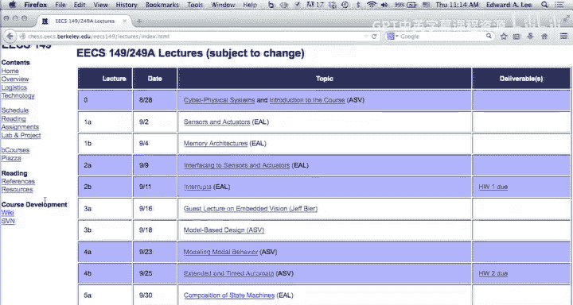
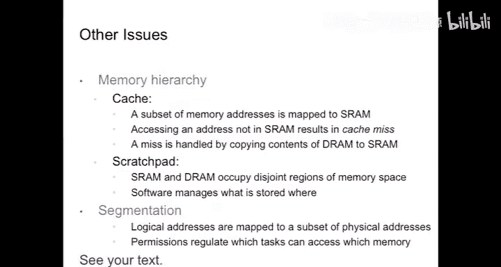

# UCB《嵌入式系统｜EECS 149  249a Introduction to Embedded Systems fall 2014》中英字幕 - P3：-03-Lecture 03 - Memory Architectures.zh_en - GPT中英字幕课程资源 - BV1rBgDzRE2s

Okay， let's go ahead and get started here。Can you hear me in the back of the room？All right， good。

We are here November， sorry November， not yet。September 4th。

 I want to point out for those of you who haven't been paying attention。

 there's a homework due in one week。Okay， and that should be turned in online using B courses。

 any medium that is legible。It's fine， PDF files are probably preferred。

 but whatever works for you will accept。嗯。Any questions？Okay， good。

 one little announcement the Tuesday lab people didn't get their。Account assignments， as you know。

 we have those here so you can see Ben after class over here to get your accounts。O。So。

Just a little bit of explanation of the order in which we're doing things here。

 we're front loading the class a bit with content that is a little bit nitty gritty embedded systems content deliberately because it aligns best with the labs。

 because one of the things that we're trying to do in these first few weeks of the lab。

Is give you experience with design of systems at three different levels of abstraction。Okay。

 the lowest level of abstraction is where you're really directly working with the hardware。

 there's no operating system in the way， so you've really got to understand how software interacts with hardware and one of the goals is to make sure that you do understand that because that's an important part of designing interesting embedded systems。

The second level of course， is much more familiar to most people。

 which is where you're interacting through an operating system with the hardware。

 and there the twist in embedded systems is that you care about the timing of things in a much deeper and more integrated way than you do with general purpose computing where timing is just a performance metric。

 in the case of many embedded system applications， timing is a correctness criterion。

 not just a performance metric。And then the third level is model based design， and in my view。

 model based design is still a somewhat immature area that is somewhat in flux， right。

 but there's technology that's improving very rapidly where engineers are using models at much higher levels of abstraction than the low level software to design and analyze systems。

So that's the goal in the first few weeks of the lab is to give you experience and a little bit of experimentation with the trade off between those levels。

So as a consequence in the lectures we've kind of front loadeded with content that is much more on the design part of the course。

 if you remember， we showed that there's kind of three concurrent paths in this course。

 design modeling and analysis。And we're focused initially on design。

 which is why we're already on chapter9 of the book。

All right so hopefully that helps understand the trajectory。

 so today I'm specifically going to focus on memory architectures because the issue is that memory looms larger for embedded systems as a problem than it does in general purpose computing。

 in fact a lot of computing infrastructure is very carefully designed to make you think that you have an infinite amount of memory。

And you don't really care how long it takes to get anything， it's all going to be fast enough。O。

That's。That's how laptops are designed， right that's their goal is to make it seem that way to you。

But in the case of embedded systems， it's very often not the case that， well， first of all。

 you have to grapple with the fact that you don't have an infinite amount of memory。Okay。

 you also have to one interesting twist with embedded systems is that you care a lot about how the system behaves over very long periods of time。

There's lots of embedded systems where rebooting is unacceptable and you want to run for years okay so you can't afford to just keep allocating memory and never delocating it。

 okay that doesn't actually work because it'll cause your system to crash at some point。Um so。

A few of the issues that we're going to look at are types of memory。

 what does it mean to have volatile versus nonvol memories， what are the consequences of that？嗯。

How does the logical address space for memory relate to the physical address space。

 where is stuff stored and how are you getting to it， is the issue there？How memory is organized。

 so in particular， when you run a program， are your variables being stored at a location that the compiler decides that's just fixed for the whole duration of the execution of the program。

 we call that statically allocated memory。Or does the variable live only in memory for the duration of a procedure call。

 that's a variable that's allocated on the stack。Or does the memory get allocated？

Temporarily and then explicitly delocated where your software has to say， well。

 I no longer need this variable， you can now use this memory location for something else。

 okay we call that the heap。So these are three very different ways of dealing with memory and in embedded systems you really have to pay attention to what you're doing with your memory。

 so that's going to be a big part of the focus today。

 and we're going to focus on the programming language C。

 which provides a particular access to these memory models now the reason for focusing on C is that unlike。

Most modern languages。C gives you very direct control of the hardware。

Okay now if you run a C program on your laptop， there's an operating system and some hardware in the way that will actually prevent you from doing a lot of stuff that you actually would like to do。

 so you can't necessarily access all physical memory locations。

 you know you sort of need the operating systems permission。

 you have to go into kernel mode to be able to access certain locations。

But in the embedded systems context， often there's no kernel， there's no operating system。

 you control the hardware， and you can do damage。And。But you can also do wonderful things。

 and so you're really controlling the hardware， and so we need you to kind of understand how that works。

嗯。Okay， so。Dive right into this， so volatility， a lot of the memory that we deal with。

If it loses power， it loses data。Okay， we call that volatile memory non volatile memory has been around for a long time。

 I actually used when I was in college， these memory devices。

That chip up there is under a quartz cover。It's quartz not glass because it needs to be transparent to ultraviolet light。

And you had to stick it in this little oven， it's not an oven。

 it's actually just a UV light but it was inclosed because you don't want people getting sunburned and leave it in there for a few minutes and everything would be erased and then you could plug it back into your circuit and start writing data to it okay and you could write once and if know once you had written to a location。

 the only way you could write again to that location was to pry it out of your circuit board and stick it back in that oven to erase the contents okay。

So that was called an Eprom， an erascable programmable read only memory。And shortly thereafter。

 an EEprom was invented where could you didn't have to pry it out of a circuit board and stick it in an oven to erase it。

 you could actually erase it electrically， but that seems great except that it was the only part of your circuit that required 24 volts。

So you needed an extra power supply in order to be able to erase your memory because everything else was running off of five volts。

So that was a hassle。Flash memory has been around for quite a while。

 it was actually invented in 1980 by a fellow at Toshiba。

It's prevalent now many of you probably have laptops that don't have disk drives that you're using flash memory instead。

 and flash memory is actually a very interesting， creates a very interesting engineering problem because you can't。

Just overrite a location。A single variable， you actually have to erase a block of memory。

And then overwrite that okay and in addition， you have a limited number of times you can do that with today's modern flash memories。

 you can overwrite each location about 100，000 times。

 so think about that when you're using your laptop and you know you delete that video and replace it with another video well you've got a limited number of times you can do that。

Okay now， hopefully， I mean， I guess you know， the controllers for these things are actually trying to optimize so that pretty much your whole memory will fail all at once。

So they're actually remapping the memory continually to try to keep it balanced so that the rewrites are occurring across the whole memory。

It creates a very interesting control problem， in fact， I've been to conferences。

 there's one conference that I go to every year where literally one third of the conference every year is devoted to research papers on managing flash memories。

And there's all kinds of optimizations you can do if you're interested in operations research and the optimization problems that they do。

 there's a good application for them， flash memories。Dis drives， of course， are also prevalent。

 this guy has a disk drive because I need a lot of space and the flash memories that are available on these are not enough yet。

 but they're somewhat more problematic for embedded systems because they have a significant mechanical component and if you that has size power and reliability implications。

So。Those are all nonvolatile in the sense that you remove power， the data stays there。

 okay volatile memories， if they lose power， they lose data and in fact。

 dynamic ras can lose data even if they still have power， in fact。

 dynamic ras are essentially capacitors controlled by a single transistor and there's leakage and they forget。

Okay， and they will forget if they're not refreshed， and in fact。

 each memory location in a dynamic ra needs to be refreshed approximately every 64 milliseconds。Okay。

 so that's。Roughly。15 times a second。ok。So 15 times a second。

 every single location in the four gigabytes of dynamic RA on this device。Gets rewritten。

15 times a second， and if it fails to get rewritten。It's going to forget。

So dynamicogram is particularly volatile memory。And。It also has the property that。

You have to sneak in those rewrites， the controller has to keep doing those rewrites no matter what your machine is doing。

And often， those rewrites will collide with whatever your software is doing and your software just has to wait。

So this creates an interesting timing problem because it means that。

You don't really know how long the memory access is going to take because you could be blocked by one of these refresh cycles。

 and that's going to introduce variability in the timing。In addition。With dynamic RAs。

 the time that it takes to access a particular memory location depends on what address you accessed in the previous cycle。

Okay， so the memories are very carefully designed， there's a lot of parallelism in them。

 so there's a bunch of separate memories and if you read from this one and then in the next cycle read from this one and then in the next cycle read from this one。

 then things will go pretty fast， but if you read from this one and then in the next cycle。

 try to read from the same one， that second read is going to stall。

And it's going to stall until the first read completes， which can actually be quite a few cycles。

 many cycles， okay。Now。One of the conundrums that you face as an embedded software designer is。

You don't generally know how the memory addresses are mapped onto the physical memory。

And on top of that， you don't know how your compiler is allocating memory unless you look at the output of the compiler。

 disassemble the assembly code。Then you can look at how the memory all got allocated and then you can tell。

 but who wants to do that， so you really have to dive in very deep into the software that the machine is actually running if you want to understand the timing of the memory accesses。

So for practical reasons， that's rather difficult to do。

 which basically means that anytime you're accessing dynamic RAM。

You don't know what the timing is going to be。And you're going to have to design your system as。

For worse case， which means that no matter how good your memory is in terms of being designed for average case。

 for laptop use。You're going to have to design your embedded system for worst case。

 as if it was a really crappy memory。Okay。So。That's kind of a problem， right， I mean， in a sense。

 the memory designs are not well suited for embedded system applications。Stataticogram is different。

 the access times are predictable， controllable。But it's a much more expensive memory technology。

 so in the circuits a dynamic ra is typically implemented with a single transistor today。

 static ras are typically implemented with at least six transistors。

 so they're quite a bit bigger in area， which means that on a given region of the die。

 you can't have as much memory， yes。Because the access actually takes a while。

 it takes several cycles to complete the access。And the circuit is busy well it' doing that。

 but if in the next cycle， your address takes you to a different bank。Okay。

 then that bank circuit is not busy。So if your second address takes you to the same bank。

Then the circuitry will just block the request until the request that is currently going。Completees。

Okay。So it can be really very difficult to understand the timing and you know people there's a whole cottage industry of people who make software tools。

That you can give them the output of your C compiler。

Give them a very detailed model of your processor architecture。And they'll analyze the timing。

Okay but that kind of timing analysis is extremely difficult and in fact we're going to talk about it towards the end of the semester。

 there's an introduction to that problem of timing analysis in chapter 16 of the textbook and we'll talk about it in more detail towards the end of this semester。

 it's a very sophisticated kind of analysis that you need to do。嗯。

So one interesting thing that also you need to worry about with embedded systems。

That we you kind of also need to worry about them with general purpose computers。

 but it's kind of taken care of for you， which is what happens when the power gets turned on。Okay。

 your volatile memory。Has garbage in it。It could start up in an arbitrary state。And。

The processor clock starts。And something's got to happen right if the clock is running on the processor。

Then。The program counter is getting incremented and memories being fetched at the address specified by the program count。

 so you turn on power。And the processor runs。It runs if there's power。

 it'll be clocking and it'll be fetching whatever is in the program counter， which is a register。

 will be fetched and executed。Okay so how do you get a processor started？Sorry。Right。Exactly。多干。

Exactly。RightSo as part of the power up process， what' will happen is the circuitry will initialize the program counter with a fixed address。

 a zero。ok。And the circuit will direct all memory requests to address zero to a non volatile memory。

 that contains a hardwired program in it。And that program is what we call a bootloader。

 okay so typically that program is very simple， all it does is copy a bunch of stuff from another nonvol memory。

 the flash into the RA and then set the program counter to the beginning of that。Okay。

 and that's how things get started。So the big thing about flash。

 one of the reasons that Flash took off as a nonvol memory is that it can be implemented with technologies。

 the same silicon technologies that are used to implement the processors。

and the power supply requirements were the same as for the processors， so it's very convenient。

So this is a dye photograph。Of a fairly popular embedded systems processor an Arcortex M3。

 which is a 32 bit microprocessor， and this has a megabyte of flash memory right on the chip。

 I believe the flash is that block at the top and I think that down here this is dynamic RA。Okay。

 and in the middle is the processor， you can recognize if you're a circuits person。

 you can probably recognize a standard cell design。In that central part of their chip。But okay。

Memory maps for that particular， oh， yes， question。Actually， why don' we say that well。

 because it's true， but why is it true， I'm actually not sure。

 is there a circuits person who understands how flashes work and can explain why you have to erase them by block？

I'm not really a circuits person， so I don't really understand the circuits of flash。

But good question。Okay。Memory maps。There's a lot of different ways for dealing with the problem of what to do with a memory address。

Okay， the hardware in the processor， yeah。没有。Yeah。So the question is whether the controller has any idea of which part of the memory needs to be refreshed versus parts of the memory that are not actually being used and hence don't need to be refreshed。

嗯。I don't think so， the controller is that does the refresh is built into the hardware of the RA chip。

It has no。Yeah， I don't think it I don't think it has any visibility into what the operating system is doing。

 so memory allocation is typically handled by the operating system。

 and so it's going to just refresh everything。Okay。

So on this particular processor here's how the memory map works now one of the things I'd also like to point out just to give you a sense of what I'm doing here。

 I'm going to be actually talking about a bunch of different processor architectures now we could do this very differently because in the lab you're working with two processor architectures。

one is an arm and the other one is a microblaze。I could just show you those。

But I don't want to do that because what I want you to get a sense of is sort of a pattern of how these things are designed and what the differences are between the low end processors and the high end processors in embedded systems。

You often want to put in processors that。Consume millwatts or microwats。

And only cost 15 cents in quantity。ok。Those aren't high end intel processors。

 they're quite different， but we sometimes need more powerful processors and embedded systems too。

 so you get the kind of whole range to work with。And I want to give you a sense of the wealth of possible choices that can be made across these different architecture designs。

So。This arm processor is a 32 bit processor， and it has 32 bit addresses for memory。

So what does it mean to have a 32 bit address， well。

 it means you can address two to the 32 locations， which is 4 billion memory locations， okay。

2 to the 32 is about 4 billion。So。You have a four gigabyte。Memory space。

 and the addresses are 32 bits， which we typically write in hex。

So you'll get used to reading a lot of hecks if you're not already used to it。

 but each symbol here represents four bits。Okay， so there's a total of 32 bits here。

 and address 0 is pointing directly into flash memory。Starting at address Hex。20000。

 okay you start addressing static RAM。 and you have half a gigabyte available of static RA。Now。

Let me ask you this。 Does this mean that if I give you。And arm cortex M3， I just hand it to you。

 here's the chip。That there's a half a gigabyte of static raM on it。Does not mean that at all。Okay。

There could be any amount of statictogram up to half a gigabyte。The memory map is a logical。

Mapping okay it doesn't tell you anything about what is physical on the particular implementation。

It also doesn't tell you if you have only， say， 500 megabytes。Those could be mapped anywhere in here。

They might be at the bottom addresses or they might be at the top。

And your compiler is going to need to know。So the compiler has to be parameterized to know where there is memory。

 because if it writes to locations where there's no memory。

Then what do you think is going to happen when it reads back from those values？

It's probably going to get zeros always， maybe if the circuitry is designed that way， right。

 if you read from an address where there's no physical memory。

Carefully designed circuit would probably give you at least a predictable value。

 maybe just all zeros， but it's certainly not going to be the value you wrote to that memory location。

Now you don't see this problem when you write programs on your laptop。

Because the operating system and the compiler together make sure you never write to physical locations that don't exist。

But when you're writing sea program for a bear iron processor。

 you can write to any one of these addresses。Okay， and the hardware will just do what you told it to do。

Hardware is stupid。It does what you tell it to。Okay， and if you tell it to do something stupid。

 it'll do something stupid quite happily。So you kind of have to know how this is going to map into physical space。

So。There's also this concept of memory map registers。 So here's a half a gigabytes of。

Potential locations that might be actually some other piece of hardware， some peripheral device。

 okay？Maybe it's a nativeTda de convertverer。At a particular memory location。

 so what it might mean is that when you read from a memory location in that range。

 you're not reading from memory at all， you're reading the latest value captured by an A to D converter。

that's a memory mapped peripheral。嗯。Okay， so then there's a gigabyte available for dynamic RA。

 another gigabyte for external devices， which could be memory。

 also you could hang other memory off of those external devices。And so forth。

That's how this particular architecture， this is an architecture， not an implementation。

 there are several chips that implement this architecture。

 and they could have varying amounts of memory。But the architecture tells you this logical mapping。

Now let's look at an extreme that's at a different- oh yeah， question。Is not always what？All right。

理解啊。So okay， so what I said is that what this architecture tells you。Is that。Any address in here？

Should refer to a location in static RAM。ok。But that's a constraint， not a requirement。

 you might not have that much static ram on your implementation。Okay。

 whatever static RA you have should be mapped into somewhere into this address space。

 that's what that means。Yes。So this map is。In neither hardware nor software。

 this is documentation published by arm。Okay。And if you're a chip designer。

You can actually license from arm this architecture and make your own arm processor that conforms with this architecture。

And when you make that。You're completely free。To put your physical static ra anywhere in this region。

Okay。Sorry。Then you get hardware after that， but this isn't a description of hardware。

 this is a description of an architecture， yes。This is the convention or the requirements。

Anything that calls itself an arm cortex M3？Needs to conform with this。

You could maliciously violate this， and you could play games。 And in fact， actually。

 you can play lots of games with this， right， I mean。Those external devices， well， what are they。

 well， I can put static ram on them。Right。Yes。That's right。seemsms kind of small。

 hu I've got 16 gigabytes on this guy。Right。But I do a lot of programming in Java。

 and that's really sloppy in its use of memory。So I need 16 gigabytes。第二。You can do that， yeah。

 you can map these external devices to memory as well。By the way， you will pay a price。

 because it means that every compiler out there that is written for an arm cortex is going to have to be customized for your processor。

Okay。です今日。The question is whether there are bounds or barriers for writing to IO memory。

 and the answer is no， the architecture doesn't impose any constraints。

I've run across peripheral devices。that are memory map devices， and they have。

 you can write to a location， that it refers to that device and then read back from the same location。

And what you read back is bit flipped from what you wrote。ok。If you wrote 1，1，1，1，111。

 and then read it back， you'll get 0，00，0，0。And if you wrote the reverse。It will flip the bits。

Why they did that， I have no idea。That's an implementation detail， yeah。But you know， I mean。

 an operating system needs to know that， so typically the part of an operating system that knows this is what we call a device driver。

So a device driver is simply a piece of code that writes to these memory map registers。

 reads from the memory map registers to determine what the status of the device is。

 and the device driver is really what interacts， it's the bridge between your software and the peripheral device。

Writing device drivers is tricky because you write them at the lowest level。

 you're directly controlling hardware and you can make mistakes and the most common causes of crashes like this machine crashed 15 minutes ago when I plugged in the projector。

Why there's a flaw in the device driver。I don't know what the flaw is， I'm hoping Apple will fix it。

 but there is a flaw in the device driver that's dealing with the writing to a memory mapped peripheral。

 which is driving the display and it caused my machine to crash yes。好。Right。That发。关费。Right。はいです。爱放记录。

Well， you can't assume there's 0。5 gigabytes。Oh， I mean， think of this as a constraint。

 not a requirement。O。So a particular implementation will have some amount of memory in it。

And your compiler or whoever is writing the software has to know that。告发。就。没听到 other。That's right。

 So if you play funny games with this， you're going to end up having to customize the compiler。ok。

That was my point before。Okay。So let's look at a lower level processor。And AtM AVR， okay。

 I really like these processors because they are， first of all， extremely cheap， I mean。

 literally you can buy variants of this architecture that are，15 cents per chip in quantity。

And they're very widely used。There are probably by a couple of orders of magnitude。

 more of these processors in the wild than there are intel processors。Okay。

 counting all the laptops and everything else because they're in your microwave。

 they're in your watch， they're in all kinds of stuff right very widespread。

 so it's an eight bit single chipip microcontroller was first developed by AtML in 1996 based on an architecture that was developed by two students at the Norwegian Institute of Technology and AVR is rumored to stand for Allf and Vguards risk processoror。

Okay， but no one at least AtML will not officially confirm that that's the source of the term。

 they just say it's just an AVR， but anyway， Allffin Vigad developed to this architecture and AtMel picked it up and started making processors。

 by the way， you know 1996 seems like a long time ago。

 but the same thing is happening now here at Berkeley with the Ri five。Okay。

 which is a really nice architecture that was developed here at Berkeley that has been put in open source。

And there's a bunch of implementations happening around it。

 so keep an eye on the risk five as an interesting architecture for the future。Okay so。

One of the things that made the AVR take off is that it was one of the first microcontrollers that included an on chip flash memory。

Which is extremely convenient because it meant that if you're building a microwave oven or something。

 you know， one chip could handle the whole computing。Problem okay。

 including you know would it would you basically pre configuregu it with the flash that contains the program and。

It's a one chip solution and at 15 cents per chip。That's a pretty good buy。

 you can make some pretty cheap microwaves。Okay。嗯。One of the very popular uses of AVRs these days among hobbyists is in the Arduino processors。

And these are the Arduino is an open source board level architecture so you can make your own Arduinos。

 okay， but a lot of the ones that you buy if you want to buy it commercially。

 so if you buy the this is the Arduino due Millanovi，It made in Italy， like my colleague Alberto。嗯。

And it's a beautiful little piece of hardware。 you can you do all kinds of stuff with this。

 and it's a wonderful device for experimenting with and probably quite a few of you in your projects will use Arduino processors。

 This is the processor here It's in a 28 pin dip dip is not referring to the personality of the person sitting next to you。

 It means dual inline package right It's two lines of pins。Okay。

iss what a dual inline package is and this particular board， that's what they're using。

 they're not using a surface mount or solder connection。

 it's the dual inline package that you can provide the chip out。

If you fry it and replace it with a new one， okay， yeah， so anyway。

Here's another use of the AVR processor， in fact， the first time we used the I robots in the lab。

 which you'll be using in the lab， we used this particular processor and it was an Atmega 168 made by AtML and it's an AVR processor。

And one of the things I like about this processor， this particular instance of the processor is that the amount of memory。

On this processor is measured in millibytes。Not megabytes。It was tiny。Okay。

 it had one kilobyte of RA。One kilobyte， this has 16 gigabytes。Okay。

 what do you do with one kilobyte of RA？That's all it had， one kilobyte Ram。

 it had 14 kilobytes of program memory。m not going to write any Java programs on that。

You can't do hello world with Java with less than an order of magnitude more memory than that。So。

So if you really want to get down and dirty and understand hardware。

This is a really nice platform to program okay so let's look at it in a little more detail all right so this is the particular AVR that was used in this at mega and here's a diagram that comes from the at mega 168 reference manual and my hope is that you know by the end of your lab experience with this course you will be quite familiar and comfortable looking at these kinds of diagrams and kind of puzzling through how things work by the way let me tell you stylistically there's one thing we do to you in the lab that may seem a little surprising and shocking right？

We'll happily point you to a 500 page document and say and then ask you a question about it。ok。

And you know， if you approach this the way you would in other courses。

 you would go sit down in a comfortable chair and start on page one reading the 500 page document。

It's not going to work。Okay， so one of the things we're hoping to do is to you know。

Give you some experience with finding information from an overabundance of what's available and being able to zero in on the right place right and a lot of times these diagrams can be really helpful because they tell you a lot about what's going on。

So this diagram， for example， right at the top， you probably can't read that in the back of the room。

 but it says that the data bus is8 bits。Okay， so the chunks of data that this processor deals with are eight bit chunks of data and every instruction in every instruction cycle you're going to at most be able to operate on 8 bits of data。

 doesn't mean you can't operate on a 32 bit integer。

 it just means it's going to take you several cycles to operate on a 32 bit integer because you can only do eight bits at a time okay。

嗯。So it has one kilobyte of RA right there。And it's staticgram。

 so the timing of this processor is actually very predictable。

 that's another thing I like about it if you look at the assembly code。

You can figure out the timing of all of the IO operations by just counting instructions between the operations。

 okay can't do that with a lot of other processors。

 but if you need really precise control over timing。

These low end processors are often a better choice than a high performance high end processor because you can really control the timing。

ok。嗯。All right， so this also has a whole bunch of peripheral devices and some of these we're going to talk about next week and show you how these memory map IO devices work。

 how timers work， and things like that。How interrupts work， et cetera。

But we'll defer that until next week。Because today we're focused on the memory architecture， Okay。

 so one thing about this this architecture， it's an  eight bit microcontroller。

 but it has 16 bit addresses。Right？What if it only had eight bit addresses？

How much memory could it address？256 bytes。Okay， that's even less than one kilobyte。

Which is what you have on this processor。So eight bit addresses wouldn't be very useful。

 so 16 bit addresses still can't address a whole lot of memory right it's two to the 16th is about 64。

000。Right， so。The fact that this processor only gives you 14 kilobytes of program memory。Well。

 I mean， if you were to make a variant of this and max out the memory。

 you're still only going to get 64 kilobytes of memory because that's all that the processor can address。

Okay， any more than that doesn't work。嗯。Okay， so the8 bit data is the reason why this is called an8 bit microcontroller。

 because it operates on eight bit chunks of data。Now here's a couple of questions， all right。

 so see if you've been paying attention。What's the difference between an8 bit microcontroller and a 32 bit microcontroller？

tell me yes。Nope。Yes。It's the width of the database。

How much the size of the data words that you're dealing with in each instruction？Okay。

 that's just the convention， by the way。You know， we could have easily had a different convention where this processor would be called a 16 bit microcontroller because it uses 16 bit addresses。

But instead， by convention， when we say it's an API microcontroller。

 we're talking about the chunks of data that it operates on， not the chunks of address。Yeah。

 you could， so you could build peripheral hardware that could handle a bigger address space by。

 for example， giving the first half of the address in one cycle and the second half of the address in the next cycle。

 so you could definitely do that。Normallyally， I。Yeah that's a very good point and you know。

 I mean any reduction to one word of something as complex as this is going to leave out a lot of detail。

So if you hear that it's a aI microcontroller， that tells you something but not a whole lot， right？

Well， so the convention would be that at least the inputs to the ALU are eight bits。ok。

But the output could be more。And it often is because if you add two eight bit numbers and you want to avoid overflow。

 you actually need more than eight bits， right。Conventionally。

 it's common for the ALU to be wider on the output， but in this case。

 actually you can tell from this diagram that it's not。

Because the output of the ALU goes to an8 bit bus。So it's eight bit inputs， eight bit outputs。

The diagram tells you that already， yes。You can store long ends in memory。

 it's just going to take you several cycles。RightSo there's always this trade off between time and resources and if you have a lot of time you can sequentialize things。

 right？Okay， so second question， so see whether you've been paying attention。

 why would we use volatile memory， why don't we just use nonvol memory always。

 let's hear from someone else， someone I haven't heard from。Yes， right there， what's your name？

Yeahah。Yeah， that's one big one is that you know the volatile memory。

 if flash memory will wear out after a while， okay so DRAM doesn't wear out， well， probably does。

 you get electromgration， but it really takes a long time to wear out。Yes。

Volatile memory is also faster to access。Especially staticogram。So don't get confused。

 why is static RAM called static if it's volatile？No refresh。

So there's sort of different levels of volatility， volatile means if you take away the power。

 it forgets everything。ok。Yes。It's also cheaper， that's right。

 dynamicymic RAM is incredibly cheap for a bit。Okay。All good reasons。All right。Yes。

The first reason was that the flash memory in particular wears out after a certain number of accesses。

 you can only write to it so many times and then it breaks down。

 you can only write typically about 100，000 times。So if you have a two gigahHtz processor。

 you could wear out your flash memory in。A small fraction of a second。Yes。Oh yeah。

 I'm going to talk about that a little bit later on， so hold that question until we get to it。Okay。

 so let's talk about the memory Orization for programs and in particular what I'm going to focus on is the distinction between statically allocated memory。

 a stack and a heap。Okay， and the reason for focusing on these is that they these you really have to pay attention to these issues when you're writing low level bare iron programming or writing device drivers。

 they matter a lot。Okay， so what do we mean by statically allocated memory in C Well here's a short C program and here。

CR is a data type that refers to an a bit quantity，It's。Because it's an ASI character is8 bits， so x。

 the variable x is being declared outside of any procedure call here。Okay， so by definition and C。

 that is a statically allocated variable。So what that means is that the compiler chooses a memory location for that variable to live。

And for the entire execution of the program， that variable x will be at that memory location。Okay。

 that's what that means very precisely。So when I assign 0 x20 to x。

 I'm writing an eight bit quantity into that eight bit location at that fixed location chosen by the compile。

Okay。Suppose that I wanted to write a program。That tells me what address？The compiler chose。

How could I do that？Yeah， if I have a print statement。Embbedded processor， right？15 cent chip。Okay。

 sittingtting on a board in your microwave。No print statement。Where is it going to go？Right。

There's no screen connected to it。Yeah。But if you have a print statement， okay。

 and some place to read the result。Then you could precede the x with an ampersand and find out what address the compiler chose to put that variable at。

嗯。All right。This is also a static variable， What's the difference between this and this pretend you can't read this？

I mean， it's says right on the slide， right？So from the perspective of the layout in memory。

 it's the same， the compiler chooses a location。Okay。

 but the only difference is that when your C program compiles。

 if you refer to the variable x outside of this， the scope of this function。

You'll either get a compile error or you'll get a different variable altogether。Okay。

 but you can't reference this variable outside of that scope。

 but it's still going to be statically allocated and it's still going to have its lifetime be the entire duration of the execution of the program。

 yes，Oh yeah， one of the beauties of sea is。If there's no operating system in your way， whatever。

Protection this gives you is bogus， right， I mean， if you like the idea of writing viruses。诶。

C is the language to use。Yes， it's the same logical address， that's right。So， really。You know。

This is a way， doing this is a good idea because you can catch some programming errors。Okay。

It helps the compiler to。Catch errors that you made where you reference D。

 where you shouldn't have or you referenced DX， you thought you were referencing this。

 but you're actually referencing that， something like that。Yes。Right？Right。No。

 x will be allocated only once， and if you call F twice the second time you call it。

 x will still have the same value it had the first time you called it。

 so so x is persistent across calls to fo in this case。Well， the compiler。

 the static is a keyword in C， and so the compiler recognizes that， okay yeah。

 this is something I need to just allocate a fixed memory location for once。By the way。

 there's one real trickiness that comes up in embedded systems， which is in NCC。

 you can initialize the variable x， the static variable to an initial value。Okay。

So when is that initial value put into memory？When is that initial value put into that memory location？

When it runs is one conjecture， but usually not actually。It's in the binary。

 so it's put into memory when the program is loaded。Okay。

 when your bootloader copies the program into memory。The initial value goes into the memory。

Now what that means is that if you load your program into memory。

And then you push the reset button to restart the program。It doesn't reinitialize the variable。😡。

Okay， that memory location will still have whatever the previous execution of the program had。

 That's a very interesting source of bugs。It means that when you push the reset button on your processor。

 it doesn't necessarily go to the same state it went to when you loaded the memory。ok。Very tricky。

Okay。So if you omit the static keyword here。Then what that means is， first of all， logically。

 the variable x lives only during the one execution of this procedure。Okay。

 so memory will be allocated when you enter the procedure。And then it gets delocated when you leave。

 delocated means that the memory location can now be used for something else。ok。

And this is done using a stack。So a stack is simply a pointer into memory。

 and when you call a procedure， what the compiler does is it inserts an instruction to increment the stack pointer。

In order to make room for that variable X。O。So。And then if you have another variable。

 it'll increment the stack pointer again and so forth right？

So the stack will be on this particular processor， here's the memory map for this processor。

The bottom 32。Addresses in this particular ABR process are refer to machine registers， okay。

 so the registers themselves are in the memory space。

That's a little bit of an odd thing about Allf and Vigar's risk。Okay， not all processors do that。

 but the AVRs map the registers into the memory space， so that means by the way。

 one of those registers is the program counter。if you accidentally write to a memory location that happens to be the program counter。

 what's going to happen？You're going to do a jump。To whatever location you specified when you wrote into that。

Address， okay？So the stack pointer will typically get initialized to the largest address of available memory。

And then when you push something onto the stack， the stack pointer will get decremented。

 so the stack moves from the top of the memory。down。

What happens if you overflow your stack onto those IO registers and the registers at the top？

Now you're going to write a bunch of junk to your IO devices， right， your motor controller。Okay。

 your PWM motor controller。Is going to get some random value because you overflowed your stack and then you're going to overwrite your program counter and start executing random data at some random location。

This is not good。Right。I mean， you can kill people this way。

This is why you really got to pay attention to what's going on in the hardware。Yeah， but you know。

You can't fit a shell interpreter in this 14 kilobytes of memory， there's no operating system here。

 so you're just directly controlling the hardware。Okay。All right， so let's see。

 So the stack will grow as shown in this little animation here， right。There it is shrinking。

There it is growing， and you have to be really careful to not overflow。按发。ジエジ。Yeah。Yeah。

 so higher end processors have memory controllers that segment the memory and will actually trigger a hardware fault if your program accesses locations it shouldn't be accessing。

Okay， in fact， how many of you have seen the message segmentation fault？What is that？

Your program tried to access a memory location that it's not allowed to access。

 and the hardware caught it。Right and the hardware triggered and interrupt we'll talk about how interrupts work next week and that interrupt aborted your program which basically means resetting the stack pointer。

 that's what it means to abort your program， you just reset the stack pointer to the top of memory and you throw away the return address for your program and you reset the program counter to start now executing your bootloader or whatever。

Yeah。It could be a fall from the page map， or also that's true in you know so the memory architectures get quite elaborate in higher end processors。

嗯。Okay， so I'm going to go through a series of questions here now。

 and I'm going to answer the first one for you， but I want I'm going to then pause on the second one and I want someone to give me a good answer of it and the goal here should be。

You know， if when we pause， if you can answer the question in your head。

 then you've got a good understanding of this and you're basically you've mastered much or most of chapter 9。

 chapter 10， whatever the chapter is that we're looking at。Okay。

 so the first question is what is meant by the following C code and what it doesn't say a lot right。

 but what is meant by it is that the compiler is going to allocate a static location to store eight bits。

Okay， and when the food procedure is invoked。We will write the eight bit quantity hex 20 into that memory location。

 that's what that means。Okay。So。In aI quantity， hex0x20 is stored at an address an internal RA determined by the compiler。

So what is meant by this？So I want just a pause， okay and I want。

A show of hands when you're confident， you know what it means。In the same spirit。

A lot of you are not confident it's okay not to be confident， so we'll walk you through it right。

 but yeah， you want to。Right。Yeah， so here the difference is that x is a pointer。Okay。

Which means how much memory is going to get allocated by the compiler。16 bits，2 bytes。

 right because it's a 16 bit address space， so the compiler is going to allocate two bytes at a location of its choice。

To the variable x， and then it's going to load it with what。0 zero2 zero， right？And see。

by implication this gets zero filled and that's what's going to get loaded into that address。

 so a 16 bit quantity， 0 x-0020 is stored at an address in internal RAM determined by the compiler。

Okay。Let's do the same exercise here， so what is meant by this program？I guess in particular。

 what I'd like to know is what goes into why？In that last line。

So show of hands when you think you know。Okay， someone wanted to tell me， how about you？Exactly。

It may be garbage， so what gets stored into why in this program is whatever is at HexX address 20。

Which happens to be the first of 64 IO registers。So if you have a peripheral device attached to this thing that is mapped to that address and responds。

To being written to， then you've just done something with a peripheral device， you wrote a value。呃。

Wait a minute， no， you read from it。You read from it， so maybe you're A to D converter。Right？

Gives you the reading of its last conversion。In that memory map location。

 and you just loaded that reading into variable Y。Yes。Right， because it's an eight bit processor。

 so the fact that it's an8 bit processor in this case really means that each address refers to one byte and you operate on bytes at a time。

Okay， so in summary， the AP quantity in the IO registered at location 20 is loaded into Y。Okay。

 so here's another question， where are X， Y and z in memory？And again， let's do the same exercise。

 so your choices are。St staticatically allocated by the compiler on the stack or。In on the heap。And。

While we're at it， figure out how much memory is associated with each one right hopefully。

So a show of hands when you。I you got it。Okay， that's pretty good， so how about can you tell us？

Right。And how big are they？Perfect， good。Okay。All right。How about this one。

 So here's the first use of the ampers sand。So I guess in this case。

 what I'd like to know is what does the last line do？Sorry。Yeah。Yes。Right。嗯。No， not quite。Not quite。

 so let's look at this， okay， let's look at this carefully， all right。嗯。So。

X and Y are both going to be on the stack。X will be given 16 bits or two bytes on the stack。

 y will be given one byte， okay。The second line。Takes whatever address。

The Y variable was given on the stack and loads it into X。 X can store 16 bits。

 so it can store the address。Okay。Then the last line。Writes to that address。The value0 x20。Okay。

 so this is a very arcane way of saying y equals0 x20。That would be an equivalency program。ok。

Notice that because C allows you to find out what the addresses are of things on the stack。

You can write some pretty nasty procedures。You can， for example， find out。

Where the program counter was stored when this procedure was called and overwrite that value。

So you can write a procedure that when it returns， doesn't return to the same location from where it was called。

By the way， that's how an operating system does multitasking。Okay。

Because you call a procedure and then you may not want to return to the same place。

 you may want to return to a different place to resume some other task。Okay。嗯。

What goes into Z in this？Program。So again， let's do this the same way。

 so a show of hands when you think you know。I've only got one hand。

I guess there's a lot of lines in this program， so that's fair。Okay， it can take a few minutes。

One thing that I might help you with is， if you don't recognize you int 16 underscore T。

There's a whole family of data types that were added to see later because people realized that it wasn't a good idea to have ill defined or only half defined data types。

int is not a fully defined data type。So U in means unsigned 16 bit integer。

 and underscore T just means it's a type。Okay， so show of hands， I'm getting more hands， okay， good。

So let's hear from someone I haven't heard from。I have heard from everyone who has a hand up。

just about， I think。Maybe not you。value。Right。Exactly， so Z。

 this does the same thing as the previous program， okay。

 it's reading from this IO register at0 x20 and loading it into Z。ok。Yeah。啊。

It compiled on myC compiler。嗯。I yeah， that was a couple of years ago that I tried it。

 so it may not anymore， I don't know， you're right， I mean。

 it's this nasty program because it's misusing the data types。All right。The big one。ok。

Find the flaw in this program。How about a show of hands when you think you know what's wrong with this program？

Okay， cool， how about you want to tell me back there？This is a really nasty。

 insidious kind of programming error。Because the odds are when you test this program。

 it's going to work fine。ok。You're going to get a result and you're going to use the result a few lines later。

 and it's going to be the result。Okay， and you're going to think your program is correct。

But it's not。And the program is actually extremely vulnerable。And in particular。

 one of the things that could happen is between the time you assign this result to this variable and the time that you use it。

And interrupt miicaer。Due to a timer or an IO device and a whole bunch of stuff will get pushed on the stack because a bunch of procedures will get called。

And the result will get overwritten with some random value。And then when you go and read the result。

 it'll be something quite else from what you expected。ok。

So this kind of insidious error these are the kinds of errors to really watch for。

It's not enough to just test your program。See that it did what you expected。Okay。

 that's not the way you build confidence in embedded systems and no one will ever let you deploy a safety critical system just because it worked in your tests。

O。You really have to analyze the code。And in this case。

 the code has a very serious flaw and it's particularly serious because your program will almost certainly work correctly when you test it。

Yes。Right。Well， yeah， or we could just。There's a bunch of things you could do to fix this right。

 I mean a return value is preserved as the stack against dereence。

 so probably the right thing to do is instead of returning the address of the result。

 just return the result。Right。It's probably what you should have done。Okay。So yeah。

 so here's the analysis。This is a statically allocated memory location。

The argument goes on the stack。This variable gets allocated on the stack。

When the procedure gets called。The argument 10 goes on the stack， z goes on the stack。

 possibly other stuff might go on the stack， the program counter。

And the procedurefo then returns a pointer to a variable on the stack。

And that's not generally a good idea because by the time that procedure has returned。

 the stack pointer has。Dallocated that location， which means it's now free to be used by anything else。

 another procedure call， and interrupt anything else。Okay。All right， so for this program。

 what do you think the final value of Z is？After this call。So Z's getting initialized to 0 x1？

Z is a static variable。Z is not referred to in fo。So it seems obvious， right。

 each after this call should have value 0 x10。Will it？Yeah。

 so someone want to give me an explanation of what happens in this case。Yes。

So the numbers here are actually carefully chosen so that you will get a stack overflow no matter how frugal your compiler is。

no matter how little it manages to use the stack， there's enough stuff that has to go in the stack that you will get a stack overflow。

In fact， it'll overflow quite badly， it'll not only overwrite your statically allocated value of Z。

 okay， but it'll also start writing into these IO registers and into your registers。

 so there may not even be an after F。Gets executed because your program counter will get some random value。

And you're going to jump to some random location and start executing garbage code。ok。Yes。嗯。No。

 because so I first call it with 0 x4 FF， which is certainly greater than 0x100。

And then I decrement the argument by one， so the second call to F will have 04FE。As the argument。

The third call will have 04 FD。And it'll just keep calling recursively。

 and each time it calls it at least。Pushes the program counter onto the stack。And。A bite for why。

Okay。So the program counter will take two bytes， the bitete for y will take one by。

 so on each call it's going to at least。Increment or decrement， in this case。

 the stack pointer by three。And there's enough calls in there to walk through this entire memory。Yes。

嗯。The recursion doesn't even have a return value here， right。

 so I don't think the compiler can do much with it because the only reason for this call would be because of its side effects。

第二。诶。Yeah， so let let me just close this with one comment about the heap。

 I haven't said anything about the heap and there's a good reason for that right so the heap is。

it's a chunk of memory that you can use。That the program can use sort of dynamically。

 so it temporarily allocates a location to a variable。And then delocates it。

 This requires a supervisory procedure。It means that your runtime system is going to have to have a table of information about what has been allocated in memory and what is free。

 okay and it has to provide it， your runtime environment has to provide a procedure for allocating memory and a procedure for deallocating it and in C these are normally called malic and free。

Okay， those are the two procedures you call those are usually part of an operating system。

 but in an embedded system context。Often you have a very small runtime kernel。

 and the runtime kernel may only provide maloc and free and nothing else。 it can be that small。

 right。So there's other issues， I'll talk a little bit next time about caches。

 but not too much because I'm going to mostly count on you reading about them in the book。

 but we'll spend a little bit of time on them next time and let's stop there now because we're out of time。

