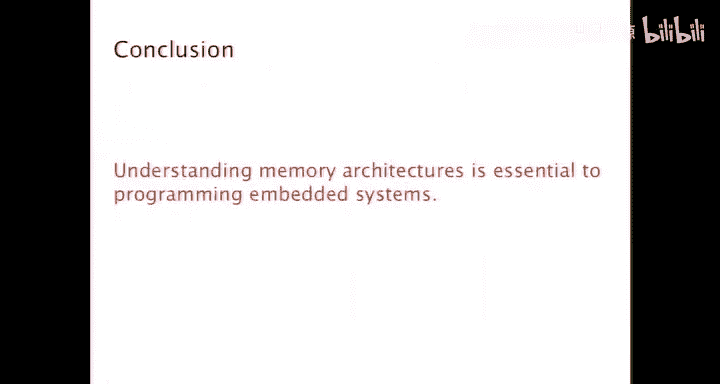
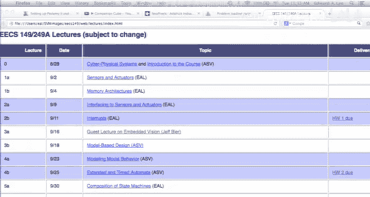
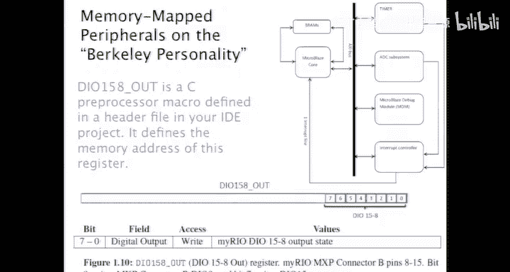

# 嵌入式系统：04：传感器与执行器接口


在本节课中，我们将学习如何将嵌入式系统的数字世界与物理世界连接起来。我们将探讨内存架构的收尾内容，并深入了解如何通过GPIO、串行接口等方式与传感器和执行器进行通信。

## 内存层次结构

上一节我们讨论了嵌入式系统中使用的内存技术。本节中，我们来看看如何组织这些技术以形成高效的内存层次结构。

典型的处理器内存层次结构从寄存器组开始，这是最小但最快的内存。接下来是缓存或暂存器内存。两者的核心区别在于：缓存的内容由硬件管理，而暂存器的内容由软件管理。

在缓存中，数据以“行”为单位组织。一个地址被分为**标签（Tag）**、**组索引（Set Index）**和**块偏移（Block Offset）**。硬件使用组索引找到对应的缓存行，然后比较标签以判断是否命中。如果是直接映射缓存，每组只有一行；如果是组相联缓存，则每组有多行，需要更复杂的硬件（如内容可寻址存储器）来并行查找。

当发生缓存未命中时，硬件需要从主存获取数据，并决定替换缓存中的哪一行。常见的替换策略包括**最近最少使用（LRU）**和**先进先出（FIFO）**。

然而，缓存虽然能提升平均性能，却会导致访问时间变得不可预测，这在需要严格控制时序的嵌入式系统中可能是个问题。因此，嵌入式系统中有时会直接关闭缓存以获得可重复的行为。

## 连接物理世界





现在，让我们转向本节课的核心：如何连接数字世界与物理世界。物理世界是连续、并发的，而数字计算是离散、顺序的。桥接这两个世界是信息物理系统的核心挑战。

一个典型的嵌入式开发板（如BeagleBone或Arduino）提供了许多数字和模拟输入输出引脚。通过配置内存映射寄存器，我们可以控制这些引脚的功能。

以下是配置引脚功能的几种主要方式：

*   **通用输入输出（GPIO）**：软件可配置为输入或输出。作为输出时，可以驱动引脚为高电平或低电平；作为输入时，可以读取外部电路施加到引脚上的电平。
*   **串行外设接口（SPI）**：一种高速的全双工串行通信总线。
*   **通用异步收发器（UART）**：实现异步串行通信（如RS-232）的硬件。
*   **USB**：通用的高速串行总线。

## 通用输入输出详解

GPIO是最基础的接口方式。当配置为输出时，常采用**开集电极**电路。软件写“1”到控制寄存器会使晶体管导通，将引脚拉至低电平（接地）；写“0”则使晶体管关闭，此时通过外部上拉电阻可将引脚拉至高电平。

开集电极设计允许实现“线或”逻辑，即多个输出引脚可以直接连接在一起，任何一方拉低都会使整条线变低。

**设计注意事项**：连接外部元件（如LED）时，必须根据欧姆定律计算合适的限流电阻值。公式为 **R = (V<sub>supply</sub> - V<sub>LED</sub>) / I<sub>LED</sub>**。电阻值过小会超过GPIO引脚的最大电流定额，损坏处理器；电阻值过大则可能导致LED亮度不足。

## 串行通信：以RS-232为例

串行通信一次传送一位数据。RS-232是一个经典的异步串行协议，其数据帧以**起始位**开始，然后是数据位（通常8位），最后是**停止位**。通信双方需要预先约定相同的**波特率**（如9600 bps）。

接收端在检测到起始位后，会按照约定的时间间隔对信号进行采样，以获取数据位。波特率的上限主要受限于两端时钟晶振的精度误差。误差会随着每个位的采样而累积，因此限制了单次传输的位数和最大速率。

在现代嵌入式系统中，UART硬件负责处理串行化的细节。软件通过读写内存映射寄存器来发送和接收数据。

以下是一个通过UART发送数据的C代码示例，它演示了“忙等待”的方式：

```c
while (!(UCSR0A & 0x20)); // 等待“发送缓冲区空”标志位就绪
UDR0 = byte_to_send;       // 将数据写入UART数据寄存器
```

这种方式的效率很低，因为在等待硬件就绪的数百微秒内，处理器无法执行其他任务，浪费了计算资源和电能。

## 实验平台架构简介

在本课程的实验中将使用的平台采用了一种混合架构。它包含一个运行Linux的双核ARM处理器，以及一个在FPGA上实现的32位MicroBlaze“软核”处理器。

*   **ARM处理器（运行Linux）**：提供高级、稳定的控制环境，便于远程访问和调试。
*   **MicroBlaze处理器（无操作系统）**：用于进行底层的“裸机”编程，让你直接与内存映射寄存器和硬件外设交互。

你需要通过查阅头文件和数据手册来理解类似 `DIO_15_8` 这样的宏定义，它们对应着特定的硬件控制寄存器地址。

## 网络与时钟同步



最后，我们提升一个层次，看看网络通信。在嵌入式领域，存在许多特定领域的网络技术，如用于汽车的**控制器局域网（CAN）**。这些技术通常为满足实时性和确定性时序而设计。

**时钟同步**是实现高效、可靠网络通信的关键。如果网络中的各个节点能够保持时间同步，它们就可以协调动作，例如在无线传感器网络中，节点可以同时唤醒、通信，然后同时进入休眠，从而极大节省能耗。

IEEE 1588（精确时间协议）等技术可以实现纳秒甚至皮秒级的时钟同步。高精度的时钟同步不仅优化了网络性能，甚至在纠正重大科学实验误差（如中微子超光速测量事件）中发挥了关键作用。我们将在下一节课中详细讲解时钟同步的工作原理。

## 总结

本节课我们一起学习了嵌入式系统与物理世界接口的核心知识。我们回顾了内存层次结构，深入探讨了GPIO和串行通信（如RS-232）的工作原理与编程方式，介绍了实验平台的混合架构，并引出了网络通信中至关重要的时钟同步概念。理解这些底层接口机制，是构建可靠、高效嵌入式系统的基础。