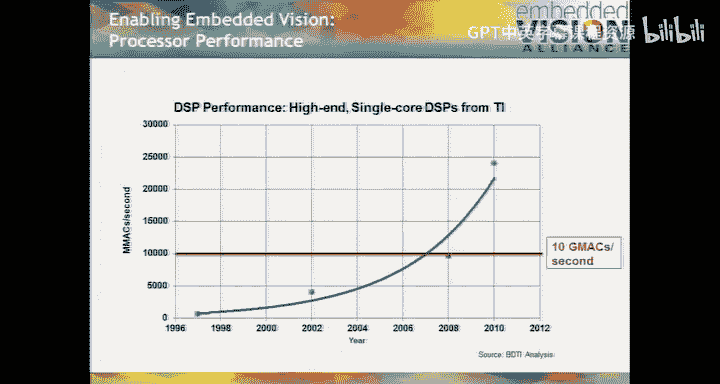
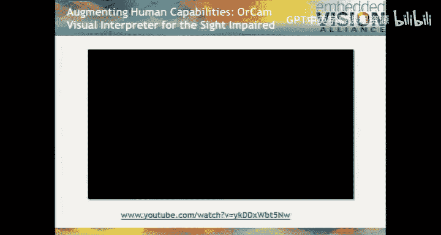
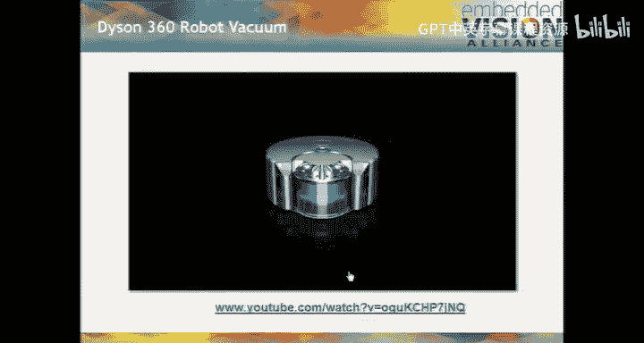
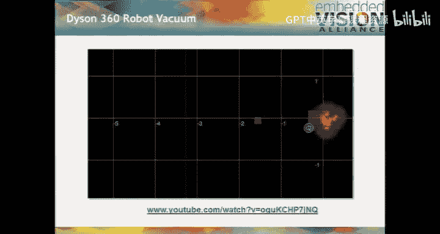
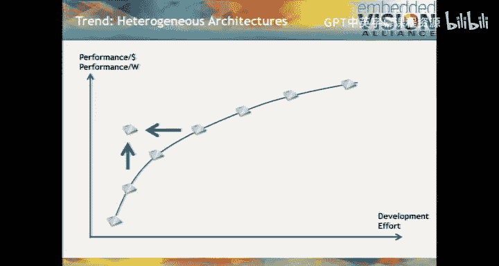

# UCB《嵌入式系统｜EECS 149  249a Introduction to Embedded Systems fall 2014》中英字幕 - P6：-06-Lecture 07 - Model Based Design.zh_en - GPT中英字幕课程资源 - BV1rBgDzRE2s

Good morning。s this thing on good morning， hello test one， two。Hello。Good morning。Can you hear me？

Not a lot of gain on this okay good morning my name is je Pier。Professor Lee invited me here。To。

Present the guest lecture today。Very excited to do it。

 I graduated from Callith master's degree in 1989。It's nice to come back from time to time。

 can you hear me in the back？Let's see， is there an electrical engineer in the house？

See if there's a volume control here somewhere。Lamp dimmer。Seriously。

 does anybody know how to operate this thing， I don't see anything that looks like a volume control。

thanks。Better。Is that okay？Keep going。All right。It's at 211 now。Can you hear me in the back now。

 all right， good morning， my name is Jeff Beer， Professor Lee invited me here to is that too loud？

It's a little bit too loud， huh it's loud in my head， I don't like to hear my voice echo like that。

 Let's try this。Good morning， my name is Jeff Beer。

 Professor Lee invited me here this morning to present the guest lecture。

 I'm really happy to be here， I graduated from Cal with a master's degree in 1989。

 it's nice to be back。Have we already established that none of this material will be on the final？

Yeah， okay good， so we can be kind of free form and you can ask questions and ask about what you really want to know about without worrying about what you're going to be tested on I think that's best anyway。

 so I understand this's a class on embedded systems yes。Okay。

This is going to be a presentation about giving site to embedded systems。

 or another term for this is embedded vision。This is a perfect time for this presentation because in your careers。

 I predict if you go into design of embedded systems。

 vision is going to become one of the most important capabilities of embedded systems over the next 20 years。

I have spent about 25 years in industry on various kinds of embedded systems design topics and processors and tools for embedded systems。

 and if we think about 20 years ago， think about w-F and wireless networking if I went to an embedded systems design conference 20 years ago and said。

 let's say I met guyd designing vending machines and I said， hey。

 what kind of wireless networking are you putting in your vending machine。I would get a blank stare。

What are you smoking？Of course， we're not putting wireless networking in vending machines。

 so that's ridiculously expensive and complicated。Today， if I have that same conversation。

 it's exactly reversed。If you're not putting wireless networking in your vending machine。

 you're the one who needs to have your head examined right because it's so easy。

 it's so cheap and it provides so much value， Otherwise how are you going to update the pricing in the vending machine。

 how are you going to find out when it needs to be restocked， etc。

 Of course you're going to put wireless networking in because it's virtually free。

 it's really simple to integrate and it brings all kinds of added value to the machine。

Same is about to be true for what has been known for decades as computer vision in most fields today。

 people designing embedded systems if you have the conversation， hey。

 what kind of computer vision functionality are you putting into your vending machine。

 you get that same reaction that Wi-fi got 20 years ago are you crazy。

 that's a technology like nuclear fusion， yeah it's really cool and powerful but it's just way too complicated and expensive to use here。

 that has been true for the last 50 years。But it's not true anymore。

 and the system designers who are being clever about incorporating vision into products today are getting huge gains by doing so and in 20 years。

 I think while the same situation that we have now with digital wireless。

 it's going to be taken for granted， it's going to be ubiquitous almost every kind of system is going to have vision because enormous benefits come to systems from having vision。

And it's going to be pretty easy and pretty inexpensive to do， just like wireless is today。

This quote from neuroscience is very， I think inspirational in that regard。

 this is of course about human vision， human vision， depending on which neuroscientists you talk to。

 take somewhere between a third and a half or maybe a little bit more of the human brain if you think about that in computation terms and evolution terms。

 I think you can infer two pretty interesting things that also apply to artificial vision or embedded vision as I call it thing one。

It must be hard， vision must be hard， otherwise why would we need half of our very powerful brains to do it。

 it must be a computationally hard problem， that's true。😡，Number two， it must be really important。

If evolution has decided to allocate half of our brains to vision， it must be extremely useful。

 we only get one brain， if we're going to allocate half of it to vision。

 that must be a really useful thing， of course we don't need neuroscience to tell us that。

 just try getting through your day with your eyes closed。

And you very quickly realize the thousands of things that vision enables us to do。

 so keep this in mind， vision occupies half the human brain because of that or from that I think we can infer it's computationally hard and it's really valuable to humans。

 the same things apply in artificial vision in embedded vision， it's computationally hard。

 and it brings a lot of value to systems。Please raise your hand at any point if you have questions or just shout out。

 I have low expectations in this regard， the only place I've ever given a presentation gotten fewer questions than an ECS class is in Finland。

Where apparently it's a cultural thing， you just don't ask questions。I don't know。

So we use this term embedded vision。Simply to mean the practical， deployable form of computer vision。

 Comp vision is a term that has a lot of baggage from 50 years of research and kind of niche exotic。

Deployments and things like high end manufacturing and military applications。

 So we've chosen the term embedded vision to mean。The practical。

 deployable sort of successor to computer vision， if you will。

What's making this transition happen right now， why didn't it happen 10 years ago or 10 years in the future。

 Well， it's because the technologies crossed important thresholds。Remember， from neuroscience。

 we get the inference that vision is computationally demanding。

And this is true for human vision and also for embedded vision takes a lot of processing power。

 typically in the order of tens of billions of operations per second to do vision。

 it's easy to see why this is so it's simply the product of the data rate and the amount of computation being applied to that data visionion of course is operating at least in most interesting cases on video data。

 30 frames per second， 60 frames per second， VGA 720p， 1080 and so on that's just a lot of data。Tens。

 hundreds of millions of。Data elements per second now comes to question well。

 what are we doing to that data， even something really simple like。

Correcting for the geometric distortion of an imperfect lens。Typically could require， let say。

 let's just say on the order of 10 operations， not just per pixel but per color component of a pixel in the image。

 so tens10 operations per element times 100 million elements per second。

 we're already up to a billion operations a second of compute power and we haven't even done anything interesting yet。

So it's very easy to see how we quickly get up into the tens of billions of operations per second。

 Now， if you're doing the DARPA Grand Cha and you have the whole cargo area of an SUV。

In which to install racks of servers with high end CPUs and GPUs， this is no problem。

 right tens of billions of operations per second， that's easy。If on the other hand。

 you're trying to build a small product， a low power product like this pen。

 which incorporates vision。Then it's an entirely different matter。

 right to fit billions of operations， tens of billions of operations per second。

 into does something small， inexpensive， this is a $100 product and low power。

 this will run for many hours on whatever small battery they can cram in here that's hard and that's why。

Vision is just taking off now because we're just getting to the point where processors with enough processing power。

 but low enough。Power consumption and cost for vision applications are becoming widely available。

And the same can be applied to image sensors， thanks largely to smartphones。

Image sensors have become an enormously high volume market with a huge emphasis on small size。

 low power and low cost so not only have the processors crosseding important threshold but so have the image sensors here's quantitatively one view of the processors crossing the threshold Now there are many classes of embedded processors as I'm sure you know one class DSPs digital signal processors and I chose those here because classically DSP is really optimized for the sweet spot of yes we need high performance for streaming data algorithmic intensive kinds of workloads but we also need it at low power and low cost so I chose a very mainstream DSP family from Texas instruments the C 6000 family the single core version of that and I looked at how the performance of that family has evolved over the last 20 years and using the very simplified metric of billions of multiply accumulate operations per second just kind of the equivalent of MIPS for digital。

signal processing， what you can see is that just in the last few years。

 these processors have crossed this threshold of 10 billion operations per second。

 which is a kind of typical workload。Typical performance load for an embedded vision application。

 some are much higher， some are much lower， but order of magnitude 10 billion operations per second is typical。

 and we've just gotten to the point in the last few years when you can get a processor not for 100 watts and $500。

 but for a watt or two and 10 or $20 that will deliver this kind of performance。

So that's what makes it possible now to put vision in everything。

 but as my mother used to tell me frequently， perhaps you've heard this just because you can do something doesn't mean you should so this is the you know we can。

 but why should we put vision in things Well， just like vision provides incredible。

Versatility and utility for humans。 It provides incredible versatility and utility for machines。

 It can fundamentally what it does， I think， is it upgrades what machines know about the environment。

 So if you're interested in how machines interact with the physical world and I would contend that that's really the only interesting kind of machine is machines that interact with the physical world。

 machines learn much more about the physical world from vision than almost any other way。

 which is also true for humans and with that additional awareness of what's going on in the physical world。

 they can achieve a lot of things they can be safer。

They can be easier to use interacting with humans in a way that's more natural to humans。

 for example， they can be more。Insightful， be able to determine things about what's going on in the environment。

 like a person's emotional state， for example， that are difficult or impossible to determine in other ways。

 so vision just like it brings huge amounts of information and functionality， if you will， to humans。

 brings enormous amounts of information about the physical world and to machines which enables many。

 many new kinds of functionality。I'm going to show you a video here。

 let's see if the sound will work This is I have dozens of these and I've just chosen three to show you today I'll give you links in the slides to more if you're interested but these are a few I think very innovative products that are entirely enabled by vision and that hopefully give you a sense of what I'm talking about when I say vision brings entirely new kinds of functionality to machines this first product is from a company called orcam based in Israel and what it is is an aid for people are severely visually impaired not completely blind but severely visually impaired and you'll see in this video how it works a camera clips onto the earpiece of regular eyeglasses there's an earphone and pocket computer roughly the size of a smartphone and one of the really innovative things about this device you may have noticed is it uses a person's finger like a mouse to direct the focus of the vision system so I'm interested in this thing what is this piece of currency。

What is this street sign， what is this text on this menu， and then gives a spoken interpretation。

 either text to speech or object recognition of what is that thing that you're pointing at？

This was just announced last week， has anybody have or has anybody seen a Roomba robot vacuum？

So that was cool when you know when it debuted， what was that 10， 15 years ago。

 but it's a pretty clumsy thing right you see it work its way through a room。

 it's constantly bumping into things because that's the only way it finds things。

 it bumps into them and also winds up missing spots and going over some spots many times because why？

It has no model， it has no model of the space， it's just blundering around in a very kind of brute force way bumping into things。

 Os can't go there， let's try over here this is a successor to Ria。

 this is a Dyson product that was just announced and not surprisingly it uses embedded vision to solve this problem not just in a straightforward way that you might think of looking around but actually using 3D vision to in real time create a 3D map of the room and everything in it at least at floor level now it has a model of the space now it can map out a path through the space that never collides with anything in the space and covers each。

Patch of floor once and exactly once， vastly more efficient approach。

 but only possible really with vision or some comparable sensing technology， you may say。

 well that's not so impressive， I've seen things like this before and you're right， for example。

 when they land the Mars or rovers。

On Mars， one of the ways that they avoid having them land upside down in a crater is they use 3D vision to look at the surface。

 compare what they see to a stored map， and then navigate。

 maneuver the landing vehicle so it lands in an appropriate location。Again。

 just like I said earlier with the DARPA Grand challengege this isn't hard if your budget is hundreds of millions of dollars for the actual product you're building right but if your budget is a few hundred dollars for consumer product that's where it gets really challenging think about the computational complexity of doing this 3D map construction in real time on a then think about mapping that onto a very low cost and a low power processor that's where some of the very interesting challenges arise here's one more example。

Also very small low power vision enabled product， what this device does is turns any surface into a touch screen using 3D vision。

Again， it's not so much that you can do this， that's interesting。

 it's that you can do it in a very small， low cost， low power device。

Devicicees from a company called Ra， as an R active without the E on the end， based in Singapore。

 they've just started initial production of this device， retail price is $75。

I've got a bunch more very cool example videos here。

 I'll make the slides available and I encourage you to check these out to see more about how people are using this kind of technology for real commercial applications。

 not just sort of science fair， do it because we can yes。So that's a great question， processor specs。

 I'm going to come to you I have this section on processors coming up。

 so let me see if I answer that question there。So how does this work first of all。

 from kind of a behavioral from an algorithmic point of view， you know， this is。

 of course a whole rich field computer vision I'm going to。

Give it an extremely superficial treatment here just so those of you who haven't had exposure to computers and get some flavor for what's going on algorithmically and then we'll get into the implementation challenges。

 processors especially so of course you start by acquiring images typically you then need to optimize the image or enhance the image because。

Imaging the images are often imperfect， especially in a product that needs to work kind of out in the wild。

There are applications like factory automation where imaging conditions can be very tightly controlled。

 for example， imagine a bottling plant where beer bottles are coming down a conveyor belt and the job of the vision system is to make sure that each beer bottle is filled to the appropriate level has a cap affix and has the label aff fixed Well what we can do in a case like that is we can make sure there's nothing in the background that's going to make the problem harder we can make a really simple playing background we can have optimal lighting from the same vantage point as the camera we can locate the camera in exactly the optimal position to get the best quality image and that's what they do in factories and it works great。

But out in the real world， if we're talking about a robot vacuum or device that's a PC peripheral or an automotive safety device。

 it's quite the opposite， we have no control over the imaging conditions and they're often atrocious。

We have bad weather， we have glare， we have dirty lenses， we have just limited light available。

Things are moving very quickly so a lot of the first steps that happen in a typical vision system kind of in the wild is doing the best we can to improve the image and of course cameras do this。

 but they are optimizing for different criteria they're optimizing for a pleasing image pleasing looking image that we're gonna to look at and say oh yes we like how that looks for vision we're optimizing for different criteria we're optimizing for maximum information in some sense of the word information in the image once we've gone through those steps which include things like contrast enhancement。

 noise reduction， color correction， lens distortion correction。

 then we move to extracting information from the image。Converting pixels into objects if you will。

 and then reasoning about the objects， for example。

 is this person that I find in this location in this frame。

 is that the same person that was in this nearby location in the previous frame。

 and can I therefore infer that there's a person moving on a certain trajectory？

So that's a very high level view I'll go into a little bit more detail。

 but one of the really important points here is that as we move through this pipeline from the image sensor。

 and of course， there may be several image sensors。Doesn't necessarily have to be just one。

 a lot of products use two， three， four or more image sensors depending on what they're trying to do。

Purposes of simplicity， let's just say there's one moving from the image sensor through all of the algorithmic steps to a point where some decision can be made。

 we go through a cascade， a feed forward pipeline of steps starting with image improvement。

 then typically looking at small low level features in the image that may when they are collected together。

 help us identify an object， for example， corners that may indicate features of a face like a mouth。

 eyes and nose。Then we start aggregating those small features into larger objects。

And eventually reasoning about those objects， is that really a person or is it a sign。

 is it the same person that I saw at this nearby location， the previous frame and so on？

A couple of really interesting things here， one is as you go from the left side to the right side of the pipeline。

 the data rates go down quite quickly because we move from and the front end。

 operations that touch every pixel or every color component of every pixel。

 so massive amounts of data to in the back end， algorithms that are talking about objects like people。

Where there may only be a few such objects in a frame。

 so we go from hundreds of millions of pixels per frame to perhaps just a few objects per frame at the end of the pipeline。

 so the data rates go throughout this pipeline go down by orders and orders of magnitude and of course as data rates go down。

 computation load tends to go down except that there's a counteracting force happening here。

 which is that the complexity of the algorithms goes up very fast as we move through these stages in the pipeline in the front end when we're doing things like color correction and lens distortion correction。

 the algorithms tend to be very simple algebraic transformations， things like filters for example。

 but then as we get to the middle and the end of the pipeline where we're really reasoning about well is this collection of corners of face。

 the algorithms are much， much more complex and so we go from tens of lines of code for example in the case of lens distortion correction to potentially tens of thousands or even。

hundreds of thousands of lines of code as we get into some of these heuristics in the backend reasoning about objects。

 so data rates are going down as we move through the pipeline， but algorithm complex is going up。

 and so computation requirements tend to be substantial at each stage of the pipeline because the computation requirements are the product of these two things。

Like we said earlier， also the data types tend to change at the front end we have pixels they're usually 8 bit integer quantities or something like that。

 but as we move through these increasingly complex algorithms。

 often we wind up with more complex data types， for example， when we talk about。

Applications that are doing things like 3D mapping 3D spaces。Floating point is a virtual necessity。

So there's a lot of heterogeneity in the computation。

 even within one vision application from the front end through the pipeline， different data rates。

 very different data rates over many orders of magnitude， different algorithm， complexity。

 different data types， and this is one of the things that makes it a challenge for processors because it's easy to find a processor that's good at one thing。

 it's hard to find a processor that's good at a wide diversity of things。And good in the sense of。

 you know， extreme cost efficiency and energy efficiency。

Now the view I gave you a minute ago is very simplified in reality。

 algorithms the algorithms wind up being much more complex and one of the reasons for this is has to do with models or the lack of models in other fields in sort of applied electrical engineering for example。

 wireless communications， we have really good models of the physical world。

 really good mathematical models that predict quite well how， for example。

 wireless signals propagate through space reflect off objects are absorbed and so on。

 and so what this means is that we have a really good foundation for reasoning about the design of the communication system under a known set of constraints and goals。

If we have a known set of constraints and goals， experts in wireless system design tend to converge on similar answers in terms of what should this system look like。

 should it be CDMA， should it be MIO and so on， because they're guided by these strong mathematical models。

 In vision there really are no such models。And what that means is that vision is a fundamentally experimental field where we try things。

 we try things in the lab with a limited amount of data that we have on hand， we think they work。

 we take them out in the field， they break。We diagnose why they broke。

 we bring that data back to the lab， we refine our algorithms。

 and we repeat that cycle essentially forever。And we wind up with algorithms that look like this。

Very complex， lots of feedback， lots of concurrency， lots of heterogeneity in terms of data types。

 data rates， algorithm types， and so on。So。Lack of models is a key challenge， I'm sorry， question。

The kind of feedback， an example of this kind of feedback path。

I'm trying to recollect from a really good presentation on this topic。

 which I can point you to later that I saw about a year ago， but a good example might be this。

 you have in automotive applications， for example， we have cameras that are doing a whole bunch of things including they're looking for lane markings on the road。

And as you know， those can be hard to see depending on the imaging conditions。

And glare and lighting and how worn they are and the angle of the light and so on。

 And so one of the places where you might see a loop like this is the back end or the middle end really in this case might say。

 look I'm having a really high see the road but I'm having a really hard time finding the markings you might then ask the front end to change some of the settings turn down the gain。

 compress the dynamic range do something to give me a better shot this isn't working for me can you adjust。

The image， because under these conditions I'm not getting something I can work with。

 that's kind of a simplistic example and I don't know how realistic it is。

 but at least it illustrates the concept。So these difficult imaging conditions are a key reason why vision is hard。

 I mentioned that earlier。Lack of analytical models is a key reason why vision is hard。

 another reason why vision is hard is that there's an enormous design space before we even get to implementation。

 just when we're at the functional level of MATLb or C++ code or whatever prototyping algorithms。

 there's enormous number of knobs we can turn。On these algorithms and that creates a huge design space where it's really hard to find what is the optimal set of settings for this set of algorithms for this set of conditions and actually there's some very interesting work that's recently been done in a DARPA program called。

Visual media reasoning where they've developed some tools to help in the automated exploration of this design space。

 once you have an algorithm or a small set of algorithms and a set of parameters and then a set of data images is and what we call ground truth。

 meaning what's the reality about those images that our system should be extracting an automated way of framework to help with automated testing and exploring that design space to help you figure out what the best parameter settings are。

It's also true that。Vision systems are challenging because it's a very much multidisciplinary problem。

 you have optics， you often have lighting， you have image sensors， you have algorithms。

 you have processors， you probably have networking of some sort databases and so on and even within big sophisticated organizations it's rare to find one group of people that has all of the necessary expertise to optimize across all of those domains。

 but it really does require co-optim across all those domains to get an optimal system design。

 you know if you've got the wrong lens no amount of optimizing the image sensor or the image enhancement algorithms is going to offset that bad lens selection for example。

So those are some of the things that are challenging。

 make it challenging kind of at an algorithmic functional level。

There's a whole other set of challenges that we get into when it comes time to implementation once we get to the point where we say。

 okay， we have the algorithms we want， now we're going to implement them。

On a some kind of embedded processor so that we can actually deploy them in a product。

 The first challenge， as I mentioned earlier is simply there's a lot of performance required relative to what's typical in embedded processors。

We need that performance， we need it at very low cost， very low power consumption in most cases。Now。

In electronic system design， a classic way of solving this problem of needing a lot of computation in a low amount of power consumption and cost is to put the algorithms into fixed function hardware。

To design specialized logic that implements the algorithm， for example。

 if you pry open your set top box or your nice laptop and you dig down into the bowels of it to find the piece of silicon that's actually doing H264 decode。

Even though you have billions of operations per second of compute power in your CPU and your GPU。

They're not doing H264 decode。 There's like one square millimeter of silicon。That is doing H264Dcode。

 And that's all it does。And it can't do anything else。Because it only does H264 decocode。

 It's amazingly efficient。And it does that H64Dcode for almost no money and almost no power。

That approach， unfortunately， doesn't work well in typical vision applications because the algorithms tend to change very fast。

Why do the algorithms change， It's primarily two reasons， One I already said。

 which we don't have analytical models and so in the absence of analytical models we experiment。

 lots of people experiment， and they constantly come up with new and better approaches。

 try and outdo each other number two， we don't have standards in vision the way we have in multimedia and wireless in wireless we have to have standards if my smartphone can't talk to your base station。

 there's no wireless industry So standards are essential to wireless communications。

 they're not essential to vision however， because vision systems generally do not talk to each other。

 they don't interoperate with each other。 they're standalone in that sense。

 and so vision systems are not influenced by the same standards in the same way that things like wireless and consumer multimedia and broadcast are so given the experimental nature and the lack of standards we wind up with algorithms changing very。

 very fast， which means if you burn your algorithms into gates by the time you're done with the verification and tape out the chip。

 the algorithms change。So we need high performance， we need it at low power and low cost。

 but we also need it to be programmable so that we can update the algorithms。

As our ideas change about what algorithms we should be using。Yes。Yeah。

 I mean I'm somewhat overstating the case for effect and I'm saying probably even before you finished your design。

 you'd find that your hardware was obsolete because the guys in the other room work in the algorithms would go oh。

 we can do this much better if only we change the algorithms this way and you go just shoot me because I just spent the last you nine months optimizing this down at the gate level I can't change it now now in reality there's a continuum and often what happens is the frontend steps things like the image enhancement and 3D stereo depth extraction。

 which are relatively simple and relatively stable algorithms that people have been using for decades can and are reduced to fixed function hardware and later stages which are less stable is where it's dangerous to put things into hardware because the algorithms keep changing and so people rarely do put them into hardware yes。

It's not so much that the so let's say the roombo the Dyson robot they deployed in the field。

 I'm not necessarily talking about。Upgrading your unit once it's in your house。

 but I'm talking about next year's model and next year's model。

Doing a custom chip is enormously expensive， time consuming and risky。

 so people do it only when they have to and only when hopefully their requirements are really stable so。

More likely every six months， Dyson's going to have a new version of the robot with better firmware。

 better navigation， maybe you'll upgrade yours， maybe you won't。

 but the point is if they did a fixed function chip that was based on today's algorithm。

 they might not be able to upgrade it than in six months when they have slightly better or maybe a much better algorithm。

So， the。I'll come back to processors。Point here is。Since we can't do custom hardware。

We have to use a programmable processor CPUs are the programmable processors。

 the default programmable processors that get used in everything， general purpose processors。

 but general purpose processors are pretty inefficient when it comes to performance per watt and performance per dollar often way too inefficient for these kinds of applications and so what usually happens is we wind up using some sort of heterogeneous collection of processing elements including a CPU but then one or more other kinds of processing engines that's how we get the efficiency that we need with the performance that we need。

 but heterogeneous processors are complicated， they're complicated to program they're complicated to debug and so that's adds another layer of complexity to implementing these systems itll be more about processors in a minute question。

How far are we from DSPs that are tailored to embedded vision， that's a great question。

 they're out today。Yeah， they're not sort of widely publicized。

 but there are quite a few companies making them and I have a slide on that。Coming up。

What time are we supposed to finish here， is it 12 20 or 12， 30？1230， okay。

 I'll try to push it to the very last minute。 just want to past myself here。 Okay， so let's look at。

A real example。You may have started to see cars now are starting to come equipped with vision based safety systems。

 the industry acronym for this is ADS， ADAS， which stands for our automated driver assistance system。

And these systems have a variety of functions that they perform。

 the most common is what again in the kind of industry tortured lingo they call forward collision avoidance。

 what that means is helping you not crash into things that's the most common functionality so one or more cameras looking out typically through the windshield they're typically mounted up by the rear view mirror so they have a similar view of the scene as the driver and they're looking at what's happening initially specifically for other vehicles that you're driving behind。

And looking for a situation where you are closing too fast on the vehicle in front。

And when they detect that situation， if it's a passive system。

 it's going to warn you with a shrieking alarm， perhaps。If it's an active system。

 it'll start by warning you and then if you don't seem to be getting with the program。

 it will stop the car itself by applying the brakes。

So that's one function that these ADS systems provide。

 but very rapidly they're providing lots and lots of other kinds of functions as well。

 I mentioned sign reading， so some of them will read speed limit signs and warn you if you're speeding。

Lane departure warning is another common function I mentioned this earlier where cameras either behind the front mirror the rearview mirror I mean behind the windshield or in the side mirrors looking kind of forward and downward will look for the lane markings in the road and if you seem to be drifting out of your lane unintentionally in other words you didn't make a deliberate kind of steering input。

 you didn't use your turn signal， you just seem to be kind of wandering out of your lane the system will warn you or again if it's an active system it'll provide steering input to correct the situation and keep you in your lane there are many other functionalities that these functions that these systems are providing and some of the videos that I'll give you links to illustrate these some of them are inside the car for example looking at the driver to see is the driver getting sleepy。

And if so， war the driver， hey， maybe you want to take a break now。

But let's stick with the lane departure warning。And let's just take a high level look at how that might work from a vision point of view。

Not surprisingly， when we're looking for lane markings。

 really what we're looking for is edges in images right we're looking for high contrast features with certain geometric properties。

 that's what lane markings R。 and so often the first step in a lane or after we do some of the image improvement the first step of extracting meaning is an edge detection algorithm which might take you from something that looks like this to something that looks like this from a natural image to an edge image where the black pixels are highlighting edges in the original image and this is computationally very simple。

 there's an algorithm invented by a Berkeley CSs professor John Canny called Canny edge detection。

 which is kind of the classical approach to this which is essentially 2D FIR filtering。

 So from a writing code point of view， just maybe a dozen lines of code but since you're applying it across the entire image and then 3。

per second or maybe higher， because keep in mind， we have a moving vehicle here。

 So we need lots of images per second to keep track of what's happening。

 The computation becomes significant。The edges produced by something like canny edge detection are not going to be ideal edges like you might draw if you were drawing the scene though。

 they're going to be kind of noisy and messy because the image data from the real world is noisy and messy and to help us figure out what we're really seeing。

 help the algorithms figure out what they're really seeing and what's really alien marking and what isn't often will take a step where we simplify and clean up。

Those edges， edge thinning， kind of binary morphological operation where we look at a local neighborhood of pixels and remove some that are sort of unnecessary to the fundamental edge that we think we're looking at。

嗯嗯。So now we have a cleaned up edge image now the question is are there lines represented by these edges because lane markings are lines right these edges could be any pattern。

 they could be a sine wave， they could be a circle， we're looking for edges。

A classical technique for extracting edges sorry lines from an edge image is called the huff transform it actually can be used to extract other shapes as well like circles in this case we're using the huff transform we applyingly the huff transform which is kind of histograming technique it finds each edge pixel and it looks at the neighboring edge pixels and it starts to build a histogram of essentially all possible lines in the image and if a possible line has a lot of actual edge pixels on it then it likely is a line so it's kind of a voting technique。

Very simple to describe write and write and code， but very again。

 very computationally demanding Now for lane markings。

 we're probably looking for at least initially straight lines。

And so this is a place where that earlier step of correcting the geometric distortion from imperfect optics。

 imperfect lens is important because that geometric distortion will make straight lines look curved and curved lines look straight。

 and so if those kinds of properties are important。

 then it's important that we do that lens distortion correction step up front。

This is a little more detail on the Huff transform， but I've already pretty much described that。

And and then typically we're going to start applying additional heuristics to determine well of all these lines in the image which ones are likely to be lane markings Well we know something's a priority right if we know lane markings don't usually appear in the sky so we're probably going to discard images that are in the field of view well above the roadway we may also reason based on color at this point we only have a binary image based on a grayscale version of our original image。

 but we could still retain the color data from the original image and once we have candidate line we could refer back to that color data and say well this line here what color was it in the original image was if it was white or yellow。

 maybe that gives it a higher probability of being a lane marking if it was black。

 maybe that gives it a lower probability and so on。

Often then we're also going to do tracking of these lane candidate lane markings from frame to frame Now of course。

 the markings themselves are not moving from frame to frame。

 but the vehicle is moving so there's relative motion between the lane markings and the between the lane markings and the car and so by by tracking a candidate lane marking from from frame to frame。

 we can get some useful information。 for example， maybe the imaging conditions are marginal and so every third frame we don't get a clear edge on a particular marking well it's not helpful to us if we're oscillating back and forth between it's a lane marking it's not a lane marking。

 it's a lane marking it's not a lane marking we got to decide and one way we can decide is look over time and say well in this frame is here in this frame it's here in this frame it's here here it's missing but it's back in this frame yeah I think it's a lane marking for example we can also。

Predict where the car is moving relative to the lane marking。 So for example。

 in the lane departure warning system， we don't want to wait till the car has exited its lane。

 We want to anticipate when it's about to exit its lane and warn the driver or take corrective action at that point。

 And so things like common filters are very helpful for doing this kind of of tracking and prediction。

 We're at a stage now where we're operating on much lower rate data。 Now we're only looking at the。

Lines that are good candidates to to be lane markings and so instead of millions of pixels per frame now we're probably down to dozens of candidate lines per frame so data rates much。

 much lower but the algorithms are starting to get more complex so hopefully this gives you a little bit of a flavor of how this kind of application might work This is kind of the textbook version this is what you might start with and you take it out in the field and you start testing it over thousands and thousands of actual road miles under varied weather and lighting conditions and you find that it failed in various situations you capture that video and you bring it back to the lab and you'd iterate and improve the algorithm and this happens essentially continuously as anyone heard of the company called Mo eye。

Mobilizing Israeli company that just was in the press a couple weeks ago for having a phenomenally successful IPO。

 they are really the pioneer and the leader in this vision-based automotive safety technology and they've invested something like a thousand mans in their algorithm development so far and there's no end in sight they're going to keep working on this because it's never perfect and it's never going to be perfect。

 but as processors become more powerful， algorithms become more sophisticated。

 they can get closer and closer to perfect。Okay， so a little bit about processors now。

I mentioned that high performance CPUUs， I'm not talking about microcontrollers here。

 but X 86 Ar cortex 89， this class or processor， they often have sufficient processing power for vision applications。

 especially when you bring in the single instruction， multiple data capabilities like SSE and neon。

 but when you start running them at two three gigahertz and you4 or8 course per chip and maxing out the SIMD lanes。

 they start to get very warm。And also expensive and you can see that with a mobile phone。

 if you take a typical smartphone today that's got four。

2 to three gigahHtz arm cortex A 15 type cores and you just max them out。

 it can't run in that state very long， it starts to get too hot and thermal limiting comes into effect and forces the CPU clock speed to go down so the phone doesn't melt。

So this obviously isn't going to work for a lot of applications， it isn't a very energy efficient。

 it isn't a very costeff way to get the necessary performance， so like I mentioned earlier。

 very common approach is to use heterogeneous processing。

 use a CPU plus one or more more specialized parallel processing engines that are still programmable but that are more specialized and can do the highly data parallel。

Algorithms that are common in these applications at very low cost and energy consumption and ideally what you hope to achieve is the best of both worlds。

 these more specialized processors are harder to program。hen a general purpose CPU。

 you have to know more and you have to work harder to get an efficient implementation on these specialized architectures。

But you get a more efficient implementation by doing so， so in the ideal world。

 80% of your code is only consuming 20% of your processing cycles roughly and that can stay on the CPU because it's only consuming 20% of the processing cycles and so you can keep that 80% of the code on the CPU where life is good in terms of ease of programming and really good tools。

 then the 20% that's really doing the computational heavy lifting。

That is a 20% of the code that you take and you put on the more specialized processing engines and it's going to be more effort and more skill required to do that。

 but you're going to get an enormous gain in efficiency。

pererformance per watt performance per square millimeter silicon by doing so。

 and so virtually every implementation that you see kind of in the wild today of computer vision。

 embedded vision is using some form of heterogeneous processing。

And there are many different forms of heterogeneous processing。

 mobile phone application processors are a great example。There are many。

 many processors besides the general purpose CPU in the typical mobile phone application processor。

 GPU。DP。ISSP， which is the image signal processor， and that's by necessity because the phones are extremely constrained in power consumption and also cost。

So if you're trying to do some sophisticated computer vision on a mobile phone or tablet and it's something that's going to run for more than a few minutes at a time。

 so you care about the energy efficiency， you almost certainly have to get it off the CPUU and find a way to put the heavy lifting onto the GPU。

 the DSP or one of the other more specialized but more efficient processing engines。

 and this is not true only in mobile phones because these mobile application processors are now starting to find their way into lots of other applications。

 like automotive systems， for example， so these almost exact same processors that you find in smartphones are now showing up in lots of other places。

General purpose GPU。This is the concept of taking the graphics processing units。

 which were originally designed， of course， for doing 3D graphics rendering。

And using them to using their highly very powerful parallel architectures to do other things Now this idea has been in common use in PCs and servers and supercomputers for at least a decade but it's just now I mean literally right now starting to be used in things like mobile phones and embedded systems NviDdia recently announced this new Tegra K1 chip。

 for example， for embedded applications and they're really focusing on using the GPU to offload things like vision functions from the CPUU with much lower energy efficiency。

 This is getting easier now with non-proprietary programming languages like OpenCL that enable you to program the GPU in a way that's not specific to that GPU supplier NviDdia really pioneered this approach their version of it is branded KUa but NviDdia has their proprietary programming language and so you can't take that code from an NviIDdia GPU and Mo it。

to an AMD GPU or an imagination technologies GPU that's in your iPhone or something like that with openCL you have the ability to move from GPU to GPU and not only on GPUs but move to FPGAs。

 DSPs and other kinds of sort of data parallel processing oriented architectures so more and more attention is going into using GPUs for these applications now you asked a few minutes ago about DSPs optimized for vision and in fact there are roughly eight or 10 products out there that are DSP processors。

But really tuned for vision applications， most of them are not chips。

 most of them are silicon intellectual property cores。

 the same business model that ArM uses where they don't make the chips。

 they provide the processor designed to chip manufacturers who then implement that processor on their SOC alongside whatever other processors and buses and memory etc。

 they need for their application So I've listed a few of those companies here。

 Siva Coogniview Vantis， Tensilica， which is recently acquired by cadence， apical。

 these are all companies that offer visionspec programmable DSP cores。

 although they may not call them that in the form of licenseensable silicon intellectual property cores。

 there are very few companies that offer these kinds of processor at the chip level。

 In fact I think the only one doing that really today that's not totally market specific is a company called Movidus if you saw the Google project To。

If you haven't seen it， check it out， they have a smartphone prototype that integrates 3D vision so you can do things like mapping interior spaces similar to what that Dceson robot vacuum is doing。

 They use the Movidious processor in their。Project tango， smartphone prototypes。Also。

 FPGAs are starting to be used as compute engines in these kinds of applications and that's becoming more feasible now that there are ways to implement algorithms on FPGAs that don't require going down to doing register transfer level hardware design in Verlog or VHDL。

 for example， highlel synthesis tools that allow you to take algorithms expressed in C or C++ or system C and synthesize RTL or openCL。

 like I mentioned a minute ago， AlTRA for example， has an openCL to FPGA flow that they've been using in the high performanceform computing space for servers and that they're now bringing into the embedded space as well。

So those are a few of the common processing options if you're interested in more about practical computer vision and what kinds of processors and tools are available。

 what kinds of applications are people implementing。

 I want to invite you to come to our website the embedded vision Alls an industry organization that I started about three years ago to help facilitate the widespread use of computer vision technology in products in industry and the alliance's main mission is to provide practical technical education to engineers and industry who want to understand how they can use this technology in their products so you'll find lots of good video presentations and tutorial articles and code examples and so on on the alliance website。

 I've got postcard here about it if you're interested in learning more about the alliance。

 all those resources are free to anybody who wants them。

 you can also meet our member companies that are currently 42 member companies in the embedded vision Allance。

That you can find out about on the site and if you're interested in the job in this space。

 many of these companies are interested in hiring people to develop the enabling technology and the applications in this embedded vision space my own company is BDTI on here in the center middle column and we specialize in performance optimization so a lot of times end product companies like a Dyson for example will come to us and say well we have this big pile in thatla code。

 we have this $10 processor， how do we get this functionality into this small lowpower inexpensive processor that's what we do for a living。

Let's see if you're really into this stuff， I have this book here that was recently published called Computer visionion metricss。

 which is not a typical kind of academic textbook， it's a really practical treatment focusing on feature detectors and feature descriptors which is a kind of core topic in vision from a practical point of view including implementation aspects。

 it's available free in electronic form as a PDF you can find that on the alliance website if you're interested in a hard copy。

 I have a few that I'd be happy to give you in exchange for you writing a brief review about the book and posting it on the alliance website。

 so anyone is interested in that come see me after the lecture or send me an email and I'll be happy to mail you a copy of the book。

All right， I think I have time for a few questions。Any questions？Yes。

So I'm a digital signal processing guy。And particularly my focus in my career has been the efficient implementation of digital signal processing。

 and digital signal processing as you know， is used in a lot of things it's used in wireless communications。

 it's used in audio， et cetera。About five years ago。

 my consulting company clients started to bring us our first computer vision projects with these kinds of problems like how do we fit all this compute into this small budget。

 and because we also do a lot of work in evaluating processors。

 we realized over the course of about a year that the processors were just getting to the point。

where it was going to start to become possible to implement vision in just about everything。

 and we made the decision at that point to focus our business in this sector。

 and so we've been hiring people and building up our own skills and over the past three or four years doing more and more projects。

 solving these kinds of performance optimization and processor selection problems for mostly electronic systems companies。

Any other questions？Great， well， I really appreciate your time and attention。

 feel free to come up and have a look at the book if you want。

 grab the postcard about the embeddedbed visions Alliance。

 if you want to see how this $100 pen size computer vision product works。

 I'll be happy to give you a demo。