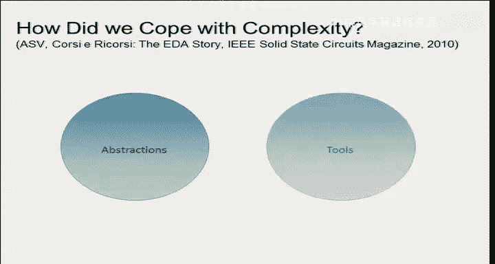
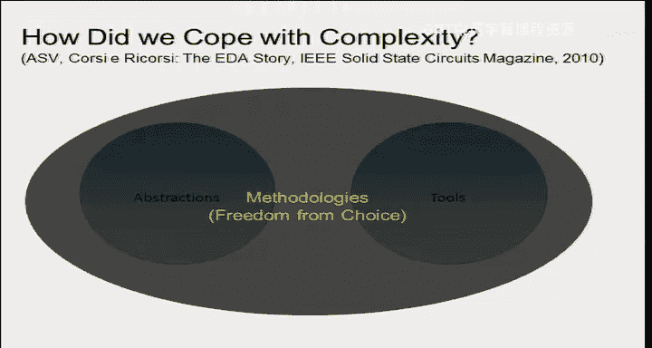
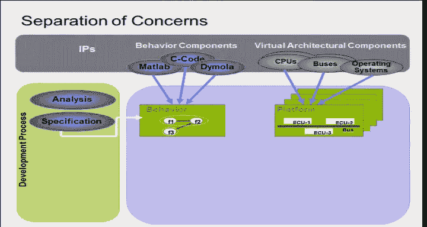
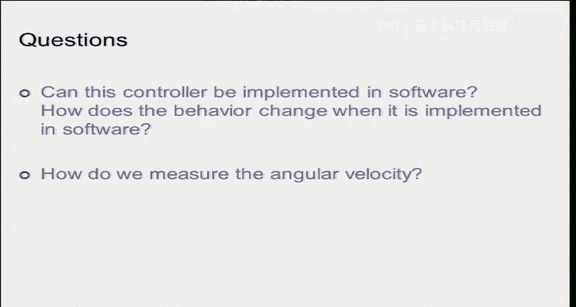

# 嵌入式系统设计方法学：08：模态行为建模

在本节课中，我们将学习嵌入式系统设计中的核心方法学，特别是平台化设计的概念，以及如何通过建模来预测和验证系统行为。我们将以汽车电子系统为例，探讨如何应对复杂性、缩短上市时间并确保系统安全。

---

## 设计方法学的重要性

上一节我们介绍了嵌入式系统的基础概念。本节中，我们来看看设计方法学为何至关重要。

方法学是组织思维和解决问题的方式。如果方法严谨且组织良好，设计结果将远优于随意尝试和反复检查。方法学本质上是一种基于特定原则的智力过程。大多数方法学都基于简单的原则，因为组织思维的方式本身就不多，总体框架应保持简单。

我们将讨论一些过去使用的设计模型，并分享工业界的视角，包括不同公司采用的方法以及我们认为优秀的设计方法。

---

## 汽车电子：一个复杂的案例

为了具体说明，我们使用一个大家熟悉的例子：汽车。如今，汽车开发的主要挑战在于电子部分。今天，汽车超过50%的价值来自电子系统。人们通常认为汽车是机械部件，但实际上，它更像是披着机械外衣的电子部件。电子部分才是最重要的。

安全性、燃油效率和减排目标，没有电子控制都无法实现。过去20年的重大发展始终集中在电子控制方面。当然，政府也施加了巨大压力，要求将事故或故障降至最低，这意味着汽车部件必须极其可靠。

然而，坦率地说，汽车行业的许多进步并非由消费者需求驱动。消费者只关心汽车的炫酷外观和娱乐系统，很少有人愿意为安全或环保额外付费。因此，创新的引入往往依赖于政府法规。例如，加州设定了到2018-2020年实现“净零能耗建筑”的目标，这同样是由法规驱动的。

---

## 上市时间的压力与虚拟工程

过去，推出一款新车需要大约五年时间，需要经过概念、模型、初步设计、骡车测试等多个阶段，反复修复问题。如今，这种模式已不再可行。例如，大众汽车采用我们即将介绍的方法，将新车的上市时间缩短到了6个月到一年。

这种巨大改进是通过方法学和消除物理原型实现的。这被称为**虚拟工程**，即大部分工作都在计算机上完成。我们不再制造“骡车”，因为成本太高，且产品（如手机）需要快速上市。

---

## 汽车功能的复杂性与架构演变

现代汽车的功能极其复杂，包括防抱死制动系统、电动转向、主动悬架、电子稳定控制等。新功能大多与安全相关，分为**被动安全**（如事故发生后起作用的**安全气囊**）和**主动安全**（如防止事故发生的**自动刹车**或**车道保持**）。趋势是从被动安全转向主动安全，并最终实现完全**自动驾驶**。

为了实现这些功能，汽车需要大量传感器、强大的计算单元（用于图像识别等）和执行器。这构成了一个典型的、高度复杂的分布式嵌入式系统。

传统的设计方法是“一个功能，一个盒子”，即每个功能对应一个独立的电子控制单元。这导致现代高端汽车中可能有超过100个ECU，意味着上百个微处理器。同时，车内的线缆长度可达数公里，增加了重量和油耗。

为什么不使用无线连接？主要原因是**可靠性**和**电磁兼容性**，而非仅仅是安全黑客问题。无线连接可能受到干扰，在安全关键系统中这是不可接受的。

因此，汽车内部采用了多种网络，如LIN、CAN和FlexRay。嵌入式系统工程师需要了解传感器技术、网络和计算，领域非常广泛。

---

## 行业变革：从供应商主导到OEM主导

过去，汽车制造商依赖一级供应商提供“黑盒”解决方案。但随着电子系统成为竞争力的关键，制造商希望掌控核心技术并获取更高利润。因此，他们转向了**集成模块化架构**。

这意味着什么？OEM（原始设备制造商）负责整体架构和集成，而供应商可能只提供软件算法或特定组件。这打破了“一个功能，一个盒子”的对应关系。

*   **一个ECU可以承载多个功能**。
*   **一个功能可以分布在多个组件上**。

OEM拥有所有应用的完整视野，可以要求供应商提供符合其架构标准的软件组件，然后由OEM进行集成。这带来了两个好处：削弱了供应商的议价能力，并提高了**灵活性**，例如可以通过软件升级为汽车增加新功能。

---

## 新架构的核心挑战：时序保证

然而，这种新方法带来了严峻挑战。当我在现有平台上添加新软件功能时，如何保证**时序**？现有的微处理器和操作系统大多基于“尽力而为”的原则，无法保证最坏情况执行时间。

在安全关键系统中，**性能（尤其是时序）是正确性的一部分**。例如，从碰撞发生到安全气囊弹出的信号如果延迟，后果将是致命的。因此，能够表征在已有任务运行的平台上，新增软件执行的时序特性，变得至关重要。

一种潜在的解决方案是在通信中使用**时分多址**等同步协议，为关键消息分配固定的时间槽。即使底层硬件是异步的，也可以通过抽象层让应用看到同步的行为。这体现了**选择性约束**的设计哲学——通过限制选择来获得可预测性。

---

## 设计流程模型：V模型及其局限

业界常提到**V模型**。这是一个线性的设计流程：从系统概念开始，经过功能设计、架构选择、实现，最后进行测试和验证，形成一个“V”字形。

为什么它不好？问题在于**验证进行得太晚**。如果在最后阶段才发现错误，返工成本极高。数据显示，在需求阶段发现并修复一个错误的成本是1，在维护阶段发现则可能高达500。

因此，我们需要将验证尽可能提前到设计过程中。在虚拟工程时代，我们可以利用**数学模型**在早期进行验证，无需等待物理原型。这催生了“小V循环”的概念，即每个设计步骤都包含自己的设计-检查-修复循环。

为了做到这一点，我们需要**平台组件模型**（包括计算机、线缆等），以便在设计初期就能评估实现方案。如果模型准确，早期设计决策就能更好地反映最终实现。

---

## 平台化设计

这就是**平台化设计**的核心思想。它大约在25年前被提出，如今已成为主流。大众汽车CEO最近也宣布，未来车辆开发将基于平台和平台化设计。

平台化设计不仅适用于电子部分，也适用于机械部分。其思想是：拥有一个基本完成的**平台**，通过微调来生产满足客户需求的新产品。例如，大众固定了汽车前轴、后轴等核心机械部件，只允许调整轴距等少数参数。这是“选择性约束”的典型应用。

平台化设计始终基于两部分：
1.  **我想做什么？**（功能）
2.  **我有什么可用的？**（平台）

平台是所有可用组件库的组合。设计过程就是将功能映射到平台组件上。这类似于从门级库中进行逻辑综合，也类似于为不同的葡萄酒选择合适的酒杯——你需要根据功能（葡萄酒特性）选择能提供所需性能（醒酒效果）的平台组件（酒杯）。

---

## 设计是一个“中间相遇”的过程

因此，平台化设计不是一个纯粹的自顶向下过程，而是一个**“中间相遇”**的过程。需求从顶部而来（目标），可用的库从底部而来（现有组件）。设计过程就是在这两者之间寻找匹配。

为了使这个过程可行，库中的组件必须能够“即插即用”。我们需要定义清晰的**接口**和**组合规则**，就像乐高积木一样。这就是**契约**的概念：每个组件都声明其**假设**（对运行环境的要求）和**保证**（在此假设下提供的性能）。通过检查契约的兼容性，可以判断组件能否组合。

当需要引入一个全新的创新组件时，你可以先将其视为一个“虚拟组件”，为其定义功能和性能要求（即契约），然后交给专门团队去实现。如果实现成功并满足了契约，集成就是正确的；如果无法满足，则需要重新协调顶层设计。

平台本身不是一个单一实体，而是一个**解决方案族**，由参数化的组件库定义。平台实例则是其中一个具体的连接配置。

---

## 性能分析与正确性

在嵌入式或信息物理系统中，仅验证功能正确性是不够的，**性能分析**同样关键。系统必须在规定的时间内做出反应。因此，在设计的每一步映射后，都需要进行性能分析。如果结果不满足要求，就需要调整功能、更换更快的处理器或增加资源，然后重新评估。

---

## 建模的本质

所有虚拟工程方法都依赖于**模型**。那么，什么是建模？建模就是用一种能够**解释**和**预测**系统行为的方式来描述系统。一个只能解释过去、不能预测未来的模型是无效的。

建模的艺术在于**抽象**——在特定抽象层次上，忽略不重要的细节。没有“唯一真实”的模型，模型的有效性取决于你提出的问题。例如：
*   设计晶体管电路时，可能需要**SPICE模型**（微分方程级）。
*   设计数字电路时，**布尔逻辑模型**（0和1）就足够了。
*   设计软件时，本身没有物理时间概念，只有**并发性**和**偏序关系**。
*   将软件映射到微处理器时，才需要考虑**执行时间**。

最关键且最困难的部分是**对环境建模**，即预测世界将如何与你的设计交互。例如，设计汽车方向盘时，必须假设司机有两只手。

---

## 契约与组件化设计

**基于契约的设计**是当前的热点。契约是一个（假设， 保证）对。它为每个组件明确了使用条件。这极大地促进了组件的可组合性和设计的模块化。微波设计中要求阻抗匹配到50欧姆，就是一个典型的契约。

---

## 各种建模技术

在本课程中，我们将遇到多种建模技术：
*   **物理现象建模**：使用**常微分方程**。
*   **模态行为建模**：使用**有限状态机**。例如，汽车有不同的驾驶模式（加速、巡航、刹车），模式间的转换由输入（如踏板位置）触发。
*   **软件建模**：关注并发与逻辑。
*   **网络建模**：关注延迟、错误率、丢包等。

所有这些技术的核心区别在于它们如何处理**时间**——这个在工程、物理乃至哲学上都至关重要的问题。我们将在下一讲中详细讨论这些不同的时间观念和建模技术。

---

## 总结

本节课我们一起学习了：
1.  **虚拟工程**正在取代物理原型，成为主流设计方法。
2.  传统的线性**V模型**存在验证滞后的问题，现代方法强调早期验证和“小V循环”。
3.  **平台化设计**是一种强大的“中间相遇”方法论，它通过将功能映射到由可重用组件库定义的平台上来进行设计。
4.  **时序保证**是信息物理系统设计，尤其是汽车等安全关键系统设计的核心挑战。
5.  **建模**是虚拟工程的基础，其关键在于针对所提问题选择合适的**抽象层次**。
6.  **基于契约的设计**通过明确组件的假设和保证，提高了设计的可组合性和可靠性。
7.  存在多种建模技术（如ODE、FSM），其核心区别在于对**时间**的处理方式。

在接下来的课程中，我们将深入探讨这些具体的建模技术。