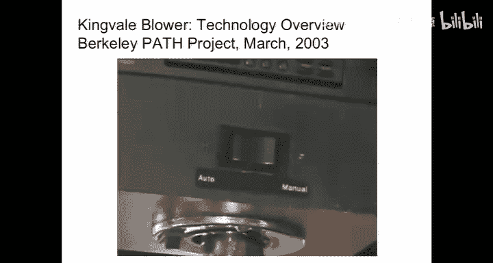
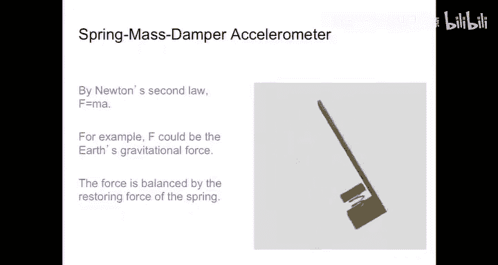
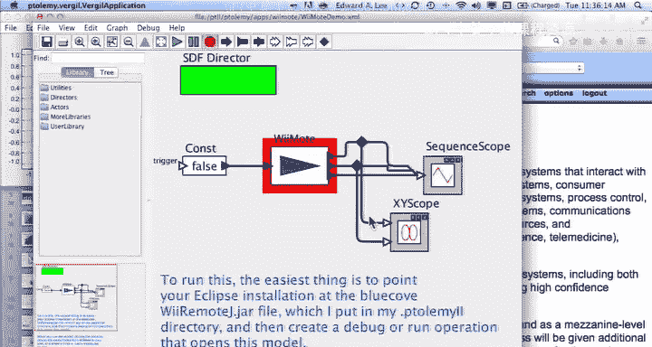
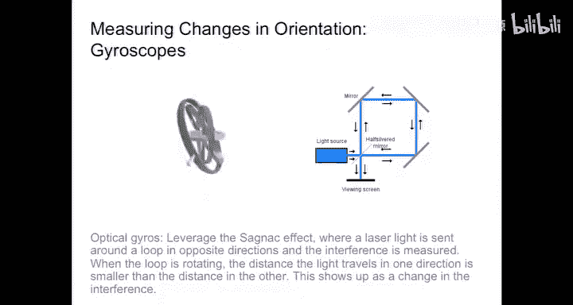
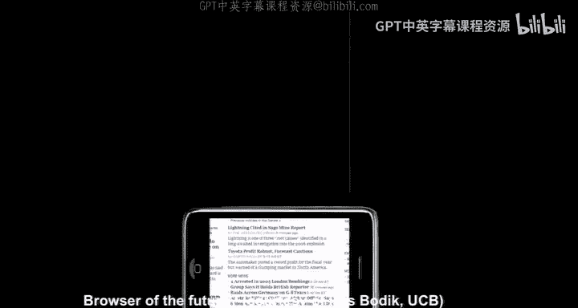
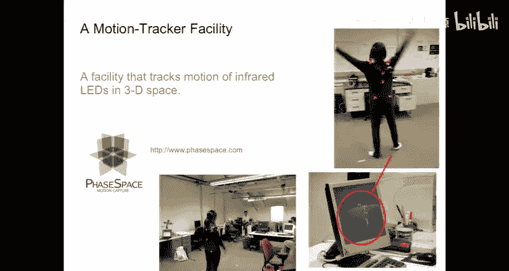

# 02：传感器与执行器

在本节课中，我们将学习嵌入式系统如何通过传感器和执行器连接计算世界与物理世界。我们将探讨不同类型的传感器工作原理、如何为它们建模，以及如何驱动执行器。课程将包含核心概念的公式化描述，并确保内容简单易懂。

---

## 传感器：连接物理世界

上一节我们介绍了嵌入式系统的基本概念，本节中我们来看看系统如何感知物理世界。传感器是将物理量（如温度、压力、运动）转换为电信号的设备。

以下是几种常见的传感器类型及其工作原理：

*   **磁力计**：利用**霍尔效应**。当电流流过处于磁场中的导体板时，电子会因磁场作用发生偏转，从而在板的上下两侧产生可测量的电压差。公式表示为：`V_H = (I * B) / (n * e * d)`，其中 `V_H` 是霍尔电压，`I` 是电流，`B` 是磁感应强度，`n` 是电荷载流子密度，`e` 是电子电荷，`d` 是导体厚度。
*   **加速度计**：核心是一个弹簧-质量块系统。固定框架与被测物体相连，质量块通过弹簧与框架连接。加速度会导致质量块与框架间的距离变化，通过测量该距离（通常通过测量电容变化实现）即可获得加速度值。其动态遵循牛顿第二定律：`F = m * a`。
*   **陀螺仪**：用于测量角速度或方向变化。机械陀螺仪利用高速旋转转子的定轴性。现代微机电系统陀螺仪则可能使用光学（如萨格纳克效应）或其他原理来检测旋转。

---

## 传感器建模与挑战

理解了传感器的基础后，我们需要为其建立数学模型，以预测其行为并设计可靠系统。建模有助于理解传感器的局限性和误差来源。

以下是使用传感器时需要考虑的几个关键问题：

*   **方向与重力**：加速度计无法区分线性加速度和重力加速度分量。设备倾斜时，重力会在测量轴上产生分量，导致读数偏差。
*   **积分误差（航位推算）**：通过积分加速度来估算位置和速度时，任何微小的测量偏差都会随时间累积，导致误差呈二次增长。位置 `x(t)` 可通过双重积分得到：`x(t) = x0 + ∫(v0 + ∫ a(t) dt) dt`。
*   **动态范围与灵敏度**：传感器需要能够测量预期范围内的信号，同时对小信号足够敏感。例如，安全气囊中的加速度计需要检测剧烈的碰撞加速度。
*   **采样与混叠**：以过低频率对连续信号采样会导致高频信号被错误地呈现为低频信号。根据奈奎斯特采样定理，采样频率必须至少是信号最高频率的两倍。
*   **噪声**：所有传感器输出都包含噪声，需要进行信号调理（如滤波）以获得可用数据。

---

## 执行器：施加影响于物理世界

传感器让我们感知世界，执行器则让我们改变世界。执行器将电信号（通常来自处理器）转换为物理动作，如运动、发光或发声。

驱动执行器，尤其是电机等大功率设备时，需要特别注意功率接口，因为微控制器引脚只能提供很小的电流。

以下是驱动执行器（以直流电机为例）的要点：

*   **功率需求**：直接连接大功率负载（如电机、LED）到微控制器引脚会损坏芯片，必须使用外部驱动电路（如晶体管、电机驱动模块）。
*   **脉宽调制控制**：对于电机等惯性负载，无需复杂的线性功率放大器。使用**脉宽调制**（PWM）是高效且简单的控制方法。通过快速开关电压，并改变**占空比**（高电平时间比例），可以控制电机的平均电压和速度。占空比公式为：`D = T_on / (T_on + T_off)`。
*   **电机模型**：直流电机的行为可以用一组方程描述：
    1.  电气方程（基于基尔霍夫电压定律）：`V = R*i + L*(di/dt) + K_e*ω`
    2.  机械方程（基于牛顿第二定律旋转形式）：`J*(dω/dt) = K_t*i - B*ω - τ_load`
    其中，`V`是电压，`i`是电流，`R`是电阻，`L`是电感，`K_e`是反电动势常数，`ω`是角速度，`J`是转动惯量，`K_t`是转矩常数，`B`是阻尼系数，`τ_load`是负载转矩。

---

## 视觉与其他传感方式

除了上述传感器，摄像头提供了丰富的环境信息。机器视觉不一定要模仿人类视觉的矩形视场，可以针对特定任务进行优化。

例如，运动捕捉系统使用布置在空间中的多个特殊摄像头，追踪物体上的红外反光标记点。这些摄像头的像素排列并非用于生成给人看的图像，而是为了精确计算标记点在三维空间中的位置，效率极高。

---

## 总结

本节课中我们一起学习了嵌入式系统中传感器与执行器的核心知识。我们了解了传感器（如磁力计、加速度计）如何将物理量转换为电信号，以及为其建立模型的重要性。我们探讨了使用传感器时的挑战，如重力干扰、积分误差和混叠。我们还学习了如何驱动执行器，特别是使用PWM高效控制电机的方法，并介绍了其数学模型。最后，我们看到了像运动捕捉系统这样非传统、任务优化的传感方式。掌握这些原理是设计可靠、高效的嵌入式与信息物理系统的基础。