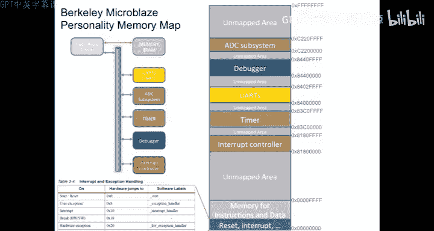
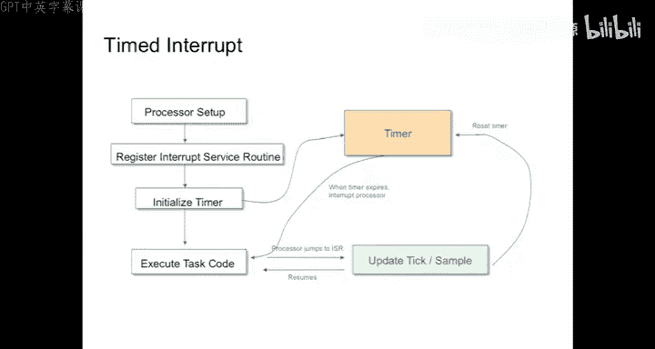

# 05：中断机制


在本节课中，我们将要学习嵌入式系统中的中断机制。中断是处理器处理并发事件的核心技术，它允许处理器在执行主程序的同时，响应外部硬件事件。我们将探讨中断的工作原理、如何设置中断服务程序，以及在使用中断时需要注意的并发问题。

上一节我们介绍了基本的I/O轮询方法，本节中我们来看看如何利用中断机制更高效地处理I/O。

## 中断的基本概念

中断本质上是一种低级的并发机制，存在于所有现代处理器中。它允许处理器在执行主程序时，被外部事件（如引脚电压变化）打断，转而去执行一个特定的短程序（中断服务程序），执行完毕后再返回原程序继续执行。

**核心流程**可以用以下伪代码描述：
```
主程序执行中...
外部事件发生 -> 触发中断
处理器保存当前程序计数器(PC)和寄存器状态
处理器跳转到中断向量表指定的地址（即中断服务程序入口）
执行中断服务程序(ISR)
执行“从中断返回”指令
处理器恢复之前保存的PC和寄存器状态
主程序从被打断处继续执行
```

## 轮询与中断的对比

在深入中断细节之前，我们先回顾一下轮询策略。在安全性要求极高的系统（如飞机飞控系统）中，为了获得确定性的行为，通常会禁用中断和线程，采用单线程轮询的方式。

以下是轮询方式的典型代码结构：
```c
int main() {
    // 初始化设置
    setup();
    while(1) {
        // 主循环，不断查询各个设备状态
        if (device1_ready()) handle_device1();
        if (device2_ready()) handle_device2();
        // ... 查询更多设备
    }
}
```
轮询的优点是行为确定、可控，但缺点是效率低下，因为CPU大部分时间都在检查那些“未就绪”的设备。

中断则解决了效率问题。当硬件设备就绪时，它会主动通知CPU，CPU可以在此期间处理其他任务。

## 中断的硬件机制

要理解中断，需要了解其在硬件层面的工作原理。不同的处理器架构其中断机制略有不同，但核心思想相似。




以8位AVR微控制器（如Arduino所用）为例，其内存起始部分有一个“中断向量表”。

```
内存地址     用途
0x0000      复位向量 (Reset)
0x0002      外部中断0向量 (IRQ0)
0x0004      外部中断1向量 (IRQ1)
...
```
当发生对应中断（如IRQ0引脚电压变化）时，硬件会自动将程序计数器(PC)设置为对应向量地址（如0x0002）。因此，程序员需要在该地址处放置一条跳转指令，指向实际的中断服务程序。

在32位处理器（如MicroBlaze或ARM）上，原理类似，但地址空间更大，通常可以直接在向量表中存放中断服务程序的入口地址。



**关键点**：中断发生时，硬件通常只做最小化工作（如保存PC），而保存和恢复通用寄存器的工作，通常由编译器在生成中断服务程序代码时自动添加。

## 使用定时器控制时间


在C语言中，我们无法直接控制指令执行的时间。为了进行时间相关的操作（如定时执行任务），我们需要借助一个称为“定时器”的外部硬件外设。

其工作流程如下：
1.  通过内存映射寄存器配置定时器，设定一个时间间隔（如16毫秒）。
2.  启动定时器，硬件开始独立于CPU进行倒计时。
3.  CPU继续执行主程序。
4.  当设定的时间到达时，定时器硬件会触发一个中断。
5.  CPU暂停当前任务，执行与该中断关联的服务程序。
6.  在中断服务程序中执行预定的定时任务。

## 实战：设置中断服务程序

在实践中，我们通常使用厂商提供的库函数或宏来设置中断，但这些代码背后仍然是操作内存映射寄存器。理解其本质至关重要。

以下是一个在AVR上设置1毫秒定时器中断的“魔法代码”示例：
```c
#include <avr/io.h>
// 配置定时器1，产生1ms周期中断
TCCR1A = 0x00;
OCR1A = 71;
TIMSK1 = (1 << OCIE1A);
```
这些看似神秘的标识符（如`TCCR1A`）实际上是通过头文件宏定义，最终被展开为对特定内存地址的写入操作。例如，`TCCR1A = 0x00;`可能被展开为：
```c
*((volatile uint8_t *)0x80) = 0x00;
```
这行代码的含义是：向内存地址`0x80`（这是一个控制定时器的寄存器）写入值`0x00`。

## 并发编程的陷阱与volatile关键字

当主程序和中断服务程序共享变量时，就构成了一个简单的并发程序。这会引入复杂性和潜在的错误。

考虑以下有缺陷的代码，它试图利用中断实现一个2秒的延时：
```c
volatile uint32_t timer_count = 0; // 声明为volatile

void ISR() { // 中断服务程序，每毫秒触发一次
    if (timer_count > 0) {
        timer_count--;
    }
}

int main() {
    // ... 初始化中断，设置为1ms触发一次ISR
    timer_count = 2000; // 等待2000毫秒，即2秒
    while(timer_count != 0) {
        // 执行一些操作
    }
    // 2秒后继续...
}
```
这段代码存在一个严重的竞态条件漏洞。如果`timer_count`的当前值为1，而中断恰好在主程序检查`while(timer_count != 0)`之后、但在它读取`timer_count`值之前发生，中断服务程序会将`timer_count`减为0。但主程序已经判断条件为真（非零），并进入循环体。更糟糕的是，如果`timer_count`是无符号整数，从中断返回后，主程序可能执行`timer_count--`，导致其下溢变成一个非常大的数，从而使循环远远超过2秒。

**`volatile`关键字的作用**：它告诉编译器，这个变量的值可能会被程序本身之外的代理（如中断服务程序）改变。因此，编译器不能对这个变量进行优化（例如，将其值缓存到寄存器中），每次访问都必须从内存中重新读取。在上面的例子中，如果没有`volatile`，编译器可能会认为`timer_count`在循环中不会改变，从而将循环优化成死循环。

使用中断时还需注意：
*   **中断服务程序应尽量短小**，以减少对主程序时序的干扰。
*   **注意中断嵌套**：高优先级中断能否打断低优先级中断服务程序，取决于处理器配置。
*   **共享数据访问**：对共享变量的读写可能不是原子的（例如，32位赋值在8位处理器上需要多个周期），中断可能发生在中间状态，导致数据不一致。

## 总结


本节课中我们一起学习了嵌入式系统的中断机制。我们了解到中断是一种强大的并发处理工具，能有效提高CPU利用率，但它也引入了非确定性和复杂的并发问题，使得程序调试和验证变得困难。我们探讨了中断的硬件原理、如何通过定时器进行时间控制、如何设置中断服务程序，并重点分析了并发编程中常见的陷阱，如竞态条件和`volatile`关键字的重要性。记住，对于安全关键系统，往往需要避免使用中断以获得完全的确定性。理解这些底层机制，将为我们后续学习更高级的并发模型和系统分析打下坚实基础。