# 09：扩展与定时自动机

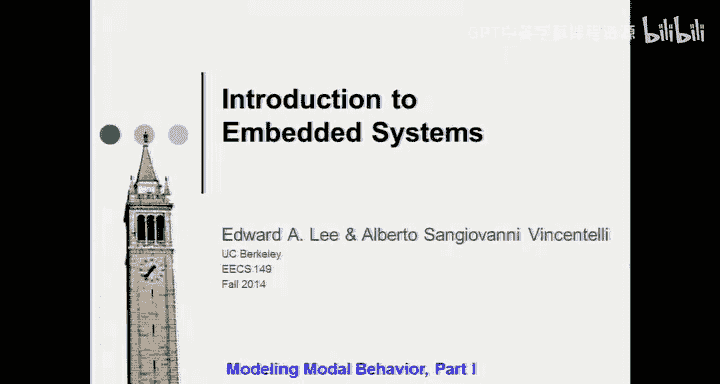

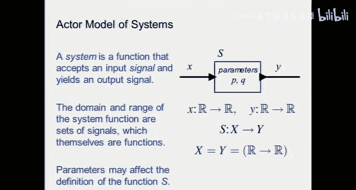

在本节课中，我们将开始讨论离散行为模型，特别是将深入探讨一种在各类应用中广泛使用的行为数学模型——有限状态机。

## 概述：什么是有限状态机？

有限状态机是一种描述系统行为的数学模型。例如，您手机屏幕的控制、自动售货机在您投入硬币并弹出商品时的逻辑，本质上都是由有限状态机控制的。接下来，我们将了解其工作原理及其构成。

## 系统与执行器模型

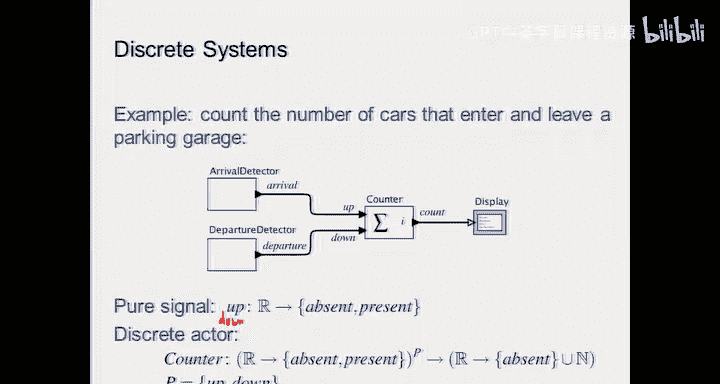

在深入有限状态机之前，我们先回顾一下执行器的通用定义。一个执行器是一个数学对象。首先，系统是一个函数，它接受一个输入信号并产生一个输出信号。因此，系统的定义域和值域都是信号集合，而信号本身也是函数。这是一种从函数到函数的系统行为功能视图。

为什么采用这种模型？因为它处理起来更方便，尤其是在涉及系统组合时。在这些功能模型中，可以有描述输入信号与输出信号之间可能关系的参数。例如，一个放大器根据其放大倍数会产生不同的输出，这个倍数就是一个参数。

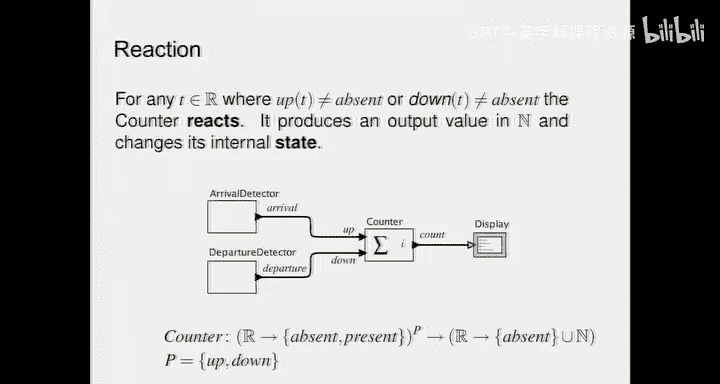

数学上，系统 `S` 的模型可以表示为：`S: X -> Y`，其中 `X` 和 `Y` 都是函数空间。

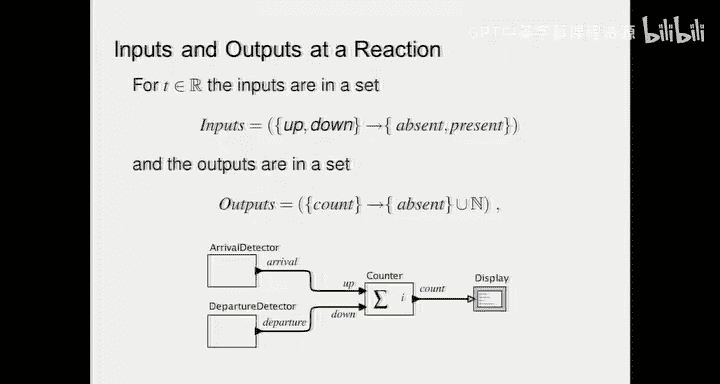

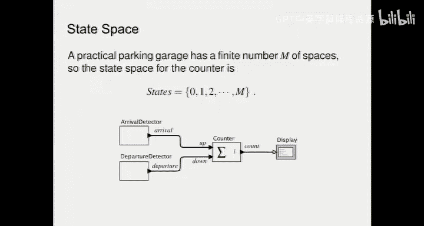

## 离散系统与信号

离散系统处理的是离散信号。离散信号的直观概念是，其值不是连续的，而是从一个值跳变到下一个值。通常，我们习惯于认为离散信号具有有限个取值级别，但这并非必需。离散的关键在于，在任意两点之间没有无限多个值。

因此，一个离散模型就是将离散信号映射为离散信号。

### 示例：车库计数器

我们将使用一个贯穿课程的示例：车库计数器。它的作用是跟踪车库中剩余的车位数量。例如，在机场停车场，你会看到数字“22”，表示该区域有22个空位；如果显示红色标志，则表示没有空位。

这个模型包含两个检测器：一个检测车辆到达，输出“到达”信号；另一个检测车辆离开，输出“离开”信号。那么，“到达”信号需要携带什么信息呢？我们不需要一个实数，只需要知道是否有车到达。同样，“离开”信号也只需要知道是否有车离开。这种只有“存在”或“不存在”两种状态的信号被称为**纯信号**。纯信号可以用布尔代数编码（例如，0表示不存在，1表示存在），但其语义核心是事件的发生与否。

因此，“到达”和“离开”都是纯信号，其值域为集合 `{缺席, 存在}`。计数器则对这两个信号进行代数求和：当“到达”信号出现时，计数值加一；当“离开”信号出现时，计数值减一。我们关心的是剩余车位数量，其输出是自然数集合 `{0, 1, 2, ...}` 中的一个值，表示已被占用的车位数量。

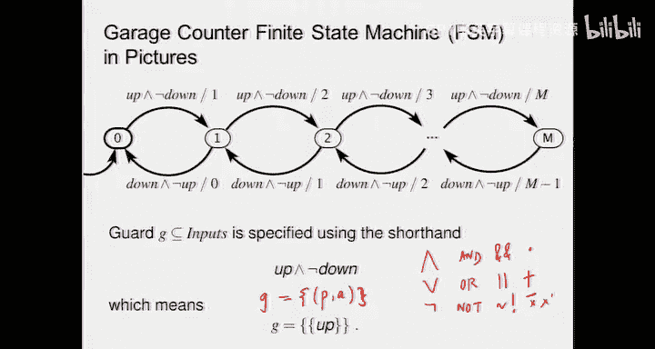

## 反应的概念

反应是一个直观概念：系统接收到输入后，会做出反应。大多数嵌入式系统都是反应式系统。它们存在于环境中，当环境产生某些事件时，系统会做出反应。例如，汽车的防抱死制动系统在您踩下刹车踏板时就会做出反应。

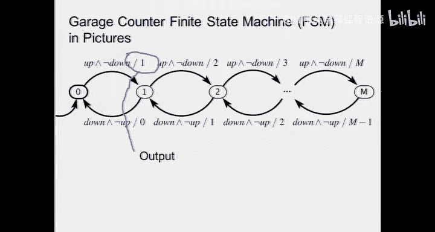

当一个系统反应时，它会做两件事：
1.  改变其内部状态。
2.  产生一些输出。

在车库计数器的例子中，可能的输出是显示剩余或已占用的车位数量。状态的改变描述了系统行为模式的变化，而输出是独立的信息。在数学模型中，我们需要同时提供状态信息和输出信息。

## 有限状态机的形式化定义

现在，我们可以将上述数学模型编码为有限状态机的形式化定义。

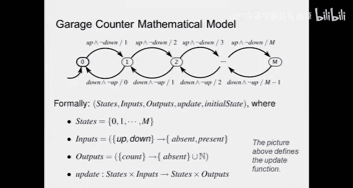

有限状态机由以下部分组成：
*   **状态集合 (Q)**: 一个有限的、非空的集合。在车库例子中，状态可以是 `{0, 1, 2, ..., n}`，表示已占用的车位数量。
*   **输入字母表 (Σ)**: 所有可能输入事件的集合。在我们的例子中，是“到达”和“离开”信号的所有可能组合。
*   **输出字母表 (Ω)**: 所有可能输出值的集合。在我们的例子中，是自然数集合。
*   **转移函数 (δ)**: 定义了在给定当前状态和输入条件下，系统将转移到哪个下一个状态。其形式为 `δ: Q × Σ -> Q`。
*   **输出函数 (λ)**: 定义了在给定当前状态和输入条件下，系统将产生什么输出。其形式为 `λ: Q × Σ -> Ω`。
*   **初始状态 (q₀)**: 系统开始运行时的状态。在我们的例子中，初始状态是 `0`（车库为空）。

状态本质上是系统过去所有历史信息的摘要。要预测系统未来的行为，只需要知道当前状态和未来的输入，而不需要知道过去的所有细节。

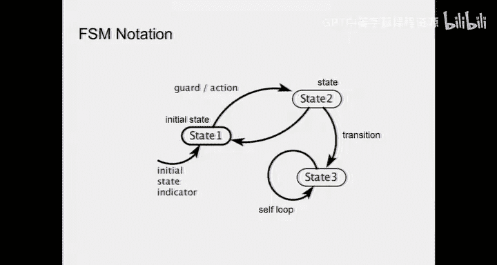

## 图形化表示：状态图

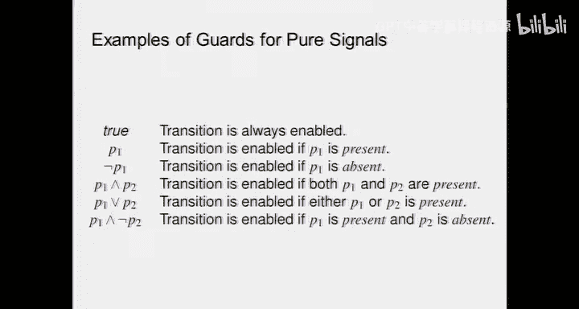

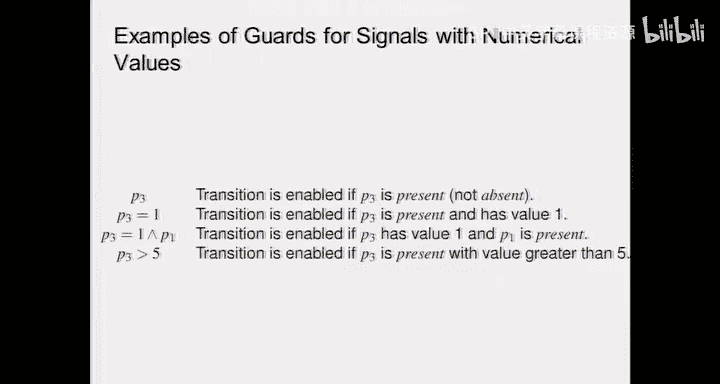

有限状态机通常用**状态图**来表示。状态图中的节点代表状态，弧线代表状态之间的转移。

每个转移弧线上通常有两个标签，格式为 `守卫 / 动作`：
*   **守卫**: 一个逻辑条件，指定在什么输入条件下可以发生此转移。
*   **动作**: 转移发生时产生的输出。

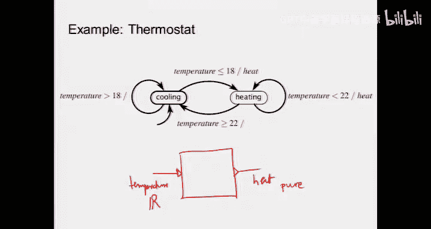

在车库计数器的例子中，从状态 `0`（无车）转移到状态 `1`（有一辆车）的条件是：有“到达”信号且没有“离开”信号。我们可以将其守卫写为 `up ∧ ¬down`。同时，输出动作就是新的状态值 `1`。

### 自循环与完整性

如果“到达”和“离开”信号同时发生，则计数值不变，系统应保持在当前状态。这可以通过一个指向自身的转移弧线（自循环）来表示，其守卫为 `up ∧ down`，动作为保持当前计数值。

如果一个状态对于某些输入组合没有明确的转移定义，那么这个状态机就是**不完整的**。有时，设计者会故意忽略某些“永远不会发生”的输入组合，这为系统优化提供了自由度。但在安全关键系统中，确保状态机的完整性非常重要。

### 初始状态

初始状态必须明确指定，否则无法确定系统的起始行为。这类似于求解微分方程需要初始条件。在现实中，系统重启（如电脑蓝屏后重启）就是将系统重置到一个已知的初始状态。

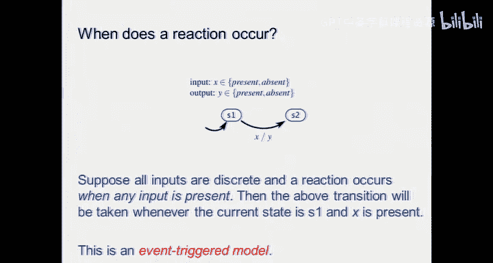

## 输出语义：摩尔机与米利机

关于输出，有两种主要的有限状态机模型：
*   **摩尔机**: 输出仅与当前状态有关。在状态图中，输出可以标在状态节点内部。
*   **米利机**: 输出与当前状态和当前输入都有关系。在状态图中，输出标在转移弧线上。

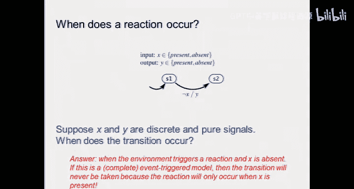

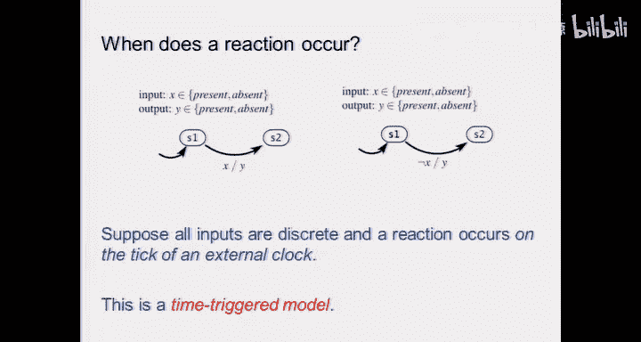

在车库计数器的例子中，如果我们将输出（显示的数字）视为与状态（当前车辆数）一致，那么它就更像一个摩尔机。但在其他系统中，输出可能独立于状态编码，此时米利机模型更合适。

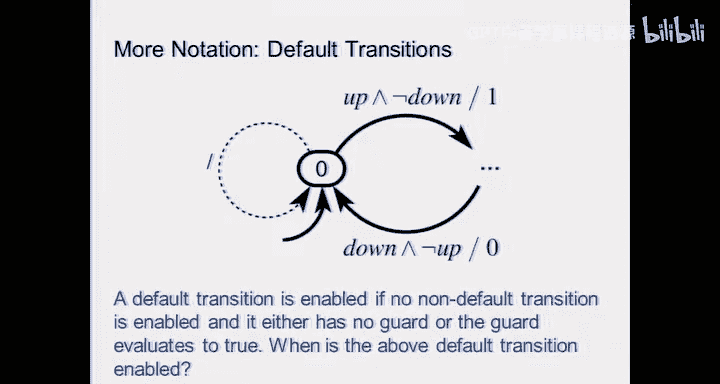

## 守卫与动作的扩展

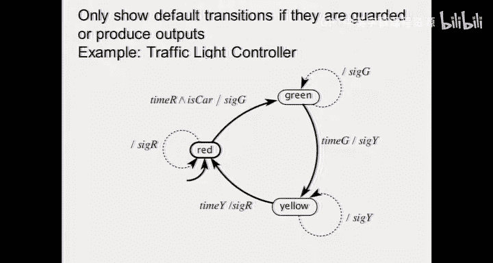

守卫可以是基于纯信号（布尔值）的逻辑表达式，例如：
*   `true`: 转移总是被允许（无条件转移）。
*   `p1`: 当信号 `p1` 存在时允许转移。
*   `p1 ∧ p2`: 当信号 `p1` 和 `p2` 同时存在时允许转移。
*   `p1 ∨ p2`: 当信号 `p1` 或 `p2` 存在时允许转移。

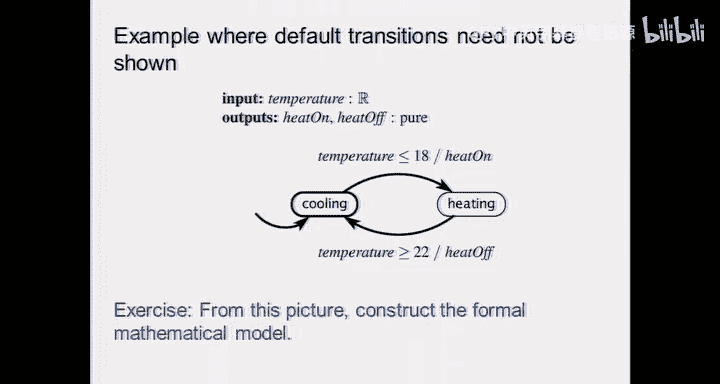

守卫也可以基于具有数值的信号：
*   `p3 = 1`: 当信号 `p3` 存在且其值等于1时允许转移。
*   `p3 > 5`: 当信号 `p3` 存在且其值大于5时允许转移。

### 示例：恒温器

一个经典的例子是恒温器。它有两个状态：“制冷”和“制热”。
*   在“制冷”状态，只要温度 `T > 18°C`，就保持制冷（自循环）。当 `T ≤ 18°C` 时，转移到“制热”状态。
*   在“制热”状态，只要温度 `T < 22°C`，就保持制热（自循环）。当 `T ≥ 22°C` 时，转移到“制冷”状态。

这种设置（18°C 和 22°C 之间的死区）是为了防止在阈值附近频繁切换，导致系统“振荡”。

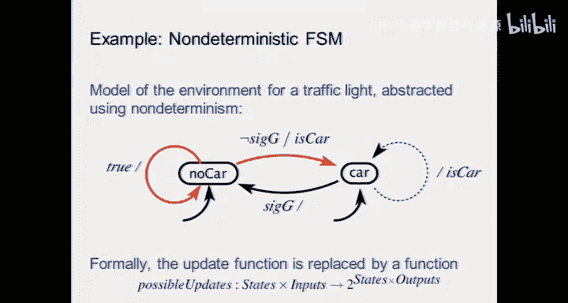

## 事件触发与时间触发

有限状态机的反应可以由两种机制触发：
*   **事件触发**: 当输入事件发生时，系统立即反应。这是最直观、反应最快的方式。但是，如果多个事件几乎同时发生，可能导致竞争条件或未定义行为（例如，汽车空调的升温和降温按钮被同时按下）。
*   **时间触发**: 系统只在特定的时间点（例如，时钟滴答声）检查输入并做出反应。这更安全，因为可以处理在同一个时间周期内发生的多个事件，但可能不够及时，且会消耗更多功耗（即使没有事件发生，系统也会被周期性唤醒）。

现实世界本质上是异步和事件驱动的。为了实现同步（时间触发）行为，我们通常引入一个**时钟**作为参考，强制系统在规整的时间点上同步反应。这是一种实现技巧，而非模型本身固有的概念。

## 确定性、非确定性与行为

*   **确定性有限状态机**: 对于给定的当前状态和输入，下一个状态和输出是唯一确定的。
*   **非确定性有限状态机**: 对于给定的当前状态和输入，可能存在多个可能的下一个状态和/或输出。

非确定性可以用于：
1.  **建模未知环境**: 表示我们对环境行为的不完全了解（例如，其他司机的行为）。
2.  **表示设计自由度**: 表示我们尚未在多个可行的实现方案中做出决定。

非确定性状态机通常更紧凑，但分析起来更复杂（需要检查所有可能的行为路径）。著名的**子集构造法**可以将非确定性有限状态机转换为确定性有限状态机，但可能导致状态数量指数级增长。

### 行为、轨迹与计算树

*   **行为**: 系统可能执行的一系列非终止步骤。
*   **轨迹**: 对一个特定行为的记录，包含了每一步的状态、输入和输出值（类似于飞机的黑匣子数据）。
*   **计算树**: 一个图形，展示了从初始状态开始，所有可能的输入序列所导致的所有可能行为路径。它本质上是将有限状态机“展开”成一个（可能是无限的）树状结构。

有限状态机的强大之处在于，它能用一个有限的模型（状态和转移规则）来编码潜在的无限多种行为。

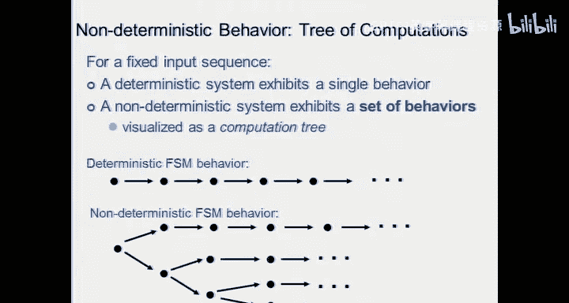

## 有限状态机的应用：验证

有限状态机是形式化验证的强大工具，特别是用于检查**安全属性**。
*   **安全属性**: 断言“某些坏事永远不会发生”。例如，系统永远不会进入“发动机爆炸”或“飞机坠毁”这样的坏状态。通过**可达性分析**，我们可以检查从初始状态出发，是否可能到达这些坏状态。
*   **活性属性**: 断言“某些好事最终会发生”。例如，系统总是能够回到空闲状态。验证活性属性通常比验证安全性更复杂。

在设计安全关键系统时，控制器可以被设计为主动防止系统进入可能导致灾难性后果的状态。

## 概率模型与混合系统

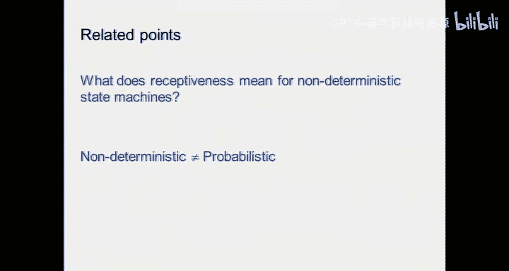

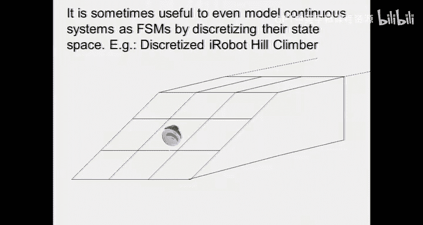

*   **概率有限状态机**: 与非确定性不同，概率状态机为每个转移分配了一个概率。它描述的是我们对其统计特性有了解的随机过程（例如，投掷硬币），而不是完全未知的不确定性。
*   **混合系统**: 许多实际系统（如汽车发动机控制器）同时包含离散逻辑（何时点火、喷油）和连续动态（活塞运动、温度变化）。有限状态机可以用来对这类系统中的离散控制部分进行建模，与连续动力学模型相结合。

## 总结

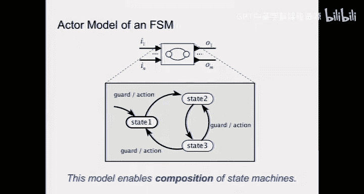

本节课我们一起学习了有限状态机这一核心的离散行为建模工具。我们了解了其基本组成部分（状态、输入、输出、转移函数、输出函数），掌握了其图形化表示方法（状态图），并区分了摩尔机和米利机。我们还探讨了事件触发与时间触发的区别，以及确定性、非确定性和概率模型的含义。最后，我们看到了有限状态机在系统规范、环境建模以及形式化验证（特别是安全属性验证）中的强大应用。有限状态机虽然不能建模所有系统，但在其适用范围内，它是一个极其强大和实用的工具。