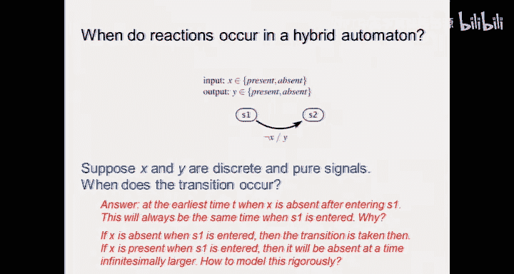

# 10：状态机的组合与扩展

在本节课中，我们将继续探讨有限状态机，并扩展其基本模型，使其能在更广泛的场景下应用。我们将介绍扩展有限状态机，并深入探讨一个在过去十年中备受关注的主题——混合系统。

## 从基本状态机到扩展状态机

上一节我们介绍了基本的有限状态机模型。本节中，我们来看看如何扩展这个模型，使其能表示更复杂的系统。

基本有限状态机由状态、转换、守卫条件和动作组成。其输出通常是纯信号（如0或1）。然而，许多实际系统需要输出更复杂的数据，例如整数或实数。

以下是扩展有限状态机的一个核心概念：**输出可以是变量**。这意味着输出不再局限于有限的信号集，而可以取自然数、实数等值。

例如，一个简单的车库计数器模型。基本模型需要为每个可能的车辆数（0到M）设置一个状态，这非常繁琐。扩展模型可以简化为一个单一状态，并引入一个计数变量 `count`。

**代码示例：车库计数器扩展模型**
```plaintext
状态: 空闲
转换:
  - 守卫: car_enters
    动作: count = count + 1; 输出(count)
  - 守卫: car_leaves AND count > 0
    动作: count = count - 1; 输出(count)
```

这个模型的状态空间看似只有一个，但实际上包含了变量 `count` 的所有可能取值，其本质与多状态模型等价，但表示上更简洁。

## 混合系统简介

扩展状态机引入了连续变量，这自然引出了混合系统的概念。混合系统结合了离散的动态（有限状态机）和连续的动力（微分方程）。

混合系统在以下场景中非常有用：
*   **数字控制器与物理对象**：例如机器人撞墙后改变运动模式。
*   **恒温器**：当连续变化的温度达到阈值时，控制器触发离散动作。
*   **汽车引擎控制**：引擎的运转周期（吸气、压缩、爆炸、排气）是离散状态，而曲轴转速、油门位置是连续变量。

混合系统的核心在于：**连续变量的演化达到某个阈值时，会触发离散状态的跳转**。每个离散状态（或称“模式”）下，系统都遵循一组特定的微分方程进行连续演化，这个状态保持不变的区域称为**不变集**。

## 实际应用案例：汽车引擎建模

让我们通过一个具体例子来理解混合系统的建模过程。考虑汽车引擎的控制。

引擎的每个气缸工作周期包含四个离散阶段：
1.  吸气
2.  压缩
3.  膨胀（做功）
4.  排气

决定阶段转换的触发器是活塞到达上止点或下止点，而这由曲轴（驱动轴）的连续旋转位置决定。因此，这是一个典型的混合系统：**连续运动（曲轴角度）守卫着离散状态（气缸阶段）的转换**。

此外，控制变量如点火正时（火花提前或延迟）也可以建模为离散决策，这会在状态机中增加额外的路径。

**建模过程总结**：
1.  **识别关键物理现象**：如气缸四冲程、曲轴运动。
2.  **抽象不必要的细节**：忽略燃烧室内复杂的流体动力学，关注宏观阶段和扭矩输出。
3.  **定义离散状态**：如四个冲程阶段，以及点火提前/延迟决策。
4.  **建立连续动力学**：如驱动轴旋转方程、进气歧管压力变化。
5.  **定义守卫条件**：如“当曲轴角度 == 上止点时，从压缩阶段转换到膨胀阶段”。

这种建模方法比传统的平均值模型精确得多，又比求解全部物理方程（如偏微分方程）简单可行，是实现高性能引擎控制的基础。

## 时间自动机：一种特殊的混合系统

在所有混合系统中，有一类特别简单且理论性质良好，称为**时间自动机**。

在时间自动机中，唯一的连续动力学是时间的流逝，通常表示为 `ẋ = 1`（即时间导数恒为1）。一个典型的例子是交通灯控制器中的计时器，或者鼠标的双击检测（判断两次点击的时间间隔）。

**时间自动机的重要性**在于，尽管它包含连续变量（时间），但可以被自动转换为一个等价的有限状态机。这意味着关于它的许多性质（如“系统是否总能达到绿灯状态？”）是可判定的，这为形式化验证提供了便利。

相比之下，包含一般微分方程的混合系统，其验证问题通常是非常困难甚至不可判定的。

## 反应触发与时间触发

理解系统何时对输入做出反应至关重要，这引出了两种语义：

*   **事件触发**：在纯（扩展）有限状态机中，当任何输入守卫条件变为真时，立即发生转换。这是**反应式**语义。
*   **时间触发**：当模型中引入了计时器或时钟变量（如 `count` 或 `ẋ=1`）时，转换通常由时间条件（如 `count >= 60`）守卫。系统在特定的时间点检查条件并做出反应。

在交通灯例子中，即使有行人按钮按下，系统也会等到当前计时周期结束（如60秒）时才检查条件并决定是否转换，这就是时间触发。

## 总结与课程项目启示

本节课中我们一起学习了：
1.  **扩展有限状态机**：通过引入输出变量，使模型能更简洁地表示计数器等系统。
2.  **混合系统**：结合离散状态机和连续微分方程，用于建模机器人、汽车引擎等物理信息融合系统。
3.  **时间自动机**：以时间流逝为连续动力的特殊混合系统，具有较好的理论性质。
4.  **建模思想**：从复杂物理过程中提取关键离散模式和连续变量，抽象掉无关细节，建立可用于控制和验证的数学模型。




这引出了我们课程项目的核心方法论：**给定一套传感器、执行器和计算平台（如Arduino），你需要为一个自选的应用完成从物理问题到数学模型，再到实现和验证的完整设计流程**。这正是嵌入式系统设计的精髓所在。