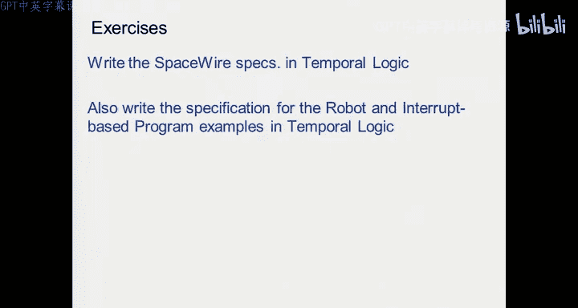
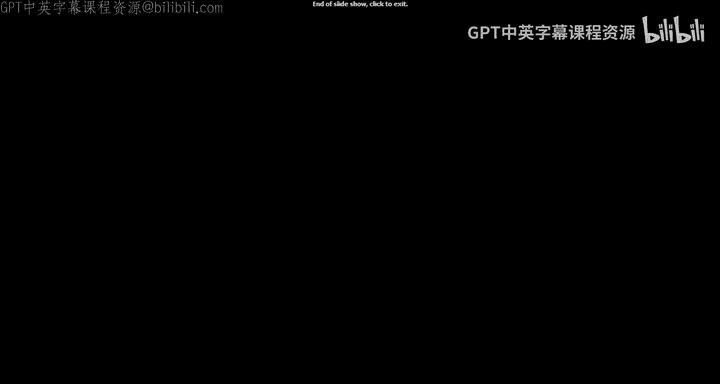

# 12：设计规范与形式化方法 🧠

在本节课中，我们将要学习如何精确地定义和规范一个设计。许多人认为设计的难点在于实现，但实际上，最困难的部分是清晰地说明你想要什么，以及设计应该做什么。这不仅是技术问题，也涉及到巨大的商业利益。

## 设计规范的重要性 💡

一个设计是正确的，当且仅当它满足其规范。一个没有规范的设计无法被判断对错，因为你没有比较的依据。仅仅运行几个测试，然后说“看起来不错”是不够的。

许多嵌入式系统被部署在安全关键系统中，例如汽车、飞机和医疗设备。这些系统的软件和硬件必须可靠，不能有缺陷。一个著名的例子是达芬奇手术机器人，其设计的精确性至关重要。另一个例子是心脏起搏器，如果其软件存在缺陷，可能会对患者造成严重伤害。

## 什么是规范？📝

规范是对设计目标的数学化陈述。它需要非常精确，以便进行验证。验证问题就是检查你的设计是否满足用于建立属性的数学公式。

控制器综合是另一个相关的主题。理想情况下，如果我们能根据规范自动构建出满足所有要求的系统，那将是最佳情况。这就是控制器综合的目标。

## 模型与验证 🔍

我们之前讨论过基于模型的设计，即从一个模型开始，然后推导出设计的其余部分。在设计阶段，我们希望验证这个闭环系统是否满足需求。这可以通过自动化的方式实现，即控制器综合，或者通过运行计算机程序来检查设计是否满足要求。

验证策略有多种，其中最常用的是仿真。然而，仿真只能覆盖有限的测试用例，无法保证在所有可能情况下的正确性。因此，人们非常感兴趣进行形式化验证，这是一种自动检查所有可能情况的方法。

为了实现形式化验证，我们需要一种形式化的方式来编写模型和需求，以便算法能够处理。这就是形式化验证代码。

## 安全属性与时间逻辑 ⏳

在设计时，我们可能希望断言某些“坏状态”永远不会被达到。例如，心脏永远不应进入纤颤状态。这种属性被称为安全属性。

为了表达这种涉及系统演化的属性，我们需要时间逻辑。命题逻辑是静态的，不涉及时间演化。时间逻辑，由以色列计算机科学家Amir Pnueli在1977年提出，正是为了断言设计的时序属性而发明的。

时间逻辑有两个基本概念：“始终”和“最终”。例如，“始终不进入坏状态”和“最终进入一个好状态”。

## 线性时间逻辑（LTL）基础 🧮

LTL建立在原子命题之上，例如：
*   `x`：信号x存在。
*   `x = 1`：信号x存在且其值为1。
*   `S`：机器处于状态S。

在这些原子命题上，我们可以使用逻辑运算符（与、或、非、蕴含）和时序运算符来构建更复杂的公式。

LTL的核心时序运算符包括：
*   **G (Globally)**： 公式`G φ`表示属性φ在轨迹的每一个状态（及其所有后缀）中都为真。用于表达安全属性，例如`G (¬bad)`表示永远不进入坏状态。
*   **F (Finally/Future)**： 公式`F φ`表示属性φ在轨迹的某个未来状态中最终会为真。用于表达活性属性，例如`F good`表示最终会进入好状态。
*   **X (Next)**： 公式`X φ`表示在下一个状态中，属性φ为真。
*   **U (Until)**： 公式`φ1 U φ2`表示属性φ1一直为真，直到属性φ2变为真。之后φ1可以为真或假。

一个状态机满足一个LTL公式，当且仅当该状态机的**所有**可能执行轨迹都满足该公式。

## 规范的挑战与未来方向 🚀

即使我们有了强大的形式化工具，仍然面临挑战：
1.  **规范的正确性**： 我们如何确保我们写下的规范本身是正确的、反映了真实需求？规范本身可能存在不一致性。
2.  **规范的完备性**： 我们如何确保没有遗漏任何重要的需求？这被称为需求工程中最困难的问题之一。

未来的研究方向包括：
*   **从系统轨迹推断时间逻辑**： 给定一个被认为是正确的系统，能否自动推断出它所满足的所有时间逻辑属性？
*   **从自然语言提取规范**： 大多数工程师使用自然语言（如Word文档）写规范。能否开发工具，从受限的自然语言模式中自动生成形式化规范？这被称为基于模式的规范捕获或规范挖掘。

## 总结 📚

本节课我们一起学习了设计规范的核心重要性。我们了解到，精确的、数学化的规范是验证设计正确性的基础。我们介绍了线性时间逻辑（LTL），这是一种用于描述系统时序行为的强大形式化语言，其核心运算符包括G（始终）、F（最终）、X（下一个）和U（直到）。最后，我们探讨了在创建和验证规范时面临的挑战，以及该领域未来的研究方向。记住，清晰、可测量的规范是任何成功设计的第一步。