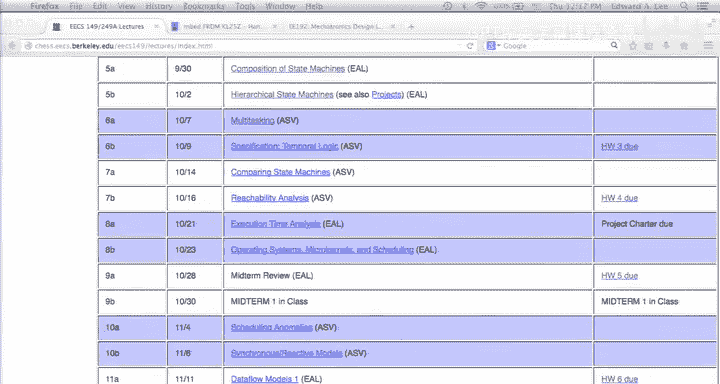
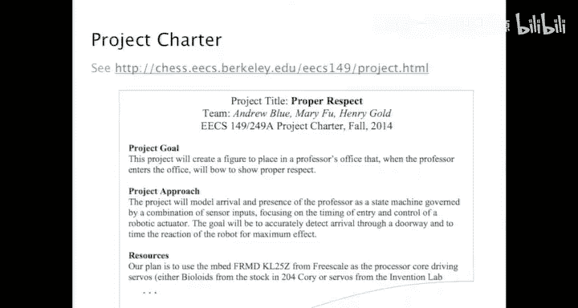

# 16：多任务处理

## 概述
在本节课中，我们将学习如何使用状态机形式化地分析嵌入式系统中的决策逻辑，特别是通过组合和层次化状态机来建模复杂的并发行为，例如中断处理。我们将通过一个具体的C代码示例，探讨如何构建模型并利用形式化方法验证程序属性。

## 状态机与形式化分析
状态机为我们提供了一种形式化决策逻辑的方法，特别是离散的、顺序的决策过程。我们可以用它来描述相当复杂的行为。

然而，当我们手动使用状态机时，它们有时看起来并不易于处理。我们之前看到的例子都过于简化，未能完全反映现实情况的复杂性，这在使用气泡和弧线图时可能导致难以处理的复杂度。

为了手动处理更复杂的逻辑，我们为状态机添加了一些符号。例如，扩展状态机使我们能够在状态机中操作变量值。此外，状态机的并发组合允许我们将两个相对简单的状态机同步或异步地组合起来。组合本身定义的状态机可能比两个独立组件复杂得多。这是一个通用的工程原则：将复杂系统分解为简单组件。这并没有消除复杂系统中的复杂性，只是使其更易于理解。

但状态机的真正价值在于，如果你有一个良好的形式化状态机模型，那么它就适用于机械化分析。这才是其真正价值所在。当然，它对我们有限的大脑尝试理解系统也很有价值。仅仅尝试为某个系统构建状态机描述就能给你带来很多洞见。因此，它对人类认知部分是有价值的，但因为它可以接受自动化工具的分析而更具价值，这些工具可以揭示你未预料到的行为，例如用于检查安全条件。

今天我将尝试说明这一点，并且为了手动演示，我不得不再次过度简化状态机，但希望它能让你了解如何利用状态机进行自动化分析。

## 状态机组合回顾
首先，我们回顾一下同步组合。这是一个非常简单的例子：两个没有输入的状态机。在我们的状态机形式主义中，一个关键原则是状态机本身不决定何时反应。状态机对何时反应没有说明，环境选择状态机何时反应。当你组合状态机时，环境选择组合何时反应。然后你可以选择组合反应意味着什么，但环境将选择组合何时反应。

如果你选择同步组合，那么两个机器会同时且瞬时地反应。这样做时，它们实际上表现得像另一个状态机，一个单一的状态机。反应是同时且瞬时的。它会将你从初始状态 S1 S3（即这个初始状态）带到下一个状态 S2 S4，一步完成，瞬时发生，并产生输出 B。然后在下一个反应中，当你在状态 S2 S4 时，你将瞬时回到初始状态。

当你进行状态机组合时，首先要做的是尝试理解组合的状态空间。获得组合状态空间的一种暴力方法是直接形成乘积空间。每个状态机都有一定数量的状态。在这个例子中，这些不是扩展状态机，所以状态数量与气泡数量匹配。但如果是扩展状态机，则不一定。无论如何，每个状态机都有一定数量的状态。如果你有两个状态机，一个有一定数量的状态，另一个也有一定数量的状态，那么组合机器的总可能状态空间就是这两个状态空间的乘积。在这个例子中，这里的两个状态和那里的两个状态给了我们四个状态。

顺便说一下，仅仅形成乘积空间就说明了为什么这是一个强大的方法，因为你可以用状态不多的状态机来描述具有许多可能状态的复杂系统。这就是工程价值的所在，能够模块化系统。

在这个例子中，乘积空间有四个状态，但其中两个状态是不可达的。从初始状态没有路径到达它们。那么它们是否在状态空间中？某种程度上是，但也不完全是。事实上，我们稍后会讨论状态机等价的概念。我这里描述的是一个四状态的状态机，只是碰巧有两个状态不可达。但这个状态机在很强的意义上等价于一个不包含这些状态的两状态状态机。我们可以形式化这个等价概念，事实上我们也会这样做。形式化这个等价概念非常有用，因为你可以确定在简化系统时是否改变了其行为。

## 异步组合
如果我们取相同的两个状态机，并使用异步组合来组合它们，那么我们有一些选择，因为“异步组合”这个短语本身不足以告诉我们两个机器反应意味着什么。

如果我为异步组合选择交错语义，那么组合的一次反应包括：首先，非确定性地选择两个机器中的一个，让该机器反应。然后在下一个反应中，我非确定性地选择两个机器中的一个并让它反应。这就是异步组合的交错语义的含义。

由此产生的组合本身就是一个状态机，同样有四个状态。但在这种情况下，它们都是可达的，并且产生的组合是一个非确定性机器，在每个状态中有不止一个可能的反应。

## 应用于嵌入式软件问题
现在，让我们看看是否可以将这种组合机制应用于嵌入式软件中的一个实际问题。

还记得我们在讨论中断服务例程以及如何控制程序中的时序时，看过这段代码。想法是，我想写一个程序，先做某事两秒钟，然后再做别的事。这可能是一个初始化阶段，你的程序应该发出令人愉快的声音两秒钟，让每个人都感到高兴，然后继续执行之后可能令人讨厌的事情。无论是什么，你打算做某事两秒钟，然后继续。

那么问题是，这段代码正确吗？提出正确性问题的一种方式是：你是否确实能到达这两秒循环之后的代码点？我甚至不担心是否恰好花费两秒钟，只问是否能到达那里。如果我能证明存在某种方式使我无法到达那里，那么无论时序如何，我都清楚地发现了程序中的一个错误。

那么，我们能否使用状态机来分析这个问题？这将是关键问题。当然，这是一个C程序。根据冯·诺依曼计算模型，C程序是作为状态机执行的。在冯·诺依曼模型下，你的计算机从一个初始状态开始，即内存的内容。然后你的指令集架构有一组操作来转换内存（这里的内存包括寄存器和所有东西，所有机器的可能状态，机器中的所有内存）。每条指令改变状态。

现在，状态的数量是巨大的。如果你有两GB内存，两GB是160亿比特。所以这台机器主内存的状态有2的很多次方个，状态非常多。因此，你不会想用气泡和弧线图来表示这台机器的状态，这行不通。

所以我们必须以某种方式抽象这个程序的功能。一种有用的抽象程序的方法是只关注流程控制。执行如何通过程序中的指令序列进行？我们可以识别程序中的关键点。例如，我标识了一个位置 D，就在分支之前，和一个位置 E，就在分支之后。类似地，while语句也是一个分支，所以我有一个位置 A，就在进入while循环之前；位置 B，当我开始while循环体时；以及位置 C，这是我最终感兴趣的：我是否能到达C。这将是我要问的问题。

如果我说这些是程序中所有有趣的点，那么我能否使用状态机明确地回答这个问题？我想再次强调“形式化”这个词，因为非正式的做法是你挠挠头，看看这个程序，想出所有可能的执行线程，形成对程序如何工作的理解，然后得出结论。问题在于，对于非平凡的系统（这是一个相当平凡的系统，所以你也许可以遍历所有可能性，但即使这样，你也很可能错过一些），但对于更复杂的系统，我保证你会错过一些。你肯定会错过一些。因此，形式化机制意味着我们实际上可以进行穷举搜索。你可以一次性研究所有可能的执行，这就是该方法的威力。

## 构建状态机模型
让我们尝试将状态机应用于这个模型。这是两个部分的状态机：一个主程序和一个中断服务例程。在良好的工程实践中，我想模块化这个程序，我将用状态机描述这两个组件中的每一个。

我可以这样做。顺便说一下，有很多选择。构建这些模型是一门艺术，尽管你也可以机械化地构建这些模型。但是对这个程序进行机械化分析的结果将是一个大得多的状态机，我们不会想手动查看它，因为它会让你不知所措，你会想自动查看它。但是当你手动构建这些东西时，你选择一些抽象。这里是一个可能的选择。

对于主程序，我们假设在到达A之前没有有趣的事情发生，所以我们称其为初始状态。它是一个扩展状态机，我们有一个计时器计数变量，在进入初始状态时初始化为值2000。然后我们是否去B？如果计时器计数非零，我们就去B。在B之后我们做什么？我们总是返回A。这是B唯一能做的事情，因为这是一个while循环。所以B之后，我只是回到A。当我在A时，如果计时器计数为0，我将转到C。这是一个对相当简单的代码片段很好的状态机抽象。

现在看看中断服务例程。一个好问题是：B和A之间的移动何时发生？请记住，在我们的状态机形式主义中，你的状态机不能选择何时反应。所以这是一个我们必须解决的关键问题：这个东西何时会反应？以及我们将如何协调这两个状态机的反应？我们将进行同步组合、异步组合还是其他什么？对于单个状态机，实际上C程序也没有说明。C程序没有说明你何时从while循环的末尾再次进行测试。在这个模型中没有任何说明。进入这个代码块，然后让我的机器暂停，出去吃午饭，回来后再启动时钟并回到while循环，这是这个C程序完全有效的执行。C程序只说明了要执行的操作序列，没有说明何时应该执行它们。所以我们的形式主义具有与C代码相同的属性，即形式主义没有说明何时进行转换，它只是说如果你在状态B并且机器反应，那么它将转到A。

另一个问题是：如果我们在B并且计时器计数达到零，它会转到C吗？答案是否定的，在形式主义中肯定不会，因为那里没有转换，在C代码中也不会。这个模型是C代码的一个好模型，因为B是程序执行的状态，实际上是在我甚至进入这个代码块之前。所以一旦我决定进入这个代码块，我就在B。在那一刻，如果计时器计数变为零，什么也不会发生，我将执行这个代码体，直到我回去再次进行测试。C不是这样工作的，有些编程语言是这样工作的。特别是，如果我用SL写这个程序，我可以说，在监视这个计时器计数的同时执行这个。如果在这个执行期间计时器计数变为零，我可以中止这个执行并进入下一步。但这不是C的语义。C只在这个while循环的开始测试这个计时器计数，并在执行这个代码体期间忽略其值。在执行这个代码体结束时，它回到开始并再次执行测试。这正是我们的模型所说的。在执行那个代码体结束时，我们回到开始并再次执行测试。

所以问题之一是，当我把这些箭头放在这里说这是我们在代码中的位置时，我到底是什么意思？这可能有点棘手，但A的意思是我即将进行测试，以决定是执行代码体还是跳到下一个执行。然后B是我已经做出了决定，现在我将执行这个代码体。是的，如果你无限期地暂停这个代码体的执行，你的计时器中断仍然可能触发。这个模型本身，这个较低的状态机，没有说明会发生什么。因为到目前为止它不包括中断服务例程。但实际上，C程序也没有真正说明会发生什么。无限期地暂停这个并让中断服务例程继续执行，是C程序完全有效的执行。

在我们的形式主义中，转换只描述了我们在这个状态时在一次反应中做什么。实际上，这种表示法没有直接提供任何方式来说“如果我在这个状态，那么我不在当前反应中，但在未来的某个反应中，我想去C”。我们唯一能说的方式是通过一个中间状态。从B到A的转换没有守卫条件，在我们的表示法中，这只是守卫条件始终为真的布尔值的简写。所以如果你在状态B并且机器反应，这个转换将触发，我们将从B移动到A。没有问题，没有需要测试的东西。这些都是好问题，因为在这种表示法中有很多任意性。但任何形式化表示法中都有很多任意性。因此，为了使用一种表示法，你必须习惯它。你不能说它是错的，除非它自身不一致。所有一致的形式化表示法都是同样正确的。形式化意味着没有意义。最有用的形式化表示法不仅是正确的，而且是有用的。希望这个表示法既正确又有用。它确实有一些任意的决定，你必须习惯它才能使用它。

## 中断服务例程的状态机
好的，我希望现在每个人都理解了第一个状态机。现在，我们来看看中断服务例程的状态机。中断服务例程比主程序稍微奇怪一些，因为在主程序中，我可以明确定义一个初始状态在位置A。但对于中断服务例程，我不能真的这样做，因为当这个东西启动时，中断服务例程可能甚至不在任何地方，我不在D，也不在E。因为中断还没有被触发。所以我需要添加一个额外的状态，一个空闲状态，它只是表示我根本不在中断服务例程中。现在我需要定义一个外部输入assert，这是一个纯输入。每当提供这个外部输入时，这个中断服务例程就会转到D。然后当它在D时，它将测试计时器计数，如果计时器计数非零，它将转到E；否则，它将转换回空闲状态并发出输出return。如果它转到E，那么它将在下一次反应中无条件地递减计时器计数，发出输出return，并返回到空闲状态。

每个人都理解描述ISR的这个状态机吗？那么我应该如何组合这些？我应该使用同步组合来组合它们吗？我看到几个人摇头，为什么不行？它们不是同步的，所以那会非常奇怪，实际上会是一个不正确的行为模型。因为那会说，假设我的初始状态是空闲逗号A。然后当组合反应时，两个机器必须同时且瞬时地反应。所以如果我在输入处得到一个assert，我将转换到D，并根据计时器计数的值转换到B或C。但这不是C程序所做的。

那么异步组合是正确的做法吗？如果是，应该使用哪种变体？我应该使用交错语义吗？可能基于同样的理由，我不使用同步组合的同样原因表明，如果我要进行异步组合，最好使用交错语义。我不希望这两个机器同时反应。那么问题变得更简单：异步交错语义是组合这两个状态机的正确方式吗？是的，但有一个问题。如果我选择交错异步语义，那么我可以在B和D处断言中断服务例程，然后在下一个反应中，选择继续执行我的主程序，即使我仍然在中断服务例程中。这不是中断的工作方式。主程序在中段服务例程返回之前不会恢复执行。实际上，如果我强行构造描述这两个状态机的非确定性交错异步组合的状态机，它就在这里。这个状态机具有在实践中不会发生的状态转换。例如，它显示我可以从A D转到B D。这是在这个组合中允许的转换，但C程序不会这样做。

所以我们有点卡住了。我们有两个漂亮简单的状态机，而我们到目前为止提出的所有组合机制都失败了。我不知道如何组合这些。

## 层次化状态机
所以让我们选择一种新的组合语义：层次化状态机。为了做到这一点，我将不得不提出一些描述中断控制器如何工作的描述。必须有一些逻辑来管理这两个状态机如何相互交互。我必须捕捉到，如果中断服务例程开始执行，它将执行到完成。我可以捕捉关于中断服务例程的更多细节，从而开始回答Josh提出的问题：禁用中断到底意味着什么？例如，我可以有硬件，如果在我正在处理中断服务例程时发生断言，那么我会记录该断言已经发生，然后在那个服务例程返回后稍后处理它。我可以在状态机中捕捉这种行为。但这是硬件的描述，这不是C程序的描述，甚至不是指令集架构的描述。它是微处理器和计时器的特定实现的描述。

我可以这样做，但我会使用一个更简单的中断服务例程，因为使用那个四状态中断处理程序会导致PowerPoint图上有太多状态，而且你最好进行机械化分析而不是人工分析，所以我将进一步简化。

在这样做之前，让我解释一下层次化状态机。同样，在这种表示法中有很多任意性。这种风格的层次化状态机最初由David Harel在1987年引入，他称之为状态图。事实证明，他最初的状态图论文并不是真正的形式主义。有很多歧义，实际上，人们误解了他的论文，并提出了许多不同实现的状态图，所有这些都有不同的语义。有一次，我读了一篇论文，它分类了大约28种不同的层次化状态机语义变体，这些变体实际上被人们在各种上下文中使用，而且它们都不同。所以如果你想做任何事情，你必须选择一个。我将给你一个。它是形式化的，因为如果我给你一个状态机，它的行为和可能的行为集是完全定义的。

层次化意味着什么？首先，我们可能将一个细化与一个状态关联起来。在这个例子中，我有一个两状态的状态机，状态A和B。B有一个细化，它本身是一个两状态的状态机。解释这一点的方式是：如果我在状态B，我实际上在C或D中。但只能是其中一个，不能同时是两者。在Harel的表示法中，他称之为或状态，称B为或状态，因为它不是一个真正的状态，它是一个占位符，表示处于几个其他状态之一。

那么，这里的状态空间有多大？这个状态机有多少个状态？实际上是三个或四个，取决于语义中的另一个微妙之处。让我给你一个提示，然后我们再回来讨论。当我从B转换到A时，我可能记得我在C D中的位置。当我回到B时，我可能从我离开的地方继续。如果我离开B时在D，那么如果我下次返回B，如果我仍然在D，那么这个状态机实际上有四个状态。另一方面，如果我每次进入B都去C，那么这个状态机只有三个状态。David Harel也引入了这个概念，他谈到转换可以是历史转换或非历史转换。历史转换实际上让你能够非常紧凑地描述极其复杂的行为，但状态数量可能变得非常大。

现在，我们必须定义这个层次化机器反应意味着什么。根据层次化状态机的定义，一次反应包括：首先，细化反应，然后顶层机器反应。尽管它们是顺序的，但它们发生在同一次反应中，所以你将它们视为同时发生，同时且瞬时。但你仍然必须一个接一个地做。这几乎像是一个矛盾，但从外部视图来看，这意味着什么？例如，假设我在状态B，机器反应，并且守卫G1和G4都启用。那么会发生什么？首先细化反应，我从C到D，并产生输出A4。然后高层状态机反应，从B到A，并产生输出A1。这里重要的是，A1和A4是由这个状态机同时产生的。它们都在这一次反应中出现在输出上。

这是一个可能的反应序列。这是一个跟踪，一种记录可能反应的方式。我们从状态A开始，如果G2启用，我们将产生输出A2并转换到状态C。如果在下一个反应中G4启用，我们将产生A4并转换到D。如果在下一个反应中G1启用，那么我们将产生A1并转换到A。等等，我让细化反应了吗？在这个转换中，我实际上做了，我在状态D，细化反应了，但没有从D出发的转换被启用，所以它的反应是停滞，它只是停留在原地。然后高层状态机反应。然后我可能回到D。这是一个历史转换还是非历史转换？这是一个历史转换，我去了D。所以我记得我在哪里。所以现在一旦我在D，如果G3和G1都启用，那么我的反应将是同时产生A1和A3并转换到A。我下次进入B时会进入哪里？进入C，因为我采取了从D到C的转换。想想这个转换，当我从D到A时，我现在在状态A。如果我的下一个转换把我带回B，我应该去哪里？我需要记住去哪里，我必须要么去C要么去D。如果是历史转换，我将去……实际上，无论如何，它都会去C，但在这两种情况下，任何时候我从A到B，如果我有一个历史转换，我必须记住我离开的地方。所以仅仅知道你在A是不够的。如果你只知道你在状态A，你缺少一块状态信息，所以我会通过实际回答这个问题的方式来更明确地说明这一点。顺便说一下，每当你有一个状态机的组合，并且你想确切地知道它的含义时，总是将其转换为一个单一的扁平有限状态机。那个单一的扁平有限状态机就是该组合含义的定义。

## 扁平化状态机
这是这个状态机的一个扁平化版本。这应该也能回答Josh的问题。我最初从A C开始。希望这很清楚。然后我可以转换到B C。从B C，我可以转换到B D，或者我可以转换回A C。然而，如果我在B D，因为这是一个历史转换，转换到A C是不正确的。因为如果我在那时转到A C，那么下次我进入B时，我将在C进入而不是D。所以如果我转到A，我必须记住我在细化中的位置。A C表示我在A，如果我将来再次进入我的细化，我应该在C进入。而这个状态表示我在A，如果我将来某个时候进入我的细化，我应该去D。必须记住你需要从哪里继续的问题必须在状态机中捕捉，因为它是状态信息。

所以如果我有更多状态在这里，那么我系统中的状态总数将是那个状态数和细化中状态数的乘积。假设我在细化中有四个状态，这里有四个。那么这个东西会爆炸到16个状态；如果是八个和八个，它会爆炸到256个状态。因此，你可以非常紧凑地表达非常复杂的行为。

这里的表示方式解释是：我在状态A，下次我进入B时，我应该在C进入。记住，状态是关于过去的一切，我需要这些信息才能前进到未来。这就是拥有状态的含义。

现在，假设我们没有历史转换，而是有一个重置转换。那么我就不再需要记住我离开的地方了。所以扁平化的状态机只需要有一个单一的状态来表示A，我不需要记住我离开的地方。所以如果我在A，如果我将来重新进入B，我将在C重新进入。所以重置转换更紧凑一些。

另外，作为一种符号上的便利，我们允许抢占式转换，David Harel也引入了这些。抢占式转换是指如果守卫启用，我们不允许细化反应。如果守卫启用，我们就排除了这种可能性。确保你理解这个状态机的扁平化版本以及抢占式转换是如何在这个扁平化版本中捕捉的，这将是一个很好的练习。

## 应用层次化状态机
现在让我们应用它。这是我的简化中断控制器。我只想说，如果我的中断不活动，那么我将有一个抢占式转换。所以当这个机器反应时，如果a为真，我将不允许细化反应。相反，我将立即转换到活动状态。在活动状态，当那个细化产生输出return时，我将使用历史转换转换回不活动状态。现在这开始看起来像一个中断了。实际上，我可以插入我的中断代码，看到，是的，这确实是它的行为方式。如果我使这些状态机细化，我可以说，我正在执行主程序，无论我在哪里。如果assert发生，主程序不允许反应，我将只是停留在原地。我将转换到我的中断服务例程，它现在不再需要空闲状态，它有一个初始状态D。注意，这是一个重置转换。当我进入中断服务例程时，我总是进入初始状态。我执行直到产生输出return，此时我将使用历史转换转换回不活动状态，并从这里我离开的地方恢复。

## 形式化分析与验证
现在我们有了一个形式化模型，我可以问一个形式化问题：C是否总是被到达？它没有说明速度，它只是说，如果我查看反应的无限历史，将有无限次反应中assert被断言。实际上，我不确定我是否需要这个约束来回答这个问题，因为如果我只有有限次断言，我不认为这会改变答案。这试图说明的是，我不想检查中断请求从未发生或只发生一次的特殊情况。实际上，这很重要，因为如果中断请求从未发生，计时器计数变量永远不会改变，因此，实际上我永远不会到达C，因为计时器计数永远不会达到零。所以我确实需要那个约束。它说的是，计时器硬件没有故障，它将持续请求中断。这就是那个假设所断言的。

现在我们有形式化模型，我们可以问形式化问题，并且只有一个答案：要么C总是被到达，要么C不是总是被到达。这里没有两个答案，它不再受人类解释的影响。那么答案是什么？如果在每次反应中assert都为真，那么实际上C永远不会被到达。

我想强调这一点，因为如果你在编写嵌入式软件，并且设置一个计时器每两毫秒触发一次，你不会想到这一点。你可能会想，它不会一直断言中断。但实际上，根据系统的定义方式，中断请求是一个输入，你对输入没有控制权。如果你的硬件有固定故障，实际上你的中断请求线一直为真怎么办？实际上，在我们定义的系统中，这是环境的一个有效情况，因为它提供了一个输入assert，只是碰巧一直提供它。但这也可能在C程序的实践中发生。假设这个代码体总是比中断之间的时间长，那么实际上，assert将总是……不，这不完全正确。假设这个代码体总是比中断之间的时间长，所以中断服务例程实际上需要很长时间来完成其动作，长到计时器硬件再次触发。那么它可能发生。但是要再次启用它们，所以如果计时器已经将中断请求线拉高，它可以保持高电平直到得到反应。

所以即使中断被禁用并且这些中断不嵌套，我很高兴你提出了嵌套的问题，因为如果你允许嵌套中断，这个层次化状态机可以被扁平化。现在，对于扁平化的状态机，我可以进行穷举搜索。我可以查看所有可能的行为，并找到一个从未到达C的跟踪。那个跟踪被称为反例。它证明了我关于这个程序最终会到达C的断言是不正确的。根据程序的定义方式，这就是你可以进行的那种分析。

如果你允许嵌套中断，那么你有一个更困难的分析问题，因为状态机现在变成无限的了。如果你考虑它在C中的工作方式，实际上，在C的逻辑中，它是无限的，因为每次中断发生时，一堆东西被压入堆栈，你进入中断服务例程，如果允许嵌套中断，当你在那个中断服务例程中时，如果发生中断，你将更多东西压入堆栈。你的堆栈无限增长，那是无限状态。所以那个分析问题变得困难得多。

## 总结
在本节课中，我们一起学习了如何使用状态机对嵌入式系统中的并发行为进行形式化建模和分析。我们回顾了同步和异步组合，并引入了层次化状态机来解决传统组合方式无法准确建模的问题（如中断处理）。通过一个具体的C程序示例，我们构建了主程序和中断服务例程的状态机模型，并利用层次化状态机（包含抢占式转换和历史转换）将它们组合起来。最后，我们展示了如何通过形式化分析（如状态空间探索）来验证程序属性（例如“代码点C是否总能到达”），并发现了一个反例，说明在特定环境行为下程序可能无法达到预期状态。这凸显了形式化方法在发现潜在错误和确保系统正确性方面的价值。