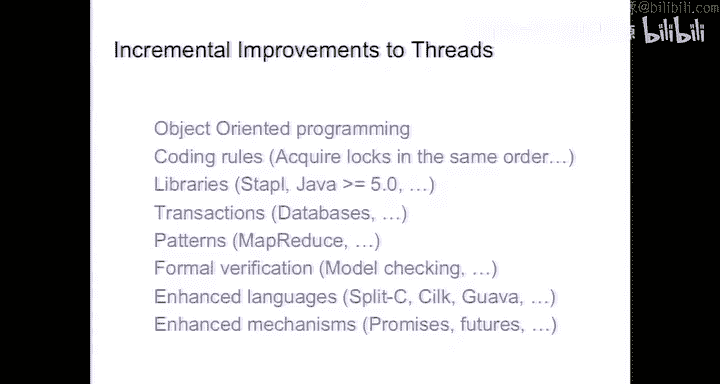

# 16：操作系统、微内核与调度 🖥️

在本节课中，我们将学习操作系统、微内核以及任务调度的基本概念。我们将探讨多任务处理的原理、其潜在问题，以及如何通过线程和互斥锁等机制来管理并发。课程内容将涵盖从底层中断机制到高级线程库（如Pthreads）的各个方面，并分析多线程编程中常见的陷阱和解决方案。

---

## 多任务处理与并发

上一节我们介绍了嵌入式系统的基本架构，本节中我们来看看多任务处理。多任务处理是指系统能够同时处理多个任务的能力。在计算机中，这通常通过并发机制实现。

并发是指逻辑上同时执行多个任务，无论它们是否在物理上同时执行。如果任务在物理上同时执行，我们称之为并行。在嵌入式系统中，并发通常通过中断机制实现，这是一种低级的并发方式。


---

## 操作系统与微内核

从底层中断机制向上抽象，操作系统或微内核提供了更高级的并发模型。微内核是一种轻量级的操作系统，通常不具备文件系统等完整功能，但能够提供任务调度和并发管理。

微内核的主要目标是在资源受限的嵌入式系统中提供高效的并发支持。它通过管理线程和调度任务，使得多个任务能够在单个处理器上交替执行。

---

## 线程与进程

在讨论并发模型之前，我们需要区分线程和进程。进程是操作系统分配资源的基本单位，每个进程拥有独立的内存空间。线程是进程内的执行单元，多个线程共享同一进程的内存空间。

在嵌入式系统中，微内核通常直接管理线程，而不提供内存保护机制。这意味着所有线程都可以访问系统的全部内存，这增加了灵活性的同时也带来了风险。

---

## Pthreads 线程库

Pthreads（POSIX线程）是一种跨平台的线程库，广泛应用于Unix、Linux、OSX和Windows系统。它提供了一套标准的API，用于创建和管理线程。

以下是使用Pthreads创建线程的基本步骤：

1. **定义线程函数**：线程函数是线程执行的具体任务。
2. **创建线程**：使用`pthread_create`函数创建线程。
3. **等待线程结束**：使用`pthread_join`函数等待线程执行完毕。

以下是一个简单的示例代码：

```c
#include <pthread.h>
#include <stdio.h>

void* thread_function(void* arg) {
    int* value = (int*)arg;
    printf("Thread received value: %d\n", *value);
    return NULL;
}

int main() {
    pthread_t thread_id;
    int value = 42;
    pthread_create(&thread_id, NULL, thread_function, &value);
    pthread_join(thread_id, NULL);
    return 0;
}
```

在这个示例中，主线程创建了一个新线程，并传递了一个整数值作为参数。新线程打印该值后结束，主线程通过`pthread_join`等待其结束。

---

## 线程调度与原子操作

线程调度是操作系统的核心功能之一。在单处理器系统中，线程通过交替执行实现并发。线程可以在任何两个原子操作之间被挂起，原子操作是指不可中断的操作。

然而，在C语言中，我们很难确定哪些操作是原子的。这导致线程调度的行为难以预测和控制，从而增加了多线程编程的复杂性。

---

## 多线程编程的陷阱

多线程编程虽然强大，但也存在许多陷阱。以下是常见的问题及其解决方案：

### 1. 竞态条件
竞态条件是指多个线程同时访问共享资源，导致结果依赖于线程执行的顺序。例如，两个线程同时修改同一个变量，可能导致数据不一致。

**解决方案**：使用互斥锁（Mutex）保护共享资源。互斥锁确保同一时间只有一个线程可以访问临界区。

### 2. 死锁
死锁是指多个线程相互等待对方释放资源，导致所有线程无法继续执行。例如，线程A持有锁1并等待锁2，而线程B持有锁2并等待锁1。

**解决方案**：遵循固定的锁获取顺序，避免循环等待。此外，可以使用超时机制或死锁检测算法来预防和解决死锁。

### 3. 数据不一致
数据不一致是指多个线程对共享数据的修改导致系统状态出现矛盾。例如，一个线程更新了数据，但另一个线程读取了旧数据。

**解决方案**：使用同步机制（如条件变量）确保数据的一致性。此外，可以复制共享数据以避免直接修改。

---

## 互斥锁的使用

互斥锁是保护共享资源的基本工具。以下是使用Pthreads互斥锁的示例：

```c
#include <pthread.h>

pthread_mutex_t lock;

void* thread_function(void* arg) {
    pthread_mutex_lock(&lock);
    // 临界区代码
    pthread_mutex_unlock(&lock);
    return NULL;
}

int main() {
    pthread_mutex_init(&lock, NULL);
    pthread_t thread_id;
    pthread_create(&thread_id, NULL, thread_function, NULL);
    pthread_join(thread_id, NULL);
    pthread_mutex_destroy(&lock);
    return 0;
}
```

在这个示例中，互斥锁`lock`用于保护临界区代码，确保同一时间只有一个线程可以执行该代码。

---

## 设计模式与并发

为了简化多线程编程，可以使用一些设计模式。例如，观察者模式（Observer Pattern）用于在对象状态变化时通知所有依赖对象。然而，在多线程环境中实现观察者模式需要特别注意线程安全性。

以下是一个简单的观察者模式实现：

```c
#include <pthread.h>
#include <stdlib.h>

typedef struct Listener {
    void (*notify)(int);
    struct Listener* next;
} Listener;

Listener* head = NULL;
pthread_mutex_t lock;

void add_listener(void (*notify)(int)) {
    pthread_mutex_lock(&lock);
    Listener* new_listener = (Listener*)malloc(sizeof(Listener));
    new_listener->notify = notify;
    new_listener->next = head;
    head = new_listener;
    pthread_mutex_unlock(&lock);
}

void update_value(int new_value) {
    pthread_mutex_lock(&lock);
    // 更新共享变量
    pthread_mutex_unlock(&lock);
    // 通知所有监听器
    Listener* current = head;
    while (current != NULL) {
        current->notify(new_value);
        current = current->next;
    }
}
```


在这个实现中，互斥锁用于保护监听器列表，确保在添加监听器时不会发生竞态条件。然而，通知监听器时释放锁可能导致数据不一致，因此需要进一步优化。

---

## 总结

本节课中我们一起学习了操作系统、微内核和任务调度的基本概念。我们探讨了多任务处理的原理、线程与进程的区别，以及如何使用Pthreads库创建和管理线程。此外，我们还分析了多线程编程中常见的陷阱，如竞态条件、死锁和数据不一致，并介绍了使用互斥锁和设计模式来解决这些问题的方法。



多线程编程虽然复杂，但通过合理的同步机制和设计模式，我们可以编写出高效且可靠的并发程序。在接下来的课程中，我们将进一步探讨更高级的并发模型和嵌入式系统的其他关键主题。