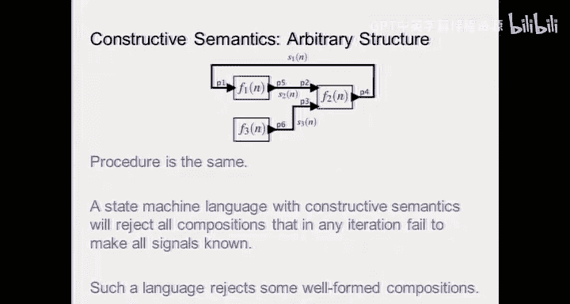

# 19：同步反应模型

在本节课中，我们将要学习同步反应模型。这是一种用于设计和分析嵌入式系统的形式化方法，其核心思想是通过消除不确定性来确保系统行为的可预测性。我们将探讨其历史背景、核心概念、组合方式，特别是如何处理棘手的反馈回路问题。

## 同步反应模型的历史与动机

上一节我们介绍了并发系统组合的挑战，本节中我们来看看同步反应模型如何解决这些问题。

同步反应模型起源于法国的同步语言社区，例如 Esterel、Lustre 和 Signal。其设计动机源于硬件设计领域。在 20 世纪 70 年代，异步电路设计面临竞争条件问题，电路输出可能依赖于数据路径的延迟，导致行为不确定。

为了解决这个问题，硬件设计引入了锁存器和时钟信号。时钟周期性地对电路状态进行采样，只要时钟周期足够长，电路就能在采样前达到稳定状态，从而确保每次计算的结果是确定性的，与数据路径的延迟无关。

法国社区的研究者思考：既然图灵模型的异步性是软件难以编写正确程序的根本原因，为何不将硬件的同步思想应用到软件中？于是，同步反应模型应运而生。其核心原则是：系统的所有组件以锁步方式运行。当输入到达时，系统会“瞬间”查看所有变量的快照，基于此快照决定下一步的计算，然后等待下一个输入。这里的“瞬间”意味着在模型抽象中，时间概念被移除，计算被视为在逻辑时间（或反应索引）上发生的离散步骤。

## 同步系统的核心特征

同步系统的根本特征在于**同步轮次**的概念。一个同步轮次发生在一个反应索引到下一个反应索引之间。

*   在每个反应索引上，系统读取所有输入。
*   在同一反应索引上，系统产生所有输出。
*   计算被视为在反应索引上“瞬时”完成。

考虑一个由模块 A、B、C 组成的同步框图，其中 A 的输出同时作为 B 和 C 的输入。在同步世界中，A 产生输出后，B 和 C 基于此输出“瞬时”计算。无论 B 和 C 的实际计算顺序如何，最终结果都是确定的。这实现了**确定性并发**。相比之下，使用线程的异步模型虽然能加速计算，但会因为交错执行而导致复杂且难以分析的行为。

同步反应语言（如用于铁路控制的 Esterel 和用于航空电子的 Lustre）的优势在于其程序可以通过构造被证明是正确的。当然，这种确定性的代价可能是性能，因为每个反应索引都需要评估所有组件，即使某些组件可能无需工作。

## 有限状态机的同步组合

既然在同步反应模型中一切以锁步进行，使用有限状态机进行建模就显得非常自然。当我们组合多个 FSM 时，需要定义三件事：
1.  各部分的行为。
2.  通信模式（即输入输出变量如何连接）。
3.  通信的含义（即连接代表什么）。

在同步反应模型中，最常用的组合方式是**同步并行组合**。这并非指物理连接上的并行，而是指行为组合的机制。

以下是并行组合的定义：
假设有两个 FSM：M1 和 M2。它们的并行组合 M1 || M2 是一个新的 FSM。
*   **状态集**是 M1 和 M2 状态集的笛卡尔积。
*   **转移**存在于组合状态 `(s1, s2)` 到 `(s1‘, s2’)`，当且仅当在相应输入下，M1 能从 s1 转移到 s1‘，且 M2 能从 s2 转移到 s2’。
*   反应是同时且瞬时的。

考虑一个级联组合的例子：FSM1 接收输入 a，产生输出 b；FSM2 接收输入 b，产生输出 c。
组合系统的状态是 FSM1 和 FSM2 状态的乘积。通过分析所有可能的输入（a 存在或不存在），我们可以推导出组合 FSM 的转移。通常，乘积状态空间很大，但许多状态可能是不可达的，实际分析中可以剔除。

## 反馈回路的挑战与固定点

反馈在控制系统中至关重要，但它也为同步组合带来了独特的挑战。反馈意味着一个组件的输出被用作其自身的输入。

在同步反应模型中，反馈连接施加了一个约束：在同一个反应索引上，反馈路径上的信号值必须满足一个方程。例如，对于一个函数 `F`，其输出被反馈回输入，这就要求存在一个值 `S`，使得 `S = F(S)`。这被称为**固定点方程**。

系统是否有唯一、可确定的行
为，取决于这个方程：
*   **良构**：存在唯一解。
*   **非良构**：无解或多解。

Moore 机和 Mealy 机在处理反馈时表现不同：
*   **Moore 机**：输出仅取决于当前状态。这相当于在反馈路径中引入了一个“延迟”（输出基于上一反应索引的状态），因此通常能保证良构的反馈。
*   **Mealy 机**：输出取决于当前状态**和**当前输入。这意味着输入到输出是“零延迟”的，容易导致固定点方程无解或多解，从而产生非确定性。

为了确定反馈系统是否良构，我们可以使用**构造性**方法（即“研磨机”算法）：
1.  将所有内部信号初始化为“未知”（除了已知的原始输入）。
2.  根据逻辑规则（例如，AND 门的一个输入为 0，则输出必为 0）传播已知值，尽可能地将“未知”替换为确定值（0 或 1）。
3.  重复此过程，直到没有新的值可以被推断出来。
4.  如果最终所有信号都变为确定值，则找到了唯一固定点，系统是构造性的（因而是良构的）。如果仍有信号为“未知”，则构造性方法失败，系统可能非良构（即使数学上可能存在固定点）。

## 构造性语义与编译器

同步反应语言（如 Esterel）的编译器使用构造性语义来分析程序。如果编译器通过构造性方法能找到固定点，它就接受该程序并生成代码。如果方法失败（仍有未知），即使理论上可能存在解，编译器也会拒绝该程序，因为它无法保证生成确定性的实现。

这对于避免电路中的振荡等潜在问题至关重要。一个在纯布尔逻辑分析下有唯一固定点的电路，在实际中可能因为微小延迟而振荡，消耗功率甚至损坏。构造性语义通过要求信号值能被逐步推导出来，排除了这类有问题的设计。

## 总结

本节课中我们一起学习了同步反应模型。我们从其源于硬件设计的历史讲起，理解了它通过锁步执行和逻辑时间消除并发不确定性的核心思想。我们探讨了有限状态机的同步并行组合方式，并深入分析了同步模型中反馈回路带来的独特挑战——即求解固定点方程。最后，我们介绍了使用构造性语义来判断反馈系统是否良构的实用方法，这也是许多同步语言编译器的工作原理。同步模型虽然可能在性能上有所取舍，但它为构建高可信度的确定性并发系统提供了强大的理论基础和实用工具。