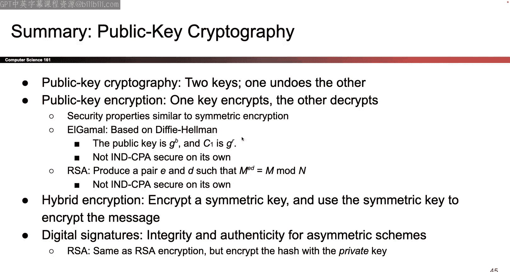

# 011：UCB《计算机安全｜CS 161 Fall 2023 ｜ Computer Security at UC Berkeley》Calude-3.5翻译 p11 -11--CS161 FA23- Lecture 11 - Public-Key Encryption and Digital Signatures.zh_en -BV1YGbceREDs_p11-

I guess one thing I will briefly note before starting like actual lecture stuff is that lecture scope goes up to lecture 12 that is the lecture this Wednesday so this is the end of scope goes all the way up to the end of cryptography after that is we and I know it was like kind of rude to ask you to study for something like two days before the midterm so what we did mention is that these two lectures this week。

And not used to， but like in particular lecture 12 is gonna be pretty lightly tested like on a 100 point exam there's gonna be like two points of questions on this lecture like it' not gonna be a lot。

 it'll be stuff that if you just come to lecture and just watch the content like you'll be okay and part of the reason why we want you to be caught up on cryptography like we discuss this over and over some people voted to keep it out some people voted to keep it in but you're curious one of the reasons why we want everyone to be caught up it' because project two is coming out like any minute now and it relies on this crypto unit so we want to make sure everyone's like caught up before the midterm and not way behind on lecture So in case you're wondering what the scope is the scope is until this Wednesday but we are also promising that lecture 12 is' gonna be pretty lightly tested So like if you just watch the lecture absorb some of the content you will be fine。

Okay， Joes wanted to get that out there， but today is in scope， we have a lecture on it。

 we have a discussion on it homework fortex about stuff in today so today is in scope Wednesday。

 just come to lecture， absorb some information and we will be all saying。Okay。

 that's all I had to get out there， so let's do actual content， okay。

So I guess as half review and half finishing what I rushed through at the very end of last week。

 we talked about Diffy Heman， the idea that two people who do not share a secret can actually share a secret by communicating through an insecure channel which is pretty incredible but the problem with it is that if there is someone in the insecure channel tampering with our messages saying Mallory then Maory could actually take the messages that we send G to the a G to the B replace them with her own malicious secret G to the M where she takes her own secret M and disguises it and she can cause Alice and Bob to both derived secrets that are not only different from each other。

 one of them gets G to the AM， one of them gets G to the BM that's a problem but both of them also drives secrets that Mallory knows which is even worse because Mallory knows G to the A sent by Alice she knows her own M which she can compute G to the AM same thing on the Bobb site Bob sends G to the BM so Mallory sees it Mallory knows her own M so Mallory can compute G to。

So Die Heman is great， but has this fatal flaw against attackers who can tamper with their messages。

I would say there's two ways to look at this problem so one way to look at it is the way that we just saw which is that if someone can tamper with messages。

 then dipiffy helmetman is not secure because the person tampering can cause both sides to get different secrets that is one way to see it another way to frame the exact same problem is to say dipy helmetm doesn't provide authentication this is the same problem that we just saw framed in a slightly different way。

 because if you look at this exchange from earlier。

It really is a legitimate exchange in some sense Alice and Mallory are each sending a secret A&M she's sending GA mallllory is sending GBM and they both agree on GV AM so technically a real legitimate diyhelm and handshake happened between Alice and Mallory and a legitimate difffihelm and handshake happen between Mallory and Bob so another way of looking at the same picture is that mallllory has stood between Alice and Bob and instead of Alice doing a handshake with Bob Alice does a handshake with mallllory Bob does a handshake with mallllory instead so。

Another way to say the same problem is to say when you finish your diffy Heman protocol you successfully exchanged a secret with somebody that's really cool。

 it means that you and the person you're talking to had no shared secret but over an insecure channel you send some disguised G to A G to the B suddenly you have a shared secret but you have no idea who you're talking to there's no guarantee that the other person you're talking to it could be Bob it could be Mallory who stood in front of Bob it could be anybody so another way of saying the same problem it's man in the middle problem is that diffy Heman doesn't tell you who you're talking to all that it says is that you and the other person have exchanged a secret but who's the other person is a Bob Mallory I don't know it's somebody out there there's no guarantees as to who that person is and if you want to guarantee who that person is we have to use something else that will talk about this week okay。

So that's mostly wrapping up from last time one final quick thing I will say about Diffy Heman is that we use the discrete law problem that was our mathematical equivalent of paint separation is hard and we said that if you know G to the A or someone gives you G to the A mod P it's really hard to figure out what the value A is that's one problem that we could use to make this diiffy Heman problem or this key exchange work。

 but it is not the only problem in fact there are lots of different mathematical problems out there that simulate the same process which is that somehow if I give you a secret you can disguise the secret publish the disguised version to the world and someone who sees the disguised version has no idea what the original secret was as long as I have any mathematical function that has the same property I have a secret I can disguise it and now anybody in the real world has no idea what the original secret was any mathematical function that satisfies those same property and gives us that same security guarantee it could also be used to model。

A similar diffyhelman key exchange so there are all sorts of different ones out there you're not responsible for knowing all this fancy magic math behind them。

 but I should just mention that in the real world and most people no longer use the modular think version of Tffyman almost everyone now uses something fancy called elliptic curve diffyhelman and like what the heck is elliptic curve is this really funky function that has this like weird looking curve property I don't even know too much about it。

But the important thing is that this elliptic curveb diffy helmet。

 it serves the same purpose it's some function where given a and G to the A someone cannot figure out or given G to the A someone can't figure out a it serves roughly the same purpose but a nice benefit of elliptic curve is that the problem itself is just harder to solve then the discrete log problem so you can actually use a smaller key and get the same level of resistance again brute force so the amount of time it would take for someone to solve a 384 bit elliptic curve problem is approximately the same as the time it takes for someone to solve a 3000 bit difffi helmetman problem so all that we're saying here is that if you use this you can use smaller key sizes or smaller values of Ga A and B and you still get roughly the same level of resistance against someone trying to do a brute force attack so it's kind of nice you don't have to send gigantic keys you can send smaller keys get the same security all by using this slightly fancier magic math。

Okay。So that was Diffy Heman， we talked about the algorithm。

 we talked about the fact that other or other versions exist like a Li to curve Dffy Heman but we said that there's a problem which is that it's not secure against the man in the middle and equivalent way of saying that is that Diffy Heman doesn't guarantee who you're talking to could be the other person could be a man in the middle you don't know and the final problem that was kind of annoying is that to do this both people have to talk to each other at the same time like if Bob is away you know sleeping or on vacation。

 they can't exchange a shared secret because Alice and Bob both need to be online at the same time to trade their disguise secrets and come up with a shared secret together so this is an online protocol they both have to be here at the same time to exchange Bob cannot be like off vacationing and hope to get a shared key okay。

So those are the problems we're going to solve some of them today。

 we're going to call solve some of them on Wednesday。

 but that's me wrapping up from last time so anything else you want to know about Tiffy Helman before we move past it。

You'reGood， at least until you're Victor， okay。W。Nothing on zoom Okay so this is the actual content for today。

 so today we're talking about the second part of that table so we talked about the summary from last time and today we are moving into this part of the table So where's my table。

Oh no， I want my table， okay。We're moving finally into this part of the table so we finish everything on like the left side we're making great progress we've already talked about if Alice and Bob have a shared symmetric key。

 what are ways in which they can guarantee confidentiality authentication that's all the stuff here and we've taken care of it great we're done。

😊，And now in the second part of this cryptography unit。

 we are now turning our attention to this side， so in this setting Alice and Bob do not have a shared secret so。

They're not going to perform Diffy Heman they could if they wanted to and get a shared secret。

 but in this part we're going talk about protocols where Alice and Bob do not share a secret but they still want confidentiality they still want integrity so we'll talk about how you can do that so that's all of today it's like this asymmetric keyight we're going to talk about protocols that give you confidentiality protocols that give you integrity but for all of today there's no more magic fairy or dipiffy Heman protocol that gives Alice and Bob a shared secret they're on their own okay。

So just wanted to show you that picture okay so back to our task of the day。

 which is Alice and Bob no longer share a secret key that no one else knows So instead we're gonna move to a slightly different model this is called the public key model and so the idea here is that everyone's going to have two keys now instead of one we briefly mention this when we gave you that speed run of all the cryptography definitions but just to remind you one more time the setting now there's no more shared secret so instead the way that we're gonna to do this is everyone's going to have a pair of keys these keys come in pairs so every key has a every public key has a corresponding private key every private key has a corresponding public key。

 these things come in pairs so when I generate a pair I'm going to do two things I'm going to take my private key keep it to myself there's only one person in the universe who knows this private key it's me there's also a public key that comes with this key generation you have two values out and the second value the public key you're going to give that。

To the world so who knows this public key anybody who cares can look it up and figure out what my public key is so private key known only by me it's not shared by two people it's not shared by three people it is only me in the universe public key everyone knows it and these things come in Paris so if I have some private key value it's probably going to come with some public key you always generate these things in Paris okay。

😡，Something else that you're gonna to start seeing a lot in like this lecture。

 especially is that in public key cryptography the math that makes it work is no longer xhors and bit shifting if you think back to symmetric key cryptography like block ciphers and Hms and hashes。

 the things that like underlying operations that made those fast or what they what like xhors and bit shifting things that are really fast on modern computers but today in public key cryptography that's going to switch up so instead of using I don't know bit shifting xhors a lot of today is going to be based on number theories so these are things like modular arithmetic factoring and you'll see these as we go through a bunch of today。

So the things that drive or like make public key crypt work are no longer like bit shifting。

 they' modular arithmetic， there are a lot of things that you saw in CS7 basically， okay。

And because we're dealing with things like modular arithmetic。

 we're also going to switch up one more thing just to make our lives easier。

 it doesn't actually lose any generality or anything like that。

 but just to make our lives a little bit easier for the rest of today we are going to say our messages are numbers So instead of saying something like I want to encrypt a bit sequence 101001 I'm going to say all my messages are like numbers like my message is 33 and I want to encrypt it my message is 750 I don't want to encrypt that and why am I doing this just because it's gonna play nicer with a modular arithmetic that we're about to see today but remember that whether my message is a number or bit string。

 it doesn't really matter because whatever my message is video image I can always convert it to a number or to a bit string using some protocol that's not cryptography related so this is not saying that you can only encrypt numbers this is just saying to make our lives easier we're going to assume everything everything we're encrypting as a number and other people can deal with converting stuff。

For numbers， you don't need cryptography for that， okay？

So what's good about this well the good thing is that now we can run all these protocols even if Alice and Bob don't share a secret you don't have to have a shared secret to do any of this stuff that's great but the drawback is that this stuff is going to be way slower you know so think about like all this CS70 like magic mass stuff I don't know about you I never finished the CS70 exam my life those things are so long like those things are as slow as heck right so compared to things like bit shifting number38 calculations are just slower and we're gonna have to deal with that okay。

😊，So let's talk about our very first encryption scheme。

I guess we should first talk about what these things even look like so all things are going to look roughly the same we'll talk about two they are way more out there。

 but all of these have the same kind of flavor structure to them which is that everybody can use the public key to encrypt so anybody who wants to send a message to Alice can take Alice's public key who knows that everybody and they can encrypt with the public key and send Alice's messages so the world can send Alice any message they want to but the only person who has the power to decrypt is Alice because she's the only one with a private key and this applies to anybody else so if you want to send a message to Bob anybody in the world can send a message to Bob but only Bob to decrypt okay and our goal is someone like Eva spying we don't want them to see the message okay so no Eve。

Okay so that's like the intuition of what these will look like so now let's talk about formally what the definition is so yet another definition slide so yet again we have to talk about how you generate a key and unlike insymmetric key cryptography where the key generation algorithm was kind of like generate random key use diy helmetman hope they have the same key now the key generation algorithms are going to get a little bit more involved and specifically we have to make sure that all of our key generation algorithms always generate these things in pair so it's not enough I don't know why the underline is so far off okay。

So specifically we need to say that any key generation algorithm it outputs two things it outputs a public key and a private key and these things have to come in pairs there's no such thing as oh I've got a public key。

 there's no matching private key， these things always come in pairs when I ask for a new pair of keys okay slightly annoying thing is that the word public and the word private go start with P which is kind of annoying so when I tried to abbreviate these or when people abbreviate these they will sometimes write PK and SK Pk is public key SK is secret key why is it secret key because if I said private key the letter P will be reused doesn't really matter but that's why we say SK secret key same thing as the private key is just English is hard okay？

the encryption algorithm it's kind of like what we've already seen and noticed that we're using the public key to encrypt this So we said the world can use the public key to encrypt anything they want and when we decrypt we use the secret key why is that because only the people who know the secret key can decrypt so it's all stuff we've basically seen before okay so what makes the public key encryption scheme good well first of all I hope it's correct so we've already talked about this correctness property before I encrypt something and I decrypt it I'd better get the original message back or else my scheme is not going to be very useful and this has to be true no matter what message I pick and no matter which keys I use fair enough。

Now we're hoping it's kind of efficient but as we said。

 number of theories can just be slow sometimes so for today again we're not gonna to formalize what it means to be efficient。

 but we're still looking for things that are say polynomial time it'd be kind of silly encrypting a message took like length of the universe time that's why not very useful so it should be something like polynomial time practical but again not something we will formalize in this class and finally what about security well we could try to use the NCPA game again so we could say okay you are the your Alices I know you Eve and I'm Aliceice I'm always Aliceice okay so we could say you Eve you send me any message you want I will faithfully encrypt it for you and then at some point you're gonna send me two messages I will flip a coin pick one send it back to you you tell me which one I encrypted all of that familiar from a couple lectures ago so we could do the NCPA game but we can also simplify it just a little bit because。

Remember， who can encrypt？Anybody the world， so we could play the same NCPA game。

 but it's kind of pointless to give you the super power of asking me to encrypt anything you want me to because you could have just done it yourself so for this threat model it's the same threat model as before except it the fact that you can encrypt things is kind of already baked into the algorithm because public key encryption schemes you can already encrypt whatever you want so it's kind of pointless to give you this additional phase of asking me to encrypt whatever you want when you could just do it yourself and I'm lazy I don't want to encrypt stuff for you you already have the public key just do it yourself right so。

The reason why we'm not going to walk through the whole game in details because it basically is just NCPAA I'm just going to delete those two steps where you ask me to encrypt whatever you want because they're not really useful。

 you already have the public key go forth and encrypt whatever you want and when I get rid of those two phases and allow you to use the public key to encrypt whatever you want without having to ask me it gets a new fancy name called semantic security but it basically is the same thing as NCPAA the ultimate goal is that if I send you two different ciphertts and I don't tell you which is which or if I like flip a coin and I send you the encryption of one of two cyberpherts you should not be able to distinguish which is which so the ultimate goal is the same the only thing that change is that well if you can encrypt anything yourself and I'm not going bother doing it for you it's the only change。

Okay， so that's what makes a public encryption scheme good。Now let's see some examples。

 Here's the first one called eliggamal encryption。 I think it is after some guy named Elliggamal so。

😊，Here we're gonna take inspiration from Diffy Heman because Diffy Heman is great it's like magical if you think about it you can share a secret even though you can only talk over an insecure channel like that's kind of amazing so can I leverage that to make a public key encryption protocol can I use that same power of the discrete log to come up with a scheme that can send messages over an insecure channel well maybe that's my goal so why can't they just use Dffy Heman by itself why can't I just say the scheme is Diffy Heman let's go home Well a couple problems one is that Dffy Heman is not used to send the messages if you think about what the goal of Diffy Heman is the goal of the Dffyhelman exchange is that you get this value is that a message is that a message right if I get this thing like can I give an extract A and B will not really and this value if A and B are chosen randomly there's just a random value so Diffy Heman is great but it's only purpose in life is to give you random value？

😊，That attackers don't know Dffyhelman by itself there's no notion of a message you're not sending messages you're just getting a secret that no one else knows。

 so I cannot' just say diffyhelman by itself is the encryption algorithm because there is no message so I need to throw in a message somewhere。

So that's my goal I'll take the power of diiffy Heman but allow it to encrypt in dec messages and then Elgamar will be born when I do that okay。

So let's do it okay so here's the key generation algorithm like I said it's a little bit more complicated this time。

 but remember when I generate keys they always come in Paris the key generation algorithm and he's to return two things so here we go Bob is going to do a couple things he's going to pick a random private value b。

And then he's going to compute G to the B mod P should look pretty familiar and this is going to return two things it's going return lowercase B that is Bob's private key it's also going to return uppercase B。

 which is G to the B mod P that's Bob's public key So what does he do now he takes his private key and he like walks it up only for Bob the only person in the world who knows B is Bob What about the public key G to the B mod key published in the world everyone in the world knows that Bob his public key is G to the B mod P okay。

And again， if you start to stare at this， it looks kind of like diffy Heman。

 So maybe we're on the right track Okay what comes next what comes next is we have to be able to encrypt stuff What's the encryption algorithm The encryption algorithm is you use the public key to encrypt what's the public key It's capital B in this case So why did I write encryption B comma M because I'm encrypting with public key what's the public key It's Bob's capital B Okay so let's do it this is anybody in the world here it's Alice。

 but it could have been anyone in the world using Bob's public key to encrypt a message So here's what we'll do Alice is gonna to do this step which is pick a random R and compute G to the R mock key so she's gonna compute two values Now why would she possibly do this well I squint at it a bit kind of looks like diffy Heman so maybe againm doing the right thing。

Okay， what comes next？Well Alice is going to compute this funny thing which is she's going to take her message so we've introduced an m we solved the problem with Deffy Heman doesn't know what a message is now we've introduced a message so we're good on that front and we're going to compute m times B to the lowercase R okay when I look at this i'm not entirely sure what it means but maybe I can like。

You know， change this equation or rewrite it a little bit to make it a little bit more clear what's going on。

 So first of all， we should note that Alice is able to compute this thing Okay I don't know why the annotations are so far off today Oh well okay we know Alice can compute this thing that's no problem Why is that Because Alices knows N that's the message she is encrypting Alice's knows B why because this bo's public key the world knows it and Alice's knows R lowercase R Why is that because Alice shows lowercase R so we know she can encrypt this and what bound do you get if you encrypt this well I could rewrite this a little bit because I know that capital B is just lowercase G to the B so I end up getting something like this which is kind of nice。

So this equation is completely equivalent to this one up here。Okay。

 that was really far off so I don't know what's going on when I tried it ends up appearing in different places。

 so mysterious okay。Anyway， we know that this equation is the same as this equation I just took B and swapped it out for Gta the lowercase P and so if you stare at this a little bit well hang on this thing was this thing was kind of familiar nice I circled it this thing was kind of familiar because this is kind of like the diffyhoman shared secret so in essence what is happening here is that Alice is computing her half of the diffyhelman secret and multiplying the message by the shared secret that they end up deriving together kind of okay we'll talk about that in a lot more detail probably next slide but ultimately what she's going to do is she's going to send capital R and the disguised or encrypted message that she sent so she sends these two values okay。

So maybe another way of seeing it I guess since we're here another way of seeing this is that this is basically Diffy Heman but Alice is going to do all the work so Bob is going to do his step of the Diffy Heman key exchange and then he's going go on vacation I'm like go to sleep go on vacation whatever doesn't matter and then Alice is going to do all the work of finishing the Tiffy Heman getting the shared secret and then sending the shared secret with the message over to Bob so that's her goal okay so how does that work well if I look at this he generation algorithm Bob is going to do this thing it's way off okay sorry I'll fix this later if my have time。

Okay， so。B generation Bob comes up with his half of the diffy Heman key exchange。

 he finds lowercase B， he publish capital B， which is his public key and then he goes aways on vacation the cancun I don't know where he is doesn't matter but he's already given everything he needs to finish the diffy Heman key exchange he is sent G to the B to anybody in the world who could possibly need it so he's done he can go away go on break now here comes Alice Alice is gonna to do her part of the Diffy Heman key exchange which we all know involves the lowercase R capital R which is G to the lowercase R just like we've seen from before and at this point because Alice has received Bob's half Bob already did all the work and like went away so we know that we have Bob's half and we have Alice's half because she just did her half of the key exchange so Alice can generate the shared secret she can take Bob's half with the secret which is G to the B G to the B right there capital B and she can raise it up to her part。

secret which is R and she gets G to the BR which is her part of the secret or her shared secret with Bob so this is her shared secret with Bob she multiplies it with M so she's essentially taking her shared secret using it to disguise them a little bit so by multiplying the shared secret and M i'm doing something kind of like a onetime pad where like I take the G to the BR my shared secret and I like I take the m and I like disguise them together in some weird way。

And then I can send that， but of course sending this is not enough because remember we are doing some form of like diiffy He but Bob is on vacation so when I send this m times B to the R the shared secret with the message disguised or the message disguised with the shared secret。

 I also need to tell Bob hey when you come back you need to finish your half of the diiffy Heman key exchange so I'm going to send G to the R or capital R so that when Bob comes back from his vacation he can also compute the shared secret if I didn't send this R Bob would be stuck because he sent me his half of the shared secret but I Alice never send Bob my half of the shared secret so in essence I'm sending two things I'm sending capital R G to the R about Pete that will complete the diiffy Heman whenever he comes back and then whenever he comes back I'm also going to send the message disguised by the shared secret M times G to the BR。

Okay， so eventually Bob comes back from where do I say he went a cancun Bob comes back from Cancun at a good time and he sees well I've got new messages waiting for me so here's what he's going to do he's going to take the message that Alice sent what's the message that Alice sent Alice sent two different things she sent C1 and C2 so we get to use them both because they were both sent over by Alice。

And Bob is going to use his secret key， which only he knows to decrypt the message What is Bob's secret key I look up here Oh Bob's secret key is lowercase B his half of the Tiffy Heman key exchange so let's try and compute and let's have Bob decrypt message So well what should Bob do well since we're doing something based on Tiffy He I'd say the first thing Bob should do is Bob should figure out what the shared secret is Alice figured it out So Bob should probably also figure it out So how's he going to do that well。

Sorry， I know that's a lot of syntax。How does Bob figure out the shared secret well Bob has lowercase B that's going to be pretty useful Bob also has capital r because Alice sent it over so Bob has Alice's half for the diiffffyhaming key exchange so if Alice sorry if Bob computes something like C1 okay well that didn't do what I expected if Bob computes something like C1 to the B that work nope sorry if Bob computes C1 to the B that work kind of。

If talk computes。I will try this one last time and then I'm going to give up forever C1 to the B Okay listen if Bob computes C1 to the B。

 what is that that is capital R is G to the R raised up to B so this value is actually the same as。

That didn't work is actually the same as G to the R raised up to the P power mod P。

Did that kind of work， it kind of worked， okay， good earn。So Bob can take this red value R。

 raise it up to B his secret value that completes the difffi hem in handshake。

 so these two values complete the difffi hem in handshake， okay。So now what。

 now that I know the secret。G to the AB， what do I do？

I see here that what did Alice do in the first place Alice took the message。

 multiplied it by the shared secret So if Alice took the message。

 multiplied it by the shared secret now that I know the shared secret by using these two values to finish the diffy helmetmman handshake and get the shared secret。

 what should I do to get the original message back Well intuitively if we don't think about the mod for a second Alice multiply by the shared secret So if I want to erase that shared secret and get the original message back。

 I should probably just do the opposite I should divide by the shared secret and if I divide by the shared secret I'm going to get the original message back and I'll be all clear。

 So Bob's goal at this point is。He wants to use B and C1 which is this G to theR value that Alice sent these two values Bob can use to combine them diiffy Heman style get the shared secret and as soon as I get the shared secret I can say Alice took the message multiplied by the shared secret I want to cancel that out I'm going to divide by the shared secret get my original thing back the original message back okay so that's all well and good that totally works that's basically what all these equations say the one final thing we have to do because we're working in modular arithmetic in modular arithmetic we do not say you divide by things because that's just not what the people say in modular arithmetic so instead of saying I divide by something in modular arithmetic I'm going to say you multiply by the multiplicative inverse of the value does that change anything intuitively and not really it kind of is just canceling out the multiplication but because you cannot divide by numbers in modular arithmetic and not something from C70 we will instead say you're going to compute the multiplicative。

Inverse and then multiply by the multiplicative inverse。

A value and its multiplicative inverse they cancel and I get the original value back。Okay。

pause anyone has questions while I attempt to get this stupid iPad working questions is are the private key of Alice that's a great question so here we're only thinking about Bob so Bob generates private key public key and this is all the things that Alice needs to do to generate or to encrypt a message to Bob if Alice wanted to generate her own public private key pair she would have to follow this key generation algorithm herself get a new private key like a or something new public key key to the a published that to the world that's a good question。

So R here it's not really Alice's public key because she's just using it for this particular encryption and the next time she wants to encrypt a different message she can pick a different art so this is not her private key that she's going to keep forever it's just something she's using for now okay I restarted that I fix it。

And not really， okay， that's tragic。Okay， sorry about that everyone Anyway。

 this equation it is kind of hard to read， but the important things are I use B and C1 to generate the shared secret again。

 that negative there what's the negative that negative is raising it all up to the negative one power it's fancy way of writing I compute the multiplicative inverse in other words I figure out what to divide by to cancel out the G to the BR and I take the message I multipied by the multiplicative inverse which is a really fancy way of saying I divide by G to the BR but in mod world and then I eventually simplify it down the G to the BR and it's multiplicative inverse G to the negative BR cancel and eventually I get back at。

Okay， are things you want to know about this yeah。系望易在开会嘅。question about how do we get M down here。

 Yeah， that's a great question。So the question is difference between m mod p andm sorry I'm going to try to fix this while I answer this so remember that in this entire section we're going to assume that the messages are numbers right and maybe even more specifically I'm going to assume that the messages are numbers mod p so the only things you can encrypt this algorithm are between zero and the p minus1。

Right everything is working in the modP world， so we're going to say the message itself is also a number between0 and p minus1。

If you want something that's greater than p minus1 you might have to like use this algorithm twice or something。

 split the message up into smaller pieces， but because everything we're doing is in the mod modular arithmetic world。

 everything is mod p there's no difference between like M and m plus P and n plus 2p and n+ 3 p they're all the same in the mod P world so just to keep things clear we're going to use only messages or values of M that are between0 and p minus1 it's a good question I think I had a slide about it in the RSA section but I guess not here hope that I fixed it I'm going to fix it okay。

Any else Yeah it's a great question which is our GM publicly known so in this protocol we're going to assume yes in the same way that a Diffffy Heman GM are known by everyone in practice there are basically some content that someone shows many years ago and everyone uses and for the security guarantees of diffy Heman GM do not have to be private so it's okay。

Okay， cool good questions Come me ask some stuff Okay that's Alga mall I think I have the doodles working again so fingers crossed So what makes Alga mall secure well we already saw that if you squint at this thing really hard and you stared at it really hard。

 it kind of just。Devolves into Diffffy Heman。 It is Dffy Heman kind of in disguise Its Diffy Heman。

 but Bob goes on vacation， lots of different ways to say it。

 And so the security of Elga mall is built on the same security properties that Tiffy Heman had In other words。

 the discrete log problem being hard is what makes Elga mall secure to break Elga mall I have to break the discrete log problem Why is that Well think about what gets sent over the channel Well。

 the things that get sent are B and another way of writing B is G to the Bma P like that is the value of capital B。

What else gets sent Well r gets sent What's r is G to the r mod p where r is some random value that Ls chooses and then we have this。

 which is m times G to the BR the shared secret mod p Well so what do I know about these values well I know that。

From the discrete log problem that we talked about last time the attacker coming up with B is a hopeless。

 they're not going to figure it out the attacker is also never going to come up with R that's also hopeless so the attacker has no idea what B is lowercase B has no idea what R is has no idea what G to the B R is there's no way for the attacker to calculate that baseline on B two values and if the attacker doesn't know G to the B and G to the R they have no way of dividing by the right number here。

In like air quotes， you're not really dividing you're using multiplicative inverse but the ideas。

The attacker Eve has no way of figuring out what the right value is to multiply here。

 like what do I multiply by to cancel out the G of of BR？

But supposed to be treated to the negative BR， but Eve has no way to figure that out。

 she doesn't know B， she doesn't know R， she has no way to figure out what to divide out here or what to cancel out to get the original M back。

😡，So somehow this m times G to the BR it's like concealing the true value of M because Eve has no idea how to extract the M out。

 she has no idea how to cancel out the correct G to the BR because she doesn't know G to the BR she doesn't know B she doesn't know or she doesn't know G to the BR so this whole thing like。

punchunchline here is that all of this alal encryption security。

 it relies on the security of tipping home。O。Great so we seen how it works we know that it works we saw that you can encrypt something and decrypt something we saw that it's secure so while are we done well first we can think about semantic security so yes it says in CP but remember technically we can also say semantic security so there are some ways to break this I would say like one common way to see if things break hard to try things that are easy I like trying things that are easy so one trivial thing I can try is well what if I send the message zero。

That's a valid message。 So what happens if I send m equals0。 Well if you send m equals 0。

 you're gonna to notice that some stuff will go wrong in the scheme。 So for example。

 if I send m equals0， what's this value gonna to be0 all the time right so it's like then the attacker probably knows that I send zero So in some sense I am leaking information if I send m equals0 that's not good So already I've proven through one counterex。

 that the attacker would know if I'm sending0 or non-zero value。

 that's not so good but know more fundamentally there's a problem called malleability。

 which is kind of a funny word and basically the idea here is that even if the attacker doesn't know what the message is they can still mess with it and that's pretty cool for the attacker I guess for the people using this it's kind of bad news but what's pretty cool is that even if the attacker doesn't know what the message is they can still mess with it in a way that's predictable that's what it means for the message to be malleable for a scheme to be malleable so for example。

ぼ？Well what do we know gets sent over the channel Everyone knows B is published the world capital B AliceS sends these two values okay and now suppose someone wants to tamper with these values in a predictable way。

 so how can I tamper with these values in a predictable way to make it valuable one thing I can do is I can take the second value C2 I can multiply it by two。

And if I multiply this by two。😡，Then when Bob computes his decryption step。

 his decryption step is just going to have an extra factor of two in every single step。

 there will just be an extra factor of two and when he runs all the decryption steps you can see this on the homework prove it to yourself ultimately what Bob is going to get is two times n。

So somehow I was able to take the message even though I have no idea what the number is and I can force Bob to get exactly two times the message or three times the message four times the message I can change this message in a way that is predictable which is kind of bad so that's what it means for asking game to be valuable the homework will give you a little bit more practice on it but that's kind of the idea okay。

So if I take the message I take the disguised message and time shared secret and I multiply it by two and Bob runs the exact same steps Bob is gonna to get two times the message when he teach crs so somehow imagine if the number I was sending is like hey Bob like how many dollars do I owe you I guess I ran a different way know Bob tells Alice hey send me how many dollars a number of dollars and I'll pay you that amount Alice sends 100 and then mallory takes 100 multiplies it by two even though she doesn't know it as 100 now Bob was forced paying like $200 with $300 so malleability it can be bad by itself it doesn't necessarily break in CP security but it is something we have to be worried about。

O。So those are some problems with Elga mall to fix it。

 we're not going to talk about all the fixes in this class they kind of go beyond the scope。

 but in theory you can do some like padding other modifications and Alga mall wisdom modifications can be semantically secure。

 but like as shown here is。Questions oh yeah what happens with here so remember the NCPA game or the semantic security game is you want to be able to distinguish right so if you send m equals zero the encryption is going to come back to be zero if you send a message that's not equal to zero the encryption is going to come back nonze so if you send me two messages one is zero ones non zeroro and I turn around I flip a coin and I show you the results of encrypting one of the messages if I show you a zero you know for sure that I encrypted zero if I show you a non-ze you know for sure I encrypted the nonzero so you can distinguish。

OK这个 question。Okay， so Alga model it's good with some modifications becomes really good。

 all of it's built on Tfffi helmet， but there are some issues， okay。

Anying people on Zoom want to know maybe。There's a question about is alcoholg vulnerable to man in the middle。

 I'd say yes because of this property over here， a man in the middle could take a message。

 swap it out and then bow could decrypt something different， so not resistant to tampering by itself。

ok。Good question okay so one other algorithm that we want to show you is not the only public encryption algorithms in the world。

 but the other one that we do want to show you is RSA encryption now hopefully maybe kind of sort of this is familiar from CS70 I don't know any takers anyone just like skip this because they've seen any okay so I'll give you a quick professor but just do know that like this is something that CS70 spends a whole lecture on so I'm going to speedrun it and like 10 minutes but if you want the more detailed version they have it it's a pretty common scheme you can even just look online for your favorite like YouTube channel or whatever and ignore me but I'll give you a quick kind of rundown of the highlights of RSA encryption okay。

So mathematically what do you do to generate a key right remember that the key generation algorithms they have to generate things in pairs so here's what I do if I want to generate a public private key pair where I keep my private key and I give my public keys to the world this is what I do I pick two large primes P and Q and if you're not convinced you're like how do you do that efficiently there is a way to do it I going to talk about it I'm going to multiply them together to get n n is just some really large number it's a product of two primes and two primes only okay。

Really large。Then I'm going to choose some values kind of clever release so I'm going to choose E what the gaze Z E is some value between zero or sorry between two I guess and p minus1 times q minus1 inclusive why am I not allowing like zero and one and some values up here is just for kind of bookkeeping those values constant weird weird edge cases I don't want to think about so I'm going to pick some E it doesn't really matter what I pick I just have to avoid some weird edge cases in practice or like when you're doing R homeworks and stuff a really common value to choose here is three so as you can see not a super interesting value all you have to do is pick some E a lot of people choose three So if you don't like arbitrary value in E like pick three if you must。

And then I'm going to do this and this is the step that's like a little bit strange at first。

 but it's going to help us a lot when we try to prove that this thing works。

 I'm going to compute the multiplicative inverse of E。

 but it's not going to be mod n so here I'm dealing with two different moduluss there is an n and I'm going to do things mod n later but right now I don't want to do things mod n I want to do things mod p minus1q minus1 that's some value it's not n but it's some other value and I can do operations mod p minus1 q minus1。

So here what I want to do is I want to find basically two values。

 E and D that are multiplicative inverses of each other in this modulular space。

And what does it mean for something to be a multiplicative inverse it means that if I multiply E and D together I'll get one so they're like opposite of each other it was like five and one fifth4 and one fourth。

 but I'm doing it not in the real number space but in the modo p minus1 q minus1 space so what do I do first I pick p and Q I get n and then I pick E and D where E and D are multiplicative inverses but not modulo n modular P minus1q minus1 okay that was a lot of work and you might be like how can I compute this thing efficiently there is a way to do it we're not going to talk about it in fact you don't have to know about the specifics but there is an algorithm to do it。

And finally I can now return two values my ultimate goal to generate keys is to return two values so here are my two values the public key itself is also a combination of two values so when I publish my public key to the world and I say Bob I'm Bob and my public key is this anybody who encrypts please use this I actually have to publish two things I have to publish both N and E so I'm going to say Bob's public key is n comma E Bob is going to publish two values to the world and then what's Bob going hold to himself Bob's going keep D to himself so nobody knows D but Bob。

Okay so those was a lot of words， it was a lot of letters， I know I'm like overwhelming with symbols。

 but the important symbols are there were two primes。

 if you multiply them together you get n and I had E and D and E and D were chosen with this really peculiar but important property。

 which is that they are multiplicative inverses not mod n but mod p minus1q minus1。

 then I published E to the world published n to the world key D to myself。O。

So that's the key generation algorithm it's kind of complicated but is what it is okay so I'm going to just refresh your mind those are the two patients that we cared about right remember all these symbols。

 all these words that the important things that matter were that n is equal to p times Q it the two primes multipplied together and D and E are multiplicative inverses not mod n but mod this weird p minus1 Q minus1 okay。

And finally， it's time to encrypt and decry stuff How do I encrypt something remember the encryption takes in what public key the world uses the public key to encrypt the message here N is the message what's the public key I look back Oh the public key is both E and N so why am I allowing someone to use both E and N here because that is the public keys I'm using E andN the public key to encrypt n and how do I encrypt something well this is actually simpler so all I have to do is take M raise it up to the E power or mod and again people might ask well hang on what if M is greater than n so we're just going assume that M is the value that I want to encrypt is between0 and N because I'm working in mod n space So if my message is too large RSA just cannot handle it I'm going to work in mod and space okay。

Great， so how do I encrypt something It's actually not too bad。

 You just raise it up to the E power mod and you're done How do you decrypt something All you have to do is take the C that someone is given to you。

 That's the Cyphertext and all you have to do decrypt is raise it up to the D power mod That's it So the key generation was so complicated but somehow the encryption and decryption that come out or actually pretty straightforward So how do you encrypt something。

 you take the public key E and you raise it up to the E power。

 How do you decrypt you take the private key D， which only you know and you raise it up to the D power that's it how do I know that this thing works remember the first thing that I should always check is does my scheme actually work so to check that my scheme actually works I have to make sure that if I encrypt something and then I decrypt it Id better get the original message back。

So how do I check that？Well what does it mean to encrypt something to encrypt something I raise it up to the E power how do I decrypt something I raise it up to the D power so if I raise something to the E power and the D power i'd better get the original message back this is what I have to prove down here for correctness okay no question。

Is N n part of the private key that we needed to encrypt encrypt Yeah there's a good question which is like could you also put n as part of the private key I guess you could I guess the syntax that we're using here does not include n some people I think actually just make end like a public thing that everyone knows like GM and that works too but here we're saying that you need N to encrypt encrypt so I don't know syntax thing I guess but I would say the most important thing is that E and D are multipleggative inverses we're going to use this property really students to prove this whole thing works。

And to encrypt something， raise it up to E， that's possible because everyone knows E to decrypt something。

 raise it up to D， only person who can do that is bo or whoever owns the private key。Okay， so。

This is the part that's going be kind of from CS70 like if youve seen this before you're like well du you know you can take a nap if you haven't seen it before or this is going feel too fast。

 I'm sure CS70 or any other like Google RA encryption I'm sure people have much more detailed explanations but since it's a prerequis that I'm going to go through it in like moderate speed and hopefully it'll be okay okay so to do this I do need to like pull back to CS70 and like bring back a couple theorems that are super old you may not remember so you're going to have to trust me that these are true so one of them is kind of from the Chinese remainder theorem is not exactly the Chinese remainder theorem but it is a nice property which is。

If I want to know that two values are equivalent mod Pq and this is not the p and Q from RSA。

 this is just like a general theorem that I'm stating if you want to make those like I don't know x and y or A and B or something you can just the general theorem so if I want to say that x and y are congruent mod P andq if they're equal in the mod Pq space。

 one way to check that this is true is just to check X and y mod P check in mod Q if they both check out it checks out mod Pq。

Nice property so I can take this harder problem of R x and Y equivalent mod Pq I can split it into two smaller problems。

 I like that okay。So you know just keep that in the back of your mind， how do I know this。

 I pulled it from CS70 and they can convince you if I haven't okay？

And I'm again going bring back some stuff from the previous slides just to remind myself like what is n was the multiple it's the product of the two large primes and then what about D E how are they related We already know that D and E are multiplicative inverses mod p minus1q minus1 That was the definition that was how I came up with D in the first place as I said that D is the multiplicative inverse of E modular p minus1q minus1 So this works just fine This is the definition I'm going to actually rewrite it just a little bit just to make my lives a little bit easier for the upcoming proof but I am not changing this statement at all In fact i'm not doing any like magic math here I'm just rearranging so let's do some rearranging one thing I can do so I can multiply both sides by。

E that's okay right I can multiply the left side by E and I get E D and I can multiply the right side by E and I get E to the negative one times z and E to the negative one and E or the inverse of E and E they cancel their multiplicative inverses so now on the left hand side I've got ED right hand side I've got one nothing fancy I just took both sides multiplied them by E and I got this slightly nicer looking identity so this is just me doing a little bit of cleanup。

Okay and again just doing a little bit of cleanup no like magic tricks here。

 I'm going to take both sides and subtract them by one so I get E minus1 is congruent to0 mod p minus1q minus1 that I do any magic no unless you think that's subtracting one from both sides is no wizard magic this should be hopefully be okay so I took this equation and I subtracted one and the reason why I did this is because now I have a really nice interpretation I'm like I don't want to think about mods there's so complicated but if I read this off I have a nice English interpretation from the definition of mods which is that if this value is0 mod this value and it must be the case that this value is a multiple of this value。

Okay they didn't like that Maybe I'll say something like five is equal to sorry shouldn't have chosen five I'll say 15 is equal to zero mod5 Okay。

 so 15 is a multiple of five Okay good so by that same logic where 15 equals zero mod 5 give me that 15 is a multiple of five I can say that E minus1 is a multiple of p minus1  Q minus1。

So again not really magic here just using mods to make my equation a little bit nicer to look at so now I don't have to think about all this like multi goodative inverse stuff that's way too hard for me all I have to do is say E minus1 it's a multiple of p minus1 q minus1。

So I took my ugly gross multiplicative inverse thing， you know， rearranged it a little bit。

 got a nice looking English sentence because I like it， I like simple， okay。

But so far I haven't done any sort of new magic new proving I've just taken the things that we know and I've laid the out in a way that's nice and clean Okay so here we go so before we start we should just remind ourselves this is what I want to be true the thing that I want to be true is when I take a message and encrypt it and decrypt it I better get the original message back in other words when I take a message M and encrypt it raise it up to the E decrypt it raise it up to the D I better get the original message end back。

Okay， here's another step that's not going to be super magical which is if something is or if m to the E is equal to m mod n well what's n oh n is pq so I can write n equals pq not super fancy here's the first time i'm going to use the theorem everything so far has just been rearranging equations and like you know keeping my workspace clean and finally I get to use the theorem which is。

I'm looking at this and I'm like I have no idea how to prove this like how do I get how do I know if this thing is zero or equivalent mod PQ I don't know。

 but something nice is that I can break this into two smaller problems I can use that theorem that I pulled back from CS70 and I can say that if I want this thing to be true I can just check these two smaller cases I can check this quality mod P I can check the equality modq and if they both hold up then I have the equality mod PQ and then I'm done。

Okay， so what do I have to do， I need to prove that m to the ED is equal to M because that means if I am encrypt something decrypted。

 get the original thing back and instead of proving this thing mod M which is too complicated。

 I'm going to prove it mod P then I'm going to prove it mod Q and if I get mod P and I get mod Q。

 then I get mod M。Thanks to this theorem。Here we go so all of this mostly was just keeping my workspace clean so now I'm going to try to prove the modP side and once I get modP modq will be really easy trust me on that Okay so here we go again I'm gonna pull back some facts and just clean up my workspace okay sorry these slides were kind of a like an hour ago so hopefully they hold up okay so I'm going pull back some facts that we've used I'm gonna pull back some more random facts from CS7 that turned out to be useful so this fact is the one that we just arrived I took that equation where E and D are multiplicative inverse and I'm like put the heck is multiplicative inverse way too hard I took that thing I rearranged it a little bit got rid of the inverse made one of the side zero and suddenly I got this nice state which is E minus1 multiple of p minus1q minus1 what does that mean I don't know but it's there for me I can use it if I ever need okay。

Here's another one that I'm going to pull back from CS70 which is that if I have some number a and I raise it up to the p minus1 power it's equal to1 mod p it's called for Mos little theorem it is true for any P so just some random fact I pull it back from CS70 okay and you just have to believe me that I pulled it back correctly hopefully okay what are we proving on this slide remember the whole goal was to prove that M to the E is equal to M mod n but proving that mod n is two parts I'm splitting it into two cases on this that i'm going to prove the mod P case and then on the next slide i'm going to prove the mod Q case and then I will be done so let's do that okay。

So I'm looking at this and I'm like， wait a minute I still have no idea how to prove this。

 I took the mod n， I made it mod P and mod Q， but I still have no idea how to prove this。

 I'm still stuck okay so when I'm stuck， I'm going use you know again my super secret C7 like acing strategy which is when I don't know I'm just gonna try the easy stuff first hope that it works out and maybe they'll give me some inspiration for the hardware stuff so I'm gonna look at this and I'm gonna be like this is way too hard。

 I don't know what to do here So I'm gonna try the easy stuff was the easy stuff Well one potential easy thing is what if m is equal to like0 mod p M is a multiple of p I like that I like easy I like when m is equal to0 because if M is equal to0。

Well， then what is this thing reduced to？The left hand side0， right hand side0。

 Do I have equality0 equals0 for all values of0， I do A。 So when m is equal to 0。

 seems like I have equality。 I like that it's easy so I'm going try to generalize that and see what I can do with it So M is equal to 0。

 that works， it turns out if m is equal to0 not p。 same thing basically holds So when m is equal to0 mo p m is a multiple of p this whole thing works out just beautifully。

 like look at that left hand side is0 right hand side is0 And if you're not convinced that the right hand side is 0 M is equal to 0 not p I multiply 0 mod p over and over again。

 still zero。 another way of seeing it is that m is a multiple of p and if I multiply a multiple of p over and over and over again。

 the result still a multiple of p still zero not p。

 So this thing holds okay So I got rid of the easy case。

 That's nice Still and my heart case though So now I'm gonna have to dive into the heart。

And hope that what I learned from my easy case will help me a little bit Well i've already narrowed it down a little bit I know that from my easy case i've already solved all the places where m is zero my p so I got rid of the easy stuff let's try the harder stuff what if m is not a multiple of p now I have to do a little bit of massaging so the equation and make it all work out so。

Let's try it， so I know that I have M to the ED， okay。So well， that's kind of hard。

 I don't know how to deal with that， but I look at this and I'm like。

 some wizard has told me that this expression is useful。

They've told me that this whole like p minus1 thing。 if I have a 1 in the exponent。

 then something good happens there's a theorem。 So I'm like m to the E， no-1。

 I really want that1 because then I can use this theorem and this theorem seems really useful。

 It takes an expression and knocks it down to1。 I like that。 So M to the E。 there's no 1。

 so I'm kind of stuck。 So I'm going introduce a -1。 I'm gonna say m to the E。

 you were the same as m to the E minus-1 times n all mod p。 this entire slide I'm working mod p。

 So why did I know to do this because I looked at my facts。 and I see two pretty useful things。

 I see that having a -1 is going to unlock this algorithm So I really want to pull out that -1。

 which I've just done。 I also see that look at this E -1 E-1。

 and I see that and I'm like I must be on the right track。

 I must be doing something good because both of these facts are starting to come in handy so。

Somehow I am piecing this puzzle together， okay。So well now what well now I'm going to start using those stacks from above because I've already found this E minus1。

 I have that minus1 I really want to use Vert's little theorem so let's do it。

What do I know about m to the ED minus1， I can try to pattern match this against Fmat's little theorem that fact from above and I see that well m to the ED minus1。

 what the heck is E D minus1 it's a multiple of p minus1 q minus1 okay so if this thing is a multiple of p minus1q minus1 then you know。

Oops， sorry。Then it must also be a multiple of p minus one on the whole slide I'm working mod P。

 so I don't really care about the Q， all I care about is that this ED minus one thing。😡。

I don't know exactly what it is， but I know that it must be some multiple of e minus1 how do I know that well because they told me right there that's pretty nice。

hi z。Md P okay it's pretty useful so what have I done here I've taken that fact told me E minus1 is a multiple of p minus1 q minus1 so I shoved it in there I left the Q minus1 out because i'm only dealing mod p on this slide so I don't really care about the  Q so if it's a multiple of p minus1 q minus1 it's also a multiple of p minus1。

Okay so I use my first fact， but I still haven' them use the second fact so now I'm going to bust out my second fact and I'm going to see that no m to the multiple of p minus1 that's just m to the p minus1 to some constant right I can even write this if you really wanted to you could say this is just m to the p minus1 to some constant C I'm not going to do that but you could that's a multiple of p minus1 and what do I notice if I do that what's m to the p minus1 mod p from us little theorem what's gone that's one okay。

So suddenly。That expression is gone and I'm simply left with M modp nice so I used my two facts right I took the equation。

 I changed the equation a bit just to get those two facts to be able to come in handy。

 they came in handy one after the other and eventually I got the M that I was looking for okay。

So that's nice so I know this is not a proof class but that's kind of how I approachch it so I guess maybe you're not too impressed that I took the two facts that I needed put them there and then they came in handy but okay so here it is in kind of nicer type setting I took the ED I pulled out the minus1 because that allowed me to use this first fact then I used the second fact where it said that M to the P minus1 mod P that's one mod P adding some multiple doesn't change that fact so m to the ED it's M okay。

And again， I promise you there are much slower walkthroughs of this proof besides the speed than I'm doing。

 but the lucky thing for us is that once we've done the P thing， guess what I have to do for Q。

 it's not that hard。Qq right like the thing is exactly the same all I have to do is take all my p's and swap them for Q there was nothing special about me using P here instead of  Q So if I take all of the p's and I changed them to Qs guess what the Q side also checks out for the exact same reason so this slide it's not going to be very surprising it's the exact same thing I took all the p swap them for  Qs okay so I got the p1 true which was that m to the E is equal to m mod p m to the E is also equal to m modq therefore this thing must hold mod n and if it holds mod n I know that if I encrypt something decrypted get the original thing back。

Okay， there you go that was like。90 minutes of CS70 in 10 minutes。

 so I hope you enjoyed and if again it didn't make sense or if it felt really speedy。Totally natural。

 look at CS70 you look at somewhere else okay。We come ask us I guess okay but that's a rough proof of why RSA works so now let's think about what makes it good what makes it secure so。

Here we're not really relying on the diiffy helmetlman problem anymore。

 we're not taking exponence you know modD G and P there was no G in this thing。

 so instead we're not relying on a slightly different problem called the RSA problem again we're relying on a problem in number theory that's really hard to give us the security and in particular the problem is called the RSA problem' very creative and so the problem says if I give you M oops if I give you M to the E mod N。

And what is this， this is just the encryption， so if I give you the message encrypted raised up to the E。

 it's really hard to figure out what Ms that's all that this says。

And it might not seem immediately obvious that this is really hard， right？

But maybe one way to kind of see that it's not really easy is like think about what would have to happen for this to be solved like how would I solve this well here's one possible way to solve it。

 which is。II think back and I'm like if only I had D right if I had D I could solve this problem super easy。

 if I had D， how do I solve this， I just take this value oops。😡。

If I had D I just take this value raise it up to the D power and I'm done I got M back so seems like one way to solve this is to get D back how do I get D back Well there's no D anywhere here so how do I get D I have to go back and remember oh this was the definition of D the definition of D was this thing and to calculate this thing I have to know E I know E that's good I also have to know P and Q and oh I don't know P and Q so I'm stuck P and Q we're not part of the public key so I'm stuck。

So you could think of it as how would I actually figure out what M is here。

 one possible way to do it is to try and figure out what D is and how do you figure out what D is you have to figure out what P and Q are and how do you figure out what P and Q are you have to factor N and so that's where the underlying hardness is right？

😡，The underlying hardness is that factoring that n into P andq is really hard no one knows how to do it if I give you a gigantic number and I tell you this is the product of two huge primes you have no idea with two primes I chose is it just too hard to figure it out and the current known algorithms are all like exponential time so it's hopeless so how does the factoring problem connect to RSA it's because if I wanted to solve this problem and decrypt something without knowing the private key one way I will do it is to learn P andq compute D and then decrypt but how do I compute P andq I factor N that's really hard so that protects me against people trying to learn what D is。

That's what conceals these the fact that factoring at is certain。O。

So all of this slide is basically just to say， the problem that makes RSA really difficult for attackers and gives it the security is the fact that taking a large number N and factoring it into P&Q really difficult。

As far as we know， there's no good solution， if you know a solution， you know。

 let me know if I become like the most famous computer scientist， but I don't know a solution， okay。

So that's great RSA encryption from CS70 is beautiful。

 but CS70 Ben never talked about NCVA or semantic security but we do and we care about that so one problem is that RSA by itself textbook RSA that you saw here there was actually no randomness which is kind of annoying so we have to solve that somehow and know not going talk through this in detail I don't think you have to know it。

 but basically the problem is that RSA by itself is not strong enough we need to strengthen it a little bit and in particular we need to add some sort of randomness does adding randomness guarantee security no but it helps so we should add something that's kind of random okay。

😊，Now here's another place where you know the geniuses over at computer science have come up with names that are a little bit confusing so just to get it out there。

 this is called padding but it is not the same kind of padding that we saw in symmetric e cryptography where you add a bunch of dummy bytes at the end to make the length of a message to the right amount all that we're doing here is introducing randomness and it's kind of the same as like an IV or an once from that unit but here instead of calling it an IV or an once they're calling it padding why I don't know but that's what they called it okay so if you say something like RA with asymmetric encryption padding then you do get something that hopefully is Merure okay。

The way that you've had using this fancy little structure。

 things called the F network we're not going to talk about it here in detail。

 but it's pretty cool so if you're interested we have some slides that you can look into okay。

So one I'm running for a on time， okay， so I got two carried away byers say， okay so。

Those are the two schemes that we've seen those are the two that you have to know they're not the only two out there。

 plenty of others， but they work they give us public key encryption Now Alice and Bob don't have to share it heat and they can still encrypt stuff it's beautiful but there are a couple of problems So let's talk about those problems now One of those problems is that I can only encrypt messages that are kind of small we already saw that。

All these all these algorithms or at least the two that we saw they worked mods some number so Algama it worked mod P P is some large prime RSA it worked mod n and n was also the product of some two large prims so because of everything working in like module world we have this problem where if you have like message M。

And message M plus P and message m plus 2p if I do these in the modular world or I encrypt them and decrypt them in the modular world like I take these all mod p guess what they all look the same you cannot distinguish them if you encrypt these you can't uniquely decrypt them so all of that is a fancy way of saying our messages are limited in size because of those modular operations we're encrypting numbers we're working on a modular space so our numbers that we encrypt they have to fit inside the modular space kind of annoying in fact in project two one of the most common things that people run into it's really annoying is they try to use public key on a think that's pretty large and what do they hit error public key cannot encrypt something very large so there's the notice okay。

Another problem is like all this stuff can be slow like we have to do like modular inverses。

 we have to like find a large prime， we had to multiply large primes together。

 all this stuff is way slower than shifting bits around I shifting bits around because things your fast so all this is super slow CS70 map and so in general asymmetric key while it is great doesn't involve Alice and Bob sharing a key it's not going to work as your messages get really large it's kind of bad at scaling to very large messages in theory it could work you could take your message split it into a bunch of small chunks and encrypt each one but just kind of cumbersome to use it's kind of slow not a huge fan so there is something nice we can do it's called hybrid encryption which is a fancy way of saying one thing you can do is I can leverage the power of public key and symmetric key schemes together so here's how I do it。

😊，I'm going to。I have like a huge amount of data that I want to encrypt I could use public key but it would be very slow and very annoying to do it so instead I'm going to take my huge amount of data and I'm going to encrypt it using a randomly generated symmetric key so I'm gonna to pick a random K use the random K and a fast symmetric key algorithm to encrypt my huge amount of data and then I'm going to encrypt K using asymmetric encryption so in other words what do I send to the other person I send the key encrypted using public key encryption which is slow then the other person can decrypt K and then use K to decrypt my huge thing using fastsymmetric encryption so I only use public key encryption to get the key to the other person and the rest of the way I use symmetric key encryption because I know it's faster and it's more scalable so it's kind of nice you'll get to use it on Project2 so I like it。

And it's something you see a lot in the real world。

 I just use the expensive public key to get Alice and Bob to share a key of some sort to share the secrets that they need and then once I get that information out there I usesymmetric key that rests the way because it's a lot faster。

O。哦。Great I've left myself 10 minutes to talk about signatures I think I can get through it so all of what we've talked about is up here in this corner talked about two schemes there they are and remember they were asymmetric key Alice and Bob did not share a secret key and only provided confidentiality In fact we saw that with Alga Mal where someone could like multiply the side protectt by two and suddenly Bobb decrypts a message that is twice as large kind of weird right so all this only provides confidentiality if you want integrity and authentication you need to come down into this square and use algorithms down here so let's do that so now we move down here final square they're almost done we're gonna use asymmetric schemes Alice and Bob don't share a key but they want integrity and authentication on their messages so let's do that。

😊，Okay， so。Oops， okay。So just like before we're in the same setting。

 which is that everyone knows the public keys， Alice and Bob they know the public keys it's great and each of them have a private key that only they know so this is all stuff we've seen before so here we go once again here's the setting the setting is that only the owner of the private keys going to sign messages so who can sign one person in the world the only person in the world who can sign with the private key is the one person who owns the private key say that's Alice who can verify everybody else in the world can use the public key to verify so that's the idea so it's kind of if you squintted it a little bit it's kind of like the reverse version of public key encryption so encryption everybody could encrypt but only one person could decrypt here we've kind of flipped it around only one person can sign so I signed the messages from me and I publish to the world and everyone can verify and I signed it using the public key to verify okay。

So yet again we have a definition and what's the definition we need to generate a public private key pair somehow so some algorithm generate the key and the keys come in pairs just like before so there's two keys one of them is the public key what do you use the public key for the public keys for verify so everybody in the world can use the public key to verify that a signature is valid and what about the private key the one that you keep to yourself that is what you use the sign so you take the private key and you sign things okay and again we use pkSk if you really want to you could say Sk is signing key I don't know English is hard okay but the important thing is that this algorithm outputs pair use the public key to verify use the secret key to sign things Only one person can sign everyone else can verify and you see that here again the two algorithms that you need or the sign algorithm what is the sign algorithm take in secret key why because only one person can sign the person with the secret key can sign they sign things and they output。

A signature what's a signature it's kind of a fancy way of saying tag so if you think signature is in the aysymmetricmmetry key unit and tags in the Mac unit basically the same thing I'm output puttinging some unique fingerprint or signature or tag on the message that says this message came from me person with the secret key nobody else and then there's some verify algorithm and what does the verify algorithm do the verify algorithm takes in the public key and uses the public key to check if the signature works so I say here's a message and the signature you can use the public key to check if the message is properly signed or if the message is not properly signed so who can do this everybody in the world can do this okay。

So I can sign only with my secret key everybody else in the world can use the public key to verify whether or not the signature is good or not okay so what makes it good。

 what makes a digital signature scheme work well it better be correct so if I sign something and I send it to you and you verify you'd better get something that correctly verifies be very weird if I sign something send it to you and the verification algorithms that error that be kind of weird I signed it。

 you should be able to verify it if someone else tamers verification should not check out so that's the security property okay and then what about efficiency again reasonably fashion I'll take like exponential time and again you can play a similar security game just like the EUCPA game and max where you can challenge someone else come up with a valid signature like I dare you you don't know the secret key come up with a message and a signature pair that's valid if they can do it they've broken the scheme if they cannot come up with a pair that's valid without knowing the secret signing key then your scheme is probably good。

O。So again kind of looks like Mac if you starere itss a bit and that's pretty natural Mac and digital signatures give the same properties。

 but just in different settings， so pretty natural that they feel kind of similar but the difference here is that instead of using the same key to sign and verify or the Mac and check the Mac I'm going to use a secret key to sign and everybody else into the world can use the public key to check that is correct Okay so that's cool here's a really brief note that I believe the discussion workshes to something will like elaborate a bit more on。

 which is that when you want to sign a message you actually have to throw on a hash which is kind of weird so before you sign the message you want to sign the hash of a message so this is good for usability purposes because what if I want to sign something really long we've already seen from before that these asymmetric key key algorithms have size limits like if you're working modkey you'd better keep your messages under P or if you're working mod end you'd better keep your messages under N and so one way to deal with this in digital signature is when you have really long messages is to use a has。

Take your really long message compress it down into a smaller fingerprint and then sign that smaller fingerprint so for usability purposes the hash is nice and it turns out that for some schemes the hash will super provides extra security I think the discussion will talk about that but that's kind of nice okay。

So why use hashes because that allows me to take a long message which otherwise could not be shoved into this digital signature algorithm。

 compress it down to something I can and then shoved that into the algorithm Okay final thing I will say about integrity and authenticity here is that digital signatures do provide both here assuming that the private key is only helped by one person so let's think about that I'm Alice I guess I only hold I'm the only person in the world who knows the secret key I sign it I publish the world you use the public key to verify so what do you know well you know that this message has integrity because nobody could have tampered with it if they tamper with the message the signature would fail to check out if they tamper with the signature the signature would fail to check out if they tamper with both they have no way to tamper with both and get a valid pair because they don't know the secret key so you know that the message is not being tampered with if the signature checks out that's great that's integrity no one is tamper with it and if they do tamper you will find out。

You also get authenticity and here we leverage the fact that only one person knows the private key so if you check the message and the message checks out then what do you know you know that it could have come from only one person in the world because the only person in the world who could have generated that signature is me so you know for a fact that I sent that message not someone else claiming to be me got to be me right not like a posture claim to to be me is me okay。

People are giggling me cool。That's digital signatures so I'll give you one quick example and then I guess we'll have to go home and maybe I'll give this to you a bit slower next time but turns out you can take RSA and you can change it up just a little bit so that it becomes a signature scheme which is pretty cool So if you remember RSA encryption we went through all that headache of proof and all we got is this ultimate property here which is that if you take M raise it up to the E raise it up to the D where E and D were specially chosen values during the key generation algorithm you get M back we spend like 10 minutes proving that C7s spent an hour proving that but something pretty cool about this is that this does not rely on the order in fact if I take M and I raise it up to the D power first and then I raise it to the E power what are you going to get you're going to get M back mod M So order didn't really matter here and in fact if I swap up the order and I get something that can be used as a kind signature scheme which is pretty cool so what is the RSA signature scheme。

Really quickly if the exact same key generation is RSA encryption E is the public key D is the private key just like we saw from before these are generated in the exact same way。

 but now I'm going to flip the two DE on their headcount so when I sign something I don't sign with the public key I sign with the private key only I know the private key to sign so how am I going to sign I will raise it up the to the D power I'll throw in the hash for usability and security but in essence I am just taking the message hashing it raising it up to the D power。

And then how do I verify well I guess how I verify I take the thing raised up to the D power I raise it up to the E power and if I get the original message back it's good check out and that's great because everybody can raise this thing to the E power because E' is the public key everyone knows E so how do I sign I take the hash of the message I raise it up to the D power how do I verify I take the signature that someone gives me I raise it up to the E power and I had better get back the original message with the hash and if this is true if this is true then I have a verified signature if this is not true then the signature doesn't verify so it's RSA signatures its not too much to it it basically is just RSA encryption but with the two sides swapped around the D and the E swap okay I might do it a little bit slower next name if you want there are also other types of signatures this one is so incomprehensible that we just took it out of scope because I genuinely do not understand how the signature scheme works but is' pretty complicated apparently。

But yeah that's basically public key cryptography so I would like slowly head up we talked about public encryption remember everyone can encrypt one person can decrypt we talked about two different schemes for it we talked about how public key is slow only to make it faster to encrypt the symmetric key and use the symmetric key to encrypt your message and then I guess next time i'll like give you a slightly slower version of RsA signatures but it really is just RsA encryption you just take DNA and swap them around to do the D power first and the E power and it works out just the same okay so that's it for public key cryptographyies see you next time for the final crypto lecture and yeah that's。

はい。