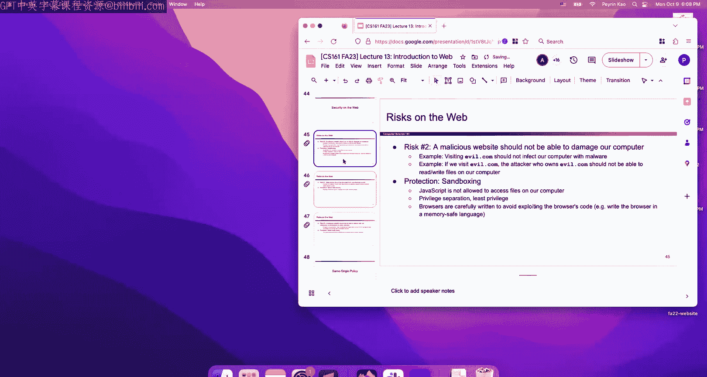

# 013：UCB《计算机安全｜CS 161 Fall 2023 ｜ Computer Security at UC Berkeley》Calude-3.5翻译 p13 -13--CS161 FA23- Lecture 13 - Intro to Web.zh_en -BV1YGbceREDs_p13-

Okay。

Okay cool welcome back first post midterm lecture cool so we finished two out of four of our major topics now so memory safety is all done crypttography is all done and crypttography is all you're going need for project2 so all the lectures that you need to start Project two are over with now and we're gonna to start a new topic which is web so this is the third of our four major topics and so just like some of the previous ones we're going give you like an intro to cryptography lecture and an intro to memory safety vulnerilities and C programming lecture we're gonna give you an intro speed run to the web today so if you're never going to take or have not been able to take CS169 which is the software engineering class you at B like today is your speed run of the entire CS169 there are certainly things that we're not going to cover because is one day but we'll give you everything you need to be able to start at least thinking about the most common attacks that people on the web So that's our plans for todays mostly a speed run of a lot of web things no real attacks today yet。

😊，But just laying the framework so that we can start talking about attacks starting on Wednesday okay so that is the plan okay so I guess just to get a bit。

 I don't know philosophical and tell you a bit about how the web came to be I was really old there's a lot of like this is like old idea conceptual idea from World War I about how the web can be built and'm not going to talk about it in too much detail but kind of the key takeaway from all this old stuff is that when the web was designed it wasn't really design as security and so when people designed it they were mostly focused about usability and no one really thought from the beginning how do I actually stop this from attackers like when this was first built it was being used like in universities and stuff so the one was really thinking about how to make the web secure and so if you remember one of our very first security principles from like lecture one it was that you should always design with security and from the very start because if you design something。

Then later it turns out that it becomes security sensitive then you're gonna have a really bad time going back and trying to plug in all the gaps and your design is going to end up looking awkward。

 it's gonna to look complicated and it would have been a lot nicer if it was designed with security from the start so it turns out web is a good example of like what not to do because this was something that was designed without security in mine and so you're gonna to see today there's a lot of really awkward attacks that are possible and we have to use a lot of awkward defenses and the reason why they're going to feel really awkward is because well the people who design web they did not think about these things from the start so it's kind of an example of what not to do okay web goes all the way back like many。

 many years and there were these like conceptual ideas but like ultimately all of these words basically say that there is one way to think of the web which is to think of it as like a collection of resources or like objects and what's an object it could be like a web page it could be like a PDF that you want to load it could be an image or video somehow the web is just this big collection of。

Data and the data could be spread across all sorts of different computers like if you want to download a PDF it could be from like UC Berrkkeley servers or from like CS161。

org servers or from anywhere， so somehow the web is has something to do with accessing all these resources that are distributed across all these different computers we have to figure out a way to find where those resources are how to access them and so that's maybe the simplest possible where you can think of what the web is okay。

And so。A lot of what we'll be talking about is what we call or I think what people call like web 1。

0 which is kind of the first idea of what the web could be and it's kind of w to just said which is that there's all these different resources lying around on the internet some of them are like just text documents some of them are PDF some of them are images and they're all lying across all these different computers and your goal to be able to pull them in and download them so that you can access files from other people's computers so that's kind of like the 1。

0 model of web and it's kind of outdated I mean like I would imagine the web has changed the lot since 2004 but it turns out that a lot of the vulnerabilities that still exist on the web and we'll show you the leaderboard of like all the most common vulnerabilities and a lot of the vulnerabilities that you'll see that relate to web they still applied from the web 1。

0 days so the vulnerabilities that work back then they're still around today and they're still regularly topping the leaderboard of the most common things so if you're wondering well why are you teaching me this outdated version of web like what about all。

More modern developments like are you going to show me react which is a framework for building more modern websites and it turns out that yes while those are also those are modern ways to build websites and they also have their own classes of vulnerabilities the most common class of vulnerabilities is stuff that dates all the way back to web 1。

0 so the model of web that we'll be showing you it's a little bit old but it is sufficient to learn about all the vulnerabilities that exist even in like modern web so that's web 1。

0 web2。0 I think things got more react or like reactive so there was more interactivity and web 3。

0 I think is just some like crypto garbage so I don't know okay and we're not going to talk about that okay。

So going back all the way to like introduction what is the web。

 this is the model that we'll be using it is admittedly a simplified model。

 but it is good enough to talk about the exploits that are the most common so again here's how I think of it which is that the web is all these different resources spread across all sorts of different servers so I could have the UC B server sitting somewhere in I don't know like a basement of Soto hall and that is serving files like PDFs images。

 your homework to the rest of the world and there could be other servers like I don't know this server could be serving movies to the rest of the world and so every server has some set of resources that is serving resources to the rest of the world and how do you access it well you go on your computer you open your favorite internet browser and then using your browser and you can connect and go access the resources from some servers you can go ask the server hey can you please give me I don't know please give me like this movie or please give me my CS161 homework and the server will send it back to you and you're the browser。

Okay so that's roughly the model that we'll be going with again it's kind of simplified but it's good enough for our purposes and so another question that people ask all the time was what's the difference between the web and the Internet seems like to the same thing at least when I talk about it to non CS people seems like everyone uses it interchangeably so at least for this class we're going to define web as the protocol that sends data between these two so all I care about is that I am the browser and I want I don't know has anyone watched a good movie lately that we should use as a running example。

Ferrisbuers day off awesome okay so like I want you know Ferrisbuers day off totally illegal copy empty4 and I send it over to the server and the server sends the copy back to me So that process of sending information between the browser and the server that is what we're going consider the web and then the process of well how does that information get from point a to point B like how does that information get sent along this channel like does the server send someone out with a USB drive and they give it to me do they use like do they send bits over like radio waves how they send that information over to me that's going to be the internet or the networking unit So we're going talk about how of how information gets between these two people in the networking unit which is the last unit of this class but for now we're just going to be concerned with how the data like what data goes between the two。

People， the browser only server here， but we just care about what the data is the protocol presenting the data and specifically how the data gets sent like do we send like a mail man is delivered to you whatever that's going to come later okay。

That's our simplified model of what the web looks like So we're gonna give you a quick whirlwind tour it's going to be really fast we're gonna cover these in not the most detail。

 but just enough for this class， so we're going show you a lot of how the web works it's gonna to be a lot of vocabulary so fair warning this is one of those lectures where just a lot of terms get thrown at you but I don't know maybe if you' browse the web before which hopefully most of us have some of these will seem familiar so that's our goal for today is to find a bunch of these terms and then at the end we can start talking about what the security model for the web looks like so all will go one by one so I'll start with URLs hopefully a somewhat familiar term。

 but I'm going break it down all the way so that we can use it when we talk about security so URL it stands for something I don't really care what it stands for but what a URL is it is some string that uniquely tells me about one of those resources So if you think of the web as a collection of resources pictures videos files and they're spread across all sorts of different computer。

A URL is like one string that uniquely identifies a single item in this entire web of data so that's conceptually what a URL is here's a URL and again maybe it looks familiar so we're going to try and break it down and try to understand what all these pieces are so the first piece the way that you identify it is you look for the double slashes and you slice out whatever it comes before so those the double slashes I slice out what comes before and that thing is called the scheme and we're gonna see this in more detail when we talk about networking but this the basically tells me how do I transfer things from the browser to the server and again there are all sorts of different options like do I use radio waves do I use cryptography when I send things from person A to person B do I like encrypt my data between person A and person B do I like I't know send a mailman with like a envelope with I don't know DVD and they send it to me there's all sorts of different ways that information can get from point A to point B and the scheme is going to specify。

If I have some networking protocol， some set of rules that tells me how to do it and so there's all sorts of different ways you can send information from point A to point B we'll see a lot when we get to the networking unit but although that you need to know for this unit is that there are two that we care about so one of them is HtTP that one sends information from point A to point B and then there's HtTPS which is a more recent version of HTTP that adds cryptography so those are the two versions HtTP no cryptography older version Https has cryptography added to it but both of these are just ways to send information from person A to person B there are all sorts of other ones that you don't have to know about so for example like SSH is another protocol for sending data there's something called FTP that sends files it's kind of outdated so there's all sorts of different protocols but those are the two you have to know so HtTP and it secure variance or all you have to know。

Okay that's the vertical the stuff before the double slash so we go onwards and we look for the thing after the double slash but before the next slash so there's the double slash there's the slash after there's all the stuff in between So this is called the domain and again I know it's a lot of vocabulary but this will help us talk about URLs in a language that we all speak So the domain I think of it is there are all these different computer serving data like there's a computer in the basement of UC Berrkeley probably serving all sorts of data and then there's probably some server in honor like Netflix company server farm that's serving movies or whatever and so all these different servers in the world they're all serving different sets of data and so this domain it tells me which server to go to like should I go to the server in the UC Berke basement and asperra file or should I go to Netflix is I don't know movie archive and Aspirra file So who do I go to to ask for this file that's what the domain is so uniquely identify。

s a single server sitting somewhere in the world now that's not like 100% true nowadays you can add things like there could be new servers and stuff like that。

 but for the purposes of the web unit you can think of this as uniquely identifying a single server that's serving files and again not 100% true but a good enough simplification for our model okay。

So then we go onwards so I guess before we go onwards you can also add extra stuff inside the domain so sometimes people will also add a number in the domain and so here we have added the number 4000 that's called a port and we'll talk about it more probably in the networking unit so don't worry too much about it for now basically the idea of a port is like maybe that server has two applications running so for example that server in the UC Berkeley basement。

 maybe it's running two different web servers and each of them is servering a different set of files so the port number can help me decide once I go to that server sitting in the basement which application am I talking to and the 4000 might help me uniquely identify one so that's what the port is sometimes there's a username but to be honest I've never seen this before and I don't think we'll ever see it in this class either it's kind of obsolete at this point but sometimes you'll see it but the important one that you might see now and then it port and it's used if the computer or the server has two different server is running that are both serving different sets of data。

And they're all on the same server and you have to identify one okay so sometimes call the location。

 sometimes call the port again， it's a lot of vocabulary。

 but it's important so that we can talk about the web in the same way okay。

Then I look after the slash and I finally find all this stuff after the slash and we call that the path and so at this point you know which server you're talking to you've identified like yes。

 I want to file from the UC Berkeley basement server。

 that's like sending all these files or serving all these files to the world and so once I've identified using the domain which server I want to talk to I have the scheme which tells me how to talk to them what language of internet do I use to talk to them。

 do I use cryptography do I not use cryptography do I send a mailman to the basement of UC Berkeley。

 whatever once I decide the scheme， once I decide the servers that's who I'm talking to and how I'm talking to I can finally ask for a specific file and so this path id as the file on that specific server so that's kind of how I think of it and so for example you can imagine that maybe that server has its own file system just like any of our computers have file systems and so maybe that file system is also organized its folders and subfolders and files and so you can almost think of this path as now that I've gone to this remote server。

I'm going to go through that remote service folders and request a specific file so I could say please go to this folder and get this file inside this folder on the remote computer。

 not on my computer， but on the remote computer that I'm talking to。

Okay that's one possible way to think about it and again modern web servers。

 they don't have to be organized this way so they don't have to exposed to you and say yeah。

 you can get any folder you like on my computer， they could maybe select only certain folders to expose and serve to the world these paths could correspond to all sorts of different things so in the modern W this is not 100% true but if you're just getting the hang of what the parts of the URL are you could say that this is the file path on the server。

😡，Okay。Oh oh is the audio network and that would be bad let me know if it's not working still and i'll try to fix but I don't know we'll just have to hope the Wifi holds okay。

In the worst case， you can like call me and I'll talk you over the phone， okay。

So there's also more things you can do so we could serve files and that could be the end of web。

 but as you know there's all sorts of other things that websites do so websites going just serve static files to you all day。

 they're not just like here's a PDF here's a picture websites also do all sorts of other things like they can let you interact with it like hey click this button and something will happen or click this button to buy something or to make a bank transaction and so there's also more things you can do to websites and the way that you might interact with websites to cause the website to do some computation or send you a web page that looks different depending on your input is you can also provide a query and so this is gonna trigger the server to do some computation based on the input that you provide and this is how you can allow yourself to do more intelligent computation or talk to the server more intelligently than just hey。

 give me a file and you get the file back this is technically optional and so you can totally just build a website that does nothing but serve files and in fact we at once。

You want we have a server whose entire job was just to serve exam PDF to you that server has nothing it doesn't accept queries all that it does is it just takes a PDF argument gives it back to you but for other websites you could totally have queries and so the way the syntax for it is you add a question mark and everything after the question mark is the query there's the question mark everything after it' is the query and you can almost think of these as like arguments you can think of it as like sitting on the web server it's like some function waiting to be run and when you provide a query you're asking the server like here are my arguments please run this function for me so you could think of it as and again this is kind of a simplified model just to repeat myself a couple times but you could think of it as this dropping it's not really a file sitting on this web server so there's no file called draw sitting there but maybe on the server there is an endpoint which is a fancy way of saying like a function called draw sittingtting on the server and that server is waiting for anybody in the world to walk up to the server and call the drop。

And then maybe something will happen。 So when I say slash drawn like please don't give me a file。

 please execute that draw function that you have sitting there and don't just execute it with any arguments。

 please execute it with this argument and this argument So I'm providing name equals value pairs where I'm saying that argument character。

 please set it equal to Evan and the argument size。

 please set it equal to big and I will pass this into the draw function and then the server is gonna run some computation perhaps and then send me back the result So that's one way of thinking of a query and again。

 modern web servers， they can do whatever they want with the query。

 they don't have to run computation but when you're first seeing a query for the first time。

 it's a nice way to think about what the query is。 It's like passing arguments into a function that's sitting on someone else's computer I guess really click syntax note we use amperss to separate them So now you know。

Okay。So I think this might be the last part of a URL I know there are a lot of parts。

 but this last part it's separated by this pound symbol or hash sign I guess you call it a pound symbol if you're old and you think like phone numbers and you call it like a hash sign or hashtag would be like zoom but so the fragment again it's optional you can totally have URLs that do not have a fragment so whether youre provider or not it could be a valid URL but this thing is a little bit different in that this is not something that we send to the web server So we're not like go to the web server and do something with the fragment unlike all the other parts like this path goes to the web server the query it went to the web server but the fragment is a little bit different it stays within your web browser and this is just to tell your own web browser something about the URL and so one really common use of this is have you ever like gone on Wikipedia and it got like all those different sections and when you click on a section it just tele course to the right section in the table of contents well the way that Wikipedia does that or any website does that。

Is it uses something called fragments and so the fragment just tells me some property of the webp page for example。

 please skip to the certain part of the webp page and so that's one way to think about it but overall this is something that's happening on the client science so it's happening entirely in the browser the server has no idea that the fragment exists server doesn't care it's entirely the browser's job take this fragment and do something with it and for example one thing you could do is it could take the fragment and help you scroll down to the relevant section that you're looking for or something else the fragment could be used fragment。

Okay。I think that's everything Okay one quick note which is that maybe you notice that there were a bunch of special characters that there was like a question mark to start a query。

 there was a pound sign or a hash symbol to start a fragment there were slashes to separate paths so like what if you wanted to use one of these special characters well there is a way to do it in a URL so the way to do it is to take your character for example suppose I really want to type a spacebar but I can't put spacebar in URLs so what do I do I take the spacebar I find the ASII encoding of the spacebar which happens to be the number 20 and then I add a percent in front so percent 20 in hex or percent 20 in a URL it's really going be replaced with the spacebar for anyone who's interpreting this string as URL or if I really want to use a literal hash sign I don't want to start a fragment but I want to introduce a literal hash sign I would take the hash sign I would go to my ASII table I look it up I'd find out that the hash sign is 35 and then I stick a percent in front。

Okay， and so everyone okay with what ASI is it's a table that maps characters to numbers okay I think 601mb talks about it at least I heard Justin talk about it on like Friday so I hope they talk about it okay。

So that's URL escaping It's kind of the same as how you'd escape things and say another language like Python or Java or C。

 but in URLs， that way that we escape is we take the character write it in ASI so find the number corresponding to it and then stick a percent in front if you want the percent symbol followed by the ASII for the percent symbol that works stupid so that's nice one thing we're gonna notice a couple weeks from now so I'm not going talk about it too much but something we'll notice later is that URL escaping can make it hard to scan for a malicious URL So suppose that you really don't want to see a URL that has this inside because what does this mean maybe this means someone's going to your server and trying to dig out the passwords file that would be bad So maybe you're gonna write some codes to defend against it and say if anyone comes up to me I'm the server if anyone comes up to me and requests the password file I'm going panic and say you can't do that but what if instead of coming up to me with this which I can read and I'm like that's the password file'。

that they come up to me with something like this and I'm like I can't read that what does that mean any but turns out if you decode every single one of those ASI characters it ends up being the password string anyway so it can make things a little bit harder to read it's called obfuscation and we'll talk about it more when we get improving detectionten but just going get out there that escaping is nice for usability but attackers can use it for nefarious purposes too。

过。So I think that's all the URL trivia I have to give to you again I know it's a lot of just info dumping it is's not the most interesting stuff。

 but it's important to know about it so that we can go on and talk about text okay and again here's another simplified like picture that I tried to draw and again most web servers they don't work like this a web server is not required to work like this but it is a nice conceptual picture of what each part of the URL is going to do so you could think of it as browser talking to the server using the internet there it is that's always like before and then what's sitting inside the server well inside the server I can have all sorts of files like I could have a pictures folder with files I could have a secrets folder with a bunch of files that you're not supposed to access and I could also have code sitting in the server so in addition to files I could have code like I could have the code of draw function I could have the code for a search function and so the user can come and query not just for files but also ask me to run certain commands or certain sequences of code so if they come。

Ask me like please give me pictures/lashevbo。jpg I'd go to my file system and fetch the file and give it back to them if they ask me for the draw function I would go call the draw function and the user can supply arguments using the name equals value things so thought equals evidence size equal large so that's one possible way to think about it。

😡，Again， just to make it really clear， not all web servers have to do this。

 but it's a nice simplified picture so that we can start thinking about attacks on observers。O。Great。

 let's talk about the next piece of vocabulary I have to tell you about which is HtTP So this is the protocol that the server and the browser use to communicate So the reason why we need this and maybe we'll have a slide on this so this is a protocol I guess not so a protocol is a fancy way of saying that when two people talk there needs to be a series of rules when we talk for example。

 like when I'm talking at you， we can't just be talking over each other there has to be a set of rules like for example。

 a set of rules might be like do you have a question you're gonna raise your hand and then what am I going do I'm going to call on you and then you're going ask your question and then I'm gonna repeat the question to the people in the zoom chat and then I'm going answer it like those are the sequence of agreed upon rules otherwise we would all just be talking over each other all the time and things will be really messy so there has to be some sequence of rules what the rules are doesn't really matter like instead of raising your hand if you want to like sand up and do jumping jacks to ask the question we could as long as we agree on it So somehow the。

I just has to be a series of rules that we agree upon so that our communication is clean otherwise we're just gonna to be all talking at the same time and nothing will ever get done Okay so those are the protocols we're gonna to see lots of protocols as we go into the networking unit but this is your first one it's called HtTP so this is the set of rules that we're gonna use so that the browser and the server can speak the same language because browser and servers they don't really speak like English right I can't just log into the server and say dear server。

 please give me the file Evan the server is going already are you talking about so somehow there has to be a series of rules and a series of syntaxes that I use or semantics that I use so that the server and the browser they know how to talk to each other and when you receive like an error message both sides know how to interpret the error message for example so that's HtTP we're gonna to show you how the protocol works and remember there's a variation of this called Https that has more underlying security using cryptography but we're not going see that until the networking unit so for now you can just assume HtTPS。

A version where attackers cannot read the data being sent over the channel or modify the data being sent over the channel thanks to some cryptography magic but the important thing about this protocol is that this protocol is something called request response and which is a fancy way of saying that the server not server the browser is gonna make a single request to the server and the server is gonna to send a single response so this is a one to one thing there's no such thing as I'm going send two requests and get one response there's no such thing as I'm going to send one request to get two response all the data that I could ever possibly want from the server has to be bundled into a single request which I pushed to the server and then the server thinks about it a lot and then sends me a single response and that's it that just keeps things simple and if you want to talk to the web server multiple times or you want to have a conversation you can certainly send multiple requests but ultimately every single request comes with a single response one to one and that keeps things simple otherwise we could just be sending all sorts of requests and getting all sorts of responses。

Re iss just too complicated， so to make it simple， we're going to say there's one request going。

 one response coming back， that's it， okay。So how do you make a request。

 This is where we have to define the semantics of what the request looks like because again。

 I can't just write a letter like you know dear server。

 please give me like the server doesn't know what that means so we're gonna have to come up with some syntax so that the server knows exactly what we're talking about so specifically we are going to break down an httP request into these pieces of data so every single HttP request is like a data structure。

 it contains these things as to contain a URL path so that's the path in the URL So if you go to your browser and I type like wwws161 homework or whatever then the path of that is slash homework so I'm gonna to put homework in the HttP request and the browser knows how to do that the browser will take your URL path extract it and put it in the HtTP request that is building and it's about to send so that's the path that's from the URL we've seen it and then what comes next well now I have to say what do I want the server to do and so here there's a lot of。

Different categories and so you pick your favorite method which is a fancy way of saying a category of what you want the server to do and a lot of them are kind of obsolete or not really used these days the two that are the most common by far are called get and post and they have slightly different behavior as we'll see that the get request that's usually used and nowadays there's lots of exceptions but the original intention here with that there's kind of two main categories so if your HttP request is tagged as category get and you're saying that you would like to receive data from the server So all of the requests that are of the form like dear server please give me my homework PDF or like dear Netflixfl。

 please give me this movie those are going to fall under get requests usually not always but usually and then the second set of requests is called post so any HttP requests of the category post and again there are exceptions but in general the intention of the post category is that these are the requests that are going to modify something on the server。

For example， maybe there's a server out there and you're a user on that server so there's like I don't know Facebook or whatever I people can still use Facebook I don't know but it's like a Facebook server and everyone has user everyone's user on Facebook and maybe you want to like change your password so what are you going do you're gonna send a post request and say hey Facebook I know you're storing my username and password hopefully a hash password and I would like to change my password please so here's my new username here's my new password please change and so I'm sending data to the server and I want the server to update something based on the data or I go to Facebook and I say oh dear Facebook I have a new picture I want to share so I took a picture of my dog I want to share it so here you go。

 please post a picture for me I'm sending data to the server and I'm expecting the server to change something about like underlying data or something based on the data that I sent So generally that's what the categories are get requester for when I don't want to change something I just want to get something like hey please give me all the posts from my friends in the last 24 hours。

Please give me a PDF and post this for when I want to send data to the server and I expect something to change and so there are no hard and fast rules as to which one you have to use the important thing is that we both agree so as long as we agree with Facebook that all password change requests have to be post requests and it's okay when I send a post request asking to change the password Facebook knows what I'm talking about but maybe Facebook chooses to be weird and says actually if you want to change your password。

 please use the get category they could do that as long as I'm consistent and I use the get request to change my password every time that's okay it would be very weird but technically it's okay so there are no hard rules as to which of these two you have to use in fact in like the modern internet these two sometimes get jumbled up sometimes and you use when you might have expected the other but that's the original intention is that get requests are used when you don't have to change server state post requests are when you do want to change and so examples of when these two kind of get muddy or like when you want to。

Iload something sometimes the server is going to change like its internal database if it was trying to like spy on you or like trying to serve you ads or something creepy。

 maybe you' to like update analytics then yes technically it's a get request you're like getting data but you also cause the server to like track you somehow so those are some examples of ways that these two kind of get muddy but the original intention get versus post you pick one you don't pick both okay。

So what happens after you pick one or the other like why do I even care that there's one or the other well the important thing is that there is a part of the httP request called data it's like a field in this like。

A message that you're sending there's a URL path field there's a method field where you're like you can almost think of it as like the form you're filling out the URL path。

 you fill up the field， the method you like check get or you check post and so the reason why that matters is because if you check get and you're like this is a get request that I am about to send off then you don't get to put anything in the data box the data box has to be blank no one's going to look at it if you fill in data there so if you choose to use get request you have to leave the data field of your form blank however。

 if you choose the check post then you're like this request is a post then you get to write data in data field and the reason why is because you're probably going have to send some data so the server can modify at state and to do that you're now allowed to fill in the data field with whatever you want so that's the distinction if you check get and like I want this request to be if type get then whoever receives it they're not going look at the data field should be blank。

But if you choose post you can put whatever you want in the data field and whoever's at the end will look at it and process it in some way that you both agreed on okay so those are the three fields that really matter。

 there's a lot of fine print that doesn't totally matter for example a lot of browsers will attach something like this is coming from like what kind of browser is this request coming from what operating system timetamp the version of HttP that you're using specifically like 1。

1 1。21。3 but those are kind of aninterest we're not going to test you on them at all the important ones are path type get our post and only if you choose post then you're authorized to also throw in some extra data。

Okay。I guess final thing I'll note I know it's kind of a wordy slide。

 but the path itself can also have query parameters so another way to send data to the server。

 if you cannot put data in the data field， you can also pass the server arguments using query parameters。

 so both of those are valid ways to send information to the server。Okay。Cool。

 I guess final final thing I'll note is you can think about if you go to your browser and you type something in the browser you're like www I don't know like wkiedia org something I don't know like potato or whatever you really want to learn about history of potatoes you're like Wikipedia org potato well what kind of request are you making there well you're probably making to get request so intuitively makes sense that something like www。

 Wikipedia org potato hit enter you expect to make a get request it makes sense because you're not asking to change the Wikipedia article you're not asking the Wikipedia server to change anything based on your request you're simply asking for the article on potatoes that Wikipedia has sitting there So that fact that it's a get request it kind of makes sense and the other reason why it makes sense is because you didn't supply any the data you supply nothing but a URL path you type the URL in your browser and you can enter So it kind of makes sense that when you do that you're probably triggering a get request So if you ever go into your browser you type。

Something in the URL bar you hit enter you're almost certainly triggering a get request because you didn't prevent any data and you're sending something to the server hoping to get a web page back so those are generally get requests again exceptions do exist out there usually that's a get request how do you make post request that's usually when you're interacting with the website so for example you want to change your password you type in the website you fill out the form you click the submit button that will probably trigger a post request with the data that you filled in。

Okay， again， there are also other ways to do this， you can like write a piece of code that generates get post requests。

 but those are the most common ways， at least in like daily internet browsing。O。

I guess I should pause in my HTTP in our like discussion protocol and see if you have any questions。

Youre raise your hand， do jumping jack， okay yeah。I was wondering about the escaping of URL defenses。

One thing is the case matter。Yeah question is like does URL case matter that's an interesting question does it depend on the browser I think in general it doesn't matter。

 but I would have to double check it's one of those like URL trivia things that like even we don't care too much about。

It's a good question is your case sensitive， I don't know， maybe we'll find out later okay。Anyway。

 that was all the request so that was how you bundle in all the data to send it over to the server in a way that the server understands you fill out this really specific form with all these specific fields so that the server understands what you're sending and then when the server sends you back a response。

 they also fill out like a form so they print out their HttP response form and they fill out all the fields in a very specific way and then they send it back to you and that way you have a response that's organized as opposed to just some random sequence of bytes that you have no idea what's going on so what are they going to send back again。

 there's a bunch of uninteresting metadata like hey this is HttP we don't really care about that but the important things there's two so one of them is they have to send back a status code at the very top of their response they need to return a number。

 this is at the very top of every HttP response you have to have a number iss not optional you have to have it and the numbers like a code telling you what happened with the request so the most common code that you will never see is okay and that just means that。

The request was successful and I'm sending back an actual response So anytime you load something in in your browser you type Wikipedia bla blah。

 blah you hit enter and you get a response if you see the page what probably happen is that you got an okay response with the header code 200 and then your browser showed the resulting page to you but what if something broke if something breaks there's all sorts of different error codes some of them are really common some of them are really obscure or obsolete at this point and you don't have to memorize any of these but maybe you've seen them lying around on the Internet So we all know our favorite 404 which is the code for page not found if you ever try to access something that's not found you're like who came up with 404 what does that even mean 404 is the status code of the HttP response that comes back at you So instead of getting an actual web page the data or the 404 is what tells you that I couldn't find the page There's also other ones like 403 if you sure to access something you're not supposed to So if you go to like Cs161g。

Final exam solutions like you're going get a 403 you're not allowed to access that it's also on the website so don't try but that would be 403 there's all sorts of other ones there's like a 300 something which is redirect there's all sorts of different ones okay。

And then just like in the request， there's a field for data and you can fill it in。

 you cannot fill it in it's up to you so like if the status code is okay。

 you might want to fill in the data with whatever the user requested， if it's a post request。

 maybe you don't want to fill in the data you're like okay I updated your password you don't need any data it's really up to the server what it wants to return here like for a 404 maybe it doesn't want to return anything because it's a 404 what do you return so it's up to you but the server is a allowed to put anything in here。

 the important thing is that every response has to come with a status code saying exactly what did it work did it error if it did error what kind of error happen you have to be specific and so that's the language that the server uses to speak with the browser that way we know exactly what we're talking about we have a protocol。

Cool that I think is it for HtTP， that's it for URLs。

 so anything else you want to know about them before we do more。Web vocabulary。

OkayMore web vocabulary so as we said before the web what is it is just a bunch of files sitting around on different computers and you can request and the computers will serve those files to you but I don't know about you like when I go on the internet I usually don't just load nothing but like PDFs and images and just like blank text files maybe I to go to like some oldass professors website it just be like plain text but modern websites they tend to look better than just plain text so well what's going on on a modern website how do modern websites look so nice how do they have graphics and how do they have different fonts and stuff and how can they be interactive like when I load I don't know like some online like flash game or something how does the website knows to interact with me and like give me interactive elements how does it give me buttons to press and stuff like that that's where these languages come in these allow me to specify web pages that do much more fancy things than just serving me plain text or just a plain old image or plain old PDF。

Yeah， okay。So we'll talk about each of these one by one again we are only scratching the surface here so you're not going to learn how to write HTML you're basically just going to learn what HTML is and that's kind of all we have time for in this class but do know there's a whole world of interesting web depth that you can do in this space just not stuff that we're gonna do because it's not totally security relevant basically it is HTML it's a markup language which is a fancy way of saying this is not for writing code but this is for organizing your website and making it look nice and it's going to allow you to create structured documents so in the same way that markdown as a markup language I don't know if anyone has used markdown before HTML also a markup language if you have not used markdown is totally okay and so the way that HTML works the way that you know that you're dealing with HTML is you see a bunch of tags and so the way that HTML creates I don't know fancier looking websites is uses tags so you can do something like。

Do I have an example on the next page， I guess I do okay。

Do I have any other ones Okay maybe not so maybe I to do something like I don't know I want my text to be bold so what do I do I have the B tag to open and say everything after this is gonna be bold I write my text here so there's my text super interesting and then when I'm done I close the tag with the s be saying I'm done with bold so no more bold after this please and you can do this bold you can do it for itities you can do all sorts of different things there's all sorts of different ways you can make your website a prettier you can do colors like whatever you want and so。

Ones that we care about that are security relevant in this class this is a small subspace so there are all sorts of different HTML features out there。

 some of them are vulnerable， some of them are not but the ones that we're going to use just so you're all aware and when I like put one of these on the exam you're not going complain at me so there is one called a and I don't know why it's called a still maybe someone will like look it up and tell me someday but a is the HTML tag word links I have no idea why I've looked at the word link and I'm like there's no a in there but they called it a for some reason that's okay so the way the syntax for it is you open up with an a tag there's the opening a tag there's the closing a tag and so what do you see everything inside those tags all that text it becomes hyperlinked which is nice and in these tags you can also provide an argument so I'm like I don't want this to just be any link I want it to be a specific link to this and so that's what the H rep argument is for tells me exactly what the link should go to so I use the tags to open and close where the link should be and then。

R tells me exactly where the link should go to。 That's the HTMLl synt。 you don't have to memorize it。

 but it's good to have in your back Okay or on your cheat sheet， for example， So there's the link。

 know go click on it after over there's also fan things you can do So suppose you want to make a form like you want the users to fill out something and you can do that too and I'm not gonna go through all of this you don't have to memorize this go put on your cheat sheet or something but the form you can again use a bunch of different tags So for example。

 this tag right here it's an input tag of type radio radio is like little circle button you can click and so that's probably going generate like this for example or I don't know like this label over here it's going generate this button over here if I want a button then I'm going do something like this input tag is gonna generate the button the specifics are not too important but basically the idea is that these tags allow me to have nicer looking websites like this and I'd say the most important thing here and all of this jumble of。

Intax is that one more thing you can put in the form is you can specify what happens when a user click submitmit so specifically here when a user clicks submitit you are going to make an HTTP request to the feedback path remember what do you need in an HTTP request you need the URL path it's specified right there using the action argument and you need the type which is specified right there using post so inside this form tag you can also specify something like when a user click submit please make an HTTP post to the URL path feedback with the method post and was someone click submit hopefully that will happen okay。

You can also specify things like that if you want and again HTML really big language。

 all sorts of different features， many of which we will simply never talk about， but yeah。

 if you click submit you'll get a post request to that particular URL and the contents of this form will be bundled as data。

 which is nice okay。You can also do all sorts of other fun stuff so that's a really nice desktop background and so you can embed images this index for images is a little bit weird so HTMLla has all sorts of little syntactic quirks one of them is that when you make an image you don't do an opening and closing tag you do a single tag like you you look at this line there's an opening tag there's a closing tag and there's nothing else and that tag it has the name image IG for image tag makes a lot of sense and it takes in like an argument of sorts called SRC which tells me where to find the image and usually that's the URL wherever the image is living so here the URL happens to be living there and so if I say imGSRC equals that that'll feed me the image or make the image appear on the website。

Sometimes it's called embedding is a fancy way of saying making the image appear on the website。

 but that's what the image deck does， okay。Great， and one thing I'll rfully notice that when you add this image tag well that also forces the browser to one more thing so when the server sends you this HTML like the server what does the server do it sends you an HtP response and in the HtP response is a bunch of ones and zeros and when the ones in zeros are decoded it becomes this HTML and what does the browser do the browser doesn't just show you this raw HTML that's ugly so the browser actually has to take this HTML make it look nice and how is the browser going to make this HTML look nice。

Well one thing it has to do is it has to go find this image so they can show it to you so a side effect of using this image tag is you are forcing anyone trying to show you this HTML and render it and make it look pretty to make another get request to this PNG so that they can find that image downloaded and show it to you so this image tag not only does it make the image inbed。

 but to do so it has to force whoever is loading this HTML like the browser to make a second get request and you can imagine that we can use this for text we can maybe trick people into making get request but the important thing is that the image source it embeds an image and it's also possibly a sneaky way to get someone to execute a get request because the only way to know what's hiding in that URL like you and I both know that that URL probably holds an image but the specific image that's there like what actually is that image the only way to know is to make a get request and go downloaded。

Okay that's embedding an image one more thing you can do is you can put websites inside websites and so do that there's an argument called an HTML tag called iframe that's what you used to frame websites inside another website just like the image tag this takes in a source and so the source tells you which website you're framing inside the other one you can also specify hide and width so that's how big the embedded website will end up being and so that's the syntax I don't really know why but the iframe you have to close the tag the IMG one you did not have to I don't know that's how HTML works okay。

Sometimes people call the outer one， the outer frame， the inner one's called the inner frame。

 so I guess the eye stands for inner and now you know， but not too important。Okay。

 so yeah again I realize I'm like kind of overloading your brain with a lot of HTML syntax。

 but you'll get a chance to play with this a lot in Project three。

 which is the web project and again it's not stuff that you're expected to memorize。

 you can either just get familiar with it through practice or if you feel like it just dump it on your cheat sheet and call it a date。

 it's totally okay。Okay， but that's your quick speed run of HTML。

 there's so much more we haven't talked about of what you can do with HTML。

 but those are some of the most common ones you'll see in this place at least。Okay。

So if you that H is a whole world of pain like get ready for CSS which is even bigger world of pain。

 but it's not one that we're gonna to talk about in this class。

 so you get one slide with three bullet pointss CSS is how you make websites look nice so if I just had say the HTML that you saw on the previous pages all of my websites would look totally plain there would be no style there would be no background colors there would be no text colors there would be no fonts there would be no styling of any sort there be no like if you want to draw a little box around the text looks are in color you want to make the sub look pretty there's everything is default in plain HTML and the way that you make things look nice is to use a language called CSS and this is the language where you specify things like buttons should be blue unless it's this type of button in which case make it green and when there's a text inside this class please make it look like this or when there's a text that's wrapped in this tag please make it green please make it flash or something so this is where you specify。

By all the specific styleling that you want on a website and this is another world that's like even bigger than HTML we can go so much into the details。

 but this is not a web development class so we're not going to but just know that that's what it's used for and just like JavaScriptscript which is what we will be seeing soon this is also vulnerable if it's used maliciously but are all sorts of things you can do with it you can force websites differently you can even use it to possibly execute some code so it's not good okay it's not good if you're not careful but it is good to make websites like advice so that is CSS okay you ever go into webde if you'll probably write some CSS but not in this class okay。

And finally， this is what unlocks all of the interactivity on a modern website， It's ja。

 this is the language programming language that is that all of our browsers run in order to do things that are not just showing you a static web page So if you ever load a website that's like letting you play game or something JavaScript is the most likely what's unlocking it or if I like open a website showing you I don't know a demo or something I click some button and something happens。

 JavaScript is probably what's making all that work or like even if I open Google slides like how is Google site showing me all these slides making them making the animations appear probably some fancy JavaScriptscript I guess I'll never know but this is a programming language for running code on the browser and I'd say the most important thing like if all these definitions of put you right to sleep I understand but the most important thing that you should say Hoit is that JavaScript is client site that is a fancy way of saying that the JavaScript is executed by the browser not by the server this is a really key distinction because。

It might be temping to think， well， if I want to play a game on my browser isn't it the server that's doing all the work of like computing the logic and like sending telling me like you know where the little character is moving well that's not quite true on the web So instead the way that I think of it is I go to the server and I'm like server please give me your browser game and what does the server do。

 the server does not actually execute any code at all or it doesn't have to the server is just gonna go dig up its relevant pile of jascript and send all of it to you be like here you run this you browser you give the user the game like I'm not gonna deal with that And so this is how jascript works it runs on the browser or the client side the server has no responsibility but to take that pile of ja code and dump it on the send it using HttP back to the browser and then it is the browsers job like your computer is the one that's running that ja line by line where your browser is the one running that jascript line by line to make。

The website looked nice it's not the job of the server it's entirely within your browser that's doing it again sometimes exceptions exist。

 but for the most part JavaScript is a client side language okay。So again。

 if everything else is just boring definitions， JavaScriptscript being clientight is going to be really important for the attacks that we do because it's important to note who is executing that code is the browser executing it is the server executing it that is an important distinction that we're gonna see and what can you do with JavaScript you can kind of do whatever you want like JavaScripts really powerful language it can compute things like you can do math operations it can make the website interactive so like if you click this button this happens if you click this button this happens you can make the website like messages can pop up you can have like characters going all over the place kind of do anything you want with JavaScript there's all sorts of different things you can do so we'll show you just a very small subset of examples but do know it's a very powerful language and if you want to use JavaScript with HTML that's this point right here the way that you do it is you wrap the JavaScript in a script tag so in the same way that you can use an at to get a link you can use like B tag that get bold you can use。

Scrriip tag to put JavaScript inside HTML so I can write an HTML document and then have a script inside into the script will execute。

Ok。And again， this is not like a ja class， so I'm not going to ask you to write like tons of complicated ja you you will write some one liners in the same way that in Project1。

 you wrote some one liners per， but we're not going to ask you to code like complicated stuff in JavaScriptscript but it's a nice language to know it say。

 especially if you' go to web development because it's so common but not something you have to memorize this is a really long slide that I'm not going to read。

 basically one thing that is kind of important but not for you。

 but if you ever go work at say like Firefox Mozilla or whatever or if you ever go work for like Google Chrome then it's going to be really important that the browser itself is secure and not memory unsafe and so why is that because think about what your browser is doing。

 your browser is downloading JavaScript from every corner of the internet like who knows what the user is going to request the user could go to like malicious websites。

 the user could like get ja from all sorts of attackers and what's that going do the browser is gonna have to take that code from the attackers or whatever。

And run it on the computer here right client side code and so if you're the person implementing a browser like it's not me but if it's ever you。

 if you ever go work for Firefox or something then you're gonna have to be really careful and make sure that the browser itself is not vulnerable because if your browser has a memory safety vulnerability then the attacker could write jascript the user could download the jascript run the jascript on their computer that could break other parts of the computer so it's really important that modern browsers they're like carefully sandbox their memory safe so even if the attacker gives you a bunch of malicious jascript hopefully it doesn't like destroy your computer because certainly cause funny things to happen but it shouldn't like destroy your computer okay so I guess a bit of a tangent but good to know okay so what can jascript do jascript and again the syntax is not important but the jascript can like modify a web page so one thing you could do is if I run this line of code suddenly you change what the link points do that could happen or。

Now the link， if you click on it after running the JavaScript it takes you somewhere else maliciously possibly you can make a popup message so the alert function is one that you'll see all the time I think of it as almost like the hello world of JavaScript so if you're ever not sure if the JavaScript is executing you run the alert function and what does it do it gives you a big flashing popup and you know for sure that the alert has actually happened so that's one possibility there's all sorts of other things you can do one thing you can do and you'll be doing in project three not two but three is JavaScriptscript can also make requests so JavaScriptscript can say please make a post request to this website with this data JavaScript can do that too can make get requests you can make post requests。

And it can even try to use this to secrets， for example。

 so you have to be careful okay I think that is mostly it for JavaScriptscript again not a JavaScript class but。

Language that you'll be seeing a lot， at least when we talk about text okay so as we said。

 all of this happens client site like this is the key of the web is that it's all happening client site。

 all that the server does in most cases， not all but most cases is the server just goes through its list of HTML or ja files it just digs up the raw ja and dumps it on the browser and says here you make it look pretty for the user I'm not gonna to do it So the server is not actually sending you in fully rendered nice webpage server is just sending you HTML and ja code and it is your web browser's job to make it look nice and so the exact process is not something we're going talk about in too much detail but basically they have to take the HTML they have to parse it into a nice format they have to run all the ja and only then you get a nice pretty lookinging website and all of that happens browser site the server just sends you a pile of scripts and your browser has to make it look nice and actually draw the picture on your screen。

Okay。So sometimes people call that rendering， if you ever see document object model it's a fancy way of saying that's how the HTML is parsed。

 but the important thing is that everything is browser sign server is not sending you like a picture of what the website looks like。

 server is sending you the actual HTML and your browsers that one making it look nice， okay？Okay。

 so again I realized I kind of overloaded your brain with a lot of just security or not security trivia so in the last 20 minutes I'll talk to you about security on the web or at least giving you a like rough overview of what the threat model is like。

Anything you want to know about web trivia before that， I'll try my best to answer again。

 lot of it is just like random vocabulary and facts。It's important， it's boring， but it's important。

Okay。Let's talk about threat models so I have absolutely no idea why the first risk is number two that was unexpected but I don't know we're all friends here right'm go I'm going to go look into this and you'll have to forgive me okay that's number two that's number one and that's number three okay that's clearly out of orders I'm going to move I'm down I don't know why okay。

Okay， that's number one I actually don't know why they're this library either。

 so make guess we will find out all right。So let's talk about what could go wrong with the web So we know the system now we know that users communicate with servers。

 the servers send the files and the user executes HTML or ja based on the files that are sent back so we know how it works now let's think about what could possibly go wrong So here's one thing that could go wrong which is people could hack into those web servers so for example say you have that server in the basement of UC correctlyly and it's serving homework or exams or whatever to the rest of the world well imagine if someone went inside and broke into that server now they have total control over that server so they could modify the server they could say that exam file make it public or like that homework file change it they could say something else So if someone hacks into one of these servers then when you talk to that server you are now talking to the attacker or if you request the file from that server you could get malicious files back or malicious code back you can imagine this could be even worse if someone like hacks into the Google co servers now when you go to the。

Gogle。com server and you ask for something or you're like please run the search function。

 they could return all sorts of car that's up to them because they control the server and so。

This is a risk on the web in the web model， this is a possible attack that we have to think about。

 but the ways that you protect against it， they're not really like web attacks necessarily。

 these are the same attacks you would use to make any server secure not just a server that's connected to the web so any defenses that you would use to make a normal a normal server secure are the same defenses you'd use here to make the web server secure。

 So mostly stuff you would expect like know make sure it's not using a memoryafe language install antivirusers if that's something you're worried about so it's kind of general industrial strength tools we would use to make a server secure and we'll talk about those more of the networking unit and at the very end of the class as well but this is a risk it's not one that we're gonna talk about too much because it's not key to the web protocol but do know that if you wanted to you can make a threat model where you said yeah maybe someone did hack it into Google and now I cannot trust anything coming from Google co that's a possible risk So it's not when we're gonna to include an R threat model but it is a risk。

there it is is number one， okay， in no particular order。OkayR number two。

 this is one that we already kind of talked about， which is that imagine if you went to some evil website and why you went to this is you know beyond the scope of this slide so maybe you just decided for fun。

 you were gonna go to evil co and see what happens maybe an attacker trick you into opening evil like you clicked on the link without knowing you went to evil and we'll talk about that kind of attack too maybe an attacker walked up to your computer and typed an evil co I don't know but somehow you have loaded an evil website and so things can go wrong now because the attacker what can they do。

 they can serve you anything they want， they can serve you a malicious P with like bad images on it or something or they could send you I don't know but even worse right they could send you code because what do we know about the web the code runs on the browser site So yes they could certainly send you all sorts of like naughtdi images or whatever or evil website could send you jascript and Hl and CSS and what does your browser。

your browser has to piece together that HTMLl CSS and ja and load a nice looking website and in the process your computer now has to run any old code that the attacker supplies so in fact what happens when you visit an attacker's website is you're giving the attacker full control you're letting them execute any code that they want on your computer they could execute a line of code like please access the user's passwords or please install this malicious software on the user's computer that is what could happen and it could be really really bad。

And so the modern industrial strain defense against this is that you have to make sure that your browsers are properly access controlled something called sandboxing and so here the idea is that yes。

 that jascript you're gonna have to execute it no matter what because the browser doesn't know whether you intentionally visited evil。

com or not the browser has no idea what this website is and so when the browser receives the code it's going to have to execute it no matter what but at least we can minimize the damage by making sure that that code cannot touch things outside of the browser so for example that jascript。

 if it tries to access files on the computer the browser will say no。

 you can't do that or if that code tries to I don't know like destroy the entire computer's operating system。

 the browser is gonna say no you cannot access things outside of this browser so this requires the browsers themselves to be written correctly and again if you're ever someone who works on Firefox or something then youre gonna have to make sure you're being really careful in writing your browser securely I'm assuming that's not like。

Most of us like we're not the ones implementing Firefox。

 so we have to rely on them to make sure that the browsers are secure and this relies on a bunch of security principles we've talked about。

 we want to make sure that the jascript that it runs that runs from the attack has least privilege should not have access to destroying my computer it should only have access to this stuff within the browser so it can show me something or show me the result of whatever that web pages so this is also a risk but it's also a risk that we're not going to be talking about too much because the person whose job that is to defend against this it's the browser's job to implement a good sandbox and make sure that the malicious jascript that comes back if it does doesn't do too much damage it's probably going do some damage like maybe it's just flashing things or whatever but。

Hopefully it doesn't do too much damage， that's our goal。Okay。

And so risk three this is finally the one that we're gonna talk about This one is web security relevant finally is that imagine if you load maybe two websites maybe you have two tabs open and in one tab you go to your superlegit bank website you're like on bank co and you're doing your banking and then on the other website or on the other tab you open up like evilcom who knows why maybe I accident or something but now you have two different tabs open。

 you have evil docom and you have bank and both of them are open in the same browser and well what do we know about both of these websites when you load them they are allowed to give you any jascript that they can possibly think of and your browser has no choice but to execute that jascript and render those web pages that jascript has to be executed to render the web pages So when the bank co and the evil。

com websites send back JavaScriptscript we are forced to execute that stuff we have no choice because we have to render the webage for the user as the browser but there is one。

Possible risk here which is well imagine if that bankcom or is that evil。

com website it had some javascript that was like， hey go to that other tab and like peek at the users' bank。

com tab and like check out what they're doing over there like check out their login information or please go check out know how much money they have in their account so the evil。

com website they might be tempted to write jascript that peaks at other resources resources that they're not supposed to for example this could be things that are living in the other tab or they could be peeking at like hey can you I don't know download this thing from bank co or like can you post something in login as the user and so。

This evil。com website， it might be attempted to load resources that it's not supposed to or try to access resources that it's not supposed to because it's from a different website and this is one of those things that if web was designed from the start with security this would not be a problem they would have figured out a policy to separate out website so that the evil。

com website can't use jascript to read or write things from bank co because that's bad but they did not do this。

 they did not think about it so we had to add something after the web was designed so this is the same origin policy。

 it's going to feel weird， I promise however， the reason why it's going to feel so weird is because they did not design this from the start this is something that we grafted on top of web after it was fully designed just for the security and that's why it feels kind of awkward。

But。Akward or not this is what we've got。 So here's the same origin policy。

 The goal is we want to prevent what we just said， which is that if you have two websites in your browser or if you have one website and is trying to access another website somehow these website should not be able to talk to each other or interact with each other so if you load a bunch of jascript from evil that jascript should not be able to talk to another website should not be able to write things to the Facebook or bank server should not be able to load things from the Facebook or bank server should not be able to like peek at another tab and see what's going on we don't like those we want to stop those so the same origin policy is our best guess to help us stop websites from interacting with other websites And so this word unrelated like it's so vague And so we have to define what it means for two websites to be related and unrelated And again if the web was properly designed maybe they would have come up with something cleaner but it wasn't and so instead we have to take our best guests as to。

What it means for websites to be unrelated is it going to be fully correct， I don't know。

 but it's the best we can do okay。And whose job is it to enforce the same origin policy remember where's all this stuff running like the JavaScript that comes in and the HTML that comes in all of this is stuff on the browser so it is the browser's job to make sure that the JavaScript that it's running cannot access other origins so all of this is browser side all the things we're going be talking about at least for today it's all browser side okay so that's the same origin policy that's what's supposed to do and so here are the rules and if you're like wait these rules don't totally make sense well maybe not but it's what we've got okay。

So the rules are actually not Bethhead and so the way that you're going to do this is you're gonna take your best guess as to the origin of this website。

 in other words， like you're gonna to take your best guess to see if two websites are related or unrelated and the way that you're going to do it is if you have two different URLs or two different resources you're going to identify the resources with their URL and you're gonna to extract three pieces of information look they're even color codingd the three pieces of information you're going extract or the protocol that's this string over here domain it's another string and port which is a number that's it those are the only three things you extract everything else like the path query。

 the fragment you leave behind we're not going use those to check if websites are unrelated they're still important if you want to access the website that query still matters for sure but when we're checking of two different URLs or two different resources identified by a URL are or by two different URLs when we want to check whether those two different URLs are related in some way we're just going to。

Strig these three pieces of information and only these three to check if they're related or not okay and this is just a piece of trivia。

 which is that if you don't specify the number， you don't specify the port。

 it's usually default 80 and the reason why is because that's what is TtP uses okay。

So how do you check Well it turns out it's basically string matching so it's not going to be the most interesting thing but all you have to do is you have to take those three pieces of information that you extracted from URL A and then take the three pieces of information that you extract it from URLB and you simply check the strings one by one and if they all match exactly then you have a domain match and you assume that these two URLs are related in some way and if any of the strings don't match and you assume that they are different in some way and that's it so what are these URLs represent they uniquely identify something on the web it could be an HTML page could be a PDF could be an image and if we have two different URLs representing two different things on the web the way that we tell if those two resources whether they're JavaScripts or images or whatever the way that we tell whether or not they are related in some way is we use the same origin policy and we check these three and only these three strings。

And so here's some examples and again think stream matching don't do anything fancy all we have to do is extract things in check if they match okay so here are some examples of extracting the domain and seeing if they match remember all three have to match not just one。

 but here I'm just extracting the domain to show you， so what do I do。

I extract a domain Well one of them says HttP， one of them says Https and again。

 don't overthink right just do basic string matching HttP and Https are they the same string No so are they the same origin I can stop right there and say these two are not related okay so I pulled out the domain of the URL and I found that they are different So these two whatever resource these two URLs are referring to on the internet whatever resources they are I'm going to assume they're not related and you might look at this and be like oh but wait they have to be related like they're the same URL is only a little different how could they not be related but remember the same origin policy does not care it just extracts two URLs and answers yes the strings are the same or no the strings that I extracted are different That's it that's their rule for deciding if things are related and it is the best that we could do when we graphed this on top of web at the end okay Here's another one So again we look at the left we look at the right and。

Compare the protocols first so HtTP HtTP do the strings match yes so I go on I check the domains I extract this domain I extract this domain do they match string matching says no so I say this doesn't match not the same origin and again you might be like wait like aren't these both owned by the CS161 domain like aren't they both somehow related to CS161 Howard they're not related same origin policy does not care it just looks at the strings and the strings don't match it reports false and says these two resources are not allowed to communicate with each other so the website on the left has JavaScript and that on the right has JavaScript they are not allowed to access each other's resources okay？

And final one which is I pull up both of them Okay so domains yes HtTP HttP the same string。

 the domain I pull that out that's a really ugly circle and I pull this out are they the same doing nothing but string matching yes then I pull out the port that's the number 80 that's the number 8000 are the numbers 80 and 8000 equal no for like all values of 80 they're not equal to 8000 so this one we says important mismatch so you get the idea is nothing but string matching and again even if you're tempted to say but wait they're probably related and you might be right but same origin policy doesnt no the best that it can do to balance security and usability is to just check these strings that same origin policy it is simply checking strings and so what happens now is that sorry I'll pull up some words okay so what happens now is that if you have two resources that do not have the same origin for example。

Cs161。org there is some resource living here it's probably some like HTMLml with some JavaScript like that's what is living at CS161。

org that's the resource identified by this URL I know I kind of truncated it but it was out of space。

And it's also another resource on the internet Google。

com and if I type this into my browser I will find another resource with like HTML and JavaScript and so the idea is that these two resources because they have different origins they cannot interact with each other and so this manifests or appears in all sorts of different ways so for example if you embedded one of these within the other they would not be able to talk to each other or communicate with each other because they have different origins so。

If I was c161。org I embedded or added little iframe with the Googlecom website inside。

 I could not change how the Googlecom website looks or behaves because we have different origins。

 I cannot go in effect how a different origin looks in the browser in the same way that I can't go and like change how a different tab works if they're different origins I can't go into Google co and change how it looks okay and there are some minor exceptions I'm not gonna run through them in too much detail and honestly they're kind of like trivia but I guess I'll quickly run through them so one thing you can do is you can fetch jascript on external origin and so for example if you go to the CS161。

 org page you're gonna get a pile of HTMLl back and jascript back and you might get something like this which is kind of weird syntax don' think we've seen it yet but you might get something like this where you're like I don't know。

You might get script with a source tag and like what is this Well what this says is like please go excuse the handwriting It says please go to this URL download the jascript that you find at this URL and introduce this URL onto the CS161 website and that is one of the exceptions that's okay so under regular same origin policy what would you say you'd say no because my origin is 61g their origin is Google co these cannot interact but for jascript that's fetched from an external origin we do allow it and so we say that jascript gets copy pasted onto our website and it now has the origin of CS161 so that is one of the allowed exceptions which is when you're fetching ja from external resources turns out this happens pretty often in real life like instead of you writing all the jascript yourself you might want to go like import jascript from someone else and if you want to do that same origin policy says that's okay you can read that。

Javascript from someone else and you can use it yourself and from now on that JavaScript on your web page。

 it it belongs to you okay。As one of the exceptions another exception is that you can fetch images from other origins so you could say something like we've already seen the image source tags so if on like 161。

org I really want to embed the image of the potato so there it is jpg I really want to embed the image on CS161。

 org I am allowed to do so it's an exception to the same origin policy so in normal sameorgin policy I say no this is cs161。

g that's wkipedia。orgpotato and they're not the same origin I'm not going to let you take that image and pull it over but like embed it on your website but here we're going to allow it you can embed the image but there are some restrictions for example you can't change how the image looks you have to embed the image exactly as is you can know about things like how large the image the dimensions but like it's limited right you can't just go download the image and do whatever the heck you want with it the amount of things you can do withs。

Limited， okay。And beyond the scope of this class， but there are also ways to talk to websites of different origins。

 but again it's limited， you cannot just use jascript to go to bank。

com and do whatever the heck you want it's limited you have to use some protocols called like post messages and it's a limited very narrowcod set of things you can do to communicate with someone else so that's called cross-or resource sharing it's a fancy way of saying two websites with different origins they could share and communicate resources with each other but only in a very limited way you have to explicitly allowed and say I am overr the security policy to allow these two resources to talk to each other。

Okay。So that's the same origin policy it's got a couple of small exceptions but overall the key here is just that I want websites with different origins to not talk to each other yeah there's a question of like what if I just want to completely forbid this I mean yeah you only could and that's one option。

 but remember we have to balance like web or security and usability so if I want to just delete crossor sharing entirely I might lose some there might be some websites that no longer can communicate when maybe they wanted to or should so as an example this one these two have different origins。

 but like if we look at them using our intuition， maybe they're both owned by the same organization and maybe they do want to share some resources and talk to each other but they cannot do so under origin policy they have to use crossorin resource sharing to do it or maybe like mapsgoglecom and images。

gocom maybe they want to share something or share some resources under same origin。

Policy same origin policy would strongly believe like Mastock Google and Iagestock Google are different people。

 but we kind of know they're probably the same you know mega corporation conglomerate and so okay if you use crossword resource sharing now those two websites can talk to each other。

😡，Great question， any other great questions？Ening on Zoom。

Did I craft there's a question of can the browser not run the JavaScript I'd say that depends on your browser so maybe you have some like browser extension or something that stops you from joining JavaScript but in general if the user requests a website and the website has JavaScript like a natural browser you to do would be to execute the JavaScript okay。

question about does im and inherently cause a crossword reviews reviews for sharing error I think iframems are allowed in that you can embed but you cannot modify what's size that's the origin rule and again similar policy has all these little nipicicks most of them class is not going to be too important but they do exist Okay final question also if people need it like you can go quietly pack up but I'll take a question there's no way。

Is there a question like can you register a server called 161。

org so we'll talk about this when we get to networking when we talk about networking there is a protocol for like who even allocates like the 161。

org domain but for now we're just going assume all these exist and that we can access them that's a great question though when we talk about BNS domain name server we'll talk about how those exist Okay as you like slowly file out I know 630 I will at least tell the recording people like a brief summary so you can have it for reference so today was a lot of vocabulary a lot of syntax but we talked about URLs we broke down the paths someone's scling okay。

So we talked about URLs we talked about how you can break it down into all these separate parts and we use the URL to uniquely identify a resource on the internet we talked about HtTP this is a set of rules to communicate between servers the key thing here is that there is a request and for every request there's immediately one response or not immediately but like exactly one response no more no less and every request has to be get if you're not modifying state or post if you're modifying state exceptions do exist talked about the three parts of a website HTMLs how we make the website have features like links forms buttons CSS makes it look nice with colors JavaScriptscript lets me execute code where inside the browser like key thing right and the same origin policy stops different websites we interacting if they have different orderss okay that's it sorry for going over and I'll see one。

た。