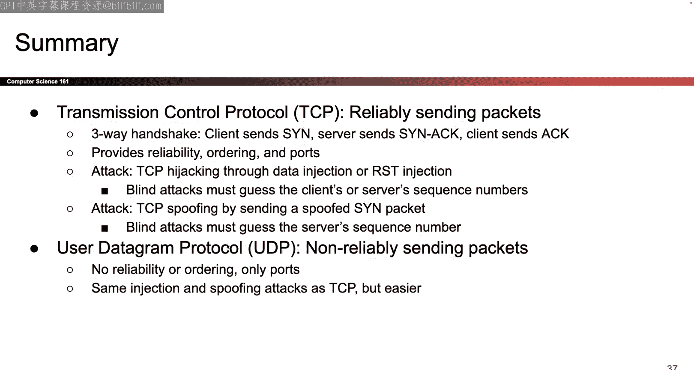

# 019：UCB《计算机安全｜CS 161 Fall 2023 ｜ Computer Security at UC Berkeley》Calude-3.5翻译 p19 -19--CS161 FA23- Lecture 19 - Transport Layer_ TCP and UDP.zh_en -BV1YGbceREDs_p19-

O。😊，I again。So here's your project to daily tip I have like tons of these I will not run out of these so if you want more just let me know if we have time left over I'll go dig up some more so this one is the first of like a bunch of implementation bugs that I've seen so the most common one that people always always always run into is they attempt to encrypt something with the public key encryption function but they immediately get an error that says the thing i'm encrypting is longer than 256 or however many bytes I figure what the exact limit is but if you remember when we talked about RSA encryption all the messages that you're encrypting are mod n or n is some large number but N is maybe like I don't know 128 byte number or something it's a limited size so all that is to say RSA has a size limit you cannot encrypt arbitrarily long messages using RSA and if you create somestruct in your project you would like to encrypt it using RSA a really common error that you're。

Or run into？I would say like probably have the classrooms into this is you'll get an error that says RSA does not accept input or plain text input that is of this lane it's too long so how do you get around that well there's a couple of fixes that I consider really hacky and so I would only do it if you know。

Like deadline crunches coming up or you just are very confident that this is the last fix you have to make So if you feel confident making the hackey fix like I don't recommend it because it is hacky a couple hacky things you can do are if you have astruct with multiple fields you could encrypt each of the fields separately with RSA So that is one possible option it is not great it's kind of hacky but technically encrypting each field separately would be the same as encrypting the whole thing another of course that's really hacky is if you're marshalling thestruct before you encrypt it the marshallstruct includes all the fields of thestruct that you're marshalling like all the names of the fields So if you have a name that's like a field name like username or something then the characters also go into the RSA encryption So one way to possibly get it like just under the limit is to make those fields those field names a little bit shorter but of course that comes at the cost of making your code less readable So I'm not a fan of it either So those are kind of your lastditch resorts if you absolutely are just like。

Gining this at the deadline or something I don't recommend it is' a lot of fun time。

 but those are the hacky fixes when people are like give me a fix， the better fix。

 which is the one that I recommend， especially if you're hearing this you know before the deadline。

The fix that I think is the cleanest makes the most sense cryptographically and its also just really nice to implement is to remember that we had this whole like10 minute lecture on hybrid encryption or 10 minute section of lecture all about hybrid encryption so that is what I would recommend doing so instead of taking this public key and encrypting astruct that might be too large you instead use the public key to encrypt the symmetric key and then now you can use the symmetric key to encrypt whatever arbitrarily largestruct you want to encrypt so remember that in symmetric key encryption like AES with those chaining modes the length of the encryption is no longer an issue so instead if you use the public key to encrypt the symmetric key and then use the symmetric key to encrypt the actual data then you're in great shape you will never run into this issue ever again and you don't have to resort to any of those hacky fixes so I think that is the cleanest fix and in fact you can even take this idea and move it into a helper function or something so you can code it up once reuse it over and over again never have to think about it again so。

Ultimately what you'd end up storing or sending over datastore might be something like the encrypted symmetric key so it's the symmetric key encrypted with the public key and the symmetric key is small enough and it'll fit inside the public key encryption so your first item that you store on datastore is the symmetric key encrypted with someone's public key and the second thing that you store is the data itself encrypted with that symmetric key and then when someone wants to go pull that data down from datastore well what do they do。

 they first decrypt the symmetric key using their own private key and then now that they know the symmetric key they use the symmetric key to decrypt everything else。

 it works beautiful， this is the approach that I recommend I highly suggested because if you have this approach。

You don't have to resort to any hacky problems and things that you publicly in cry can now be as long as you possibly want that's my recommendation you don't have to take it。

 but that's what I would do。Okay I guess more generally and I'll talk about this more if we have time like this project just is it's very open endeded right like we give you maybe what 2030 lens of starter code and everything else is yours so I think it's really important to try and be organized that if you have code that you're reusing like say this RSA public key hybrid encryption function maybe it goes in a helper function you call it over and over again as opposed to say copy pasting it all over the place now if you have a bug you have to go track it down in like five different places that's really annoying or say if you choose to use one of those hacky fixes to get around this RSA problem well what if you have another problem later down the line now you just made your code more messy so I'm not a fan of those fixes I think in general keeping your code clean its just a equipp thing to keep in mind this project is where you will be living you know for a while and I like to keep my living quarters clean so I'd recommend the same but hey it's your code so do what you want okay。

Anything else you want to know about Project two since we're like in the full swing of the coding phase now？

Okay， have fun coding y'all， let's talk about some more networking。

Talked about the lowlevel network attacks last time I won't go through them in too much detail。

 remember the one that was a little bit tricky was WPA where we had to come up with a cryptographic handshake and the idea behind the cryptographic handshake was that you know the wi-fi password then you can derive all of the steps to get the secret key to talk with the access point and if you do not know the w-fi password you cannot follow those steps we talked about the attacks and the one that I think is the trickiest is the offline food force attack it is not online you don't walk up to the access point and like say is this the right password is this the right password instead you record one of the communications and then you guess a password by yourself and then you can check your guess by using the data that you record So all of that happens offline you do not have to ask the access point to check your guesses you can guess as much as you want that's what makes WPA PSk vulnerable and then we talked about how WPA enterprise is the stronger version of WPA that fixes it。

Okay。So today we get to talk about layer4 so we're slowly moving our way up the stack and today we get to talk all about layer4 last time I already talked about BGP the IP layer so I'm not going to do it again so instead I'm going skip over to layer four stuff let's do it okay so there are two choices of protocol at layer4 I'll talk about TCP for the like vast majority of today and then in the last 10 minutes I'll tell you an alternative which is UDP so first let's think about what layer4 is even for maybe you've already forgotten all the layer it's okay I don't remember then always either so。

Where did we leave off We left off at layer3 layeryer3 is awesome layeryer3 says if I have a packet。

 I can send it anywhere in the world that I want to thanks to this interconnected network of networks thanks to this chain of routers or post offices I can always take my packet and take it one hop closer to its destination I can take my message I can send it anywhere in the entire world that I want to that's awesome but why didn't we just stop at layer 3 well there's this problem of reliability which says if I send a packet over layer3 is there a guarantee that the packet actually shows up and doesn't get corrupted and IP says no do not guarantee reliability so here are some things that you might want that IP does not provide for example。

 say you're sending this thing over you know some wire and somehow like one of the wire itself all glitches out or something and one of the zeros accidentally becomes a one well that would be bad and it would be nice if we could detect that IP doesn't care IP says if the packet that shows up is wrong was your problem。

And。Actually， I guess IP does have a check sum， so it doesn't check cryptographically。

 but I can or IP packets。 sorry that's my mistake。 IP packets will check for random errors。 So。

 for example， if this thing happens where I send something over the wire one of the zeros accidentally flips to a1 the IP packet will sometimes catch that if you include a checkup and a checkum is not a cryptographic Mac because it's not stopping from adversarial attacks。

 it is just checking for like random attacks or random errors， So IP packets can help with that。

 but they're not gonna help if an attacker intentionally tries to change something。

 Okay so you can think of the checkum is kind like a hash。

 there's no key to it So anybody can compute the hash but if one of the packets the bits gets accidentally swapped or something the checkum will catch that。

 Okay here are the things that we would like for reliability， but IP doesn't provide。

 So as I was saying earlier， there are some things that we would like in terms of reliability and IP just does not care。

 So for example， I would like to package it。act get there if I want to send a message to my friend in Australia or whatever country I said last time I would like the packet to actually get there except IP says well that might not happen maybe the packet gets lost maybe someone drops it and forgets to send it maybe some error happens and it doesn't show up and IP says that not my problem you deal with it packets can also get corrupted we talked about this so maybe some of the bits get accidentally flipped maybe you'll notice it maybe you won't IP doesn't promise that it'll get detected IP just says I'll try and if I detect it good for me and if I don't detect it is your problem Also packets can be delivered out of order so if I have a packet。

And it's like message number one， another packet is message number two and I send message number one first and then I send message number two there is no guarantee who gets there first message number one to get like stuck in traffic or stuck over some slow connection and maybe message number one which I send first to get their last and IP says that's not my problem I will try my best that's the best effort delivery service but if your package doesn't get to its destination is not my problem I try my best that's IP it's not great so the good thing is it lets me connect at anyone in the world。

 the bad news is that it's only best effort it tried its best so we are going to have to design a protocol that's built on top of IP to give us all of these guarantees because I want reliability but IP doesn't offer it that is what layer4 is going to be all about okay so we' can try to design it together it turns out that the highle ideas that make layer4 work are actually pretty straightforward。

And then everything else is just trying to get it actually implemented and designed okay so let's think about the problems and think about how you would solve them and if you're not convinced by the packets being sent back and forth you can think of the postal analogy if you makes it feel better we're just thinking of highle ideas for now so one of the problems is IP packets have a size limit you cannot send IP packets of arbitrarily large size so this is just like if you have a package you cannot stop two tons of things inside a box and then send it over the postal system so what do you do you take your two tons of stuff and you split it into a bunch of smaller boxes and you send each box over the postal system so in the same way if I have a really long message I just have to manually take the message break it up into pieces and then send the pieces along and I'm all said okay seems like a reasonable idea so when we design our protocols so we're gonna have to deal with this we're gonna have to deal with the how to split it up messages and how to reassemble them together okay。

So we're gonna do it so the user doesn't have to do it so remember the whole idea of layer4 is that we want to design a protocol that provides reliability this way the user of the program does not have to worry about oh is my message going to get there is it going to get there in order we are going to do all of that for the user and then the user who's living on top of layer4 no longer has to worry about all this stuff so we are going to rely on layer3's ideas and guarantees to give us a way to send messages across the world we're going to add reliability and implement that today and then everybody in the higher layer starting next time they're going to have reliability guaranteed by using our protocol so one of the things that we are going to do for our users the service that we're going to provide is we're going to take their messages however long they may be will do the splitting up for them will do the reassembly for them they don't have to worry about it okay。

What else can happen Well what if I take these messages or these packets and I split them up and they show up out of order How does the recipient know how to piece them back together Well again you can think about the postal system and think about what would you do if you had a letter that was really long you split it into 10 different parts and when they arrive they arrive out of order and now the recipient doesn't know how to piece the letters together how would you fix this in real life well whats the solution that I can think of is maybe I'll put like some numbers on them so I'll say this is box number one this is box number two this is box number three and so when these packages arrive at the recipient well all the numbers stamped with numbers So if you need to know which one's number one or the first part of the message or just take package number one which one's like number two the one labeled number two so even if they all show up out of order if I stamp a number on every single packet then whoever receives all the packets they can assemble them back in order so somehow I'm gonna have to stamp numbers on every single packet。

That I said this way， even if the packet show up out of order。

 the other person can figure out how to rearrange。Okay， so that is something I'll have to do as well。

So I solved my problem of packet size I solved my problem of packet showing a at a order just by stamping numbers haven't told you how to do it yet。

 but feels like a reasonably intuitive idea and then the last problem is what if a packet gets lost I send it and it never gets to the recipient well that's still a problem so how do we solve that So the way that we're gonna solve that is we're going add confirmation message like receipts So when I send a message over like say if I send box number one over then the person who supposed to receive box one is required under this protocol to send me a reply saying I have received box number one so it's like a receipt or a confirmation message that box number one has been received so every single time I send a bunch of packets I send really long message I split it into10 parts and I send all 10 boxes over the boxes are number to make sure that the recipient can reorder them and when the recipient receives the boxes they will return them or return to me a confirmation message saying I。

ceBoxes number you know12，3，4，567810 and I'll see that message and'd be like wait a minute I missed fine I'll send it again Okay so again these are really high level ideas and if you're or I feel like the' reasonably intuitive and so if you have this then you're basically set for TCP and the rest of today is really just implementing all this stuff as a protocol because this is all like high level analogies okay question this will take of the。

The receipt messageYeah， so this is everyone ask this every semester。

 which is what happens if the receipt message gets dropped。

 if the receipt message gets dropped you send the package again and you send it again and again until the receipt message comes back so。

It's got a be a little hack but it works so in that case the message actually showed up but the receipt didn't come over so you'll just send the message again until the receipt shows up and yeah it's a little bit of duplicate data but it's the best we can do other questions yeah。

Why dot even go handle these byte the message because doesn't I guarantee that light？安达嘅。

We'll receive like with all flights we just need label just each packet Yeah it's a good question so the question was do you have to label each byte or can I just label each packet so we'll see what the actual protocol ends up doing I guess there are probably other approaches you can take depending on how IP or TCP is implemented but we'll see that the byte approaches is what people actually do in real life and we'll see like some reasons why it might be useful it's a good question though like again this is all pretty high level I'll make it very concrete in a couple of slides hopefully okay those are all great questions though。

Okay so how am I actually going to implement all of this stuff I'm going to implement it using TCP that's what it stands for I don't care what it stands for。

 but the goal is this is going to be a protocol in other words it is a series of rules that I'm going to abide by and the recipient is going to abide by so we both agree to follow these same sets of rules and if we follow these same sets of rules when we send messages back and forth then we can provide a service to the users above us so if my computer agrees to follow TCP and the other person's computer agrees to follow TCP and we send messages back and forth then the users of the computers they no longer have to worry about things like is my message going to get there is my message going to show up in the right order those are no longer the problems of。

The user because both computers have agreed to use TCP and TCP is going to do it for them so one way to name the service that we provide to users is to say we're giving the user a bystream abstraction which is a fancy way of saying instead of worrying about well the messages are like limited in size and I have to break up the messages and make sure that they get reassembled in the same order。

 I don't have to worry about that I can just take a series of ones and zeros of any length that I feel like and just feed them into TCP and then TCP is gonna make those same sequences of bytes show up on the other side so I can have an arbitrarily long sequence of ones and zeros and I can just kind of feed it into like my computer one by one and then they will simply start showing up by by byte on the other side and TCP's magic will do all of the implementation for me using IP so that's the service that we're gonna provide I can feed in bytes one by one the bytes will show up in the same order guaranteed on the other side and TCP。

You will do all of the implementation details for the user and the things that we're going to have to implement together to make this protocol work。

 we're going to have to implement。The sequence numbers。

 those are the numbers that we stamp on messages to make sure they show up in the right order。

 we're also going to have to implement the idea of acknowledgements。

 the confirmations that a message actually gets received and something else that we're going to end up adding as a feature that I didn't have a good analogy for it's called ports so we'll see that soon probably okay。

OhI guess we'll see it right now so let's talk about courts and what they are so again I'll do my best to like shove it into this postal service analogy if you don't like it I'll show you what it actually means in a couple slides so here's my best attempt at doing an analogy so Alice's pen pals with Bob do people even know what pen pals are anymore and like 2023 you know how like back in the day you'd like find a friend on the other side of the country and you'd like write letters to each other I don't know that's what pen pals were apparently so Alice and Bob live in really faraway places and they want to send each other letters okay and Alice has a roommate and is Carol and she's also a pen pals with Bob okay so Alice and Carol they live in the same place so they have the same address so that means that if we send a message to Bob where Alice sends a message to Bob Carol sends a message to Bob well both of their messages have the same source address the firm address is the same and so when Bob sends a reply it's gonna be sent to the exact same address。

Do do you tell which letters are meant for Alice， how do you tell which letters are meant for Carol that that's a type。

 okay， shall we fix it okay I'll fix it， that should say Carol okay。Okay。

 don't tell anyone I did that okay so we should figure out if all the messages to Alice and Carol go to the same address。

 how do you tell which ones are for Alice how do you tell which ones are for Carol so the solution is well if we assume that they live in different rooms maybe I can add a room number to the letter so at the very top of the letter instead of just writing the letter I'm going to add a little header that tells me which room this message is going going to okay so if you think about room numbers like I don't know about you but like inside my apartment。

 I don't have room numbers right like the bathroom is not numbered。

 I don't know about your place but it turns out that in like private homes usually the port numbers are kind of meaningless you can assign whatever numbers you want to whatever rooms the important thing is that they're just distinct but they don't really have meetings but think about like a public place say like Soda hall Corey hall in those places the numbers actually mean things right so you can't just like go to Soda hall and like suddenly change。

all the room numbers you can't really do that that's going to cause people to get lost the in soda hall so that would not be a good idea so somehow in private homes the room numbers are just there to distinguish different rooms but in a public office the room numbers have to be constant so that people can actually go find those rooms you cannot go to soda hall and start scrambling up all the numbers and expect not to get in trouble okay。

So let's let's see what this looks like in actual computers， so the idea is that。

Just like how a single apartment complex can have or single apartment room or something could have multiple people。

 a single computer could have multiple applications like my computer is running a connection to Google to get these slides it is also running a connection to zoom to talk to all you find people over zoom and so somehow I'm maintaining two streams of IP packets firing back and forth so my computer is currently firing tons of packets back and forth to Google slides to fix all mytypos or whatever and then it's also firing at the same time another sequence of IP packets to zoom in order to stream all this wonderful information to people on Zoom and so somehow the replies coming from these two addresses or these two different services they need to be addressed the different ports so I can tell which of these packets coming over was meant for the Google Slides connection and which of these packets coming back were meant for the zoom connection another example might be say I open up to。

DifferentZoom calls where I open up two different Google slides applications well now I have two different IP connections or TCP connections that are firing IP packets between me and Google or two different connections firing between me and zoom so how do I tell which of the replies are meant for the first connection how do I tell which replies are meant for the second connection the ports are going to distinguish that for me so inside the TCP header this is additional information that the TCP header has to contain it's going to additionally list what port is or what the source port is and what the destination port is okay。

Great and again this is not part of the IP header， all of this is stuff that we're implementing at the TCP level。

 so IP works just fine without any of this， i'm introducing this only because at TCP when I start thinking about connections suddenly I have to distinguish between whether I'm connecting to you Google the first time or Google the second time if i'm trying to load two different slideshows or something okay。

And so like we said in the analogy， if I'm on a private computer。

 the port numbers are more or less up to your computer to choose， they can be random。

 they don't have to have any meaning， they can change around but on a public server the port number should be wellknow so if I want to walk up to the Google server and request a connection so I can grab the slides there better be a constant fixed port number that I can talk to otherwise I won't know where to get the slides so just like when I go to Soto hall all of the room numbers need to be fixed and constant so I know where to go on a public server that's offering a service to the world the port number should be wellknow so I can go to a specific port number and grab the data that I'm looking for great and again all of this is at the TCP level so it does not replace IP so this idea does not replace IP at all I'm building it on top of IP I still need all of the magic and power of IP to send messages across the world this port thing is only an additional feature that I'm adding on top it does not replace IP。

It's also not part of IP IP is something completely different， it's already been implemented for me。

 this is something that I'm adding on top of IP so that I can maintain multiple different connections to the same person and I can distinguish those connections just like how Alice and Carol were both talking to Bob or my computer has two Zoom calls both talking to the Zoom server something like that。

Okay， those are reports so we're going to add those as well Okay I guess I did have an analogy after all。

 okay so。We talked about ports now we know how to add them all we have to do is go into the header and add a specific number now let's think about how to stamp the numbers on each of the packets so the way that we're going to do it is we are going to put a stamp on every single byte with a number so each bitete is going to be labeled with a number and the way that this is going to work is that if you think about a connection。

The connection involves two people talking back and forth so my computer could be firing packets to Google Google could be firing all sorts of packets back at me as well。

 and so the way that we are going to keep track is there's going to be a sequence of numbers stamped on all the messages from me the client to the server who Google of this example and then there's gonna to be a completely different sequence of increasing numbers for all the messages coming from the server that is Google to the client that's me okay so there's two different sequences of numbers in every connection that are always increasing and every time I start a TCP connection we're going to agree on where the number accounts start so for example when we first connect for the first time I can say I'm going start counting at 50 Google your messages are going to start counting at 25 and so when I send a message like hellello server I'm going put a number on every single byte that I send and then when the server applieslies with a message that are going put numbers on every single number that they send these two streams of numbers or。

Deent so it doesn't matter if they cross we're not concerned about that we just care about the fact that they are two increasing sequences of numbers I use my sequence to stamp all the numbers or all the ptes that I'm sending the server uses its sequence to send all the numbers or just stamp all the numbers that it's sending and both sides know both of the numbers so I know all the sequence numbers of the server messages and the server knows all the sequence numbers of my messages and we each know our own sequence numbers too so everyone knows everyone's sequence numbers okay we will see later that it's very important I haven't told you why yet but it's very important that these numbers start at random locations do not start them at zero or bad things will happen although I haven't told you why yet but just trust me on that one you will see it soon okay。

So let's think about how the connection actually gets started So how do you agree on these numbers somehow the first time we start the connection we have to agree on what these numbers are so let's do that So the way that we're gonna to do it is we're gonna to build another handshake this one's not as complicated as the WPA handshake it's just three messages back and forth and the goal is to establish a connection so that both sides to know who the other person is and also or at least know that the other person exists and wants to connect and also agree on a sequence of initial sequence numbers okay so here we go so the first thing that we're gonna to do is the client wants to connect with the server so I walk up to Google and say I'd like to start a brand new connection and so what I'm gonna to do is I want to send a packet and it's going have a flag turned on and we'll talk about flags I guess in a slide or so so this is gonna have the S flag set on which basically says synchronize I want to synchronize with you and agree on a sequence number and this packet is going to have a sequence number attached and it's going to be my starting sequence number X。

What's x， it's a number that I choose preferably randomly for security reasons that we'll see later。

 but the important thing is that I'm sending my initial sequence number to X or to the server so I know the number X。

 the server knows the number x okay。What comeses next Well now the server has to do two different things so the server first needs to send me that confirmation the acknowledgeknowment server has to say I receive the number X that you sent so the server is going to send an acknowledgement that the number X was received and then the server is going to send its own starting number and say all of my messages are going to start at number y so the server send you two different things it's going to send an acknowledgement that the number X was received and it's also going to send you its initial sequenceing and we'll talk about what the plus ones are later okay so trust my numbers。

And then what's the final thing we have to do， we have to accept that we receive the server's sequence number。

 so we need to say yes， I got your Y number that you sent over。

 remember every message in TCP has to be confirmed。

 so that's why the handshake is three different ways， we exchanged numbers。

 but we also exchanged confirmations that the number showed up。That's the three way handinging。Okay。

 okay don't Sarah the plus one's too hard， it'll make sense probably in a slide or so。

 but the important thing is that when I make this handshake happen， when I send a S packet。

 the server sends a S actg packet， when I send an act packet。

We now agree on a set of starting sequence numbers， one for me， one for the server。

 each chose our own and we also acknowledged that we received the other person's sequence number。

 so I acknowledge that I got the server's number and the server acknowledges that they got mine。Okay。

 so it's like exchanging numbers and one that we've both synchronized。

 now we have a connection and we can start sending messages back and forth。Okay。

 now we can start sending data so let's send some data so the important thing。

 or I guess one thing I will mention at this point probably seems like a good place to mention it is that once we started thinking about TCP and once we have this handshake established we can start upgrading ourselves and stop thinking about everything in terms of packets and start thinking about things in terms of connections and that's pretty cool So the idea is that if you think about what's happening at layer 3 we were always and like below as well we were always thinking in like packet mindset I was always thinking about a single packet traveling through the network and hopping back and forth and if I was doing a protocols in layer3 I would always be thinking here's my packet。

 where does it go next and I would always be thinking about each packet individually one at a time I would never think about highlel things like how to connect all the packets together or whether all the packets were part of a single conversation my job will simply like take a packet forward to the right destination or here's a single packet that I。

reateSend it somewhere else that's all I was thinking about I was only thinking about packets one by one so I was kind of like in the packet mindset but as soon as I upgrade to TCP or I'm starting to build this protocol I can start thinking not in the packet mindset and start thinking and especially an offering to the people above me a connection mindset and so what that means is I can stop thinking about packets individually and how they hop from place to place and I can start thinking about an actual connection which means I can think about two people where are sending messages back and forth that's a higher level of thinking。

And it's built on packets right the whole reason you're able to think about two people sending messages back and forth is because the packets that that are being sent back and forth below give you the ability to think of that and TCP is the protocol that kind of bridges those two so this is where you can stop thinking about the packet mindset start thinking about the connection mindset and this is the protocol that uses packets to build you a connection Okay all of that is to say once you have TCP fully built。

 the people using TCP， they don't have to think about things like oh。

 where's my individual packet going how do I split messages into packets。

 the people above the TCP level they can think in terms of a connection so they can say I am the person at this source IP and the person at this port this identifies which computer I am and which application on the computer I am。

And I am talking to this destination IP and this destination port。

 so I'm talking to this server on this server and this is the protocol that I'm using protocol kind of a placeholder that basically always has TCP here but the important thing is that if you have these five values they uniquely identify a connection because if you change any of these five values then you're talking about a completely different set of people that are communicating so this set of five numbers uniquely or identifies a TCP connection and this is something that only the users of TCP can start thinking about。

 they can start thinking about the connection mindset and we can also start thinking about that too because we're going to start thinking about a connection with two different people that are sending a bunch of packets back and forth so we're going to be the bridge we're going to use the power of packets to give our users the ability to think at a higher level in terms of connections and by streams okay。

Great， and as we said from before， TCP presents data as a stream so I can stream data into the connection and then the data streams down on the other side by by byte and the users don't have to think about packets。

 we're gonna do the thinking for let's see what that looks like so we already said from before that all the packets are going be stamp by numbers I'm not gonna talk through this slide at all because I think the picture is more helpful so let's take a look at what that looks like it's gonna look kind of I don't know。

 I think maybe it looks kind of like what you expect maybe keeping track of the numbers is a little bit tedious so I don't think this is like a conceptually brutal slide necessarily but it's just kind of tedious to keep track of all the numbers so here's what I'm going to do so every time I send a message I get to fill in a couple fields so one of the fields that I get to fill in in the TCP header is the act field and this simply tells me am I acknowledging a message right now or am I not acknowledging a message We'll see that again in a。

So don't worry too much about it for now these are the fields that I want you to care about so one of them is the sequence number and this basically says from my perspective and who is me changes depending on who's sending the message but from my perspective this is the first by of what i'm about to send you so in this case the first byte that I'm about to send to you is number x plus one and within this packet the next byte would be x plus2 the next byte would be x plus3 the next by would be x plus4 all the way up to however long this message is。

At the same time I am also going to send an acknowledgement number so in this packet of data I'm also going to bundle an acknowledgement number and this is saying I have accepted all or all the bytes from you and who you is depends on who's sending the message use the other person so I'm accepting all the messages from you or I'm confirming that I've received all the messages from you all the way up to byte number y plus one anything above y plus one。

 I don't have it anything below y plus one I have it and then I'll send the actual data okay so the sequence number what does it do it stamps all the data that I'm currently sending to the other person the act number what does it do it confirms all the data up to a certain byte sent from the other side okay so I have everything up to y plus1 all the stuff after y plus one all bets are off okay。

Great， so assuming everything is working perfectly now the server gets the send or reply So what does the server send so the server is gonna send number starting at send packets of data where the data starts at number y plus one in the stream why does the server send number starting at y plus1 Like why does that make sense Well think about what the client said the client said I have received all of your data up to y plus1 So where should the server start server to start at y plus1 and continue sending whatever data it has So that seems like a pretty reasonable thing that the ag number here says I have received everything up to y plus1 and so server it's zero job to send me stuff starting at y plus1 and the server says sure here's the stuff starting at y plus1 and that's in the sequence number because the server says I'm the one sending the data I'm starting at Y plus1。

At the same time， the server can also simultaneously say， hey。

 I've also received a bunch of stuff so I might as well send the confirmation right now no point waiting later I might as well send the confirmation at the same time that I'm sending data so in this act field I'm going to add a number and this number says I've received everything from x plus one all the way up to x plus one plus a and where here I'm assuming a is the number of bytes in that very first message so this says I confirm everything up to x plus one plus a has been received and everything above that I don't know and then here's the data that the server is sending okay at this point you also might start to get lost in the off by ones like should it be a plus one should it not be honestly I don't care the off by ones or not what makes this protocol work the important thing is that the sequence number tells me where I'm starting and the act number tells me up to which by I've received if I'm off by one not the end of the world or we can fix that in implementation but at a high level。

The intuitive picture that's important is this sequence number represents what it represents the fact that the server says I've received everything up to x plus one plus a so client it is now your duty to send me everything starting at x plus1 plus a and going forward the wrapping them off by one I don't care and the server says sure I'm going to start at x plus1 plus a and start sending you a bunch of data at the same time since i'm sending you a bunch of stuff anyway I might as well at the same time send you a confirmation and say you just sent a bunch of stuff starting at y plus1 and of length B you started at y plus1 you counts it up B more bytes so if I receive all of those correctly then I can send and acknowledge it and saying everything up to y plus1 plus B has been received okay。

And then I can send more data this goes on and on so you can almost start to see that the sequence number and the act number。

 they kind of like take turns they swap back and forth and the reason why is because the sequence number always says from my perspective me this is the data that I'm sending but as I go back and forth who is me changes so message from the server the server me starts at Y and when the client sends me is the client well the numbers start at x or this start numbering for x and start counting up so that's one way to think about why these numbers swap back and forth another nice property that I like is that when TCP is working correctly。

 this act number from the previous message always swaps into the sequence number there' is nice little property so this x plus1 plus a swaps over here to the sequence number this y plus1 plus B swaps over to this sequence number and the way that I think of that why that is true is because the act number says I have received everything up to y plus1 plus B so。

Your next message， please start sending data starting at Y+1 plus B and the service says sure here's the stuff starting at Y plus1 plus B so that's why that number goes from the act number to the sequence number so that's one possible way to think about it again it's a little bit tedious I'm not going to lie the most exciting stuff in the world but the important thing is that by stamping numbers really carefully we can not only number all or put a number on all of our data but we can also at the same time acknowledge receipt so we don't have to be really naive and send something like yep I received box number one like that's a very point list message to send instead I can acknowledge lots of fights at the same time and so that's a useful property。

Okay。Any have questions， yeah I'll take you a couple。

Yeah that's a good question so what if the server doesn't have data to send so it's kind of implementation dependent depends on you know whether the servers program to send X I guess' also say in a little bit that this TCP picture is a little bit simplified but yeah I guess one possible idea is if the server doesn't have data it could just send a plain old act that's one option or maybe you wait for the client to send another piece of data and a so I'd say all those are reasonable options and if there is a right answer I don't know it all have to look it up together any other questions or be good okay。

So true， this is just showing TCP working perfectly。

 you can imagine that if data gets dropped or if the doesn't if the client or doesn't have data at the send。

 maybe the picture is a little bit different but the important thing is just to see how the numbers are getting stamped and acknowledged okay。

Great， let's quickly talk about what happens if things get dropped So if a packet gets dropped。

 well you can think about what happens So here I'm again trying to abstract away a little bit and I'm not going talk about exactly what the numbers are but you can think about if a packet gets dropped。

 you're not gonna get an act for that packet。 So if somehow like bite number 500 gets lost。

 then the act number that comes back will be less than 500。

 it means that you did not receive a confirmation for by number 500。

 so you are going to send by 500 over and over and over again until you get an acknowledgement that 500 was received And so in other words until the acknowledgement number ticks above 500 you're going to repeatedly send by 500 over and over and over and over again and the question that people always left to ask it's a good question So I'm glad you ask it but every semester people are like what if the act is dropped well if the act gets dropped。

 then the sender has no idea that fight 500 was successfully received。

so I send 500 and I'm waiting for someone to tell me that 500 got received and I'm waiting and I'm waiting and nobody is telling me that 500 got received so I'm gonna to say I don't know 500 got received I will send it again and I'll send it again and again and again and the recipient already has 500 is' just not sending the act over so it's just gonna to get the 500 over and over again until it sends an act so that turns out to do the trick this way even if the act gets dropped there's a way to retransit messages until a successful transmission happens where I send the message and the act comes back so until that happens I'm just gonna stay here trying over and over and over again and I will keep trying until a successful message gets sent and a successful acknowledgement comes back okay。

So one thing that we haven't really talked about here in TCP and you have to go to a class like 168 to get the full picture is that there's also something like the rate of sending messages over TCP so how many messages am I firing into the IP network at any given time。

 how many packets am I sending out there and so even though we haven't really talked about it you can imagine that if packets keep getting dropped maybe that means that the network has traffic or your network is simply too slow and TCP might slow down but that's kind of out of scope for our class。

Okay。So we figured out how to stamp all the messages with numbers we figured out how to deal with acknowledgements on every single message we also figured out how to deal with packets getting dropped or even acts getting dropped too So we're making good progress Okay great so last thing we have to figure out is how do you make a connection end what if you're done talking so remember we created a connection we in like the connection mindset now and the users can stop thinking about packets and start thinking about actual constant connections going on between two people but connections can end they don't have to go on forever and so one way to end and this is kind of like the nice way to end is both sides can announce that they are done so here I am talking to you and when lecture is done is' not now it like don't go home yet but if lecture is done I'll say something like okay that's the end of lecture I'll see you next time and I have no more information to provide to you so when I am done talking to you I can give you an acknowledgement or a packet that says I have no more information to send but I'll stay here。

In case you have information to send to me， so that's the message that gets encoded with this f flag that we'll talk about when we talk about flags。

 but somehow if I send a message with a f flag turned on that basically says this is the final message you will ever receive from me in this connection I'm not sending any more messages but I'll stay here in case you have more stuff for me okay。

And then that means that I'm not gonna send anything else but I'll stay here listening and then eventually the other sides gonna get sick of sending messages to and the other side will send me a message with the Fin flag as well and say I'm actually done sending messages to I have nothing else for you either and when I receive the f flag I also know that the other sides not sending any more messages So if I'm not sending anything else and the other side is not sending anything else then we're done。

 this connection is over no one else is gonna to say anything and it's safe to end this connection So this is a twoway end where both sides acknowledge that the end has come and each side says I'm done sending messages but they'll wait for the other person to finish as well when both sides finish the connection is over that's the nice way to end so both sides agree。

 it's kind of nice and I guess just really quick side note is that if they want to keep talking they can always start a new connection but this would be the end of the current connection so if they wanted to restart a connection they'd have to send another handshake okay but what。

Go wrong So there's actually another way to end a connection and this one's a little bit more rude。

 So this is the one way abortion and this basically says。

I am out of here so it's like me hanging up the phone so if I'm on the phone and I'm like， okay。

 this is over and I hang up， well， what happens？😡，Not only am I no longer sending communication because I hung up the phone I'm also no longer receiving communication So this is a one sided termination of the connection It's called like abboarding a connection and I think of it as like me angrily hang up the phone and I'm like this is over I hang up the phone and now not only am I no longer sending packets but I am no longer listening to packets that come in so this is a one sided termination。

 the other side has no say in this right if I aboardort the connection。

 the other side can't see like oh the way I have more things to say no is too late I hung up the phone it is over so the aorting of a connection is a one- sided operation the way to do it is to send a packet with the reset flag and it basically says I am out of here I am no longer sending you messages I' am no longer receiving messages goodbye and now the other person has no choice but the end of connection because I've left I'm gone okay。

And so why would someone want to do this It's so rude well the main reason why you might want to abort a connection is when something goes wrong so perhaps something about the connection has gone wrong like the sequence numbers have gone out of sync or maybe one of the applications crashed and so in those cases it would be appropriate to send a reset to say that something has gone wrong and it's not that know the computer is not like angry and like refusing to send packets or receive packets but maybe the computer has said well something has gone wrong I'm no longer capable of sending or receiving packets so I'm sending this reset to let you know that Im something has gone wrong I don't know how to recover so this connection is over but maybe you will connect sometime in the future okay。

That's the aoring of a connection。Questions， yeah。What if one of these packets gets dropped What if the packet gets dropped Yeah so if we'll see later that the fin packets have to come with an act so just like in any other packet that gets sent over TCP when you send a packet that says I'm done the other person has to acknowledge that you're done and if they don't acknowledge you resend that over and over again if the reset packet gets dropped I guess the connection stays open but that one's a little bit trickier so maybe implementation dependent I don't know I have to look into it this is a tricky question though what happens if theresa gets dropped I don't know we'll think about it okay。

Its the question Okay so I've said this word flags over and over again and so here's a list of all the flags you have to know you've seen them over and over again and the flag is just some bit in the TCP header that you set on or off so each TCP packet and have these flags set on or off it's like a little switch that you flip on or off or if you think of the header as like a form that you fill out it little thing that you bubble in or you don't bubble in so every TCP message can have an act flag set or unet if you set the act flag that means that the act number which is another field is relevant it means that I am in the process of acknowledging data so if the act flag is set it means that please read the act number because the act number is currently filled in with the sequence number of all the by that I have received like that number actually matters please read it if the act flag is not set then it means that the act number is not relevant it can just be total garbage I don't care。

In general， this is basically always set because as message is peing back and forth you always want to acknowledge whatever's coming back so for almost all messages the act flag is set one notable exception is the very first message that sin packet it in the handshake the act flag is not set the very first time because there's nothing to acknowledge you the very first person sending the message so in that case the act flag can be turned off there's nothing to acknowledge but in general there is something to acknowledge so I keep dislike like on but it your recall depends on what your message okay。

Another flag that gets said is sin if the S flag gets turned on it means that my connection is just starting and I would like to share the initial sequence number so basically the only time this one is on is at the very beginning when I'm exchanging sequence numbers the first packet is called the S packet the reason why people call it the S packet is because S flag is switched on and it basically says yes。

 this is the very first sequence number here it is I'm presenting it to you and then the second packet people call it the S act packet the reason why it's called Sinac is because the S in the act flags are turned on the S packet is turned on because the server is sending its initial sequence number the act flag is turned on because I'm acknowledging receipt the initial sequence number and then the two flags for ending a connection are F so if I flip the f flag on it's basically telling the other person I would no longer like to send anything but maybe I'll receive some more stuff and that also has to be acknowledged so you need to send back an acknowledgement that the f was received and then the reset。

That does not have to be acknowledged it basically says something has gone wrong。

 I'm no longer sending packets， I'm no longer listening to you for packets。

 I am packing up my bags and going home because something has gone wrong it is one way so if you get a message with the reset like turned on this connection is over okay。

Those are the flags， you can turn each of them and on and off and each of them have different usages。

ok。Here's what the packet looks like I don't need you to memorize it but hopefully a lot of the stuff starts to look familiar ports we've seen those before so in the TCP header you get to specify the port saying well my port is this number and I'm sending it to this port and remember this does not replace IP this packet is ultimately going to be wrapped inside an IP header and then sent over IP so I still need the IP headers and the IP addresses those are actually going to tell me where this packet goes in the world the ports do not tell me where the packet goes in the world like if I walked up to you and I said room 310 you're gonna be like what are you talking about I to specify where in the world room 310 is right so the port or the room number it does not tell you exactly where in the world you are but if you know where you're going it helps you specify one of the applications on the computer or one of the rooms in the building okay those are the ports we've seen them before here are the two sequence and acknowledgement numbers the sequence number it tells me。

This data starts at byte number X and goes all the way up the acknowledgement number says I have acknowledged all of the data that you've sent up to bite number or whatever and I guess to the question earlier about why would you stamp every single bite instead of packets at a time well who knows maybe you only got half of the packet or something in that case maybe the acknowledgement number goes halfway I don't know it's a good question though some of these we don't care about so I don't care about the data offset one I do care about the flags because somewhere in those flags there's a bit for the act field or the act flag whether it's on or off there's a bit telling me whether or not the S flag goes on or off and so forth so there are 12 bits I care about four of them the other eight who knows？

Some of this other stuff you won't see in this class there's a checkum just in case things get accidentally random randomly tampered with the checkum is a non cryryptographic way just to make sure things haven't been tampered with so a lot of this is stuff that we've seen which I think is pretty cool like this is the actual header I haven't hidden anything so it's kind of cool that all of this is stuff that we've seen and finally down here you put the data that you want to set。

And remember this is just the TCP header eventually when you want to send something you have to wrap this inside the IP header as well so that IP can send it for you it's like taking your letter。

 putting it in an envelope you need to wrap another header around this so IP can take care of the sending across the world TCP doesn't help you send things across the world it just helps you provide reliability to people above。

Okay。That's the end of how TCP works， so it's all attacks from now on you know how it works I haven't told you how to attack it yet now we get to think about ways to attack。

Unless there's other stuff you want to know first。请你点按笑，好。Okay， let's do a text， okay。

So the first thing that you might notice is that like there was simply no talk about。

Cryptography today right I didn't mention Max I didn't mention I don't know encryption I didn't mention Seeer keys Well I guess I just did now。

 but like before that there was simply no mention of cryptography right and that holds for TCP like this protocol does not think anything or does not do any cryptographic thinking it does not take advantage of any cryptographic protocols everything is in plain text if you don't like that you got to come back next time because TCP does not have any cryptographic guarantees so here are some things that you could do so one thing you could do is you could take a session that already exists that is a connection that's already ongoing the handshake already happened and the two sides are happily sending packets back and forth and as an attacker you could go into that connection and try to tamper with it so maybe you want to modify the data being sent Maybe you want to inject extra data So how would I do that well。

One way I could inject data is I could send packets let's think about different types of attackers on what they could do So one thing I could do is if I'm a man in the middle how hard is it to attack TCP from a scale of like one to10 like I guess one is easy tends very hard how hard is it for a man in the middle to attack TCP like zero trivial right because what is the man in the middle have to do well they can see all the packets flying back and forth。

 there's no cryptography it's all in plain text and the attacker has the ability to change the data if they're a man in the middle attackers so what do they do data shows up。

 they change it send an Lawens way and it's it So if you're a man in the middle hijacking TCP is basically trivial you have the power to change all the messages Nobody is encrypting anything So your job is very easy what about an onpath attacker well now your job is a little bit harder because as an onpath attacker you don't have the power to modify things you can still read everything and that's。

A valid attack So if you just want to read things as an onpath attacker you can Everything's in plain text。

 you can see all the packets flying back and forth。

 you know the sequence numbers you can reassemble So how do you inject things if you're an onpath attacker well this is where spoofing comes to the rescue because even though you cannot change the existing packets you could actually create a brand new packet and spoof that's spoofed where you lie about who the sender is so maybe you lie and you say from client to server where it really should have said from attacker to server if you spoof and you send it over。

Well then maybe the server will accept that and that would be a way for onpath attackers to insert their own data okay and finally what about offpath attackers Well offpath attackers have have it the roughest default because they cannot change the messages directly unlike a man in the middle attacker but even worse they can't even read the messages so they don't even know what's being sent back and forth and you might say well that's not a huge problem if I want to inject something but there is one critical piece of information that they have to know in order to get messages accepted which is what is the sequence number because remember all the messages are being nicely number and so if the offpath attacker just sends a piece of data with a completely inaccurate number that's like way off the server is gonna be like well what the heck is this this is totally the wrong number I didn't expect this number to show up So somehow this offpath attacker has to know the sequence numbers that are being used in the connection and if you don't know the sequence numbers that you cannot read the connection that's kind of difficult and so。

Sometimes the off path attackers attack is called blind injection or blind hijacking。

 or the blind comes from the fact that you don't know the sequence numbers and you have to guess them and that can be kind of tricky。

Okay I guess final note on this slide is that or about data injection on this slide is that if you're an onpath attacker you might have a race condition in place because you cannot drop packets as an onpath attacker you don't have the power to just delete a packet you don't like so if you send a packet with a sequence number and the real packet with the same sequence number is on its way you might have to get there first or your packet to be accepted what happens when the duplicate packet show up probably an implementation detail okay so。

That's one possible way you can mess with connections and depending on what type of attacker you are。

 it ranges from totally trivial difficulty like the man in the middle to possibly very hard if you're an attacker there's something else you can do though which is what if you don't care about injecting data and maybe you just like you prefer chaos and you just want to stop the connection entirely so you see two people talking。

 you don't like it， you want to stop it so how can you do that well one possible ways to remember that if any packet goes to one person with the reset flag turned on that connection is over nobody else is going to send any more data because the reset packet has arrived and so one way to force the connection to terminate is to inject a reset packet so here you're not injecting data that you want one side to see you're just injecting a packet with the reset flag turned on and the goal here is that whoever receives that reset packet is just going to go home they're not going to send any more data or receive any more data because they think the connection is over and so the required。

are basically the same how hard is it for a man in the middle to do a reset injection trivial right they take a packet。

 they flip the reset packet， they flip the reset flag on。

 they send the packet on its way and the recipient sees the reset and leaves。

What about the on path attacker？Well， again， the onpath attacker they can't just drop packets or modify packets so they would have to spoof a brand new packet that says from client server where we lie about who the packet is from and then turn on the reset flag in the packet send it onwards if they win the race condition then the reset packet gets accepted and whoever gets the reset packet packs it up and packs it up and goes home that's the onpath attacker remember how does the onpath attacker know the sequence numbers why don't they have to guess them like the offpath attackers's because they're on path they can read the sequence numbers going back and forth and finally for the offpath attackers things can to be kind of tricky because they cannot even see the packets going back and forth so they don't know what the sequence numbers are they would have to guess a valid sequence number to inject the reset okay how is this useful we'll talk about denial the service in a couple of lectures you can also imagine that if someone was trying to censor a connection like you're downloading information that people don't want you to see people who are trying to censor you could use reset。

Injection that's a possible use case， but those are the attacks for TCP okay。

 very dependent on who the attacker is， but the fact that there's no cryptography makes it possibly very easy。

Okay here's a picture version so if you're not convinced with all the text。

 here's a picture version where the client sends a message， this is the same numbers from earlier。

 don't stare at them too hard and now here comes the onpath attacker so the onpath attacker cannot change the messages but they can craft a brand new message and this message is going to say from server to client is it really from the server no but the onpath attacker is lying about or who this message is coming from send it to the client and the onpath attacker can fill in all the correct feels they can fill in the sequence number correctly because they know why it was sent along the channel and the onpath attacker can see that they can inject whatever evil data they feel like and even if the real data gets there later well the client was not expecting two different pieces of data to show up with the same sequence number so the clients not going say well this looks kind of weird I'm going to wait for the real one to show up client knows no better there's no cryptography to convince you that this is。

Evil data， so the client has no choice but to accept it。

Great so that's what the on path attack looks like data injection I could have also injected a reset packet here if I just want the client to go away okay so。

That is what happens if I have a connection that's ongoing。Okay。

Well what happens if I have a connection that has not even started yet。

 but I still want to do some attacks turns out that's also possible And so that's what this slide is all about So here instead of trying to inject into a connection that already exists I have a slightly different goal and so here my different goal is I'm gonna to start a brand new connection but I want to pretend that this connection is coming from somebody else so for example it's kind of a contrived example that maybe I'll think of a better one later so maybe an example is I want to start a connection with the bank but I want to pretend like I'm someone else when I talk to the bank so I'm gonna to pick a different IP address or pretend to be a different IP address so how would I do that I'm going have to use some sort of smoothing I got to pretend to be someone else and remember that IP packets they generally can be smooth we assume it in this class so let's think about what that looks like okay。

So here's the words for it I'm gonna to show it to you in pictures and we'll come back and think about the words Okay so there is the real client What is the real client going to send in this particular attack nothing because we are trying to pretend to be the real client and the real client is not actually making a connection where're the attacker we wantna make a fake connection pretending to be the client and so the client is sitting here not intending to make a connection but who knows they're there just in case okay so here comes the attacker and the attacker makes a fake connection so here comes the S packet it's just a regular old S packet but it's spoofed so what does it say it says to server so it goes to the server but what's in the front field does it say from attacker Nope it says or from client because I'm want to lie and pretend to be the client so this packet in red it would say from client to server even though it's really from attacker to server okay the server gets this message what is the server's next job the server's next job is to continue。

They handshake with the SAC packet to send its own sequence number and to acknowledge the receipt of the first sequence number so the server has to send a SinAC packet where's the server sending the SAC packet like if you get this you get TCPpoofing and spoofing in general where's the server sending this reply is the server sending the reply to the attacker or someone else server sending it to itself？

Well think about how the server or what the server is going to see the server sees a packet that says from client to server it's not really from the client but that's what the server sees from client to server so if the server wants to send a response。

 where is it headed not to the attacker but to the client instead so that's kind of the key realization on this slide。

 if I send a message from client to server that's what the field say even if it's actually a message from the attacker the server sees that thinks it's from the client。

And send the real synac packet back to the client。Okay not to the attacker really important point okay so here's the client it's going about its day right and suddenly it gets step two of the TCP handshake the cac and the client's like what the heck I never tried to start a connection what the heck is the cnic I'm so confused okay and so the client sitting there really confused at getting this random synac packet out of nowhere but perhaps。

The onpath attacker or who attacker this is if theyre on path they could write something like this。

 they could say， well who cares where that synAC went。

 the client can sit there confused and I'm going to finish the handshake。

 the third step is to send an act packet and the act packet says I'm going start sending data starting at the number X or x plus one don't care about the off by one and I'm going to start acknowledging that I've received your initial sequence number and here's a bunch of evil data so while the client is sitting there confused I can start injecting all the data that I like to inject to the server and all of this data that I'm injecting it looks like it's coming from the client because I amerson knit a connection from the client even though on'm the attacker okay。

So can this go on forever Well it kind of depends a lot of clients when they see something very confusing like this will say well maybe something fishy is going on or perhaps I'm just very confused so the client eventually might say okay I'm like fed up with this confusion I'm going to send a reset packet to say I have no clue what's going on and if something is bad the servers are probably know so the client might send a reset packet and that would end this fake connection so that's what the general structure looks like if you would like to spoof a brand new connection from scratch so now I'll start thinking about what are the different attacker models think about this idea so what if you're a man in the middle well this is pretty simple just like before because what can the man in the middle do the men in the middle can spoof no problem the man in the middle sees this response because they can read packets and because they can see this response they know exactly what sequence number the server chose so they can copy copy paststed red into their acknowledgement response so that's something that the。

In the middle can do because they can see this response from server to client。

 they know what the server sequence number chosen was， okay？

Also really cool for the man in the middle is that this reset packet。

 the man in the middle can just say drop I don't want it and the server or the man in the middle can just continue sending malicious information to the server until it gets bored so man in the middle can definitely do this they can read off the sequence number that the server chose they can drop the reset packet and everything is bad for the client I guess and good for the attack what about the onpath attacker well the Opath attacker they can send the sequence the S packet。

 everyone can do that that's just spoofing the server sends this response the onpath attacker can read that onpath attackers can read stuff and so if they can read this they can shove the correct sequence number Y plus one into their packet and complete the handshake but the thing that's different now is that the onpath attacker can't drop this reset packet so the onpath attacker is now in era racese against the clock the onpath attacker can shove as much data as they want into this connection until the client sends that reset packet over and the onpath。

Atacker has no way to drop that reset packet。 So as soon as the reset packet shows up。

 everything is over。 the offpath attacker faces a race condition。

 just like in a lot of the other attacks。 Finally， what about the offpath attacker。

 what do we take away from the offpath attacker Well the offpath attacker can't even see this response So now the offpath attacker has an extra challenge which is that they have to guess what value Y is one one' is telling it to them they can't read the value of why from the messages sent over the channel So the offpath attacker has the guess the why and that's kind of tricky Okay here's all of what I said in words so。

Everything you saw was a TCP spoofing attack， the idea that I want to create a new connection。

 not mess with one that already exists and I want to pretend to be someone else I want to spoof for a man in the middle very easy or for the attacker itself it's easy right I just drop the reset packet。

 read the response that comes back for the sequence number for the offpath attacker they have a race condition and then for the off-path attacker they have a further challenge which is that they have to guess sequence number sometimes the off-fi the attacker's job is called blind spoofing again the word blind refer to the fact that they don't know the sequence number and they have something to guess and again for onpath attackers they have the race condition because they have to beat the reset packet that shows up when this client gets very confused。

Okay。All good so far TCP spoofing okay so those are the main two classes of attacks that you should know one of them is injecting into a connection that's already there another class of attacks is spoofing a brand new connection but both of them have very similar flavors so in both cases the man in the middle can just do whatever the heck they want the offpath attacker has to face a race condition the off path attacker has stuff to guess okay。

Great， so offpath attacker， they have to race offpath or man in the middle attacker drop the reset and inject all they okay like we said from before。

 there was no cryptography today for all of you who like just hate the crypto unit like today's your favorite day there's no cryptography at all TCP provides no confidentiality properties or integrity properties if you want those we're gonna build something on top of TCP next time that provides it for today。

 none of okay so the main defense that you really have to know about against all of these attacks well for most of the confidentiality and integrity attacks like what of all the stuff that is over plain text。

 the defense is come back next time and we talk about TlS that's how we will stop those but there is one defense at this layer that's really important which is when you choose those random sequence numbers like make them random right and why do we make them random because we want the offpath attackers' life to be hard in real life a lot of attackers are off path。

They're the people who cannot read your messages and they cannot drop your messages or change your messages so we should at least do our best to stop all the offpath attackers and the way to do that is to make it very hard to guess the sequence numbers so choose randomly choose well don't use a busted PRNG don't choose the current time or something that's guessable otherwise the offpath attacker can now do those injection attacks as boofing attacks so we we're kind of hosed against the on path man in the middle we have no hope against them until next time but at least we can do our best to stop offpath attackers okay final questions about TCP sequence number yeah there was a question about what happens if the reset has the round sequence number that's a good question I think it might depend on the specific implementation which I don't know at the top of my head but I would imagine that the reset has to come with a valid sequence number otherwise。

In the same way that other data with the wrong sequence number doesn't get accepted。

 I would imagine that reset packets with the wrong sequence number don't get accepted。

 is there a question you can grill me on  Ed later if you want to and we'll look it up or something。

O。I guess final note I'll mention really quickly since I'm running a little bit low on time is that when we say guess the sequence numbers correctly technically you don't have to guess the sequence numbers exactly right and it's not something that we'll talk about in this class but I think 168 talks about it I think 162 the operating systems class talked about it once upon a time for some reason I don't know if they still do but basically I should just briefly mention before you go into like your interviews and start talking about TCP or whatever is that we are showing TCP like this but TCP in reality it looks something more like this in other words packets usually get sense kind of in parallel so you don't wait for a packet to show up before sending a reply and then you wait for the reply to show up send another packet wait for the reply that would be very slow so in reality in TCP usually packets will get fired in parallel so before you get the response you can immediately fire more data if there is more data。

It's a fire。For example， if both sides have just tons of data to send。

 then your TCP diagram could look really cluttereding like this and' can have a lot of crisscrossing edges。

 it's not something we will talk about for this class。

 so for this class it's okay if you think about it in the simplified form it's good enough for the attacks but in reality this is what TCP actually looks like data can be sent in parallel so you don't have to worry about waiting for a message to show up before sending a reply that's just really slow and so this also means that when you're guessing sequence numbers you don't have to get them exactly right because there could be all these sequence numbers going on in parallel but you do have to get it within say a window and what the window is is not something will specify in this class but you dot have to guess it like reasonably well you cannot be like totally off okay。

Just wanted to get that out there because sometimes people ask or if you go into an interview。

 at least like if they ask you about TCP， at least draw a bunch of arrows。

 maybe'll they'll think you know what you're talking about， okay。

Final questions about TCP before I show you it's like it's a very much worse cousin UTP， okay？

Sorry UDP， we love you， but it's a very quick protocol and the reason why it's is because this protocol is like TCP minus the everything Okay so in this case it's still a protocol that layer for so we are still working at layer4 we're still we still have IP as a building block we can still use IP and it's unreliable and we're gonna build something on top of IP so that the users above have something that they can rely on but unlike TCP which provides all these wonderful bystream properties and abstractions and all these reliability properties UDP says actually if you don't need any of that like pick me instead so UDP is an alternative to TCP you have to pick one or the other and UDP says if you don't need any of the reliability guarantees go with UDP instead so what kind of abstraction does UDP provide the same one as IP in other words。

 we do not put packets together for the user。Do not split messages into packets。

 we make the end user do all of that so if you。Cose to use UDP。

 You need to do the packet spliting yourself and you need to reassemble the packets yourself。

 UDP will not do any of that stuff for you is a very lazy service。

 Okay also UDP does not guarantee reliability So sequence numbers like who needs those Acments who needs those UDP does not use any of those for you or it does not give any of those for you So that's UDP is TP minus everything that we built。

 there is one thing that UDP does keep the which is supports So you can still address multiple different applications using UDP but it provides best separate service just like IP Okay so what the heck is the point of UDp like why would you ever choose to use something like this well there are actually some applications where this is useful and in particular applications where you really care about speed might be places where UDP is better So like think about what TCP would do。

If I was a streaming a lecture or a video， imagine if one of the bitetes just refused to get through well what would happen is that single bitete in my live stream。

 if it doesn't show up， then the live stream would pause。

 you would get no more data and we'd have to resend that by， resend it。

 resend it until it shows up and the live stream for everybody on Zoom would pause until that one byte finally shows up then we can continue。

Is that behavior that I want from a live stream all it depends on you。

 but I'm okay with dropping a single byte and so maybe one trade off you'd be willing to make is say if I'm trying to live stream something。

 it's okay if one of the frames gets dropped so you're watching a video and one of the frames get skipped that's okay I don't care I do not want to sit there loading and waiting for that one frame to show up I am okay skipping that frame。

 open the user doesn't notice and just move on and give me all the next frames。

 I want to watch stuff live I don't want to fall behind So maybe in a case where you're dealing with like live streaming or like games that are working live in real time maybe it's not as important to you if a couple of bytes get lost and it's more important to you that things show up as fast as they possibly can those are be cases where UDP wins out。

The flip side is that you have to deal with all of the abstraction yourself。

 you have to deal with splitting up the packets and reassembling them。

 you have to describe what happens if the packet gets dropped that is all your problem。

 but for very high performance applications where like timing is of the essence EDP could be a reasonable alternative so it is a choice you don't get to use both you don't get to use neither you have to pick one at layer four but which one you choose is up to you。

One final minor benefit is that you could skip the handshake so in UDP you don't have to agree on the initial sequence numbers。

 you can immediately start firing off packets as fast as you possibly can。

 so if you want to just go off to the races and skip threeaway handshake this could be a time saver as well。

Okay that's UDP it's like literally a one slide thing in terms of attacks well it's kind of like all the attacks from before still apply but it's even easier because there are no sequence numbers so anybody can guess so if you're using UDP it is up to you to provide the confidentiality or at higher layers it is up to you to deal with how to reor the packets we're not doing any of that for you so it's kind of a free for all in terms of a text okay。

There's the packet structure again it is literally no extra features except the ports and maybe a check that's it no extra features it's very simple so the nice thing is that it's simple it's fast but you lose a lot of the guarantees okay summary time saying a 629 like look at me the beautiful time okay so summary time we talked about two protocols at layer4 you get a choice of which one you want to use the TCP protocol allows to send packets reliably there were different parts of the implementation so the threeway handshake was a way for both sides to agree on the initial sequence numbers remember there are two streams of numbers one for client to server data one for server to client data and the handshake let me agree on those remember that TCP recalls or sorry supports ports and so that means that you can send or you can create multiple connections between your computer and another computer even if they have the same IP address you can use different ports to identify different application。

TCP provides that it provides reliability using acknowledgegments。

 it provides ordering using sequence numbers we talked about the two types of attacks hijacking and spoofing they have a lot in common。

 which is that if you're facing a man in the middle or an onpath attacker like。

You know all bets are out right like they can do whatever they want， you're kind of screwed。

 but if you're dealing with an offpath attacker you can at least stop them by making sure your sequence numbers are random so the offpath attacker has a hard time guess and finally we talked about UDP which is TCP minus reliability the user still has to deal with the packet mindset there's no notion of a connection you simply fire packets in any order that you want and it's good if you really care about high performance。

Okay， sorry to keep you I don't know10 seconds late and I'm really sorry for keeping you 10 seconds late probably not Okay。

 well I'll see you on Wednesday anyway， so bye。

