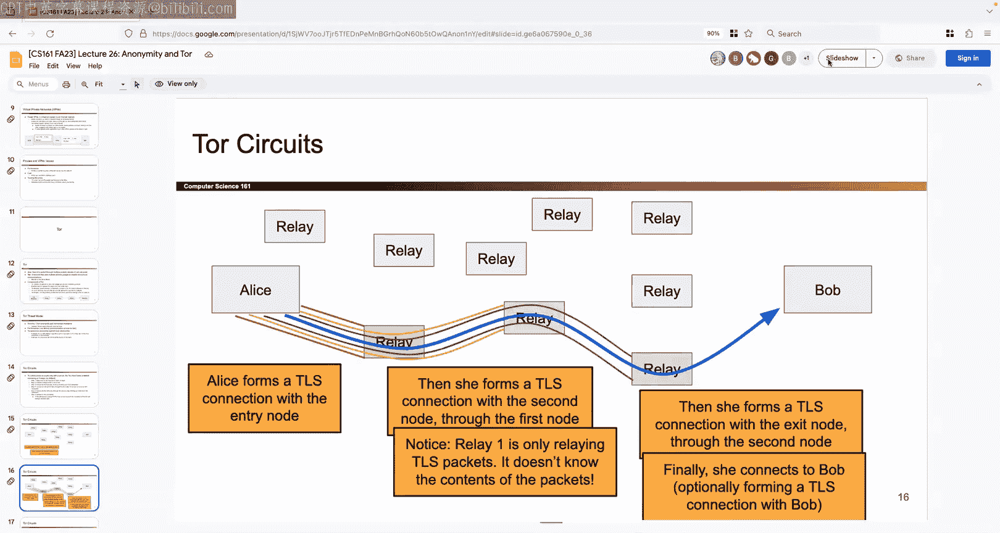

# 025：UCB《计算机安全｜CS 161 Fall 2023 ｜ Computer Security at UC Berkeley》Calude-3.5翻译 p25 -25--CS161 FA23- Lecture 25 - Malware and Hardware Vulnerabilities.zh_en -BV1YGbceREDs_p25-

嗯。Okay， I know it's the holidays I everyone wants to go home so appreciate you spending your Monday night with us all right。

 let's talk about malware。So quick rundown of last time we talked about path rev attacks that was our motivation for intrusion detection talked about how the dot dot lets you navigate up in directories and if the user input is treated as a file path they could navigate the photos that they shouldn't we talked about how the place where you put the detector determines what the benefits and the drawbacks of the detector are so if you put it at the network level it's cheap but there are evasion attacks it doesn't interpret things the same way as the endhost if you put it at the endhost then there are fewer inconsistencies but it's more expensive and then we talked about how you can generate logs from servers where you can have the servers automatically generate logs and then just read them overnight we talked about ways in which detectors can go wrong there were false positives false negatives and one of the keys and I think one of the like few really tricky parts of last lecture is that when the base rate of attacks is very low like there's five attacks and 10 million non-attacks it is really hard to find those attacks because you're going get a lot of false positives in addition to those。

RealAt and trying to figure out which ones are false positives and which ones are real attacks can be tricky。

Okay， and then we talked about the four ways in which you can detect things so you can detect things using an allow list that would be specification based。

 here's what's allowed， everything else is not and I flag on everything else signature base says here's not here's what's not allowed。

 everything else is okay。Yeah and then anomaly base says let's do some like fancy machine learning。

 find a model of what normal activity is and the behavioral says forget looking at the input let's just see what the results of the input is and see if that's evidence of compromise okay and we talked about vulnerabability is gaining attack your own system。

 a honeypot， a system that's sacrificial and if someone accesses it then we know that they might be an attacker we talked about how you have to analyze and recover what happened afterwards and then at the very end we talked about how intrusion detection can kind of merge with the prevention systems that we've already seen。

Okay， that's like my one minute rundown of last。Okay so I have like three more topics this semester that I get to talk to you about So first one is malware。

 which is probably most of today and an tour maybe next time if I get ahead of time。

 maybe we'll start it today and then everyone's favorite Bitcoin at the very end okay so let's do it these are all random side topics at this point since we have the time so I guess we'll start with malware okay so malware the term it's short for malicious software we took the mal and theware we put them together and it's just some fancy way of saying any attacker code that runs on someone else's computer that shouldn't be running on someone else's computer we can call it malware sometimes you will call it malcode for the purposes of this class is the same thing and what can malware do well it's like all the things that we've been talking about all class so malware can delete files some sort of denial service attack it can send spam email denial service you can steal information like private keys you can record and spy on what the user is doing so all stuff that we've already seen。

And so like well then what's the point of today I thought we've already been seeing malicious code I've already seen shell code I've already seen SQL injection payloads so what's the point of today so today we're gonna to look at malware through a slightly different lens and not necessarily how you construct the malware or how does that malware actually go from computer to computer because sometimes you don't want to just attack one computer you want to attack as many computers as you possibly can so that's what today is going to be about okay so we're going to see how to spread that code from one computer that's infected to tons of other computers okay。

And hopefully we want to do it automatically we we don't want to have to manually attack so many different computers。

 so we're looking for some sort of automatic strategy and one of them is to write something called self replicating code this is not is super mysterious and funky。

 but the idea is that if somehow。Sorry， if somehow you can write a snippet of code that when you execute that code。

 it prints out a copy of itself。Then that's called self-relocating code。

 it's really a mysterious obscure area of programming and one of the few use cases besides I guess like puzzles or whatever is to try and write code that's malicious because if the code is malicious and you run it and it outputs a copy of itself。

 then maybe that code can like send a copy of itself to other computers automatically without you having to do anything so that would be dangerous okay。

If you have self repplicating malware like this， you can classify it in one of two ways。

 there are also others out there， but for this class we'll show you just two so we'll talk about viruses and worms。

 the main difference is that a virus requires the user on that computer that's infected to do something before the virus propagates and goes somewhere else by contrast a worm is going to propagate itself even if the user doesn't do anything so that's the main difference but sometimes the distinction is not always clear so sometimes there's code that's sometimes a virus or sometimes a worm it can have characteristics of both there are other categories out there like Trojan malware that we're not going really talk about but that's the general outline for today we'll talk about two different ways in which code can self-proagate。

Okay so why might you want to do this besides all the things we've talked about like for money for fun for politics。

 well there's already one application that we've already seen which is do you remember how in the denial of service lecture we were saying well one thing that's super powerful is distributed denial of service because you have all these compromised machines and you tell them all to attack one computer and now that one poor computer has no idea where the attacks are coming from because they're coming from all different corners of the internet how would you get this like army of compromised machines well one way to do it automatically is to spread malware and now every single computer that's infected and compromised by the malware might be under one attacker's control and now the attacker can take all those computers and send them after one target and now that target gets hit with the doA attack so that's one possible application in addition to all the other ones you've seen all class okay so I'll do viruses then I'll do words and then we're done with malware so we already said the main characteristic that makes a virus special。

Different from a worm is that you have to do something as the user on the infected computer to make that code propagate so the user has to somehow run that code themselves。

 so maybe somehow the virus gets itself onto the computer and it's sitting there as code but it doesn't actually run the code and the user actually has to run that code somehow before the virus spreads so that's a characteristic that makes a virus a virus。

So how do you actually propagate the code then？How do you know I could just email the user some code but that doesn't seem very convincing so things I could do are I could somehow maybe modify code that I know that the user is going to execute eventually so maybe on my computer I have an app that I use all the time like I don't know zoom or my web browser if somehow the infecting code is able to go into the web browser code or the code for zoom or whatever and modify it and attach some code that's malicious then we know that eventually the user is gonna open that application and then the malicious code is gonna run so that's a possibility we could also try to infect code that's going to run by the system so for example every time I open my computer for the first time the system probably run some code so maybe I can try to inject code into that maybe somehow the user has a file that they really like to open in that file you can like inject some code but the thing that all of these have in common is that we're taking code that's already there and we're modifying it and that code might not necessarily be executing right away but。

is the user chooses to execute that code， if they don't know any better。

 now they're hit with the malware that starts running。Okay and as we said before。

 this stuff is selfproagating so as soon as you run that code not only does it do okay interesting so as soon as you run the mal code not only does it do malicious things like know encrypt your data and ask you for money or whatever but at the same time it's also going to try and infect other systems so itll go around for other systems to infect and then try to send this code and injected into those computers the same way it was injected onto your computer so maybe somehow's going to like send a bunch of emails copy it to a flash drive and try to spread itself to other computers okay。

So how do you detect this thing We talked about what the attacks look like So I was think about if you were someone trying to detect the virus。

 how would you do it Well we just spent a whole lecture talking about intrusion detection so we can think back and be like there were all these different strategies like behavioral signature based so which one do I like better and it's kind of an open end question we can try and think and predict which one I like do I like signaturebased specification anomalybased behavioral so I think about viruses and I remember what do I know about a virus it's the same piece of code being copied over and over and over again and if it's the same piece of code being copied over and over again well that code's probably going to start looking really familiar really fast So if I think about my four strategies I kind of like signature based because signaturebased detection says here's a pattern that's really common if you see it it's a virus and I know that viruses tend to just make copies of themselves over and over again so I feel like signaturebased detection is a good strategy here because if I see the virus once I can write。

It down and be like this is a virus。 and then if I ever see copies of that virus elsewhere then I know that yeah this was probably the virus that got copied so sometimes the signaturebased detector well I mean you can go out and like sell signaturebased detectors I'm not sure how many people would buy them but another thing you can name them is you can call them antivirus and that might be something you have used before so antivirus really is just often signaturebased detection it's got a huge list of all the known viruses and then when you run some code the antivirus checks against the signatures and if it's like this is kind of familiar maybe it'll flag it as a virus okay so there can be checklist of viruses companies or organizations can get together and pull their knowledge and come up with code that's common as a virus okay so now we've introduced kind of an arms race we've seen this before over and over in this class where attackers try to make their attacks better and then the defenders trying to make their defenses better and it goes back and forth and back and forth and so the same thing happens with viruses because。

As these antivirus companies and organizations get better and better at finding viruses now it's the attacker's job to try and avoid that detection and then maybe the attacker comes up with some new strategy to avoid the detection and then now the companies have to find a way to detect that so it goes back and forth and there's no like clear winner this is probably going to go on forever so attackers are going to try to evade the detection strategies that are there so maybe like make the virus look different so now the detector can't find it try and like avoid the signature or whatever the signature looks like somehow if I want to change it up maybe I' have to change it up automatically and if you're asking who wins it's kind of an opinionated thing like I don't know if there's a factual answer here one could argue that the attackers have a slight advantage in this race because the attackers can see what they're up against they can look at the antivirus offer and be like these are the signatures and here's how I get around them but by contrast if you're an antivirus company you cannot go up to the attacker and ask them hey。

 what are you planning。The attacker is not going to be so nice and tell you。

 so maybe in the information race， the attacker has a slight advantage， but。

It's kind of open to interpretation， I'd say。Okay so how do you avoid this evasion strategy So one way to do it is you could do something called polymorphic code and the idea here is well I remember that when I encrypt something I scramble it up and it looks really different So maybe if I just keep reenrypting this code over and over again with different keys it's going to look different every time So that's what we're going do we're going take the virus code and every time we spread it to someone else we're going to encrypt it with a different key and also give the decryption key so that whoever receives the code is tricked into decrypting it and running it So here I'm taking advantage of the fact that encryption schemes scramble up the input and if I use different IVs and different keys。

 the scrambled input looks really different So this is a really confusing use of encryption I'm not going to light you gonna have to stare at it a little bit because this is a weird case where I don't actually care about confidentiality I don't care if people know what the code is In fact I want people to know what the code is I want all of my。

Getts to run this code as an attacker so I don't want to make it know I don't want to like hide this information from people I want everyone to know what the code is so they can run it so the only reason why I'm using encryption is not for confidentiality in this case but only to make the code look different every single time sometimes the term people use for making the code look different is obfuscation so here I want to obcate the code and make it look different I don't actually care about the confidentiality properties of encryption I just want to make it look different so the the detectors when they try to look for a common code they cannot find me so I do not actually care about the security in terms of like people cannot read this code and in fact if you look at how this thing propagates every time I give the encrypted code to someone else I am literally giving them the key to decrypted so i'm not only am I like here's the encrypted code here is the key to decrypted here is how you decrypt it please decrypted so you run my malm so instead of using encryption to secure your communication。

You're intentionally using it in an insecure way in terms of confidentiality。

 but you're still achieving your goal of making the code look different every single time。

 so it doesn't matter if you're using a great encryption algorithm nobody cares because you're not looking for confidentiality nobody cares if you leak the key in fact you want to leak the key so that other people can decrypt it so here's like a picture version of it here's your original code。

And then when you want to propagate it to someone else， you send them the code that's encrypted。

 but not only do you send the encrypted code because then they can't execute it you give them the key and you're like here's the key please decrypt this and run it and in fact here's exactly how you decrypt it so like please decrypt this thing and run it for me so maybe you give them a piece of decrypt your code that takes the key decrypt it and then runs it runs the code okay so use this key。

 please decrypt this I really want you to know what this value is so you can run it so that's what polymorphic code looks like。

Every time you do it you can use different IVs that would swap up and scramble everything up。

 you can even use different keys because again I'm not using the keys for security。

 it's kind of backwards to think about this is the one case where I'm not even using encryption for confidentiality。

 but I can use different keys， it doesn't matter， I just want this encrypted code to look different every single time。

Okay so now if I look at these two pieces of code and I'm the signaturebased detector I'm going to have a lot harder time trying to find whether or not this is a virus because all this stuff is scrambled up and maybe the antivirus isn't smart enough to realize that this is actually two pieces of code that's identical just encrypted differently if I was just looking at these two things of strings I would have no idea that they were the same piece of code because the encryption is scrambled at all alone so how do you stop this well one thing you could do is if I stared at this really hard I'm like wait a minute this is almost all different the keys are different the encrypted code is totally different but like this code appears in common the code that says please decrypt this and run it。

That's shared between both of these and in fact it has to be shared between everyone because you need to tell everybody please decryptors and run it so maybe instead of flagging a signature on the whole thing you just flag a signature on this little piece in red and you say I'm going try to just find that decryptor code so does that work Well kind of one problem you might imagine is that now is' harder to find that code because it's a smaller chunk of code so it's not as easy to find that little piece of code you can have false positives in fact this decryptor code could be all over the place it might not just be a single chunk of code。

So it's a little bit tricky to find it you can imagine this false positives because other people might be writing regular decryption code as well。

 like the line of code that's like decrypt and run this that could be pretty common maybe there are false positives out there Another idea is maybe I can just run this code and see if it starts decrypting stuff and maybe if I run this piece of code and it starts decrypting itself I'm like wait a minute it's something weird just going on here So here you have to be really careful because you don't want to accidentally run this code and suddenly it decryptive stuff and starts running malcode or malware so you have to be a little bit careful you might have to use a sandbox remember a sandbox is this isolated environment that you cannot break out of so you create the sandbox that the malicious code can't break out of you run it and you see if it starts decrypting itself you could also try to analyze it without even running it and just read the lines and be like is this decrypting stuff that's something you could try and do。

You have to be a little bit careful because maybe other programs do the same thing so you can imagine again there are legitimate programs out there that want to perform decryption so you might get a trick by those you might see false positives there could also be a problem of what if you executed for 10 minutes and there's no decryption does that mean you're good or does that mean the attacker has just like let the code sit for 10 minutes before decrypting to try and throw you off so you have to be really careful attackers can be really clever and the defenders also have to get really clever okay so that's polymorphic code is one strategy all good with it is there anything on zoom okay。

Okay something else the name is so close that I always forget which is which but there's another one called metamorphic code so this time I'm going to take the code and it's still gonna to run and do the same thing but I'm going change it up a little bit I don't endorse this but you know how sometimes people are like oh I'm gonna to give you my homework but can you just change it up a little bit so the teacher doesn't notice that's what metamorphic code is doing' going to take the code and change it up a little bit so that the detectors don't notice not endorsed if you do it we will find okay but the idea is that I'm going perform the same action but I'm going go through the code and try and change it up just a little bit so that they don't look exactly verbatim the same so somehow I'm gonna to have to include some code to do this automatically I don't want to do this by hand and this stuff is out there so you can imagine if you're writing assembly code if anyone's ever written like risk5 code and C a6 andC those registers don't really matter which one you use sometimes so maybe this code uses T1 and then this other code just swaps all the T1s for T2s。

it does the exact same thing， but now they look a little bit different if that doesn't make total sense it's okay。

 but if you remember from C61C programming and assembly sometimes the registers can be swapped around in Om cares doesn't change anything。

 you can try and like change the ifL statements instead of saying like if I don't know if flyhes true you could be like if flyhes false and do the other thing first something you could try and do you can reorder operations that don't have any ordering dependence so if these two things can happen in any order。

 you can try and swap them around， you can swap little algorithms in your code so I have a helper function that sorting。

 right now it's using merge I want to swap it out use Pix sort。

 it's going to do the same thing but maybe it's gonna to make it less likely for someone to notice that this is the same code I could add code that does nothing useful so just add a bunch of dummy code that does nothing to hope to throw someone off so these are all ideas that are out there。

And this is a super odd topic but someone tried doing this。

 I don't know if they were like inspired by this lecture or whatever but someone tried doing this on Project two and like we got them so don't try it okay so you've been working okay so this is what it might look like you might say well here's a little piece of code that not only takes this virus code and sends it to someone else does the self-proagation but at the same time it also tries to rewrite this code and change it up so that it looks different the next time around so that's what it might look like construct something that is different but semantically or semantically different but functionally the same which means I do all these little useless changes and keep the code the same and then I send it to someone else in fact you can even maybe try and rewrite the rewriter so whatever code this is that's like rewriting the code that's also a piece of code so maybe you can try to like rewrite itself kind of gets meta but that's something you could try and do okay that's the highle idea take the code change it up hopefully the signature detection doesn't notice so。

How do you catch this Well now you can think I guess I spoiled it oops but you can go back and think about what are those four ideas so suddenly signaturebased doesn't look so hot anymore because signature based is looking for patterns but metamorphic code is intentionally avoiding as many patterns as it can so signaturebased detection not the winner here but if I go through those four ideas turns out the winner is behavioral detection so trying to think about like why is behavioral detection the best here because remember behavioral detection doesn't even look at the input doesn't even look at the code to see if it's an attack behavioral detection only looks at what the code does so if I have two pieces of code that are totally different but they do the same thing behavioral detection is really good at noticing that these two pieces of code do the exact same thing even though they're different pieces of code so here's a case where signaturebased detection and not the best but behavioral detection really stands out and does a great job okay so now i'm not going look at the appearance of the instructions I don't even care。

Someone rewrote it， if it does the same thing， behavioral detection will notice that it's doing the exact same stuff and then flag that way。

Behavioral detection， I think is the best way to go for metamorphic code So how do you stop behavioral detection right again。

 every time the defenders come up with something， the attackers are gonna try to subvert it So you could try a couple of different things。

 one thing you could try and like add random delays So suddenly it's like wait this code is running but this code is just sitting there doing nothing maybe it's okay and then maybe like an hour later it runs or something so you can try and like delay the analysis or trick the antivirus by waiting a little bit until the antivirus thinks this is okay。

 I'm gonna like stop looking at it and then it starts running maliciously if it's really smart。

 maybe it like notices hey I'm being run by the antivirus because like some sort of debug flag is on So I'm going to just play it safe and do something totally non malicious for now because I think I'm being watched So if code is really smart I can try and do that and maybe the antivirus software then comes back and tries to like if or catch these evasion strategies So again it's back and forth race okay。

That's metamorphic code So at this point you're like。

 well it seems kind of hopeless for the defenders because the attackers have all these different ways to like shuffle things around and make things look weird and unfamiliar So there is one advantage that I think the defenders have here that's really helpful which is well you can somehow flag unfamiliar code So why is that useful I guess first I'll say that there's no way to actually write a perfect detector for malware because this kind of gets into like the weeds of CSs theory if anyone's ever taken I think the CS70 talk about this。

 I don't know I know CS70 or 170 the algorithms class talks about this so there's this famous like computer science theory thing called the halting problem and there's a proof that it's not solvable and so the halting problems says something like if I give you a piece of code tell me whether or not this code like terminates or infinite loops and it's impossible to solve that and in the same vein if you're convinced by that then。

might also be convinced that it's impossible to write a program that takes in some code and tells you if it's good or bad whatever good or bad entails so like on a theoretical level in addition to just any practical level you're never going to be able to write a program that's like here is a piece of code please tell me with 100% accuracy if it's good or bad that's just not going happen so instead you're gonna have to come up with detection strategies that are good enough so one that is really nice it combines two ideas and they work really well together it's a great synergy between them is first you can try and look for code that you haven't seen before so。

You might keep this repository of all the stuff you've seen before。 So for example。

 I know that everyone's downloading you know Microsoft Word or something is probably good。

 So here's a copy of Microsoft Word。 and it's a reminder to myself that this code is fine。

 I've like checked it before it's good and lots of people have seen this code before and haven't had problems And so if I get a piece of code that's not part of this like archive of code that's really common then I should start to be a little bit suspicious as a detector because I'm like here's all the code that's really common that I see all the time。

 I have never seen this piece of code before。 maybe it's new。 maybe it's the virus。

 and I'm going to start to be paranoid So that's something you could do something you could do is you could like team up together and everyone can contribute to a repository of code that they've seen before you can use hashhes if you want to so you don't have to store the code in its entirety but it's kind of an optimization thing So why is this so great because now you're gonna stop the attacker no matter what they try in theory So what if the attacker tries。

To do something malicious Well， you can catch them by using signaturebased detection so if they try to keep their code the same well you already have this big list of familiar code So all the code that you've ever seen before is in this big repository and you're like here's all the stuff that I think is good。

 here's all the stuff that I think is bad So if the attacker decides I'm not going change my code I I'm just gonna to leave it as this and see what happens。

 you're gonna to get them because you have this big library all the code that's good or bad So now if the attacker tries to just write code that's normal that's not totally changed up and weird。

 you're gonna catch that But what if the attacker tries to change up their code and make it look unfamiliar well you're gonna catch that too because if the code is unfamiliar。

 you're gonna think it's suspicious So now the attacker is stuck in this really tough decision because if they make the code look familiar you're gonna catch them there's a signature if they make the code look unfamiliar you're going to treat that new never seen before code as suspicious and you're gonna catch the attacker that way So now the attacker is kind of in a lose loose situation。

So one good strategy if you want to be really paranoid and careful is if you ever see code that you've never seen before。

 you should really stop and think twice before running it and a lot of antivirus software will tell you this like hey。

 I've never seen this code before， what do you want to do okay？So。

That's the idea behind viruses and maybe ways to stop it。

 This one kind of gets more into again like the business and like real like economic side of security than the theory of it necessarily。

 but you can imagine these antivirus companies as much as they are good intention I think they want to help us they also exist to make money because that's how the world is these days everyone needs to make money such as capitalism so one thing that kind of happens is well these antivirus software companies they really want you to buy their software so one way they're going to try and make you do that and I'm not like accusing any company in particular because I I don't know antivirus well enough to accuse anyone but one thing that they might try to do and you as a consumer now know about is we know that attackers intentionally try to make their viruses look different so one piece of malicious code could be written like 21 hundred1000 different ways to avoid detection so how do you count how many viruses that is is that one virus that just got。

A bunch of times or is it  a thousand different viruses you might argue it's one the antivirus company that wants to like scare you and make you buy their product。

 maybe they argue that it's a lot。 so maybe the antivirus company says well I'm a great software because I know how to detect like 5 million different viruses but is that really 5 million different viruses or is that just like one virus copied over and over again that are totally changed up so you have to be a little bit careful with the way that people advertise things I don't actually know what like organization or software this is but they are claiming what is this like 1。

2 billion viruses in 2021 so either there were 1。2 billion like brand new programs written that were malicious or maybe a lot of those were copies of each other that were changed up you be the judge so just putting that out there basically says antivirus companies as much as they are kind of on the side of computer security and not on the side of the attackers。

They might still try to get your money one way or the other， okay？That's it for viruses。

 anything else you want to know about them。Okay shall we talk about worms okay so remember we talked about there were two types that we care about in this class one of them was viruses second one was worms and the difference with the worm is that you do not need users to do something to propagate the code so unlike viruses where the user had to like open an application or run a piece of code or download an attachment and open it in order for the code to run the worm is going to just run the code without the user having to do anything so one way to do that is maybe you alter some code that's already running as opposed to code that's in storage so for example。

 if you do a buffer overflow injection then the user doesn't have to do anything for that code to run the code was already running you injected something and then now the show code starts running without the user taking any action so now the user doesn't have to do anything the worm was just going to start running and spreading even if the user doesn't touch anything because you might be altering code that's already running okay。

So how do you then find other host to infect This is kind of in common with both viruses and worms You got to find new people to infect so how do you find new people to infect if I like just ask you hey go out and find like10 people to infect how do you find 100 people So one thing you can do as a computer is you can just pick randomly so you can be like well there's all these different IP addresses I'm gonna pick one try to connect to it if I connect great I'll send them a virus if I fail to connect because the IP addresses is invalid or it's not assigned to anyone okay I'll try another one so maybe that's how they're gonna go just try randomly you could try and use Google to find people so I can just go on Google search for as many IP addresses as I can and send a bunch of viruses or worms to them I could scan and like look around the internet and use network protocols to probe and be like who's available for something and see who responds and then send them some malware I could have lists out there so maybe people sell lists of targets out there？

You shouldn't do that but maybe there are lists out there of names that can be targeted from like mailing lists or whatever maybe somehow the computer that you're infecting has a list like a contact book or something that you can use to find a bunch of people you can go and like ask a thirdpart server like hey Facebook give me like a list of users or whatever and if it chooses to do that maybe that's a list of users that you can find you can even do this passively and just sit there and wait for someone else to contact you and then hit them with an infection So all of this is to say there's lots of different ways to find new users to infect it's like only limited really by your imagination and then how do you force the code to run remember you cannot rely on the user doing something or clicking on something or opening something so how do you get code to run even if the user doesn't know about it you could or doesn't take any action you can use a buffer overflow we know that those inject into code that's already running you could somehow do some sort of excessS vulnerability on a website that's already open something like that so again lots of different。

Attacks out there， but the goal is to get code to run， even without the user taking action。

 that's what makes it worm or worm， okay。So in this section we've kind of told you how worms work and how they propagate so at this point I'm going to start talking about how you model worm propagation and I find this really interesting because it has like all these weird and interesting deep connections to topics that you might have never expected to see in this class so the idea is that worms can spread really quickly and in fact they spread exponentially so I'm sure you've seen exponential growth like at some point the intuition is that if there are more computers infected and every one of those infected computers is spreading and trying to like infect more people then you get this exponential blow so if you imagine the first infected computer finds two people to infect and then each of those two people find two more people to infect now you have four people infected each of those four infected people find two more people now you have eight people each of those eight people find two more people you have 16 so it keeps doubling you get the sort of exponential growth and it's true that you can probably use the same thing to model a virus but we're gonna to use it to model worms in particular。

Because worms can propagate even if the user doesn't do anything so there's no time limit like oh I gotta wait for the user to wake up and open Microsoft word to get infected worms are just going to spread as fast as they possibly can so this is a good model from them okay so there's exponential growth hopefully you've seen it at some point before so。

What I find really interesting is that turns out when you model these things there turns out to be all these really deep connections and the graphs and the structuress that they come out with turn out to be really similar to the models that people use to model epidemics or pandemics which this lecture was made like I think 2020 or 201 so like we were all too familiar with it at the time so it turns out that when you're trying to model the spread of something like COVID well a lot of the models that they use are pretty similar in like very deep ways to the ways in which we have to model worm propagation so how might that be the case let's think about how fast does the worm spread well it depends on things like how many people are in the population just like in biology how many people are in the population that might be infected how many of those people are vulnerable so like COVID spread maybe slower because it was looking for people with high risk or whatever maybe like Ebola anyone remember Ebola like that was spreading really quickly I think。

Maybe more infectious to people even if they weren't or more people were vulnerable， I don't know。

 clearly I'm not an expert， but you can say the more people are vulnerable。

 the faster the worm is going to spread in computer science world。

 this could be something like maybe I have a worm that can only attack like Windows XP or something really old well then maybe a small population is vulnerable to that。

 but if I have a worm that can attack any computer in the world。

 maybe that's going to spread a lot faster。There's the number of infected hosts so we already saw this from before。

 the more people are infected， the more they're going out and infecting other people。

 so that's something we have to worry about the contact rate that seems kind of interesting remember however' like stay home because if you stay home you don't go out and like interact and get other people sick so in the same way if all the computers that are infected don't actually connect to the internet and find more people to infect then maybe they're not spreading as much as they could be if they were connected to the internet so we have to think about how often these hosts communicate with each other so a lot of stuff that seems kind of familiar to us if we know remember those COVID days okay。

Here's an example of a model that people built to try and think about you know how often or how fast the worms spread so here I have a graph on the X axis is I go from left to right I'm going through time so is this is hours zero after the worm was released this is 20 hours after it was released and on the Y axis I have how many people were infected so I can see that starting at zero nobody was infected 10 hours later was 50。

000 people were infected 12 hours later 100，000 people 150。

000 and it starts going blowing up exponentially so initially this looks like what we just talked about exponential growth the more people are infected the more they can go out and infect other people so the very first part of this curve where it just starts curving upwards exponentially like that makes sense that matches our model but what about the second path why doesn't it just keep blowing up into infinity why does this start like flatlinning for the end。

Ining I guess I spoiled it again with my clumsy fingers but think about like what happens at this point where it's like like it wants to keep going up exponentially。

 why is it not going up exponentially well turns out that eventually at some point it becomes harder to find people to infect if most of the population is already infected the probability or the odds of finding someone that's not infected to get someone new infected it starts to decrease So eventually as like almost everyone out there is infected this curve starts to slow down because the entire population is infected and so trying to find more people is harder so you get something called logistic growth that's what this curve is named so logistic growth says it's exponential at the first in the first part and then it tapers off near the end so turns out this is a really good model if you look at these two colors why are there two colors the red is a just pure logistic model that someone wrote as a math equation the blue is the actual thing that was observed in real life you can see it's pretty。

Close so whoever modeled this did a pretty good job and they used ideas that come from like biology and epidemics so I find that pretty interesting okay so it's I got to note about worms and how they propagate and they use logistic models and anything else you want to know before I give you a speed run of like the history of worms。

Okay。So this actually can kind of just like sit back and enjoy the stories Almost all of it is blue slides There are a couple takeaways here in there that I'll point out。

 but I'm not ever going to quiz you on what dude was the Moore'sor created because I don't care but the Mooresorm was created in 1988 this is really really early people sometimes called this the very first one and honestly for the first one it's pretty d impressive because it exploiting buffer overflows in 1988 this a long time ago it's bruforcing passwords。

 it's exploiting user accounts that are common so it's pretty sophisticated for a worm in the 1980s and then the way that it finds other users it scans the local network to see who else is there it looks inside the systems like network configuration files to see if there are other machines in there they can attack it can attack it looks through user files if you have like a TxT file that's like all of my friends TxT it can look through that and' try and infect other people so like this is a pretty sophisticated thing for the 80s。

If remember correctly this thing was like written by some graduate student who I think was just doing it for like research or hobby or whatever and then just accidentally got out there oops and then FBI came calling and so it wasn't a great day from Morris but I think that was the story we gonna look it up later if you're curious but I remember this had a pretty interesting story behind it so now we jump forward to 2001 now we're starting to talk about modern era of worms and so in this case there actually was a target in this case the target was the US White House so what they tried to do was they tried to take down the White House website doing a distributed denial of service attack so it spent some time spreading first because you have to go out and get a lot of computers and like assemble your army to attack one website and then when the army is assembled everyone floods the IP address of the White House's website and the White House had to like change its IP address and switch to a different domain or whatever so that all these computers could stop attacking it so it was pretty damaging out there。

I don't actually know what the political motive was。

 but I guess there weren't you know White House fans out there so that's what they were doing okay。

How do you exploit it， they were explaining at this buffero overflow in some old web server thing and the thing that I find a little bit sad is that that vulnerability that they exploited was known to the community like everyone knew that it existed and they actually already fixed it like a month before this attack so in other words the only people that were vulnerable where the people who did not update their system for one month and left themselves vulnerable to this attack so if you need a lesson from this slide like you got Is update do you want to update your system is super annoying but for security reasons like you kind of got to do otherwise this stuff happens that's code red how do you find users I'm not going to read all this but you can use random scanning we talked about this and something that's a little bit funny about code red and one way you can mess up a worm just by like writing it very subtly wrong is that everyone that was infected was using the same PRNGC to generate IP addresses so imagine what happens if everyone used the same seeds like if all of us have infected computers and。

We all see at our IP R the same and then we start looking for random IP addresses What ends up happening we all get the same first random IP address because we're using the same PRNG seeed the same weight and then we're like okay now let's try another one and we all get the same second IP address and then we all get the same third IP address so even though there's like so many of us that are infected we're all repeating the same work over and over and over again so this caused the worm spread to not be exponential because even though they were say like 16 people infected all 16 people were trying to attack the same person so you did not get exponential spread that was the first release it was bugged the second release they changed it up so the PRNG has different seeding now you get exponential or logistic growth because every one of those 16 computers is looking for different host to infect as opposed to finding the same ones so turns out even the people that write these worms can get around sometimes and if they do that can affect things like how fast this thing spreads okay here's slammer slammer was。

fastt and really damaging The reason why it was so fast is because if fire things using UDP So if you have this entire piece of malware that fits in a single UDP packet then you can just take that UDP packet and just start firing it anywhere you can and who cares about TCP handshakes and waiting for the handshake to finish and then sending your payload I'm gonna to take this thing I just fire it to as many different people as I can if it doesn't get there。

 who cares keep sending if it gets there and it's not accepted。

 who cares keep sending this thing over and over again So this thing was extremely fast took like thousands and thousands of hosts down in just a couple of minutes and you got this like massive growth So here in red is the predicted exponential logistic growth and eventually up there it's going to like taper off But if I look at slammer slamber didn't even get that far so it's supposed to go exponential but around I don't know 1800 seconds or what is that like 30 minutes or whatever is that 30 minutes。

30 minutes it starts to just taper off even though the model predicted it can still go。

So why did it taper off here why was it like not going up exponentially like they thought it would well turns out Smer was so freaking fast that the network itself just ran out of processing capacity because everybody was like trying to send this UDP packet over and over again so this simply broke the internet itself before it could go back more exponential so that's how fast Lamer was okay？

There was more I'm not gonna keep talking about all of these so this one was kind of similar again and again we find out that there was already a fix and then this thing was released after the fix so again if everyone had just simply updated their systems in time this one not have been a problem but it was and people got their file systems broken I guess so knows bad it was Stuxnet so Stuxnet's kind of interesting it's all like go through the story I guess so this one's from like 2010 and it turns out that it used zero days so this is from like lecture one maybe but remember that a zero day is a vulnerability that is not known to anybody and so these things are super valuable because it means that this is a brand new vulnerability nobody knows about it and because no one knows about it there's no defense published there's no patch so if you use this vulnerability on someone you're basically almost guaranteed to succeed because no one knows about it that's why it's called zero day you're the first person to know these things are super valuable like millions of dollars in cost because you want to know。

Or if you know about a zero day， you can use it on anybody that you want。

 including all these like different rich powers for people， and they will never be able to stop you。

So not only did this worm use 10 day， it seems like used for which is a lot like that's a lot to purchase or develop over time and it somehow hit code on Windows drivers so a lot of code that runs on our operating systems is signed nerves to prevent people from modifying it so like operating system code from Windows or Apple or whatever is often signed and that way if someone modifies the operating system you can find out but somehow this attacker was able to like steal those private keys or maybe bribe these people to like sign the code so it would look legitimate how did you find users to infect this particular worm use USB flash drives and know spread inside networks so this means that not only are you able to spread over the internet but you're also able to spread using flash drives so even if there's a computer out there that's never going to connect to the internet ever and we talked about how those are often like those topsec computers that are not connected to the Internet so they're less vulnerable to being attacked。

You can still attack those if someone plugs in a flash drive to download some data onto that computer so I can spread using flash drives and then when that flash drive gets plugged into a computer it gets infected So this thing seems pretty high tech doing all this fancy stuff that you'd imagine normal attackers don't have the capability of so what was payload if you have40 days。

 what do you plan to use them on you can use them on anybody in the world and you know it's gonna to work So who are you going use it on So here's what the payload was so it turns out if you use this attack on like 99。

9% of computers in the world it would do nothing if I took this payload and sent it to any of your computers it would just be like exit it would do absolutely nothing so already kind of weird however if your computer is connected to a centrifuge which is one of those big spinning machines at this very particular like spinning frequency and apparently this is the frequency for like nuclear weapons or whatever and apparently what this payload does is it's going to take that。

Centrifuge code and like speed it up so that that thing starts spinning faster and faster and just eventually flies apart and destroys itself and it's gonna to send fake readings to make it look like nothing is wrong and then eventually once it's like blown into a million pieces drop the frequency range back down as if nothing happened so I guess I spoiled it again using my clumsy fingers but like maybe from the store。

 you can already kind of imagine this is not just an average attacker out there doing this for fun or for money right this is like political So turns out our guess。

 although I don't think this is confirmed in any way is that the United States and Israel created this to target a nuclear program in Iran so this is a case of governments like our government in fact coming up with malicious software and mal we're intentionally used to attack another government's infrastructure and it's like physical right so it's not only that we're attacking people's computers and deleting the software we're just straight of going and like tearing centrifuges apart and I guess how you feel about this is it' a。

know nuanced topic， but the idea is that computer security really is political when we say that like it's not only just people deleting files or you know trying to make money like it really can be used for political systems and here's an example。

 so that is step spend okay。There's other ones out there so here's one that was used to implement ransomware so they were like I'm going to encrypt all your files if you want them back and you want the secret key to decrypt them pay me some money so that was something that people tried。

 sometimes it fails here's a case where it kind of failed allegedly the U and the UK blame North Korea is that actually true I don't know I guess depends on how much you trust the U and the UK for blaming stuff on North Korea I'll never know but that's another example of worms that are possibly politically motivated or that the U claim was politically motivated。

 but I guess we'll never know so these kind of just go on and on on here's one between Russia and Ukraine that happened a couple years ago specifically attack like Ukrainian tax software so yeah stuff happens so yeah these things don't happen like in a vacuum right there's not just attacks that are out there to make money or to just shut down systems for fun there are a lot of attacks out there that are。

Politically motivated and often our governments are the ones implicated in them。

 so it's important to kind of be aware that these attacks。

 you know they have real political implications， okay。

So that's it for worms and that was your brief history of them。

 not too many takeaways like I don't need you to memorize what year this happened or what it is。

 but that's kind of the high level idea。Okay。Anything on zoom nope okay so I will quickly talk about how you clean up after someone has infected your computer with malware and then it be done with malware so so you have been infected with malware right you've got a computer and for better or worse you've accidentally been infected a worm has infiltrated or you opened an application it was a virus so how do you get rid of it well。

Now you have to start thinking about recovery and repair so you might have to be like some of these files might be infected or tampered with and I have to go and get the original files back so some companies will try and help you with this like antivirus software might try and like help you find the malicious code and delete it off your computer somehow but you have to be really careful because what if the malWware executed with higher privileges。

 maybe you accidentally gave the malware the ability to do things with administrator privileges。😡。

So so now they could compromise all sorts of different things。

 they could compromise your computer settings， they could compromise the operating system。

 they could compromise the antivirus software itself and try to make the antivirus software itself broken so oftentimes because of how hard it is to find code and recover and delete it when it's already buried so deep into your computer you may just have to like nuke it and start over it is kind of unfortunate but there's no better answer here but oftentimes when your computer is just so deeply infected there's no way to find it you may just have to go get some backups which hopefully you make all the time know as a good consumer you make your data backups and then you rebuild the system from scratch sometimes that's the best you can do okay。

And if fact you have to be really careful because what if on your computer there's some code that like initiates the operating system。

 what if the malware hit that too， Well suddenly you have to be careful about that too so you have to be really careful malware can bury really deep into your system so here's another person who thought really hard about problems like this and how malware can bur so deep into your system that sometimes you just cannot find it so there's a lecture that was given on this many years ago if you're interested。

 I think it is linked somewhere or you can just look it up but basically the idea and I think I'm probably like bookchering it somehow because this is like a well talk and I'm gonna to give it to you in like two minutes。

 but basically the idea is that maybe I have like some code and the code we'll see so I asked them executable it was compiled by some compiler or whatever and so maybe if someone compromises the executable so the executables like that see program that you compile into a bunch of machine ones and zeros if someone possibly like。

Compromises it Well now you might just have to go back to the C code and rebuild it so go back to the C code。

 run the compile command again run GCC， get a new fresh login executable that's not malicious so I'll go back to the compiler get a new unmodified and not tampered with login executable but what if the malware went deeper what if the malWware actually changed the compiler itself because what is the compiler it's just some program sitting on your computer just like any other program sitting on your computer so maybe the attacker actually got into GCC the program that's compiling C programs and actually took that down to and compromised that so now if you use that malicious compiler to get code out you might still be getting malicious code out so how do I get rid of that well now do I have to like rebuild the compiler the compiler is also a piece of code so it was built from something so what if I go back to the source code of the compiler and built that again but what if that was compromised to。

And you get this big chain of like well this could be compromised and if I rebuild it from this。

 this could be compromised and if I rebuild it from this。

 this could be compromised and so you get the idea it kind of chains backwards on and on and on and so the takeaway that I think Ken Thompson how was basically if you didn't write the code yourself you can't trust that at some point。

 especially if someone has compromised your computer they could dig so deep and compromise all these different programs that even if you try to rebuild stuff you could still be in trouble so it's really hard to trust code that's already out there。

 especially if you're worried that someone has tampered with it。

Okay there's another fancy term This is probably the shortest light ever was one bullet point。

 but if you ever hear the term root kit to fancy way of saying the malware that goes into the operating system itself so why would that be bad Well remember the operating system controls a lot of things like the disk is controlled by the operating system the operating system juggles all the different processes and programs that are running so if you control that you can do all sorts of fancy stuff for example。

 this malware can disguise itself really， really carefully for example。

 we know that the operating system controls the disk so when the antivirus walks up to the computer operating system and says hey what's on the disk is there anything I should look at well who controls the disk but malware does so the malware can just lie and say what are you talking about there's nothing malicious on the disk and the antivirus is no way to note because the only way for the antivirus to access the disk is to go through the operating system which is compromised So maybe the operating system now lies and says like oh there's no file what are you？

even though the file is actually there。We could also try and hide processes so if the antivirus says hey。

 can you tell me all the programs that the user is running the antivirus could get lied to the root could say what are you talking about there's no malicious program here's the list see it's totally legit and the antivirus has no idea that the operating system is lying how could it so。

It's really sneaky and hard to sniff out a code that has buried itself so deep into the operating system you can even try and hide yourself into like the startup code that runs when your computer starts up for the first time and we already talked about how a lot of computers nowadays try and stop that by signing their startup code so the first thing that you do when your computer wakes up is it checks that the code that it's running is signed and if it's not it refuses to run it so that's one possible way to stop rootkis but you have to be really careful and all of this ties by the way。

 all the way back into lecture wellmo we talked about the trusted computing base because if you assume that the operating system is the trusted computing base is' the thing that we can rely on to always be correct and if someone compromises that then maybe all of your computer security is out the window how do you find these things is incredibly difficult to find so one that you could try is you could run some a little experiment where you say I'm gonna run a scan on my computer and then I'm gonna take this disk and like physically copy the。

Dis to another computer and then scan again and if I get different results that's pretty suspicious how can I take a disk with the same ones and zeros burned onto the disk and ask one computer a question about it then take that disk move it to another computer ask the same question get a different answer that's really weird maybe one of the operating systems is lying to you but it's really difficult to find stuff like this and oftentimes you're simply stuck with just nuing the computer deleting all the code on it and starting over。

It's kind of a depressing end but unfortunately that's what your left was sometimes okay so I guess i'll wrap up and then you have a choice of we could either start tour and try to just you know get through it early and you can start your homework 7 or whatever or you go enjoy Thanksgiving evening break I guess we'll see so I'll quickly summarize so malware this was a catch all term for any attacker code that's running and the goal of today was to talk about how it can replicate and spread across different computers we talked about the difference between viruses which require users to do something to spread the code and worms which do not we talked about how。

If the code is copied from computer to computer signatureaturebased detection is really good by catching code that's copied over and over again。

 if they choose to disguise the code as attack or the attacker chooses to disguise the code you can try and do that using polymorphic code where you encrypt not for security like the weirdest thing of this lecture is that polymorphic code does not encrypt for security it just encrypts to make the code look different and it even gives you the key to decrypt so that's one way to change the code up。

 you can use metamorphic code like change up the variable names and make it harder to find and in those cases one way to stop that is to flag any code that you've never seen before so that's propagation and how you might stop it and how do you recover well oftentimes you can do nothing but reset everything and from scratch as we talked about especially if you have a root kit that's hiding in the operating system and I guess the only thing that's thought on here that we talked about is how worms are often modeled using logistic spread which is very closely modeled off like epidemics and pandemics。

And how those things are modeled。Okay。Look at that that's it for Maware okay so we have 23 minutes left I think Tares on which is the next topic is on the next homework that you have which we were kind of worried about because it's on Monday and your homework is still on Friday so you have the option should we start talking about tour for 20 minutes or you want to go home。

Do儿。Hands just go home no hands okay like one hand okay I guess i'll talk about it and if you would like to go home and just watch this later you know be my guest okay so I will start talking about tour if you have to go and enjoy your Thanksgiving break I won't be offended because I wish I was out there too okay so we just liked about malware so here's our like second to last special topic of the year which is tour and then after this there's Bitcoin and then we're out of here okay so。

In this section we're going to talk about one property that we've again kind of skimmed at and just touched on a couple times but we've never actually really dug deep into so todays the day we get to finally dig deep into anonymity so what is anonymity we saw it briefly when we talked about TLS and talked about how is not anonymousy so the idea behind being anonymous is well you don't want people to know who you are in particular if you're communicating over the internet you don't want people to know who is sending the message and you might not even want people to know who is receiving the message so one thing that at this point a lot of people start saying well isn't this just confidentiality you don't want people to know right in both cases but we have to be really careful because confidentiality says you don't want people to know what the message says if the message says something you want that to be protected that's confidentiality by contrast anonymity doesn't say anything about the content of the message it only says something about the identity of who is sending and who is receiving the message so in both cases you do not。

You don't want other people to learn something， but confidentiality is about the contents。

 anonymity is about the identities of the sender and the recipient， so they're very subtly different。

 but ultimately a little bit similar， I guess okay。

So turns out anonymity on the internet is hard and in fact。

If you're dressed by yourself it's really difficult as we'll see in a little bit so how do you make yourself anonymous because I'm here and I send a message and it has to have a reply to address on it you know I have to say who sent it so that I can receive the replies well then people can see who that is or who I am and for example think about the IP protocol the IP protocol is used by everybody on the Internet you can't change it is baked into every computer and what is in the IP protocol the IP protocol has the source IP address the destination IP address right there unencrypted in the header and you can't change that if you want to use IP you have to write down who you are and who the sender is or who the recipient is in the IP header and you can't change that so by yourself you're kind of hose there's something you can do because IP requires you to say who you are and who you're sending the message to so。

It's really difficult for anonymity。 One catches that for attackers It might be a little bit easier because what can we do with IP。

 we can always spoof So one thing we could do is we could we're spoofing Okay I guess it's not there。

 But one thing you could do is you could spoof so as an attacker if you don't care about getting replies you can be malicious and you can spoof and pretend to be someone else that could give you anonymity So an attacker has a slightly easier time being anonymous attackers can also try to hack into other people's computers which honest people are not going to do so maybe attackers have a little bit easier of a time being anonymous but for real users legitimate users who want to be anonymous things can be really tricky the main strategy。

 the takeaway from all this is that if you're just by yourself and you want to send something you have to say who you are and suddenly there's no anonymity right away So the main strategy to make yourself anonymous is to ask someone else to send it for you So for example。

I could go onto Zoom right now， I guess I can't do it because I'm screen sharing we can imagine I can go on Zoom right now if I have a top secret message and I don't want you to know it's from me I can go into Zoom chat and I can tell someone else like hey you know don't tell them it was me but I really want you to send this message in Zoom chat and then if the other person sends it for you then it looks like it's coming from them and there's nobody way to trace it back to you so it's kind of the highle idea I ask someone else to send it for me and now I can't tell who the original sender was so we're gonna take that idea and then extend it and build protocols that provide anonymity。

Okay。That's the overview so first we'll try it by doing something called a proxy what the heck is a proxy it's a really fancy way of saying make someone else send it for you so here's what the proxy looks like Alice wants to send a message to Bob this time I don't necessarily care about the message itself being confidential I really just care that Bob doesn't know who the message came from so Alice wants to send a secret message to Bob Alice wants to send Bob some hate mail but Bob can't know what's coming from Alice so Alice is gonna have someone else send the message on her behalf。

Also， and this depends on your threat model so in this case part of my threat model is I don't want to know as I don't want Bob to know who the message is coming from this threat model is also going to say I don't even want eavdroppers to know who's talking to whom so maybe something else you want in anonymity is you don't want attackers to know who's talking to whom so if you're an eavesdropper you should not be able to see one of these fs to be like Alice is talking to Bob right here or look at this message and be like oh Alice is talking to Bob so Eve should not be able to know that Alice and Bob are communicating so we don't want Bob to know we don't want the attacker to know if you only want one or the other you can change your threat model but that's our threat model so we're going to ask someone else to send a message for us and by doing so we're gonna make it so that Bob doesn't know who the message is coming from。

So who is this proxy， The proxy is not Alice， The proxy is not Bob is a third party and Alice is gonna to go to the proxy and say。

 hey， I want to tell Bob something， but I don't want Bob to know it's from me。

 so I'm gonna send you this message can you send the message to Bob on my behalf and the proxy says sure I'll do it and so if the proxies takes the message and says from proxy to Bob Bob gets the message and if he looks at this packet because this is what Bob receives。

 he can study it all he wants Alice's identity is nowhere to be found so if Bob receives this packet he has no idea that it came from Alice so he's protected or we've protected anonymity against Bob so Bob doesn't know who Alice is Great what about Eve Eve is the person who can look at all these packets and figure out what's going on So Eve can also look at this packet all she wants and what does this packet say it says there's a message for Bob doesn't say who it came from So if Eve looks at this message on the rights or this packet on the right Eve has no idea。

That message came from but let's look at the packet on the left so imagine this like little K proxy is not here for just one second if Eve looks at this message right here what does this message have to say Alice has to send a message to the proxy that's the from and the tube and what is what does it have to say you can imagine in English you would say something like dear proxy here is a message I really want you to send this message to Bob okay thanks Alice right so that's what this message would say from Alice to the proxy it would say here's the message please send it to Bob love Alice and so the proxy would receive this message and the proxy needs to know who Bob is so that the proxy can forward it to Bob but if you're Eve and I read this message what do I notice Alice's name is right there。

Bob's name is right there so if the Eve sees this packet right here Eve can see oh Alice is the one sending and Alice wants to forward it to Bob so Eve can put two and two together and be like a this is Alice' trying to talk to Bob So if I take this message and just send it in total plain text will now Eve knows that the message is going to get sent to Bob and suddenly anonymity in the face of an attacker is broken So that's not great so how do I fix it。

One way to fix it is I can take this message from Alice to the proxy and encrypt it and if I encrypt not only the message but also that it's meant for Bob so instead of just saying in plain text hi proxy here's a message send it to Bob Cap Banks instead I'm going to say that same message here's the message sent it to Bob love Alice and I'm going to encrypt it with the proxys public key or something and so now the proxy can decrypt it and figure out thatoo I got to send this thing to Bob but now an attacker looking at this what is the attacker C sees Alice sees proxy encrypt a junk so now the attacker has no idea that this is a message meant for Bob so to additionally stop Eve I'd have to encryptpt this message for Bob whereas if I didn't care about Eve and I just cared to Bob Bob not knowing who Alice was then I probably wouldn't have to encrypt that so it kind of depends on your threat model。

Okay， that's the proxy， it sends messages on her behalf and the only thing I added to stop the attacker is this little extra layer of encryption because I never want the attacker to see a message or a packet that has both the sender name Alice right there and the recipient name right there in plain text that would be bad。

Okay that's the proxy。 Now Bob receives the message and again Bob has no idea who it came from because it just says from proxy Okay that's the proxy so we kind of already briefly talked about virtual private network and you could kind of argue that a virtual private network is also a type of proxy In fact it is a proxy and why is that because the virtual private network says well hey I have a request and I want a request to look like it's coming from inside the network so Alice says hey'm I'm on like vacation I'm in you know whatever other country and I would like to send a message to the UC Berkeley whatever pretending that I'm inside the UC Berkeley system so how do I do that well first I'm going to send a message to the VPN and be like hi VPN I have a message meant for Bob inside the Berkeley network but I want to make it look like it's coming from inside the network and VPN since you're inside the network can you forward this to Bob for me and VPN says sure I'll do that and then the VPN sends the message to Bob so。

We already saw VPNs when we talked about firewalls there the picture was that Alice was on the outside。

 Alice makes a secure tunnel TLS secure connection to the inside and then the VPN can now forward messages from Alice as if Alice was on the inside and that can bypass say firewall rules or allow you to pretend like you're in another country。

That's what VPNs can be used for and we talked about that from last time another way that you can use VPNs is also to hide your identity because as we see here you could say hey send a message to Bob but like don't tell Bob it's from me and just like before the VPN can act as a proxy and send a message on your behalf so that's kind of the idea behind the VPN these things gonna act at different layers so you can say it happens that the application layer the network layer you can forward packets one by one or you can take an entire like HTTP message and forward it so just like how we saw the firewalls and packet detectors can operate at different layers of abstraction soak in the proxies。

Okay。Cool there's VPNs so why not just stop there I mean we're probably gonna stop there for time。

 but why not just stop there Why do we have to talk about To in the first place Well there are a couple problems with it So one thing is that you can imagine maybe it's not hopefully it's not to like out there to say this is slower why is it slower because now when I want to send a message I need to send it through at least one more hot because Alice has to send the VPN and then the VPN has to forward it to Bob so this message has to be delivered twice as opposed to just once if I was sending directly from Alice to Bob so there's performance there's also a cost if you're doing if you want to ask the proxy to send a message for you I don't know about you I would imagine most proxies out there are not going to be so generous as to do it for you for free and in fact VPNs out there do cost money so in order for someone to send a message on your behalf sometimes you have to pay them to do it。

One more problem is in our threat model we stopped Bob from knowing who Alice was we stopped Eve the attacker from knowing Alice and Bob。

 but if you squintted really carefully I guess no one called me on on it this semester if you squint it really carefully at this picture it's true that Alice or sorry it's true that the attacker doesn't know who Alice and Bob are it's true that Bob doesn't know who Alice is but if you squint really carefully there is one person in this picture besides Alice who knows both Alice and Bob's identity who is it is the proxy because what is the proxy received the proxy receives a message from Alice so we know it's Alice the proxy receives this encrypted stuff decryptps it and sees oh please send this message to Bob okay so the proxy knows it's from Alice knows the message going to Bob and sends the message to Bob so the proxy actually knows both people in this case so if that's in your threat model then maybe that's a problem because in this model that we've seen so far where one person sends the message on your behalf it's really hard。

Trust the proxy because they know who the sender is， they know who the recipient is。

 you could be in trouble。And depending on who the proxy is， maybe you don't trust them。

 maybe this is some super shady VPN website that you found and maybe you're afraid that the VPN will like sell your identity to someone else well depends on you the VPN you're using and whether or not you trust it。

 so proxies and VPNs while they are nice， they have their issues。

Which we're going to try to solve down。Okay so I guess I'll briefly introduce Tor maybe I'll get through it I guess I'll find out and then we'll finish it after Thanksgiving okay so the idea behind tour the like fundamental basic idea is actually not too bad it's basically the idea that okay one proxy had these issues right I couldn't trust whether the proxy was secure or not maybe the proxy knows who I am so how do I stop that in tourr more proxies I'll stack a bunch of proxies together and once I stack all the proxies together。

 we're gonna see it becomes a lot harder to tell who is who so instead of asking one person to send the message for me I'm going to take this message and relay it across a bunch of different proxies and everyone's gonna take the message forward it to the next person and hopefully by the time he reaches the website the website has no idea who the sendra was and hopefully some of these relays don't know either So that's my goal so I'm going to use multiple proxies at this point since we're entering the world of tour they stop calling them proxies and Tor chooses to call them relays but it is basically the same thing and again I have the same goal which。

I don't want other people to know what the communications are turns out Tore is an acronym。

 I did not know this until recently， but Tore stands for the Onion route， so now you know okay。

So why do we call it an onion that's also coming up soon？

How do you actually build tour like what is tour I mean maybe you've heard the term before but what is it and how does it provide anonymous communications so one thing you need is know hopefully it's clear we need a bunch of relays at our service so in this tour thing whatever it is it consists of a bunch of relays for proxies whose entire job in life is to sit there receiving packets and forwarding them to someone else all to hide the identities of other people so if you're a relay your entire job in life is to receive a message and it says hey please forward me to the next person you're like okay forward it and then you do this over here and over again。

You might also need a directory server that tells you where the relays are so somehow these relays have to be organized and if you want to use them you need to know where to find them and what their public keys are as we'll see so maybe there are some directory server out there that you can contact and say hey give me some relays and then it'll give you some relays one more thing you need to actually run tour because there is a new protocol in order to send things through a bunch of relays you need a new protocol to do so and so to use To you have to download a new browser called the tour browser regular browsers like Chrome and Firefox to my knowledge do not support To so you have to download a special custom built browser in order to access all these relays and use the protocols that bounce messages between all these different relays apparentlypparently it is based on Firefox or so this slide tells me okay。

And finally， something we'll see maybe near the very end or next time is sometimes there are servers out there that don't want their presence to be known。

 so while you can totally use Tor to just communicate between normal people。

 so two people like Alice and Bob can just use To to talk to each other you can use To to talk to Google if you really don't want Google to know who you are but there are also some very shady services out there who are forbid you for making connections unless you are totally anonymous and those are called To onion services。

 those are the servers that can only be reached if you use To and Hy your identity。

 if they know who you are they don't want your business so it's kind of shady。

Okay and To Bridge is something we'll maybe talk about near the end。

 but the key things that you really have to know there's a tour network with a bunch of relays as directory server that tells you where the tour relays are and to access the network and to use the protocol。

 you have to be able to download the special custom built tour browser。Okay。So when we're doing tour。

 we need to come up with the threat model remember how we said there were all these different things I can worry about like does an attacker know who Alice and Bob are does the proxy know who Alice and Bob are。

 Does Bob know who Alice is there are all these different questions and so tour needs to make a decision before we can figure out how it works So just like literally every other protocol ever we need to say what the threat model is and only then can we start really building it So what do we want we want client anonymity。

 which means that I don't want to know I don't want the server to know who the client is So in the Alice and Bob example that would be saying I don't want Bob to know who Alice is or if I want to connect Google I don't want Google to know who I am So this is a case where I want the client to be anonymous So I am just some anonymous person connecting to Google but in this case the server is not anonymous who's the server is Google or whatever company is out there So To mostly just wants client anonymity however if you want to the tour protocol does support。

anonymity2 and this is a case where you don't know who you are or the server doesn't know who you are and you don't know who the server is either so you're talking to someone whose identity is not totally known it's mysterious so we're not gonna talk about it too much but the tort protocol does support talking to people who you don't know which is really weird they don't know who you are you don't know who they are so it's like you're meeting in like some dark alleyway and exchanging super legal stuff so it's kind of something that's're gonna to use for I guess okay something else we care about in Tort is that well we already saw that using one proxy is slow you have to send the message across two hops instead of one you can imagine that once I pile on even more relay Tor is about to get really slow and so tor even though it's going to be slower there's just no way around it you have to pay for the extra and anonymity in security we want it to be like reasonable we don't want torque to be unusably slow so at some point we're gonna have to just cut off the security and be like you know what this would be。

care but i'm going to draw the line and say I care about being usable and like decently fast so i'm going to cut like cut it off somewhere and say you know what this security benefit is not worth it I need toward it to be usable so that's trade off that's going to exist at some point and we're going to have to deal with it and。

Yeah， I guess that's it for performance okay and here's the kind of weird one。

 which is we're gonna have Tora preserve anonymity against local adversaries who is a local adversary。

 the local adversary is kind of like think like revoked sorry to bring a project2 but I think revoked user adversary from Project two that was somebody who could just see only a part of datastr that they've used before but they could not see the entirety of datastr so we care about protecting anonymity against those people for example。

 in the case of To this could be the onpath attacker between Alice and the proxy or the onpath attacker between the proxy and Bob so if you can only see part of the network you're a local adversary and we care about protecting anonymity against those people they should not know who's talking to whom。

Okay and by contrast， there's a global adversary we're not going to talk about this time。

 but it turns out protecting against global adversaries is very hard and To is not going to do it Okay so I guess I'll really。

 really quickly mention and the idea behind To is kind as we saw which is we're gonna find a bunch of relays usually three and then we're gonna form this big chain and then we're gonna send connections between all the different chains So it's gonna to look roughly something like this and'm not gonna have time to go through it。

 but maybe you once to see the picture one you can like chew on it throughout the Thanksgiving break and then come back and then I'll resolve the clipping and show you what it looks like。

 here's Alice here is Bob， they want to talk to each other but Alice does not want Bob to know who the messages coming from So how do I do it There are all these different relays floating around I'm going to choose three of them you gonna also choose more fewer of you want there they are There's three of them So what I'm going do is I'm going connect to the first relay and say hi first relay I need you to take a message and forward it。

To not straight to Bob if this was just a single proxy， I would just tell the relay。

 send it straight to Bob， but I don't want to do that。

 I'm gonna to say don't send it to Bob just yet。 send it to the next relay and the relays say okay。

 I'll take your message， send it to the next person okay and then now Alice has a way to talk to this next person by forwarding messages back and forth from reallylay number one So now Alice walks up to the second relay。

 what is Alice tell the second relay hi I have a message for you。

 I want to send it not to Bob just yet。 I want to send it to the third relay first So now everything that Alice sends to the second relay she says please forward it to the third one and the second one says okay I'll send it to the third one now Alice has a way to talk to the third relay by taking things and forwarding them through number one and2 so Alice comes up to number three and says hi I have a message for you。

 please send it to Bob and then this relay is okay I'll send it to Bob and then they reallylay sends the messages to Bob So roughly speaking that's the idea I'm gonna to have to hammer it down a little bit more to talk about how the tunneling works and。

Why these relays do not know who Alice and Bob are but that's the high level idea Alice is gonna go through a bunch of relays and the idea if you kind of want a quick preview of next time is that this relay is only gonna know who here's my picture this relay is only gonna know who Alice and the second relay are this one's only gonna know who the first and third relay are this one's only gonna know who the second one and Bob are so none of these relays have a global view that's the thing we're gonna aim for however I don't have time so I guess I got a little bit ahead which is good for next time but i'll finish up to her next time that's it for this time so have a great Thanksgiving break remember that for this class you're not expected to work over Thanksgiving you want to I'm not gonna stop you but you don't have to we design the class you don't have to work over break so please don't we'll enjoy your Thanksgiving have good time and see you next time。

嗯。See。That was not what I meant to click， I was going to stop the recording。

