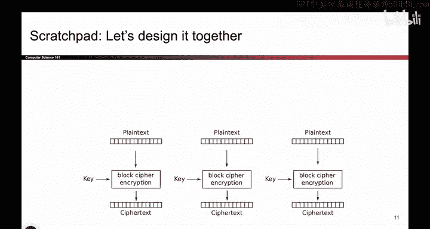
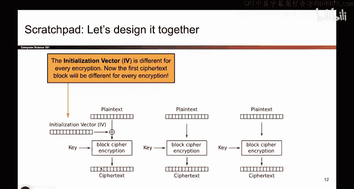
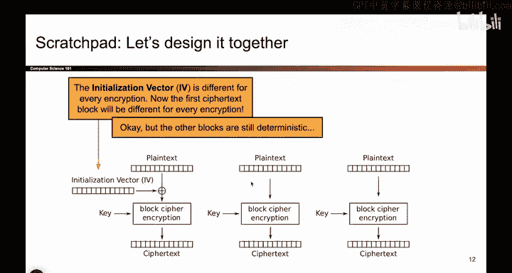
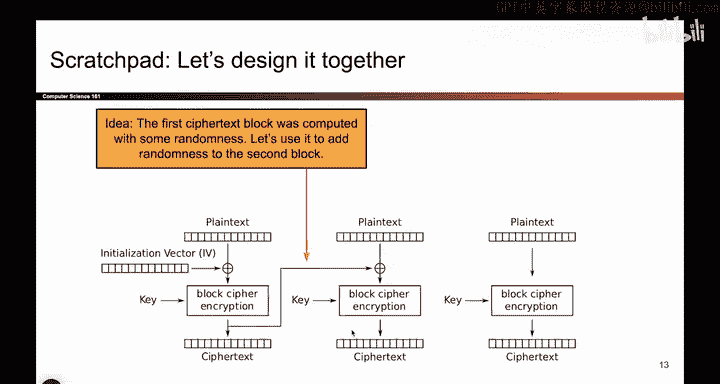
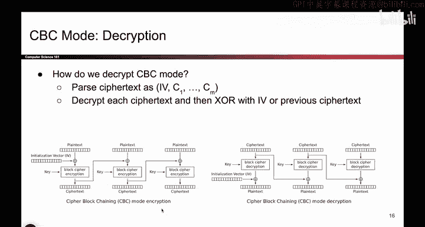
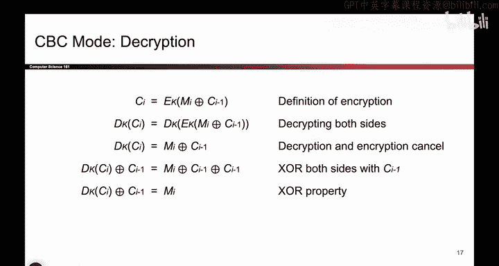

# UCB《计算机安全｜CS 161. Computer Security 2025》中英字幕 - P103：-Cryptography3, Video 3- CBC Design.zh_en - GPT中英字幕课程资源 - BV1VhEhzMEPL

Okay， we just design ECB mode。 It's great。 It it helps us encrypt longer plain texts。

 but it is not ID CPPA secure。 So we are now going to try to design to design something better。

 that actually does provide inD CPPA security。 So we already know that the main reason this didn't meet our security requirement。

 its because it's deterministic， you encrypt the same thing 10 times you get the same output 10 times。

 So to make it nondeterministic， I'm going to start adding some randomness。

 So if I throw in some random bit somewhere， maybe I can make it so that when I encrypt the same thing multiple times。

 the output is not the same every single time。 thanks to some randomness that I add in and it's different for every message that I encrypt。

 So let me try throwing in some randomness。 So maybe instead of encrypting the plain text by itself。

 What if I take the plain text and I mix it up a little bit using some randomness。

 So now this input to the block cipher it's not just the plane。😊。

Text， but it's the plain text Xor with some random string。 So this little symbol is exor。

 This is saying I will take the plain text Xor with the so-called initialization vector。

 which is some random bit string different for every encryption。 Now。

 if I pass this through the encryption block， The ciphertex should look different every single time。

 If I encrypt the same black pixel 10 different times。 I will pass in the same plain text。

 but this will be different all 10 times。 So the ciphertex should also come out different。

 So I'm slowly fixing the problem with the penguin from earlier。😊，So this is good。 Now。

 my first Cyphert is going to be different every time。

 but I still haven't solved any of these other problems。

 If the second block of plain text is the same， that's still the same。 And saying here。

 So I've added randomness to the first part of this message， but not these later parts。

 So I should keep going。 I should extend what I've just learned to make these other blocks random too。

 One possible idea is to just add more initialization vectors。

 So come up with another random value stick it here。

 come up with another random value and stick it here that would work but it also would require a lot of randomness。

 So I'm going to do something a little bit more clever。😊。

I'm going to realize that this ciphert is something random。 The input was random。

 The block cipher has scrambled it up。 So this is some unpredictable random value。

 So instead of generating a new random bit string like a second initialization vector。

 What if I just use this。 That's some random unpredictable thing。 So that's what we'll do。

 This is some random unpredictable value， why don't we just use that to shuffle up and randomized the second block as well。

 So this plain text， instead of just being passed through all by itself。

 it gets exored with the previous ciphertex block， and you can think of this as another random bit string that we use to exor with the second block of plain text。

 So now this ciphertt output should also be unpredictable because Well， that's different every time。

 So this is different every time。 So this input is different every time。 Therefore。

 this output should be different。 Every single time。😊。

So maybe you can guess what's coming。 We'll just do this again for the subsequent blocks。 too。

 This blog needs to be shuffled up。 So we'll just hook up the previous cipher text output to the input of this block and so on and so forth。

 And if we chain this over and over again， Now， all of the output should be unpredictable and random。

 So our goal here was just to say。

ECB mode is not I ND CPPA secure because it's deterministic。

 I want to add randomness throughout the encryption。

 So I started with one random value and then propagated it through the entire encryption。

 So now things should be random。 I have't proven to you that this is correct or that it works。

 I've just added some randomness。

So it turns out this actually does work。 And it has a name。

 It's called cipher block chaining mode because you're chaining up previous blocks to the current block。

 We could write it as an equation。 So you could say。

 how do you write the eighth block of cipher text。 Well you're encrypting something。

 It's block cipher output。 So I'm encrypting something And what am I encrypting。

 I'm encrypting the eighth block of plain text Xor with the previous block of cipher text。

 So this is just taking the picture and changing it to equations。 if you like equations better。

 And for simplicity， we'll say the zeroth block of cipher text is this IV。 You don't have to。

 It just makes the notation look nicer when you say that this is technically C 0。😊，So in English。

 how do you encrypt things， you first take your message， which could be arbitrarily long now。

 doesn't have to be 128 B。 You split it into a bunch of plain text blocks， one after the other。

 and each one is 128 B。 You compute this random IV。 You flip a bunch of coins。

 And you pick this random value。 And then you compute the cipher text according to this picture。

 So now we have an encryption scheme。 We've introduced some randomness。 Now， fair warning。

 randomness doesn't guarantee security， but at least this not deterministic。 So we have a scheme。

 Now let's think about encryption， security and other properties of this scheme。Okay。

 so one property that we should care about is how do you actually get the original message back。

 It doesn't seem immediately clear that if I encrypt a bunch of messages like this。

 And I throw in all this randomness， that the original message can still be output it。

 So to prove to ourselves that the original message can be recovered from the cipher text。 Well。

 there's a couple ways to tackle this problem， one way to do it is with the picture。

 So if you like pictures， we can try looking at the picture。

So let's think about the cipher text。 There it is。 You have access to that。

 One thing I don't think I have explicitly mentioned。

 but is true is that you also send the IV as part of the cipher text。

 So when Bob receives the message， he receives all the cipher text blocks plus the IV。

 You get all of it。So now how would Bob decrypt Well。

 he could just run this diagram in reverse somehow。 So what would that look like。

 I would take the cipher text and I would pass it through not encryption because I'm going backwards。

 but decryption。 that's what we see in the decryption picture。 You take the cipher text。

 you pass it through block cipher decryption。 that's the equivalent of working backwards in this picture。

 And then once you decrypt。 well， you're still left with the plain text exor with the IV。

 But I want to cancel out the IV。 I don't want that， I want the original plain text。

 So once you decrypt， you exhor with the IV one more time。 and remember our handy exor property。

 if you exort this value with the IV the IVs cancel， and I get the original plain text back。

 So one way to derive this decryption diagram is just run this picture in reverse。

 and it works on later blocks2。 So for the second block， I would start with the cipher text。

 I would run it through the reverse block cipher decryption。 That's why。Sas decryption。

 then I still have to exhort out some randomness。 And here the randomness is the previous cipher text block。

 So when I get this block cipher decryption， I exhort it with the previous ciphert block。

 The previous cipher text block cancels out。 and I'm left with the original plain text。

 So one way to get this decryption picture is to look at the encryption picture and try and think about how we would work in reverse。

😊。

Now， if you don't like this， you don't like the pictures， we could also use some algebra to solve it。

 So for you math lovers out there， another approach to figuring out the decryption equation is to write the encryption equation。

 and then solve for the plain text。 So this is the equation we previously saw。

 and it represents the encryption picture。 And it tells us。

 given some message and the previous cipher texts， how do I get the next block of cipher text。

 Now if you want to decrypt you want to solve for M。

 So we just have to do some algebra and solve for M。 So how do we do it， we could both sides。

 So I apply d sub K on both sides。 And remember， when you encrypt something and you decrypt it those two operations cancel。

 So I'm left with this equation， That's good。 But I want to isolate M sub I。

 So I will xor both sides with C I minus-1， There it is， there it is using our handy Xor property。

 those two terms cancel and I'm left with the equation for M sub I。😊。

This tells me how to decrypt given some cphert。 So if you didn't like the pictures。

 algebra is another way you could solve this problem。

