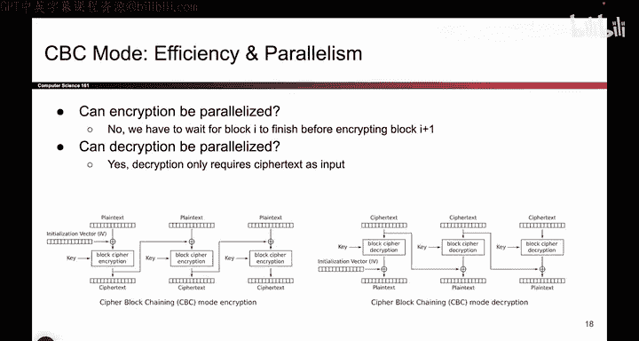
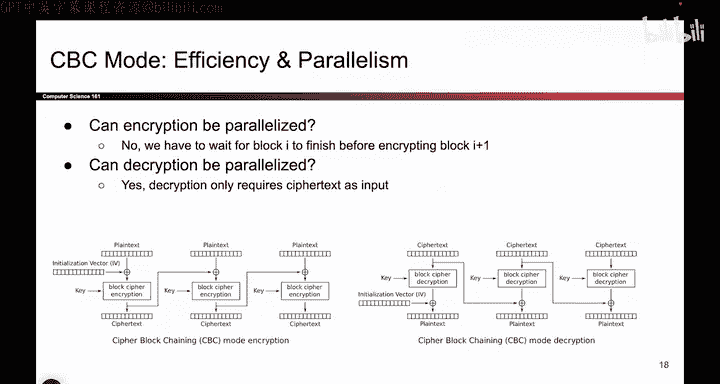
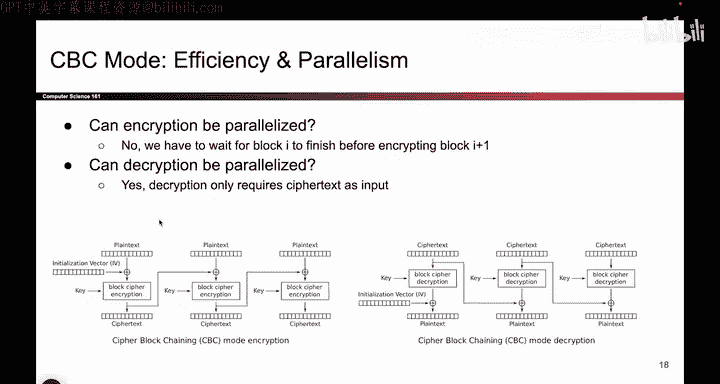
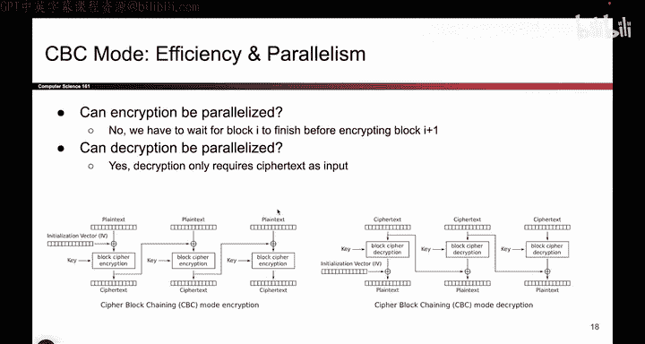
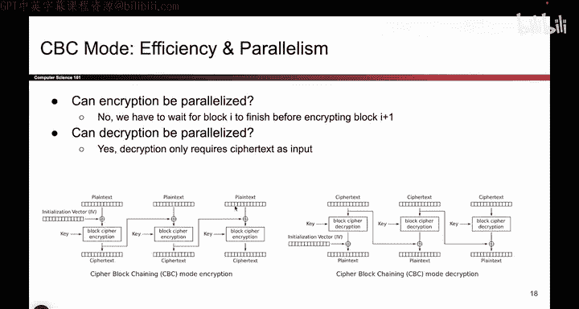

# UCB《计算机安全｜CS 161. Computer Security 2025》中英字幕 - P104：-Cryptography3, Video 4- CBC Efficiency.zh_en - GPT中英字幕课程资源 - BV1VhEhzMEPL

Okay， now that we know what CBC mode is and we know how to encrypt and also how to decrypt。

 we can start asking some different questions about CBC mode and some properties that it has and some properties that it doesn't have。

 So remember that one thing we do care about is efficiency。

 We want these block ciphers to run relatively quickly for the users。

 So one question we might have is can you run this in parallel。

 that would be quite nice if you could。 And by parallel。

 we mean you could encrypt all the blocks at the same time。😊。

So if this could be parallelzed， if you have 10 blocks。

 you could encrypt all 10 blocks at the same time and it would finish 10 times as fast。

 And if it can't be parallelzed， it means you have to encrypt one block at a time。

 and that still works。 It's just a little bit slower。 So here we're analyzing performance。

 not correctness。

So the first question is， can we parallelize the encryption part of this algorithm？

 And I look at this。 And I think， well， let's say I want to encrypt the third block。 Remember。

 I'm doing paralyzing。 So I want to give different blocks to different pieces of my computer。

 So could someone just encrypt the third block by themselves without any other information。 Well。

 they need the plain text。 We have that。 The plain text is the input。 We have the key。

 That's also one of the inputs to encryption。😊。

But what about this value right here， Before I can encrypt。

 I have to exhor it with the previous ciphertext。 I don't have that。

 I have to wait for the person before me to finish before I can encrypt my block。

 because I need their ciphertext output。 and I don't have that to begin with。 So unfortunately。

 encryption can't be paralleled because everyone has to wait in line for the previous block to finish before they can compute their block。

 So， for example， block number3 cannot run until block number two outputs this ciphertex。 So sadly。

 you can't parallelize encryption。 You have to wait for the previous blocks to finish。

What about decryption。 So again， we look at the picture and you might be tempted to say it cannot be paralleled because of these arrows。

 but we have to be careful。 Let's look at the inputs to the decryption algorithm。

 There's the cipher text。 Do we have that。 We do。 The cipher text is the input to decryption。

 Do we have the key。 We do。 That's one of the inputs to decryption， And what about this value。

 This value is the previous cipher text。 Do we have the previous cipher text。 Well， yeah， we do。

 remember， what is the definition of decryption。 It takes in a ciphertex and the key and it decrypt it。

 So you have all the cipher text at the very start of the algorithm。

 So you need the current cipher textex。 you have it and you need the previous cipher text。

 You also have it， So you have everything you need。

 You don't have to wait for previous blocks to finish。

 So all of these decryption blocks could actually run in parallel， which is kind of nice。😊。

So we analyzed whether encryption can be parallelzized， we said no。

 and whether decryption can be parallelzed， we said yes。

