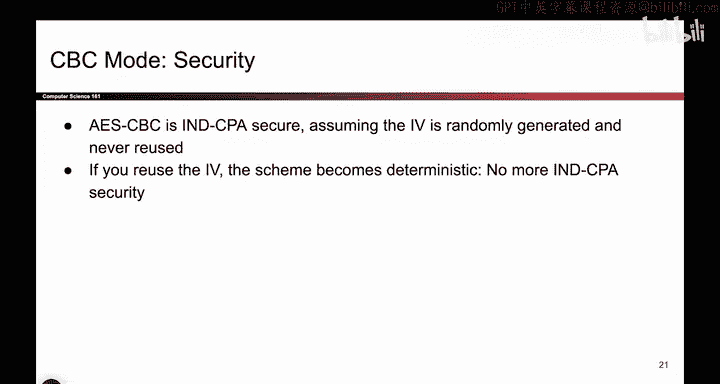
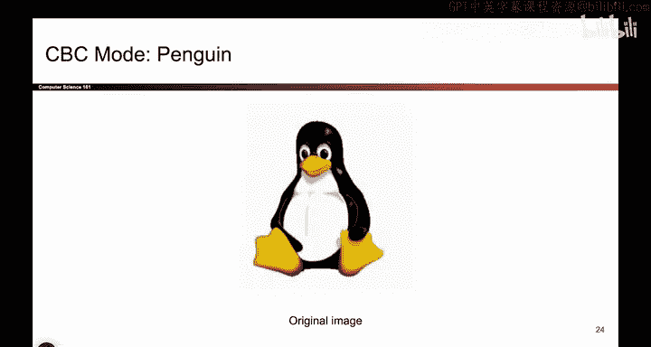
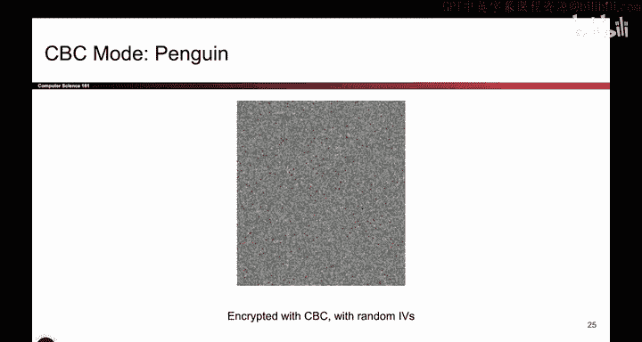

# UCB《计算机安全｜CS 161. Computer Security 2025》中英字幕 - P106：-Cryptography3, Video 6- CBC Security.zh_en - GPT中英字幕课程资源 - BV1VhEhzMEPL

Okay， now we know what CBC is。 and we thought about some of its efficiency properties and how it works and the fact that you need padding。

 So let's finish up by thinking about the security of CBC mode。

 So I'm actually not going to prove it here， but with enough thinking about it。

 AE SCC is I N D CPPA secure。But there's a very important assumption that we need for this scheme to be secure。

 You have to generate that IV randomly。 That is a requirement for A S CBBC to meet the security requirement。

 Because what if we don't generate the IV randomly。 Well， then if you generate this， not randomly。

 say you just pick a value and you use it every single time， Well， guess what。

 This value is the same。 If these plain texts are the same， the cipherts end up the same。

 you're back to deterministic。So for this scheme to be secure。

 it's really important that the I V is randomly generated every single time。

 And if you reuse the IV even once the scheme is now deterministic。

 encryptpting the same thing results in the same output。 And we're losing the in CPPA game again。

 So haven't shown you the proof， but。With some thinking， you can show that it is IN D CPPA secure。

 This also might be a good place to remind you that just because something has some randomness doesn't guarantee its ID CPPA secure。

 So if it's deterministic。 It's definitely not IND CPPA secure。

 We already showed you a game where the attacker wins。 If there is randomness。

 that is not enough to guarantee that is ID CPPA secure。 for example。

 you might make a really silly scheme that's just ECB and then stick some random bits at the end。

 that's still not secure， even though you added some randomness。 So just remember， deterministic。

 means it's definitely not secure， if you add randomness maybe it's secure。

 but you have to add the randomness correctly。 So be careful with adding randomness。

 don't just see some random bits and immediately think it's secure。 Some extra thought is required。

 So those are the two points on here。 Make sure the I V is randomly generate it and randomness by itself doesn't guarantee security。

 but it is a。

Requirement for things to be secure。So what actually does happen if you reuse IVs。

 We already said that if you pass in the same IV twice， if the two plain text are identical。

 the resulting output is also going to be identical。

 That's a case where you leak information like the penguin。 But it can actually get worse。

 What if there are two messages that are different。 but they start with some of the same words。

 maybe I don't know， It's two messages and they both say dear Bob as the first two words or something。

 Well， then the first two blocks might be the same。

 And then maybe some of the later blocks are different。

 So consider using two messages where the first two blocks are the same。 They're orange and blue。

 and then the third block and beyond starts to be different。

 What if you encrypt these with the same IV and the same key。Well， let's go through this。

 So the first block you encrypt， it takes in this first orange plain text block。

 and then this red I V and the key is always the same。 And I get some cipher text。😊。

Okay now let's think about the second message。 It's that same orange first block， the same I V。

 the same key。 oh， that's the same cipher text。 So you've already leaked that both of these messages start with the same block。

 So an attacker who sees this block and this block can deduce that。

These two messages started with the same first block。And it gets worse。

 Let's look at this second block。 Well the inputs are this value in blue and this cphertex。

 which we said is the same value。 And over here， the input is blue and this cphertex。

 which is the same value。 So this is the exact same input。 This is the exact same input。

 So the second block of ciphertex also the same。 So now the attacker knows that both of these messages start with the same block。

 They don't know exactly what the block say， but they've already deduced information they shouldn't have。

 which is that these two messages start with the same few words。And eventually。

 once you get to a different block， things start to become different。 So， for example。

 once you get to this third block。 well， that's a purple input。 that one's green。

 Those are two different blocks。 So the third cphertex then beyond should start to be different。

 but we've already leaked information we shouldn't。 So not only is the scheme deterministic。

 where identical messages give you identical cipher texts， but similar messages。

 And here we mean similar as in the messages start with the same few blocks。

 That information can also be leaked to the attacker。

 So we have to be really careful to not use the same IV twice。

 We don't want to leak information like this to attackers。Okay。

 so to recap CBC mode and its security and how it works。 the encryption scheme looks like this。

 you split the message up。 You choose a random IV。 Don't just pick0 and compute the cipher text according to this picture。

 And this is ID CPPA assuming that you don't reuse IVs。 And if you want to prove it。

 you would do something called the reduction proof。 We won't talk about it。

 but you can look up that word if you're interested。

 and the reduction proof would say something like an attacker that can beat the CBC mode game can also break the block cipher。

 And if we assume that the block cipher is secure。 Then we can also assume that CBC mode is secure。

 So that's the kind of reasoning you would use。 if you actually want to prove this。

 you would say an attacker that can break CBC mode can also break the block cipher。

 but the block cipher is secure。 Therefore， the CBC mode is also secure。

 That's roughly how you do it。 But for this class， we won't do the proof。😊。

Okay and before we leave CBC mode， here is the penguin one final time。

 And this time we're going to use CBC mode to encrypt it。

 That means that for every pixel we'll feed it into not EC mode。

 but CBC mode Now you can't see the penguin anymore。

 It's still hiding in there somewhere you can decrypt it。 but it's totally disguised。

 So this is much better than the ECB mode where the penguin was somewhat visible。

