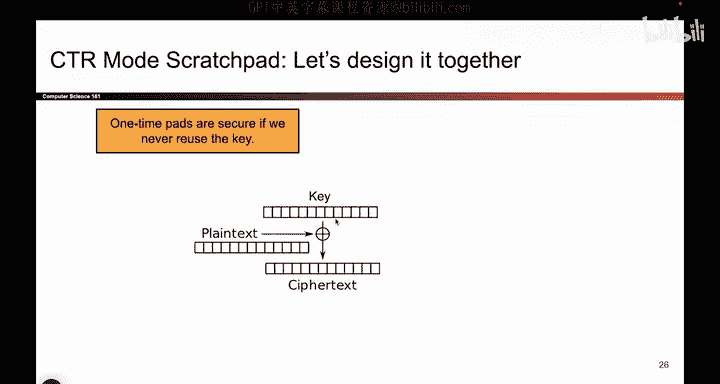
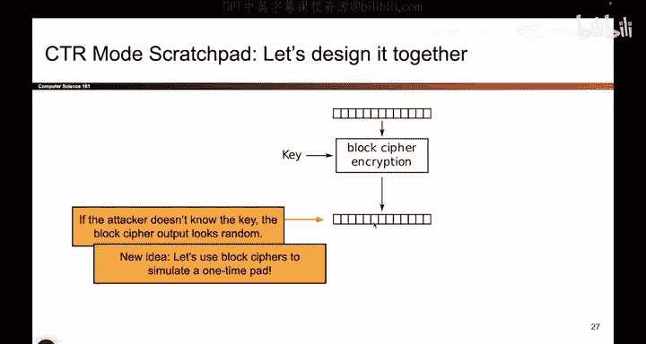
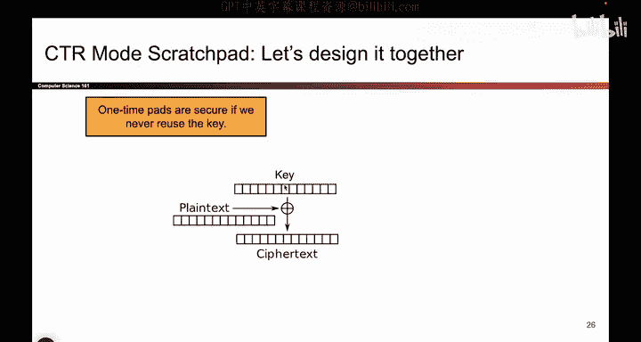
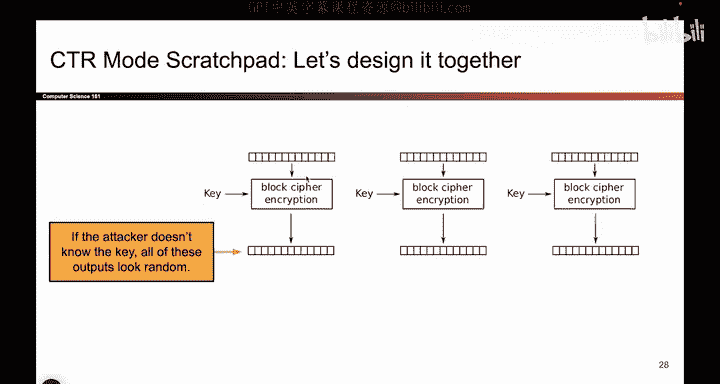
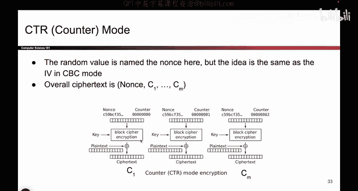

# UCB《计算机安全｜CS 161. Computer Security 2025》中英字幕 - P107：-Cryptography3, Video 7- CTR Design.zh_en - GPT中英字幕课程资源 - BV1VhEhzMEPL

Okay， the second encryption scheme that we'll see today is something called CT TR mode。 and again。

 we'll design it together and then analyze all of its properties。

 So this one is actually not based on block ciphers right away。

 but I think it's more based on the one time pad。 So if we go back to the one time pad。

 one time pads actually did have security as long as you didn't reuse this key。 So remember。

 if you reuse the key， it's a two time pad， it's no good。 But if every time you encrypt something。

 you use a different key。 This is totally fine。 You use a different key。

 you encrypt it with the plain text by exoring， and then you get the cipher text。

 So what if I could do this， but I didn't have to generate new keys every single time。

 So that's our goal with this encryption scheme， I want to imitate this behavior。

 but I don't want to have to generate new keys every single time。 So this is the first idea I need。

 The second idea I need is now I'm going to bring back the block cipher and remind myself。😊。

If the attacker doesn't know the key， this basically looks random。 Remember。

 we said that if the block cipher is secure， this output is indistinguishable from random。

 you might as well have dropped in the arrows in the permutation in here at random。

 So that means if the attacker doesn't know the key。

 which they don't then this value is as good as random。

 The attacker has no idea of this was generated from the block cipher or by dropping in the arrows randomly。

 they cannot tell the difference。 So this is random looking。

 it's not exactly random like the key you generate here。

 but it's random looking from the attacker's perspective， they think it's as good as random。

 So what if we use this， and we combine it with this idea now we don't have to generate new keys every single time。

 So this is like a fusion of one time pads and the fact that block ciphers are indistinguishable from random permutations。

 So we'll take these two ideas we'll fuse them together and we'll get something that looks like a one。

IPad， but it's based on block Cyphers， which is pretty cool。

So we might need more randomness than just this one block。

 remember you want to be able to encrypt longer messages multiple messages。

 so actually I might need to use block cphers multiple times。

 so if the attacker doesn't know the key， all of these outputs are as good as random The attacker might as well think they're random they can't tell the difference between this and actual random bits so I will just run block cipher encryption as many times as I need。

 if it's a long message， I'll run this lots of times。

 I'll obtain lots of random outputs and then I'll just use that output as a one time pad So whatever this output was I'll take that output which is right here。

 I'll encrypt it with the plain text and I'll get the cipher text and then if I have more plain text。

 I'll generate more randomness or random looking things encrypt it by extoring with the plane text and I get the cipher text So the top half of this picture is using block cphers to generate random looking output and the bottom half of this picture。

Is just the one time pad from before。 So I've taken two ideas。

 and I've fuses them together to get a new encryption scheme。

There's just one thing we have to do to finish up this scheme。

 We haven't actually told you what this input is。 What do you actually input into the block cipher encryption。

 Well， we've already got the plain text down here and the cipher text。

 So we don't have to write those a second time。 So what do you put up here。嗯。

What else is missing from this scheme that we could possibly put up here。 Well， so far。

 this scheme seems deterministic。 If I run the same encryption multiple times。

 I still get the same random output。So I'm missing randomness。 And I haven't put anything here。

 So why don't we shove the randomness up there。 That's what we do。

 So the final piece of the puzzle is to shove some randomness as the input to the block cipher。

 The only goal of the block cipher here is to generate random looking output。

 And one way to achieve that is to pass in some random input。

 So what we'll do is we'll pick a random number。 here it's called the nons。 it's just terminology。

 And we'll pass it into the block cipher encrypt it with the key and the result should be random。

 Now if you use the same nos every single time。 then every single one of these outputs would be the same。

 And that's no good。 you're reusing one time pad keys。 So we'll add a counter。

 So this is the nons plus0， this is the nons plus1。

 This one is the nons plus 2 and so on and so forth。 So that all of these outputs are different。

 And remember， block ciphers are random permutations or they behave like them anyway。

 So if you change even a single bit。 like the zero becomes a one。 The resulting output should be。😊。

Totally different and unpredictable。 So just because you change1 bit up here。

 the resulting output should be totally different， and that lets us get lots of random looking output to use for our one time pad。

So we've combined two ideas and designed something called CTR mode and notice that the counter has to go up for every block so that this block cipher output is different。

Okay， so we built it。 It's called CTR mode。 CTR stands for a counter。

 I guess because there is a counter in this scheme and it works like we described。

 So you take a nonce。 that's a randomly generated value。

 you flip a bunch of coins to get a nonce and you do it once for every encryption。

 Once you have the nos。 then you take the nos， you append0 or add0， it's up to you。

 and then you encrypt it with your key， you get some padding output or some random looking output。

 That's your pad for the one time pad。 you x it with the plain text。

 you get the first chunk of cipher text。 If you have more plain text or no problem。 Take the nos。

 Now add one pass that into the block cipher with the same key。

 you get a bunch of more random looking output， xor that with the plain text。

 you get the next block of cipher text， and you repeat this as much as you need until your whole message is encrypted。

 So that's basically it for how counter mode works。 And remember， you are using the same key。

 every single。If you use different keys， you've defeated the point。

 remember our whole goal of avoiding one time pads was to avoid having to use different keys every single time。

 so we are using the same key here and the reason why all of these outputs is different is because that counter keeps changing。

So the key is the same。 The attacker doesn't know it。

 The counters is what makes this output different。

So there it is， again， in English， you split the message up and you generate random looking blocks of output。

 and then you encrypt each plain text block by exoring it with a corresponding block cipher output。

