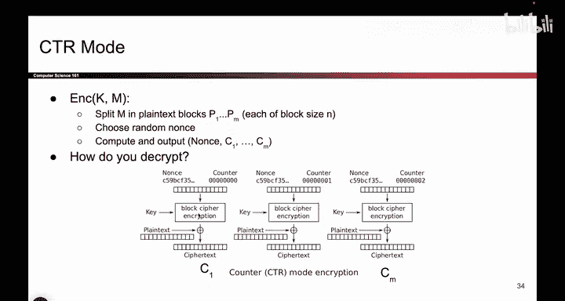
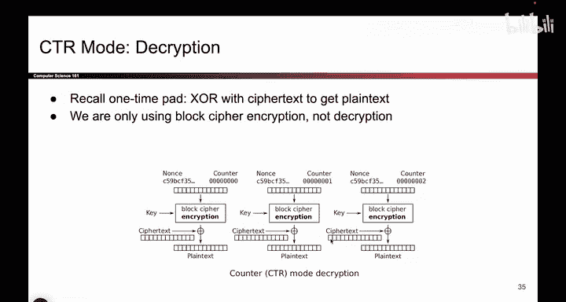
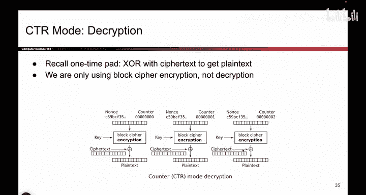
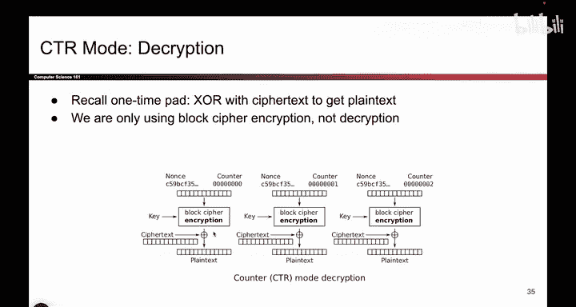
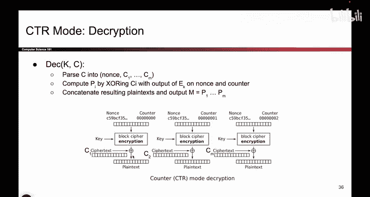

# UCB《计算机安全｜CS 161. Computer Security 2025》中英字幕 - P108：-Cryptography3, Video 8- CTR Decryption.zh_en - GPT中英字幕课程资源 - BV1VhEhzMEPL

So now the question arises how do you decrypt this thing So again there's two ways to solve this。

 one way is to run the picture in reverse and try and think about what operations we have to do to go backwards and another way is to do it with equations so I'll start with the version where I look at the picture。

So if I look at the picture， I can also think about the fact that this is one time pad。

 So here's the encryption picture and the encryption picture says to encrypt。

 you take the plain text， you exhor it with the onetime pad key， the pad。

 which is this block cipher output and you get the cipher text。

 So how does one time pad do decryption。 Well， to decrypt and one time pad， you take the cipher text。

 you exhor it with the pad， and you get the original plain text back。 That's how one time pads work。

 you take the cipher text， you exhor it with the pad， you get the original plain text back。

 So that's what Bob has to do。 When Bob receive some cipher text。

 he has to regenerate the pad by running this exact same algorithm up top。

 and then he exhors it with the cipher text to get the plain text。😊。

So this is what it looks like in a picture。 This is the decryption algorithm。

 You do the exact same thing to generate the pad。 and the exact same means you're using block cipher encryption because that's what Alice used and is's a little bit unintuitive。

 But that's what you have to do。 So you do the exact same thing that Alice did to generate the pad。

 And then you take your cipher text Xorit with the pad。 And you get the resulting plain text。😊。

Now， this is the thing that's confusing。 We have to use the block cipher encryption mode。

 So in other words， you run the block cipher in the forward direction， not in the reverse direction。

 And the reason why you're doing that is because the block cipher was only used here to generate random looking bits。

 So if you want to generate the same random looking bits。

 You have to run the block cipher in the same direction。 and here that direction is encryption。

 So it's a little bit confusing that these are encryption blocks。

 but that's required because the block ciphers need to be the same。

 They need to be run in the same direction to get the same pad。

 And then you can ex the cipher text with the pad。 It might take a little bit of staring at the see why encryption is the right answer here。

 But that's what you're supposed to do。😊。

So to summarize， you decrypt by running the same block cipher things that Alice ran。

 namely encryption with the Nos and the counter， and then you exhort the cipher text with the block cipher output and if you wanted to。

 you could also do this in equations， although I don't seem to have a slide for it。

 and if you ran the equations and you tried to solve for the plain text。

 you would notice that the encryption stays unchanged。

