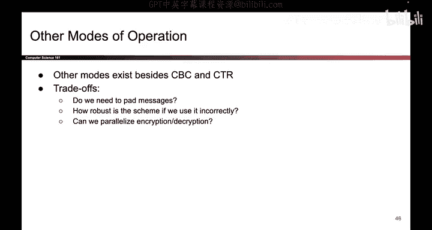
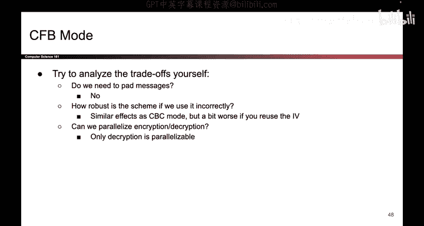

# UCB《计算机安全｜CS 161. Computer Security 2025》中英字幕 - P112：-Cryptography3, Video 12- Other Modes.zh_en - GPT中英字幕课程资源 - BV1VhEhzMEPL

Okay。One final thing to mention is that other modes do exist and sometimes on exams will like make up a new mode to show you and you get to think about it。

 and the tradeoff questions are very similar。 We have to think about is padding necessary。

 Can we parallelize in the encryption direction， what about the decryption direction。

 What happens if we reuse IVs， what information leaks。

 So those are all questions you can think about if you want to try one at home。

 We actually have one for you。 It's called CFB encryption。

 I won't do it live but you can go home and think about the tradeoffs of the scheme try to answer those questions yourself。

 And if you want to check the answers。 We have them right here。 So you can do that as well。

