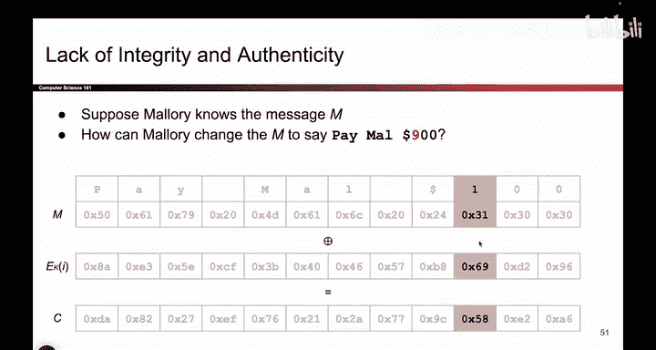
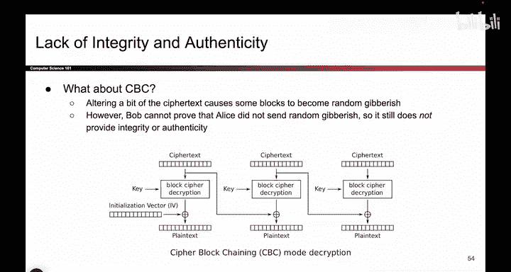

# UCB《计算机安全｜CS 161. Computer Security 2025》中英字幕 - P113：-Cryptography3, Video 13- Lack of Integrity.zh_en - GPT中英字幕课程资源 - BV1VhEhzMEPL

Okay， to wrap up our discussion of block cipher chaining modes， remember we said that block ciphers。

 if you chain them correctly， for example， using CBC mode or CTR mode。

 it gives you INDCA confidentiality。Also， remember that in our cryptography roadmap where we showed you the four quadrants。

 we said that block ciphers and their chaining modes were designed for confidentiality。

 they were actually not designed for integrity or authenticity。

So what that means is if we have an attacker like Mallory who is able to tamper with the message while it's being sent over the channel。

 we're actually not guaranteed to detect that something wrong has happened。

 so encryption is good for making sure that attackers can't read our messages。

 but just because something is encrypted doesn't mean that an attacker cannot tamper with it。

So to give a concrete example of what that looks like。

 let's say we're using CTR mode and remember the way you use CTR mode is you take your message。

 you take some pad and this pad was generated by using the block cipher so I encrypt with keyK and then I pass in some counter and some knots and then I do a one-time pad Xor between the message and the encryption and I get the corresponding cipher textex so let's say that the message that Alice sent to Bob is this message pay Ma $100 she generated this random looking pad and then she got the cipher text。

Now the problem is when this ciphertext is sent over the network。

 Mallory might be able to tamper with the ciphertext and cause Bob to decrypt to something different。

 that's something we have to deal with。

So to give you one concrete example of what mallllory could do。

 we could consider a threat model where mallllory knows that the original message said this。

 So maybe somehow there was a leak or something。 and mallory knew that the original message said pay $100。

 but she wants the original message to say pay 900 instead So in general。

 mallory might not know the original message， but in a case where she does she might try to execute an attack where the original message said 100 but she's going to trick Bob into decrypting 900。

 That's our goal。 So mallllory is going to receive the Cyphertex and somehow tamper with it such that Bob decrypt something different and in particular he happens to decrypt the number 900 instead of 100。

 So that's our goal and to achieve that the first thing we could notice is that most of these bites of Cyphertex don't have to be modified at all。

 So if I don't touch any of。Other bytes， I'll get these same message for the first few words。

 I'll still get pay and then a space， I'll get mail and then a space and the dollar sign and the00。

 If I don't touch any of those bits of the cipher text as the attacker。

 they're all going to stay the same。 When Bob decryptps them， he generates the same pad he exhors。

 he gets the original message back。 So if I want to change 100 to 900。

 the only byte that I really have to touch is this one corresponding to the character one。

So now we can do just a little bit of algebra to figure out how should Mallory change this bite right now it says 58。

 what should Mallory change it to so that when Bob tries to decrypt it。

 he ends up getting 900 instead。

So we could just do a little bit of algebra。 It's probably more complicated it looks more complicated than it actually is so the first thing we can do is write out the definition of exort Cyphert is equal to the plain text exhort with the pad we've seen that before that's how one time pads work we know the ciphertext it's 58 because that was what was sent and mallory intercepted it we know the original message set 31 remember our threat model assumes that mallory knows the original message so she knows that the original message set 31 so all she has to do is solve for this unknown pad so she can do that this is an equation with a single unknown variable we can exhort both sides and we get that the pad is equal to these two numbers exhort together which just so happens to be 69 so now we have the pad byte and that means that actually the byte that Alice was using to encrypt the number one and that particular care。

In the sequence was the fight 6，9。

So now that she knows the pad， Mallory can say I want the actual message to decrypt to 900。

 so I'll take the character9 which corresponds to ASI Hex 39。

 I'll exhort that with the pad byte which I figured out using algebra。

 now I know that instead of this byte saying 58 if I change it to 50。

 that's going to cause Bob to decrypt the message to the wrong value。

So by leveraging a little bit of algebra and my knowledge of the original plain text。

 I was able to figure out how to tamper with this bite right here to cause Bob to decrypt something different。

So now if we pass this taampered message to Bob here I'm calling it C prime and the prime I'm using to denote the fact that this has been tampered with。

 so Mallory took the original C and changed it to C prime and in particular we took the byte 58 and we swapped it with 50 well now Bob is going to generate the exact same pad that hasn't changed so Bob gets the same pad byte of 69 he exhors it with 50 and instead of getting 100。

 he now gets 900 in his message So this is an example of mallory successfully tampering with the message and noticed that she didn't have to know the key。

 It's not like at any point we gave mallllory the key So this is an example where mallllory an attacker who doesn't know the secret key was still able to break integrity and caused Bob to decrypt something different So instead of decrypting the original P he decrypt a P prime。

 a different message。So that's an example， even if Mallory didn't know the original message。

 she could still have tampered and changed some of these bites that would have caused Bob to decrypt something different。

So while this attack assumed that Mallory knew the original message in general。

 even if she doesn't know the original message or the key。

 she could still tamper with any of these bytes and that would cause Bob to get a different message from Heti Crips。

 so all of this is to say that if you use a block cipher chaining mode like CBC or CTR。

 you can stop an attacker from learning what the message says。

But you can't stop them from changing what the message says and causing Bob to decrypt to something different。

 So this is why we need more schemes for integrity and authenticity。

 although walk San were a good start for confidentiality。

And you can actually try similar exercises for CBC It's a little bit trickier because it's not the case that you can just tamper with a single by and cause the corresponding output bytes to get tampered with I think in homework 3 you get a little bit of practice with tampering with CBC so it's a little bit trickier but again you still have the same problem where whatever Bob decryptps。

 he has no idea of what he decrypted is correct or if someone tampered with it。

 there's just no way to guarantee whether Bob's decrypted plain text is correct or it's some random gibberish so we still don't have integrity or authenticity although this attack is a little bit more involved。

Okay so to summarize block ciphers from today， we started with ECB mode， it was deterministic。

 so it was not in CPPA secure to fix that we added in some randomness namely the IV and remember the IV is sent along with the cipher text so now when you encrypt a message you send the message and you send the IV as part of the message and if you design CBC mode properly you can show that now it does achieve INDCPA security remember that just because it's random doesn't mean it's INDCPA secure。

 randomness doesn't give you security for free， but it is necessary to get security with additional being careful with your design。

So randomness helps but it doesn't guarantee security by itself we were able to analyze some properties of CBC mode。

 namely whether the scheme can be parallelzized， whether you have to pad the plain text and also how dangerous IV reuses and we talked about CTR mode and again we showed that if you're really careful with it and you don't reuse the nos you do get IDCPA security we again analyze the various properties of it and we again said that if you reuse the nos and Nos and IV or interchangeable warrants you end up losing all security。

 it's like reusing a one-time pad twice and again the Nos is something you send as part of the cipher text I don't think I'd said that explicitly last time but it is true that you have to send the Nos as part of the cipher text so it's a public value the randomness is not secret everyone knows it the attacker knows it but it's important to send the randomness from Alice to Bob so that Bob can use the same randomness to decrypt and then finally。

We showed that these schemes， while they provide confidentiality。

 they don't provide integrity or authenticity， so we have to go find other schemes that do provide the other properties that we want。

 but that's it for walk cipherers and chain modes。

