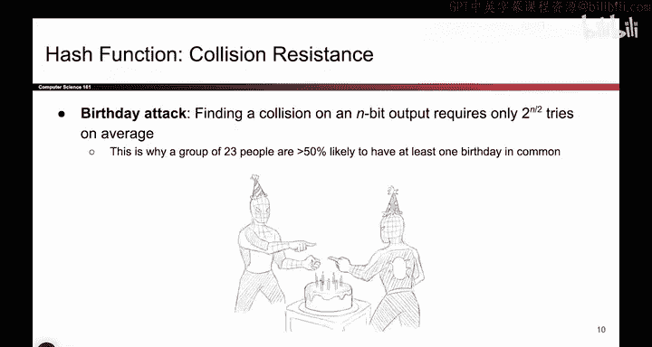
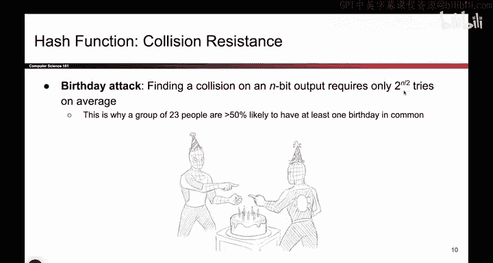

# UCB《计算机安全｜CS 161. Computer Security 2025》中英字幕 - P116：-Cryptography4, Video 3- Hash Security - Collision Resistance.zh_en - GPT中英字幕课程资源 - BV1VhEhzMEPL

Okay here is the second security property of a hash function。

 it is closely related to onewayness and I think when a lot of people see them for the first time。

 they think they're the same thing， but there's a very subtle difference and hopefully by thinking about the game we can tease out what the difference is so the challenge to read it out loud first is a little bit different from the one before So in the one- way challenge remember how I turned around and I gave you an output and I said you need to match my output so I turned around I gave you the output I said it was 42 and you had to match the number 42 by contrast in the collision resistance challenge I don't give you any output so it's still a challenge that you have to solve but the challenge doesn't involve me giving you an output that's the key difference between these two challenges and the one way challenge I turned around I hash something and I gave you an output that you had to match。

In the collision resistance challenge there is no matching involved All that happens is I tell you your challenge is to find any two inputs that have the same output that's all that I care about if you can find two inputs that hash to the same output。

 you win and the scheme is not collision resistant。

So the key difference between these two properties is that hash one wayness of a hash requires you to match my chosen output。

 collision resistance doesn't require you to match my output。

 you can pick any two inputs you want as long as they match and have a corresponding matching output hash and your two inputs have to be different。

 no choosing the same input twice that's cheating。So more formally the thing that you have found if you solve this challenge is something called a collision。

 you've found two different inputs that have the same output， so you have two inputs。

 x and x prime they are different but their hash outputs are the same so one question you might ask is can you have a hash function with no collisions at all。

 is it possible that every input maps to a different output， sort of like our block cphers。

 well to think about whether that can happen， think about the number of inputs of the hash function and the number of outputs？

The input is arbitrary， it could be one byte， it could be 1000 bytes。

 so how many possible input strings are there？Infinity。

 there's as many as you can think of because you can pass in any length input string into the hash function and it's supported。

How many output values are there for the hash function？2 to the end， if it's an endbit output。

 say 128 bits， you only have two to the 128 possible outputs。

 2 to the 128 is a big number of outputs， but it is not infinity so if you have infinity inputs and two to the 128 outputs there's going to be at least some inputs that mapped to the same output if you've taken a class like CS70 and you've heard about the pigeonhole principle that's the principle we're using here and if not you can just think of it like there are more inputs that outputs so at least some of the inputs have to be mapped to outputs。

So what that means is collisions do exist。So the challenge should more formally be say。

 not that it's impossible to find a collision， but that it's very hard for an attacker to find a collision。

 so to amend the challenge one more time to account for the fact that collisions they're out there。

 but they're hard to find， the challenge really reads like this if I tell you to find me a collision two different inputs with the same output hash。

We know that they exist， there's a bunch of them out there， but it is very hard for you to find it。

 and if you use a definition similar to the IND CPPAA one。

 you could say any attacker that runs in polynomial time has no hope of finding such a collision they would have to run algorithms that take the length of the universe to find such a collision So collision resistance really says it's computationally infeasible It's not impossible someone with infinite time could come up with one because they exist but it's computationally infeasible。

 attackers with polynomial time have no hope of finding such a collision so that's the intuition for collision resistance。

And I guess taking the idea of collisions back here really briefly。

 this is also this also needs to be defined in terms of。Computationally in feasibleasible。

 so again it's possible to find a different value that hashees to the same output if you have infinite time。

 but for attackers with polynomial time， if this is really hard。

 then we say that the scheme is one way so both one way inness and collision resistance are defined in terms of being computationally very hard。

Even though they are hypothetically possible， nobody with any reasonable amount of time will ever solve these challenges if your hash is secure。

OkayOne final thing about collision resistance in case you're wondering how hard it is。

 you can go and look up something called the birthday paradox or the birthday attack。

 We won't talk about it in too much detail in this class because it's a little bit maty。

 but if you're wondering how hard it is to find the collision it's roughly exponential time so this is why we said that polynomial time attackers cannot achieve finding a collision it's because if you want to find a collision on n bit output you usually have to try roughly2 to the n over two tries where the n over two comes from we won't talk about here you can look up the birthday paradox but the key thing here is that this is polynomial or it's not polynomial it's exponential if this said like n squared or something it would be pretty easy to find a collision but because it says two to the N we know that this algorithm would take exponential time and if you had for example。

 a 256 bit output this number would be two to the 128 tries and we've already said that if you want to try something two to。

128 times it's not finishing before the universe ends。

So with a big enough output space， finding a collision is extremely hard。

 you'd have to try2 to the 128 times， or if the output was 512 bits。

 you'd have to try 2 to the 256 times and the universe is going to melt down before you finish trying that many times。

