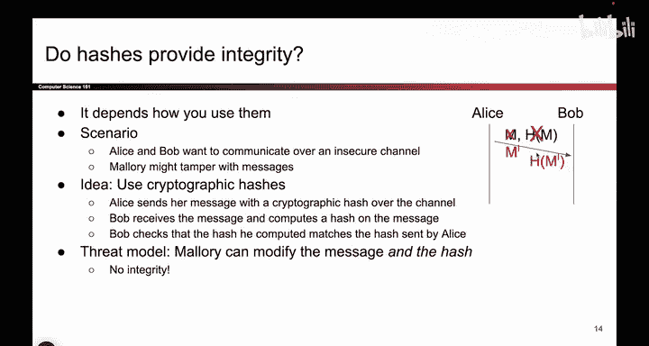

# UCB《计算机安全｜CS 161. Computer Security 2025》中英字幕 - P119：-Cryptography4, Video 6- Do Hashes Provide Integrity_.zh_en - GPT中英字幕课程资源 - BV1VhEhzMEPL

Okay， so the million dollar question， do hashes provide integrity if they do。

 we could just stop right here and celebrate that we found a scheme that provides integrity and。

Is often the case in security the answer is it depends on your threat model so here's an example where maybe it does provide integrity and this is one possible threat model。

 so the threat model might be something like well there's a new version of Firefox。

 the web browser and we want to let users download it but Firefox is a pretty big program so maybe we put a copy of the Firefox program on a bunch of different servers。

 some of them are official， some of them are unofficial and Alice goes and she downloads the version of Firefox from one of those servers that's hosting a copy of the program。

So how can Alice be sure that she obtained the correct version of the Firefox program and not some corrupted。

 tampered version that has a virus hiding inside of it？

So one thing we can use to solve this problem is to use a hash。

 it's kind of like the document fingerprint scheme from before so when Firefox publishes the new version of Firefox。

 which is a big file， big executable， we're also going to hash the executable and publish the hash on Firefox's website so if you go to Firefox's website you will say here's the newest version of Firefox you can download it from us or from any of these other possibly insecure servers and if you want to check your work。

 here's a hash。So then Alice can download the binary from any source， maybe the secure server。

 maybe one of those insecure servers， and in order to check that the hash matches。

 she just has to hash her downloaded copy and compare it to the hash that's on the website so if the program is correct。

 then the hashhes should match， remember hashes are deterministic but if she downloaded a malicious program with the virus hiding inside then the hash would not match。

 she would get one value， the website would have published a different value and if those are different。

 Alice can detect and say nope this binary is bad， I need to go download a fixed one。

And so as an attacker， you might think， could I somehow add a virus into the binary。

 but do so in a way that the hash stays the same？So could I somehow tamper with the Firefox binary and stick a virus inside because Alice to get the same hash and be fooled into thinking that the binary was not tamperered with Well。

 to do that if I reaframe the thing I just said I'm basically saying Firefox gives you a hash it's the one on the website can you find a different malicious input that hashes to the same hash as the one on the website。

 Well， that's exactly the one way property that we talked about。

 Someone gives you a hash and you want to find some input。

 possibly different and malicious that hashes to the same thing。

 and we already said that's not possible。 the one way property doesn't allow you to find another input that hashes to the same output So an attacker is unable to create and malicious program with the same hash if we are using a secure cryptographic hash So under a model like this if you tell the story like this。

 hashes do provide integrity。 They help Alice check if the message has。And tampered with。

But we had to make some assumptions so in this threat model。

 we assume that the attacker can't modify the hash on the website。

 they can't go on Mozilla's website and change what the hash says。

 we assume that whatever they publish on the website is true and correct。So we have integrity。

 but we assumed that everyone knew the hash and it was correct and no one could tamper with it。

 but under a model like this， you could argue that hashes provide integrity。

 and this is why depending on your threat model was so important。

But that's not the threat model that we used。 Our threat model was the one we talked about a few lectures ago where we said Alice and Bob want to talk over an insecure channel and Maerory might tamper with messages。

 so going back to this more familiar threat model， the one that we have been thinking about could we use hashes to help us here？

So we could think about Alice sending a message and also the hash of the message over the channel。

And then Bob receives the message and the hash， you get both values。

 you compute the hash on the message and see if it matches each of them that was sent。

 and if they match， maybe you say it's not tampered and if they don't match。

 maybe youd detect an error。So can Mallory exploit this。

 is this secure against Mallory the tampering attacker？

What can Mallory do if she could change the message？But if she changes the message。

 this original hash doesn't check out， so what does she do with the hash？She changes that too。

 so we changed the message to M prime that is some taampered message and instead of sending the hash of the original message。

 we just compute the hash of the modified message and now when Bob receives this malicious message and the hash of the malicious message he can check they're going to match up and Bob will think the message is okay but it's actually been tampered with so under a threat model like the one we've been talking about Mallory could modify both the message and its hash so we're in trouble there is no integrity and I think the key problem here if you look at the scheme is that we never used any secrecy there was no secret key so what is stopping Maory from changing this value。

 nothing everyone can compute hashhes there was no secret involved。

So under this threat model， hashes don't provide integrity。So as mentioned。

 do hashes provide integrity， the answer is it depends in the case where the attacker can modify the hash。

 they don't provide integrity and the key problem again is that there is no secret key at no point did we use secrecy against Mallory and force her to have to know a secret that she doesn't know。

 So even though hashes don't solve the problem we were trying to solve。

 theyre a good building block and we can use them for schemes that do provide integrity and that's coming up next。

