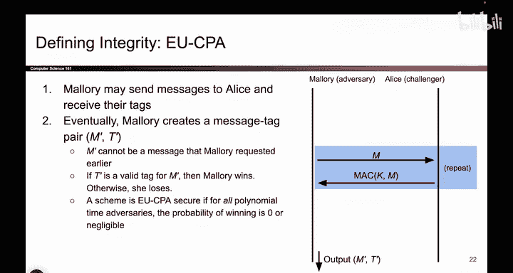
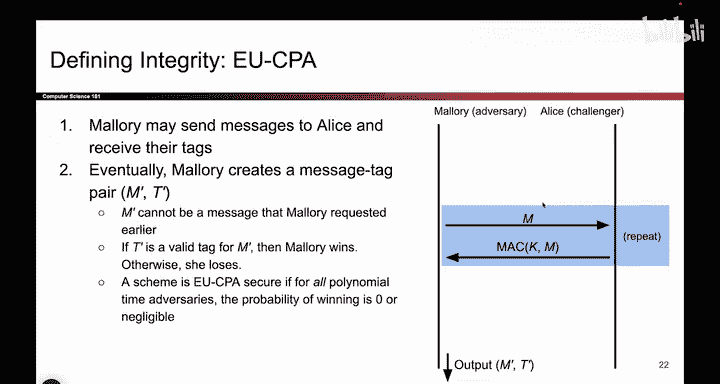
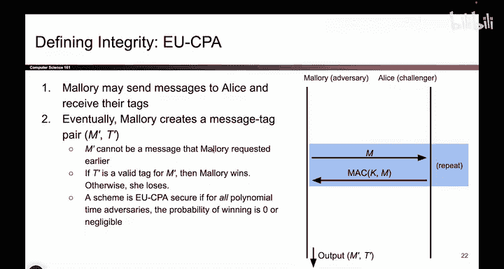
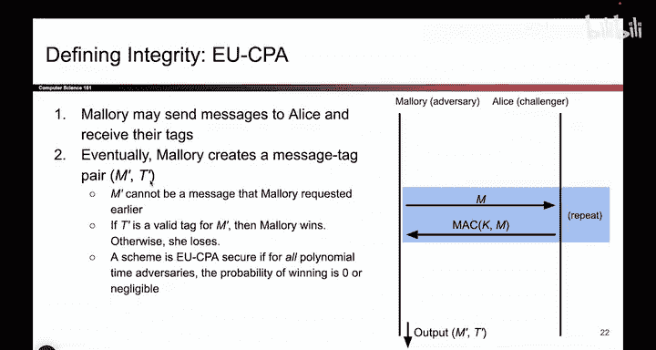

# UCB《计算机安全｜CS 161. Computer Security 2025》中英字幕 - P121：-Cryptography4, Video 8- EU-CPA Security.zh_en - GPT中英字幕课程资源 - BV1VhEhzMEPL

SoHow do you define if Max are secure there is a security game you can play and it's kind of like the INDCPA game。

 but now instead of trying to read the message and break confidentiality。

 you are now going to try and tamper with the message and break integrity So first let me tell you what it is in text and then we'll think about the game just like we did for IND CP。

So the property that you want is that if the attacker doesn't know the key。

 they should not be able to generate valid tags that would be really bad if you didn't know the key。

 but you could generate valid tags because then the attacker without the key can pick their own malicious message。

 generate a valid tag that Bob thinks is correct and we can feed that to Bob and now he thinks that the malicious message is correct so we should never have a case where attackers who don't know K can generate max on messages of their choosing that should not be allowed another equivalent way of stating that is that if I give you a Mac。

 you should not be able to tamper the message and then also tamper the Mac to match the message that's kind of like the tampering attack we saw from earlier with hashes we don't want that to be possible if you don't know the key so if someone gives you a message and a tag you should not be able to modify the message and then modify the tag so that they check out any modification you do should。

Break the Mac that's what it means to be unforgeible。

 Mallory should not be able to forge or make a fake tag that checks out and again。

 we're going to define this using a security game where if Mallory wins。

 the scheme is not secure and if Alices wins， it is secure。

So here's the game It's a bit shorter than the IND CPPA game So the first thing we'll do is kind of like the IND CPPA game we will create a query face。

 This is the phase where mallllory gets to exercise her powers and this is where the CPA comes from chosen plain text attack that's the threat model we talked about so this is where Maory gets to exercise her powers from the threat model she gets to play this as many times as she wants formerly a polynomial number of times she can't do this forever but she can repeat this as many times as she feels like and what she'll do is she'll tell Alice here's a message can you generate a Mac for it for it for me and Alice will faithfully take the key and the message that mallllory provided generate the Mac and send it back to Mallory so in other words mallory gets to see max for messages that she chooses and she can do this for as many times as she wants formerly a polynomial number of times can't do this forever。

But this is Mallory doing the chosen plain text the tech。

 It's kind of like how Mallory got to trick Alice into encrypting messages。

 but now she is tricking Alice into creating Max on messages。

 Mallory doesn't know the key but she can trick Alice into using the key to generate Max on any message she likes and you can imagine Mallory might try to use this section to maybe learn something about the max scheme find some flaws in it or maybe try and learn what the key is。

 maybe the scheme leaks a key， so if the scheme is insecure。

 it's possible that Mallory uses this section to learn something about it that breaks the scheme that would be Mallory's goal as she does this first query face。

So eventually Mallory gets bored of this scheme or she thinks she found a trick to solve this scheme or to break it and she says I'm ready for my challenge so we're done with this phase in blue。

 we're done with tricking Aliceison into sending us Max Mallory is ready for the challenge and the challenge is just this give me a message and a tag that match that's it so if you can find a message and a tag such that the Mac of the message and prime with a secret key matches the tag that Mallory choses she wins this is her forging a tag that she was not supposed to be able to forge because she doesn't know the key。

Now one important caveat here is that you can't use one of the original messages that's cheating so if you've already seen a message and the Mac on the message。

 you cannot pick that message again here in the challenge phase。

 the scheme is deterministic so doing that would allow Maory to win every single time and that's not a very useful game so Mallory has to choose a new message that she hasn't seen before she has to come up with a tag on it。

 that's any sequence of ones and zeros that she chooses and if it is the case that you take this message you compute the Mac with the key and you get the tag that mallllory provided。

 then she wins， she was able to forge a tag that she wasn't supposed to and if this is not possible whatever message tag pair if she chooses she cannot get them to check out then we say that mallllory loses and the scheme is EUucCPA secure if Mallory is losing no matter what strategy she chooses no matter what she tries to do she can never come up with something that checks out。

That's how we say she loses。

