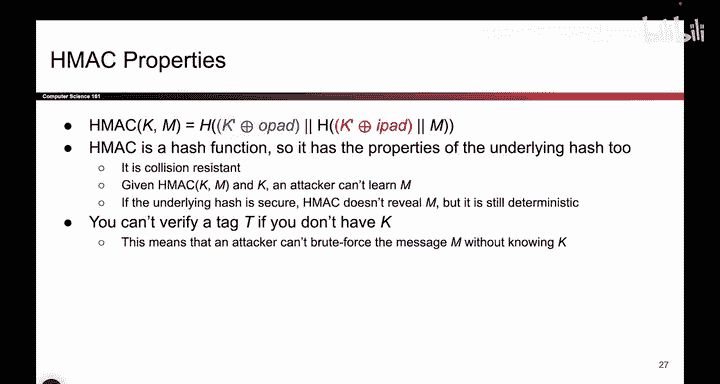
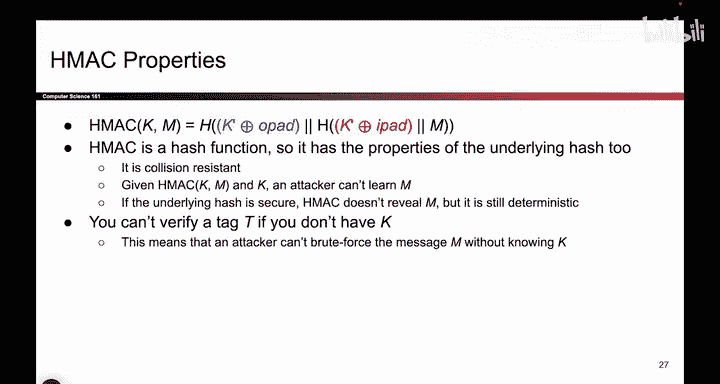
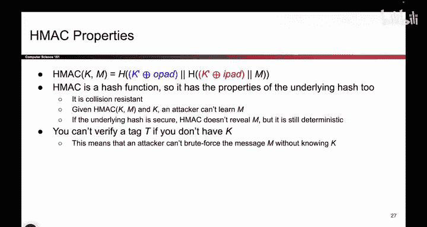
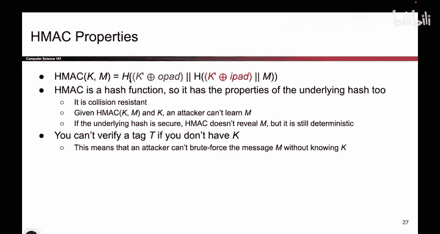
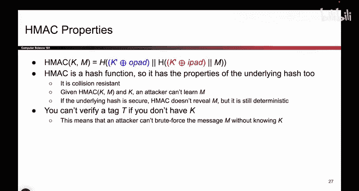
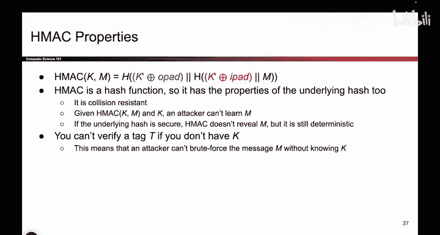

# UCB《计算机安全｜CS 161. Computer Security 2025》中英字幕 - P124：-Cryptography4, Video 11- HMAC Properties.zh_en - GPT中英字幕课程资源 - BV1VhEhzMEPL

Okay， so to recap， that's what H Macac looks like， it's basically Nm。

 but you do a little bit of fancy code to generate two keys out of one。 Now。

 if you stare at Hmac a little bit， it is just a hash function。

 It takes the input and yeah does some weird stuff with it。 But ultimately， the output is a hash。

 So all that you're doing is you're outputting whatever this H function outputs。

 So because Hmac itself is a hash function， Its just doing some extra stuff to your input before computing the hash。

 it has all of the same properties of the hash function itself。 And remember。

 we said that the hash function itself is a secure cryptographic hash function。

 So that means that this hash function is collision resistant。

 That's a property that all good secure hash functions have。 So because this is collision resistant。

 It means you can't find two different messages with the same Mac。 They exist out there。

 but it really hard for someone to find them。 So that's good。 It means that。😊。

Someone tells you to find two messages with the same Mac。 It's hard for you to find it。

 And that means you can't play a trick like asking Alice to encode the Mac of one message and then outputting the second message with the same Mac and trying to exploit the collision。

 You can't do that because we said that this hash is collision resistant。 The hash is also one way。

 So if someone tells you the Hm output， you still can't reverse it and learn the original input。

 So these are all nice properties that you get from H Mac just because it is also a hash。

 And earlier， we said that there is a proof out there， we're not going to show it here。

 But there is a proof that as long as the underlying hash function is secure。

 this Hm should be unforgeible。 And again， the rough intuition is that the hash scrambles up the message and the key and gives you a fingerprint on both the message and the key。

 So that's great。😊。

And one final note that's kind of interesting is that if you don't have K。

 you also can't verify a tag that may be a feature or a bug depending on how you look at it。

 But if you remember the way that we constructed Max earlier， we said that when Bob wants to verify。

 he takes the key， he takes the message and he regenerates the tag。

 So this does mean that the only person who can verify a message is Bob or someone with the symmetric key。

 that's just a feature of Hmac。 The only people who can sign or verify messages are the people with the secret key。

