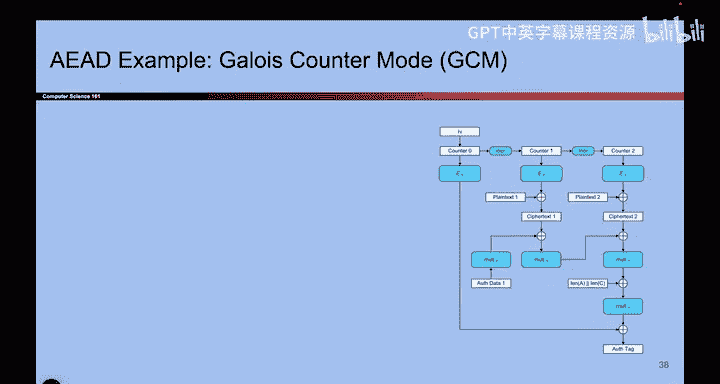
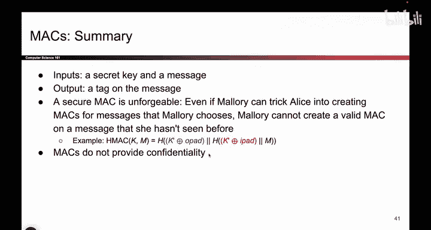

# UCB《计算机安全｜CS 161. Computer Security 2025》中英字幕 - P129：-Cryptography4, Video 16- AEAD Schemes, Summary.zh_en - GPT中英字幕课程资源 - BV1VhEhzMEPL

Okay， the second strategy for achieving authenticated encryption that is getting both confidentiality and integrity at the same time is to build a scheme from scratch。

 This is a valid option as well。 So instead of using any of the schemes we've talked about so far。

 you build something completely from scratch that encrypts the message and provides integrity with tags and you get all of it for a single algorithm。

 So that's pretty nice it's called AEAD encryption and one nice thing about it is that you don't have to worry about the way you combine the schemes anymore。

 there's just one scheme， so you don't have to worry about Mac and encrypt or encrypt and Mac。

 you just use this one scheme that's a benefit of schemes that are built from the ground up。😊。

But one major downside of a scheme like this。 And actually， here's an example， if you're interested。

 though I won't say it out loud。 But one major issue with using AEA schemes is that there's only one scheme。

 So if you mess it up， you lose both confidentiality and integrity。 and that's pretty bad。

 So this scheme， which I won't talk about out loud。

 turns out to require IVs for randomness and usually if you reuse an IV。

 we know you lose confidentiality。 you're not supposed to reuse IVs。

 but if you use a scheme like this that provides both confidentiality and integrity and you also reuse the IV。

 Well， you've just lost both confidentiality and integrity。

 that's even worse than the other schemes that we've seen。 So these schemes are powerful。

 but they're dangerous because they give you both properties at once if you mess up。

 you are going to lose both properties。 and that's undesirable。

 But that's a potential approach you can use， is to build these schemes for the。😊。

And here's an example， if you're curious。So that's it for this set of videos to summarize。

 We first talked about hashes， which map arbitrary length inputs， to fixed length outputs。

 and you can think of it like a fingerprint on the message。

 and we talked about various security properties that were useful on a hash。

 And we said that there is a length extension attack that some hashes are vulnerable to and others are not。

 And we said that depending on your threat model， hashes might provide integrity but in general。

 they don't under the threat model that we've been talking about。 Then we moved to max。

 And the idea was to pass in a secret key and a message and output the tag。

 we played a security game to show that max are unforgeible。 That's the definition of a secure Mac。

 And we showed an example construction called Hm。 It was based on Nmac。

 and we did a little bit of extra window dressing to get the。😊，Keys to work out。 And finally。

 we said that Mac don't provide confidentiality， be careful because they might leak your data。

 And then at the end， we talked about ways to combine confidentiality schemes and integrity schemes and we said that there are two possibilities。

 one approach is to combine schemes if you choose to combine schemes always use encrypted Mac don't give the attacker a decryption oracle and the second approach is to use AEAD schemes which are powerful but dangerous。

😊。

And that's it for max and integrity。