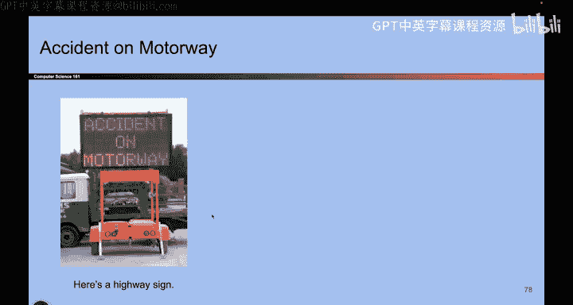
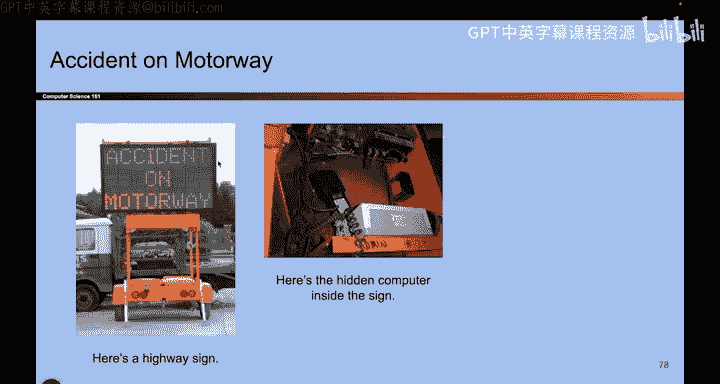

# UCB《计算机安全｜CS 161. Computer Security 2025》中英字幕 - P12：-Intro1, Video 12- Dont Rely on Security Through Obscurity.zh_en - GPT中英字幕课程资源 - BV1VhEhzMEPL

Okay。I'm making good time。Okay， so the next one is security through obscurity。 So here's the story。

So you ever see these signs， you're driving on the highway， you see these signs。 Well。

 turns out if you actually open up these signs， you'll see that there's a little computer that tells you what message to display。

 and it turns out。

If you actually go into the computer， this is a little panel where you type the message and you have the type of password before you can update the message。

 And it turns out if you go online and you look up the reference for how to use these machines。

 there's a default password， D， O T， S。 So if the person running this sign has not updated the password。

 It's just the default password， which you can find by searching online。So what can you do with this。

 go and put in the default password？I can do this， I can say zombies ahead or。Zoombies run。

That's something I can do。By the way， please don't do this。Okay， trapped and sign factory。

Senttel， okay， so please don't do this。 I would prefer not to get calls from the Department of Transportation。

 because that would not be fun， okay。So this is kind of a strange one。 And basically。

 what we're saying here is don't rely on security through obscurity。 So don't say something like。

 well， the password is default。 but who's gonna go online and search for it。

 It's pretty hard to find。 So it's probably okay。 So this is a case where we assume the attacker wasn't very knowledgeable。

 And we just left the default password lying around。 That's not good。

 The attacker is able to go online and search up the password。 That's not so great。

 So basically all of this boil us down to something called Jannnons maxim， which basically says。

 assume the attacker knows the system。 So the attacker how the machine works。

 Don't say something like， well， the attacker probably doesn't know where this little control panel is located。

 It's pretty hard to find。 So I'll be okay。 That's not okay。 The attacker can go online。

 do some searching and find out where this panel is located。

 Don't assume the attacker doesn't know where the manual is。

 They can go online and search for that too。 and learn how to reset the。

Password or use the default password。 So the attacker knows the system。

 They know how the machine works。 They know where the console is。

 They know where the password is and what the default password is。

 So don't rely on obscuring something and making it hard to find。 That's not security。

 You have to make sure the attacker is really not able to break into your system as opposed to just saying。

 well， it's hard to find So it's probably secure hard to find is not the same thing as secure for something to be secure。

 it has to be secure， even if the attacker knows every single detail about your system。

 being hard to find does not count。 So another kind of classic example that you might see in discussion section or something。

 So you'all ever have a key that you put underneath your doormat is that secure， no。

 is the key hard to Yeah， but being hard to find is not the same as being secure。

 if an attacker knows that people keep their keys under the doormat they are going to check under your doormat and take your key and go into your house。

And that would be bad。So that's called Chaandnon's Maxim。 It says。

 don't rely on things being hard to find for security。

 Always assume the attacker knows every little detail about your system。

