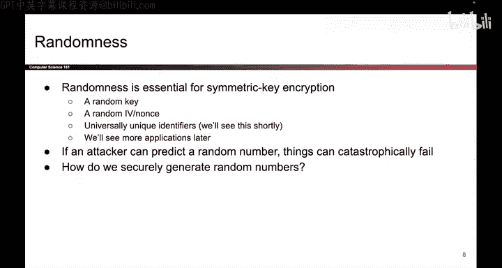

# UCB《计算机安全｜CS 161. Computer Security 2025》中英字幕 - P131：-Cryptography5, Video 2- Entropy, True Randomness.zh_en - GPT中英字幕课程资源 - BV1VhEhzMEPL

Let's start today by talking about randomness。In our cryptography roadmap。

 we're not talking about a scheme that provides confidentiality or integrity。

 but we still have to talk about randomness because it is an important building block to a lot of the schemes that we've been studying。

So as a reminder， you've already seen randomness in lots of the schemes that we have built to encrypt things and to compute Max。

 We needed a random key。 And in our encryption schemes。

 we needed a random IV or nots for each encryption。

 There's also other applications of randomness that we'll see later today。

 But the important thing is that all of these sources of randomness were assumed to be random。

 In other words， if the attacker was actually able to break the randomness。

 They were able to predict the value ahead of time， things can go horribly wrong。 For example。

 if the attacker is able to predict the random key that you're about to generate。 Well。

 now they know your key and there's no more security。

 So an important thing we need to discuss is where these random numbers come from and how to generate them securely。

😊。

So before we can talk about how to generate these random numbers。

 we should first talk about what random actually means and how it's defined。 So in cryptography。

 when we say random， we really mean random and unpredictable So as an example of what unpredictable moldbes。

 let's say we want to generate a secret key that the attacker can't guess So intuitively the best way to do this might be to toss a fair coin a coin that comes up heads 50% of the time and tails 50% of the time and if it comes up heads write a0 if it comes of tails write a1 do this over and over again and you have a secret bit string that is very hard for the attacker to guess and why is this hard for the attacker to guess Well it's because the0 and the one are equally likely so they don't really have a clue as to whether each bit is a zero or a1 By contrast a worse way to generate random bit strings would be to use a coin that is biased a coin that comes up heads。

9% of the time en tails1% of the time。 If you instead use this bias coin to generate a secret key。

 well， then most of the bits in your secret key are going to be zero because the coin is biased and now the attacker is more likely to guess your key because they know that most of the bits in your key are probably going to be zeros So we need a more formal way to write that the fair coin。

 the one with 50% heads and 50% tails is a better choice of randomness than the biased coin where most of the outputs are zero。

 So the formal measure of this is something called entropy and it measures how uncertain the outcome is or how unpredictable the outcome is and in general。

 we like things that are high entropy and cryptography because high entropy means that the outcome is hard to predict。

 So for example， the fair coin had high entropy because it was hard to predict whether each toss of the coin was heads。

Ortails， while the biased coin had low entropy because it was predictable whether or not the outcome was hazard or tails。

 So that's one way we can measure the source of randomness。

 and in this class we're not really going to go further into the study of entropy and how you measure these things if you're curious。

 usually these things are measured in bits。 So for example。

 a fairco would have one bit of entropy because there are two possible outcomes。

 some distribution that is uniform over8 values would have log base two of8。

 which is three bits of entropy， but we're not really going to go there。

 you're welcome to if you're interested though， but for our class。

 the important thing is that entropy lets us formally measure uncertainty and high entropy events are good。

So as a real worldorld example of what happens if you use a low source of entropy。

 this is some codebase that's used in Bitcoin and apparently someone made a commit to the repository that says impments to the random number generator that's how they spelled it and apparently the improvement caused the random number generation algorithm to have less entropy。

 that means that the attacker is now more able to guess the private keys that are generated with this code。

 and if the attacker is able to predict the private key。

 they can steal your Bitcoin money and all the security is lost。

 so perhaps it was not much of an improvement after all。

So now that we know how to define and measure randomness。

 let's think about where randomness actually comes from。 So if you want true randomness。

 you have to rely on some physical source of entropy。

 something that exists in the real world has to be the source of your entropy。

 So one example might be a circuit on your CPU that's intentionally wired to have unpredictable behavior。

 so maybe the voltage level hovers around 0。5 so that sometimes it's read as a 1 and sometimes it's read as a 0 and it's unpredictable where that voltage level is at any given time another physical source of randomness might be human activity。

 but measured at very specific time scales， so for example。

 every time you press a key on your keyboard we write down the microsecond that you press it and humans don't work at microsecond time scales。

 So if you press the key at 503 and 5。272689 seconds。All of those numbers are as good as random。

 So if you want true randomness， you need to use some physical source of entropy like that。

 There are also more exotic entropy sources。 So， for example， if you go to the offices of Cloudflare。

 A， they have all these lava lamps and they have a camera pointed at them and the way that the light flickers in the lava lamp could also be used as a source of randomness。

 The big problem with using true randomness is that it is slow and expensive to generate。

 So because you're relying on these physical sources of entropy gathering that entropy can be slow。

 it can be expensive compared to running a piece of code。 So ideally， we want this。

 but it's not so efficient to generate。