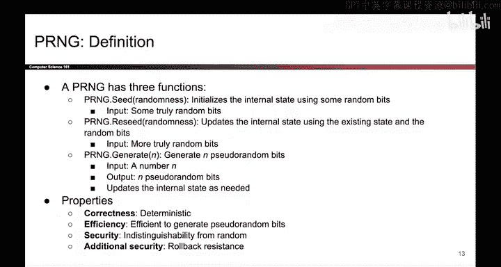
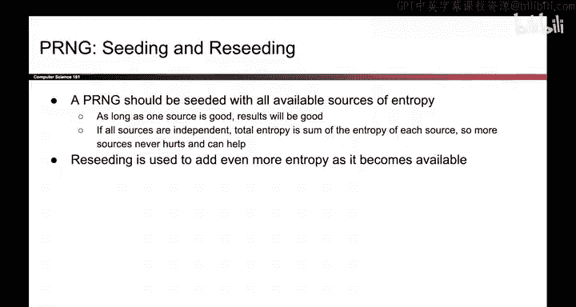

# UCB《计算机安全｜CS 161. Computer Security 2025》中英字幕 - P132：-Cryptography5, Video 3- PRNG Definition.zh_en - GPT中英字幕课程资源 - BV1VhEhzMEPL

Because true randomness is expensive， we instead turn to software。

 So what we want is a pseudoran number generator and this is a piece of code in software that takes in a little bit of true randomness as input and is able to generate a lot of random looking output very quickly and efficiently So the way that you might use this is to go and gather a little bit of true randomness which remember is expensive you feed that into the PRNG and the PRNG is able to efficiently and cheaply output a lot of random looking numbers。

 Now do note that PRNGs are deterministic， so that means that if you feed in the same bits of true randomness twice you will get the same random looking output After all the PRNG is just a piece of code so if you feed it the same inputs。

 you will get the same outputs。 However， if your PRNG is designed to be secure then we can say that the output is computationally indistinguishable。

From true randomness， so what that means is that if you give an attacker some PRNG output that was generated in this way and you give them some true random output that was generated from the lava lamps or some other physical source of randomness。

 the attacker with polynomial runtime is unable to tell which of these came from the PRNG and which of these came from true randomness。

 so that's our goal with the PRNG， it's a piece of code that can efficiently generate numbers that look as good as random。

 even though they came from a deterministic algorithm。

So how do you define a PRNG There's actually different ways you can define this and if you look through some different research papers。

 you will see different definitions of a PRNG but for the purposes of this class。

 we'll think of the PRNG like an object so if you think about objectoriented programming for example in Java you can think of the PRNG as a class that you can write and then you can instantiate instances of the PRNG in your code So when you create a new PRNG object that object has three methods that you can use to interact with the PRNG One method you can call on this object is seed and that takes some true random bits and uses them to initialize the internal state of the PRNG so as an object that has some internal instance variables to help it generate pseudoran numbers seeding is using true randomness as input and initializing that internal state。

Later， if you decide that you have some more true randomness that you want to feed in。

 you can call the reseed method and this again takes in some true randomness and updates the internal state to incorporate those random bits。

And the final method you can call is the generate method。

 this is the one that actually has output and this is how you generate pseudorandom bits。

 so you pass in a number N saying I want end bits of pseudorandom output and the PRNG uses its internal state possibly updating those internal variables as needed to generate the end pseudorandom bits that you requested cheaply and efficiently in software。

So what makes a PRNG correct and secure。 Well， one thing we want is that it should be deterministic。

 It's a piece of code。 If you run it with the same inputs， you should get the same outputs。

 It should be efficient and we're not really going to formally define that but think of it like whatever it's doing。

 it should be some sort of bit shifting or something that computers are good at so that it's actually giving us efficiency benefits compared to true randomness in terms of security。

 we want it to be computationally indistinguishable from random and we'll define that more formally and an additional security property you might want is something called rollback resistance which we will also discuss。

A good PRNG should be able to take all the sources of entropy that you can throw at it。

 If you give the PRG a good source of entropy， that's great。

 Now an attacker who wants to predict your PRG output has to guess that initial input entropy in order to run the algorithm and generate the same outputs that you are generating but a good PRG should also be able to take bad sources of entropy to make the PRG better。

 So， for example， if you pass in the output of a biased coin。 we know that has low entropy。

 but it should still help the PRG become more secure。

 the attacker still has to guess the outcome of that biased cointass in order to reconstruct the PR the way that you have seeded it。

 and even if you pass in some source with no entropy at all。

 like its always one that should not make the PRG worse。

 the attacker always knows that you've passed in the input1 that's a very bad source of entropy。

 but it shouldn't make the PRG worse。 So as long as one of。The sources is good。

 the overall PRNG should be hard for the attacker to guess Another way of saying this is that the total entropy of the PRNG should be the sum of each of the entropy sources that you provided and therefore if you provide more sources even if they are low entropy or zero entropy they should only help they shouldn't make the PRNG worse so what this means is that if you are using the PRNG if you ever have a source of entropy even if it's terrible just reseed your PRNG with the extra entropy。

 it should only make things better not worse。

