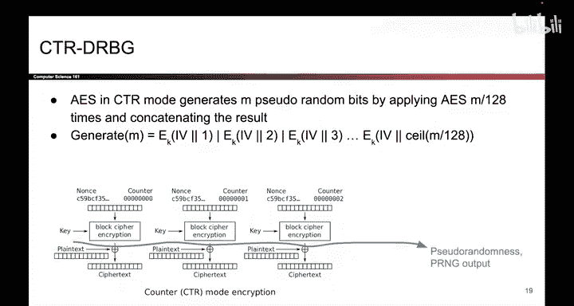
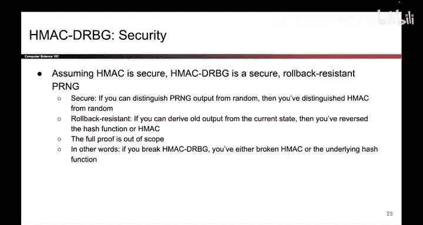

# UCB《计算机安全｜CS 161. Computer Security 2025》中英字幕 - P135：-Cryptography5, Video 6- PRNG Implementations.zh_en - GPT中英字幕课程资源 - BV1VhEhzMEPL

So now that we know the definition of a PRNG。 let's take a look at some examples。

 It turns out one example of a PRNG has been hiding in plain sight all this time。

 when we talked about CTr mode， we set that CTR mode kind of behaves like one time pad where the pad the random value that you use to Xor with the plain text is generated from block cipher outputs。

 So if you just take the top half of this diagram where you are generating that random pad that itself is a PRG the seed is the nos and the key。

 the true randomness that you pass in and the block cipher outputs are the pseudoran output that is being generated by this PR So the countermbased PRNG is one possible construction you can use to build a secure PRNG and this is based on the fact that block cipher output is indistinguishable from random So the output of this。

RNG is also indistinguishable from random。

Another way to build a secure PRNG is actually based on Hmac。

 So remember that Hmac is itself based on hashes and also remember that hash output is unpredictable。

 if you change any bit of the input， the output looks totally unpredictable So we're going to use that idea to build our PRNG So that construction might look something like this。

 Now don't worry too much about the exact details here。 it's not the most important thing。

 Just remember that what's happening is we're calling Hmac a lot of times and the unpredictability of that underlying hash is what's giving us our unpredictable output。

 but if you're curious here are all the exact details although they are not the most important thing here So the Hmacbased PRNG has two instance variables K and V and they just so happen to start at zero and anytime you call seed or reseed notice that we're taking that seed S where。

It into H Macac to cause some unpredictable output to appear。

 and then we reassign K and V to the output of that H Mac。 So in effect。

 we are incorporating the randomness that you have introduced into our instance variables K and V with the help of H Macac。

Now if you want to generate output， it might look something like this。

 so there's a loop and the loop calls Hmac repeatedly until enough bits have been outputted。

 So if you ask for a lot of bits， this Y loop will run a lot of times until Hmac has been called enough times to generate enough output Also every time we call Hmac we also update one of the internal variables V which we then pass back into the Hmac and this ensures that every call to Hmac produces different output every single time you call it in this loop。

 So again， don't worry too much about the exact details here。

 the important thing is just that we' are calling HMac in a loop and updating the internal state every single time and this is what produces the random looking output and again at the end we update the internal state not too important but this is what Hmacbased PRNGs might look like and one thing to notice here is that everything here is determinist。

It's all based on the user inputs S and N。 And at no point are we actually using true randomness here。

 The code itself is deterministic， and the true randomness is inputted by the user。

 This is why we say that PR Nngs are deterministic。

 They take in the true randomness from outside or the user provided S。

 And then they deterministically generate pseudoran output。

The Hmacbased PRNG is secure， assuming that the underlying hash that you're using is secure。

 We're not going to prove it in this class。 We're not a proofbased class， but if you're curious。

 the proof would be something like a reduction proof where it says if you can break Hmac you have also broken the underlying hash function therefore if the underlying hash function is secure。

 then Hmacbased PRG is also secure。 So we're not going to talk about the proof。

 but the outline would look something like that。 Another great benefit of the Hmacbased PRG is that it is rollback resistant and remember that property means you cannot run the Hmac PRG algorithm in reverse。

 Even if someone told you the current internal state that is the values of K and V those internal instance variables。

 you cannot run this algorithm in reverse to figure out the previous outputs of this PRG And the reason why is because this PR。

It was calling。Haashs all of the time calling Hmac over and over again。

 and Hmac is not something you can call in reverse。 given the Hmac output。

 you don't know what the input is。 so you can't run this algorithm in reverse。 So in summary， Hmax。

 they are secure。 They're indistinguishable for random， and they are also rollback resistant。

 We have that extra property where you cannot run the algorithm in reverse。

 And one thing I haven't mentioned that I might as well do now。

 DBG stands for deterministic random bit generator。

 and that's just another name that people use for PR and G sometimes So it's a lot of acronyms。

 but that's what the RBG is。

