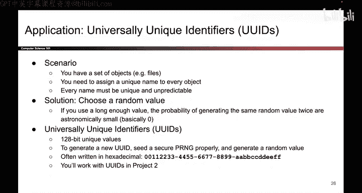

# UCB《计算机安全｜CS 161. Computer Security 2025》中英字幕 - P136：-Cryptography5, Video 7- Using Randomness for Unique IDs.zh_en - GPT中英字幕课程资源 - BV1VhEhzMEPL

Okay， even more examples of insecure PRNGs， as you can see this happens quite often in real life。

 so we have tons of examples of it， please don't be the next example of it。

 but as you can see if you use a secure PRNG but you don't provide enough entropy while people can predict future randomness and all of your security is compromised。

Okay， there's even more examples again， I am not going to talk about these out loud。

 you can read them on your own time if you're curious， but just remember that when you use PRNGs。

 you have to pick a secure one and you have to pass in sufficient entropy in the seed。

 So now you know。

One application of randomness that's different from the things we've talked about so far is something called a universally unique identifier or UUI。

 And this is something you'll get to work with in Project 2， the cryptography project。

 So the scenario looks like this。 Let's say you have a lot of objects， for example。

 files in a file system and you want to give each one a unique unpredictable IDd so you don't want to just number them 1。

2，3，4，5。 you want the numbers to be unpredictable and you don't want any duplicate numbers。

 You don't want any two objects to have the same ID。

So it turns out one way to do this is just to pick a random number for every single object and you might be worried that we might get unlucky and choose the same random number for two different objects。

 but if you use numbers that are large enough。 it turns out you can make this probability very small。

 So for example， if your Uu Ids are 128 bits long。 the probability of generating two duplicate numbers is one in2 to the 128。

 and we've already discussed that that probability is astronomically low， it's basically zero。

 So choosing random numbers is as good as unique。 So it's kind of cool that using randomness we can get unique identifiers for all these different objects and that's what Uu Is are and you can actually implement this using PR andGs and this is something you can use in project2 to give unique Is to different。

Things that you might want to define in the project。

 So that's an example of a different application or randomness that might be useful。

So that's it for PRngGs。 Let's summarize what we thought about。

 One thing we said is that true randomness is expensive。 and to fix that， we design the PRMG。

 that is a deterministic algorithm that takes in a little bit of true randomness called the seed。

 and it cheaply and efficiently generates lots of random looking output。

 If you think of the PRNG as an object in code， it has three different methods， the seed method。

 the resed method。 these take entropy and they don't output anything and the generate method takes in a number and generates that many bits of pseudoran output。

 The PRNG is secure if it's computationally indistinguishable from true randomness and a bonus property that's nice to have。

 but it's different is rollback resistance。 We saw two different ways to build PRNGs。

 one was based on block ciphers， the other was based on hashes and other constructions exist as well。

 And at the very end we showed you one application of randomness that's different。

USo that's it for PR NGs coming up next， diiffy Holman key Exchange。

