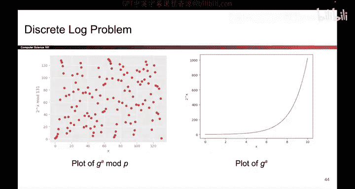
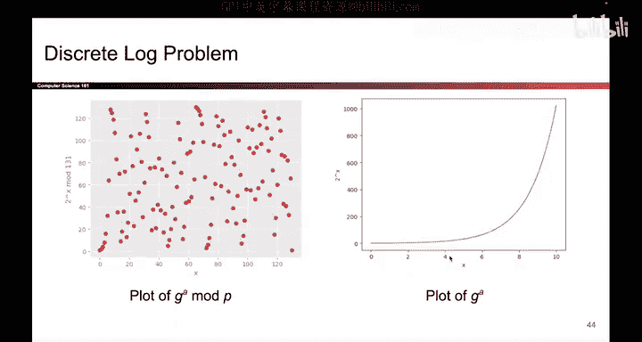
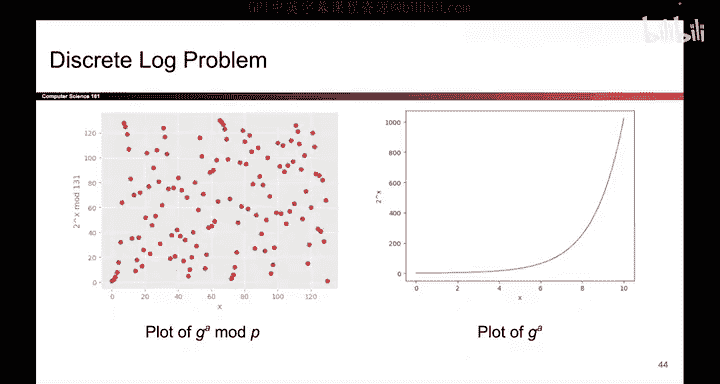
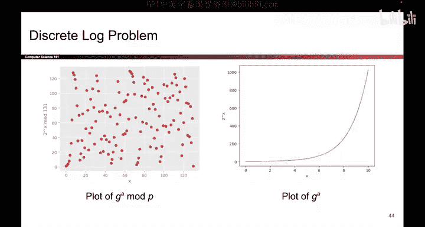

# UCB《计算机安全｜CS 161. Computer Security 2025》中英字幕 - P140：-Cryptography5, Video 11- Discrete Log Problem and Diffie-Hellman Problem.zh_en - GPT中英字幕课程资源 - BV1VhEhzMEPL

So unfortunately， computers cannot mix paint， but luckily。

 there is a mathematical version of the problem that we just saw。

 It's called the discrete logarithm problem。 So first， let me describe what the problem is。

 and then we'll describe why it's hard in this problem。

 everyone knows a large prime number P and a number G。 technicalnly。

 this number G has to be something called a generator mod P。

 but not the most important thing for our purposes。 So the problem is stated like this。

 Everyone knows the numbers G and P。 Now， if I take a secret number A。 I compute G to the a mod P。

 and I give you that number G to the a mod P。 It is very difficult for you to find what value of a I chose to compute that value。

 That's the discrete logarithm problem。 given G to the a mod P， it is very hard to find a。

Now at first， this might seem contradictory， it seems like all I have to do is take the logarithm and I can find the original A so to understand why the discrete log problem is so hard。

 let's take a look at some pictures。So on the right here。

 I have a plot of G to the a without the mod P。 If we were not working in mod space。

 you're right that solving this problem would be pretty easy if I pick a secret A that's large。

 then G to the A will also be big and you'll be able to tell me what value of AI chose So for example。

 if I chose a large value of a I would output one of these numbers and you can tell me that I must have chosen a large value of A and if I had chosen a small value of a I would have output at one of these smaller values and you could have told me that I chose a small value of A。

However， if we work in the modo P space， that is we take all of these numbers and we compute the mod P instead。

 Sudden the plot doesn't have any sort of recognizable pattern。

 if I take a small value of a and I compute G to the a mod P， the result could be some big number。

 or if I take some big number and compute G to the a mod P， it could also be a big number。

 or if I take some middling value of a and I compute G to the a mod P。

It could also be a big number， so just because I tell you a big number。

 it doesn't mean that the A that I chose is big or small or middling， it's just not clear。

Whatever value of G to the a mod P， I tell you， it's really hard for you to look at this plot and identify any patterns that would help you find the original value of a。

 So if I told you that I computed G to the A mod P， and it was this value right here。

 That's the value on the Y axis is。 I don't know what value on the X axis I chose for a。

 It could be a large value， but it could also be one of these smaller values， it's just not clear。

 That's the discrete log problem。 and this picture is why it is so hard to solve。

A close cousin of the discrete log problem is something called the Diffy Heman assumption again in this assumption。

 everyone knows some public values G and P。Now what's going to happen is I'm going to secretly choose two values of A and B。

 which you don't know， and I'm going to compute G to the A mod P and G to the B mod P and I'm going to present those two values to you and the difffihelman assumption says you have no way to compute G to the A B mod P。

 If I gave you G to the A B mod P and I give you some random number R。

 you cannot tell me which one is the answer and which one is the random value and the intuition for why this problem is hard is because if you wanted to compute G to the A B mod P the best way to do it is to first compute A and then take G to the P raise it to the A power to get G to the B mod P but of course。

 doing this is hard because given G to the A mod P getting the original A is solving the discrete log problem and we just said that's really hard。

 So the difference is very subtle can。Think of the discrete log problem and the diiffy Human assumption as close cousins。

 but the difficulty of these problems， it's what's going to unlock the mathematical version of secure color sharing for us。

