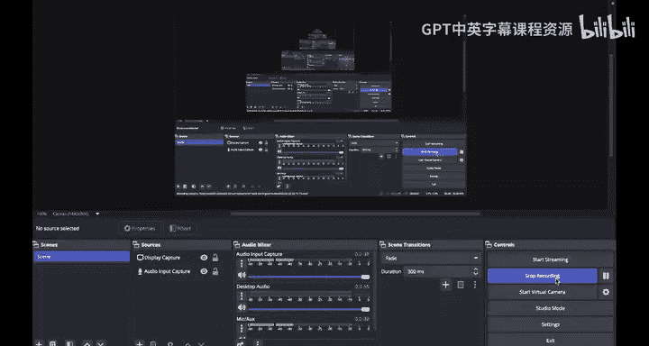
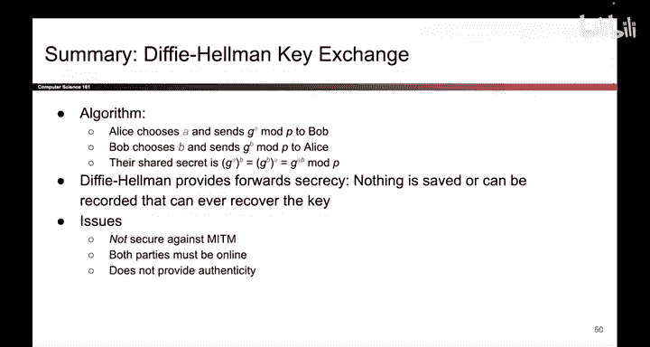

# UCB《计算机安全｜CS 161. Computer Security 2025》中英字幕 - P144：-Cryptography5, Video 15- Elliptic Curves, Summary.zh_en - GPT中英字幕课程资源 - BV1VhEhzMEPL

Now we built the diffyhelman key exchange using the discrete log problem。

 but it turns out that there are other fields of math that also provide the same property where they help you disguise a secret where the attacker who sees the disguise secret is unable to tell what the original secret was。

 One such field of math is called elliptic curve cryptography Now we're not even going to talk about elliptic curve cryptography and how it works。

 you can look it up on your own， but for the purposes of this class。

 just think of it as some magic math that has similar properties as the discrete log problem so you can also build a diffyhelman key exchange using elliptic curve math to disguise the secrets。

 One benefit of using elliptic curve cryptography is that it provides the same level of security with smaller key sizes。

 So if you do a discrete log diffyhelman key exchange like the ones that we've been doing using roughly 3000。

Bit numbers。 Well， you can get the same amount of security by using 300 bit numbers in elliptic curve and by same security。

 we mean that both of these schemes require the same amount of brute force to solve。

 but the elliptic curve equivalent uses smaller keys because the underlying problem is harder to solve in some sense。

 So that's all we're going to say for elliptic curve cryptography。

 We're not going to go into it any further if you're curious。 Do feel free to look it up。

 Just know that other fields of math can be used to produce diffyho and key exchanges and some of them provide the same level of security with smaller key sizes。

And that wraps up diffyhelman key exchange to summarize The protocol looks like this。

 Alice chooses her half of the secret A disguises it using G to the A mod P where G and P public values。

 and sends that over to Bob。 And likewise， Bob chooses his half of the secret B。

 and disguises it by sending G to the B mod P to Alice。

 Both of them take the disguised secret that they received。

 raise it to the power of their own secret， and they both compute G to the A B mod P。

 Dffy Heman provides forward secrecy， And that means that if an attacker compromises our system in the future。

 they are not able to come back and decrypt previously recorded messages and the reason is because A B and even the shared secret can be discarded once you are done using them。

 Some issues with the diffyhelman key exchange， it is not secure against the man in the middle。

 It doesn't provide authenticity。Don't know who you're talking to Both of those points were shown in our attack。

 where Mallory caused Alice and Bob to derive different secrets， where Mallory knew both secrets。

 And remember an equivalent way of looking at that is to say that Maory has stepped in the middle。

 Alice and Mallory did an exchange that worked。 and Mallory and Bob did an exchange that worked。

 So they both did do a successful exchange。 They just don't know who they did the exchange with。

 That's why we say it doesn't provide authenticity。

 And one final problem is that both parties have to be online。

 And that's something we solve next time。 So that's it for today。

 hopefully this answered some burning questions that you had about how random numbers are generated and how Alice and Bob got those symmetric keys to begin with。

 So hope you enjoyed it and we'll see you next time。

