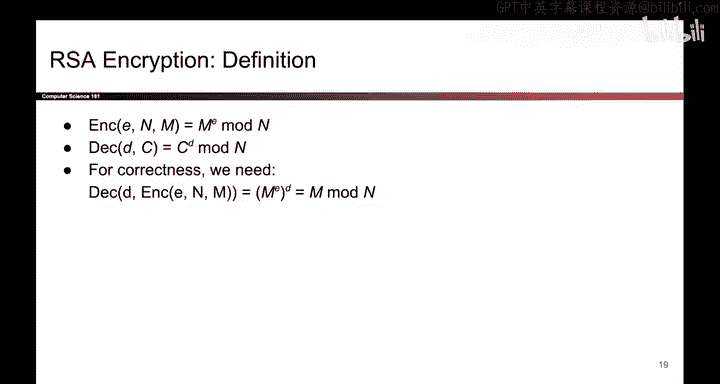

# UCB《计算机安全｜CS 161. Computer Security 2025》中英字幕 - P149：-Cryptography6, Video 5- RSA Encryption.zh_en - GPT中英字幕课程资源 - BV1VhEhzMEPL

The second public key encryption scheme we'll see today is RSA encryption。

We're still in this top right box because we're still looking at schemes that provide confidentiality in the asymmetric key setting。

So first， let me tell you how RSA encryption is defined and then we'll talk about why it's correct a lot of this will seem like mysterious math where I'm making choices for seemingly no reason。

 but hopefully when we go through the proof of why RSA encryption works。

 it will become more clear why we make all these choices。

 but first let's just talk about the definition and it's okay if it's a little mystifying。

The way that you generate the key is as follows， the first thing you'll do is randomly pick two large prime numbers。

 P and Q， and in case you're concerned that this can't be done efficiently， it actually can be。

 you can pick random numbers and then use some test to check if the number you chose is prime and it's a little bit out of scope。

 but you can show that this can be done efficiently。

Then you're going to compute a number n which is P times Q。

 usually p and Q are large enough that the resulting n is between 2000 and 4，000 bits long。

 so it's a pretty big number。Then you're going to pick a number E。Under this very strange constraint。

 we're going to say that E must be relatively prime to the value P-1 times Q-1。

 So the number E that you choose must have no common factors with p-1， Q-1。 Again。

 I know it seems strange， but it will make more sense later。 And also a minor note。

 you cannot choose exactly p -1 Q-1， And you cannot choose 1 or 0。 Those cases are too trivial。

The final thing you need to do is compute a value D and D is going to be the inverse of E modo p minus1 Q minus1 and again this should seem strange。

 but it's what we're going to do and remember from C70 that there are some algorithms for efficiently computing the multiplicative inverse in modo arithmetic Once you've computed all these numbers。

 your public key is actually going to be a pair of two numbers N and E So when you publish this key to the world。

 you must tell everyone two numbers， the value of n and the value of E and the private key is the number D which you must keep secret to yourself do not tell everyone the number D。

So that's how you generate keys Now to encrypt and decrypt it's actually more straightforward so the encryption algorithm takes in your public key and remember the public key is two values E and N and it also takes in a message with these three values the way that you encrypt is you take M you raise it to the E power mod N and that's your cipher textex and to decrypt something you take in the secret key which is D and the cipher text which is C and you compute C to the D mod N so in other words encryption is raising to the E power E for encryption and decryption is raising to the D power D for decryption and that's it。

So that's how you define RSA encryption now to prove that all of this actually works。

 we need to show that for any message that we provide encrypting it and then decrypting it should produce the original message so in other words if you take a message and encrypt it。

 raise it to the E power and then you decrypt it by raising it to the D power hopefully you get the original message M back and that's where we're going to prove next。

