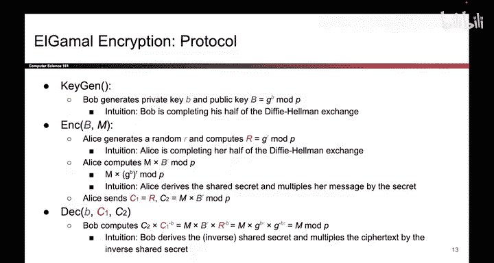
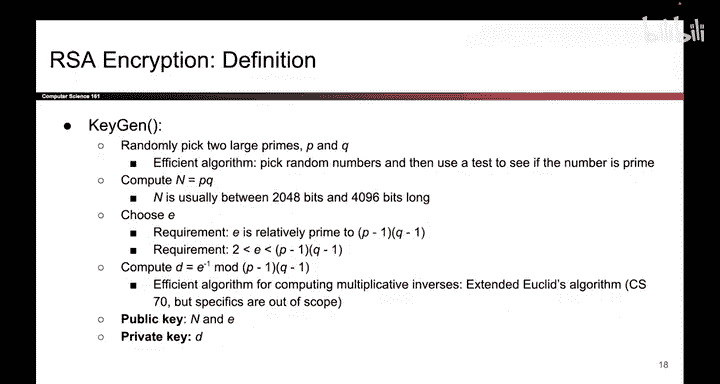
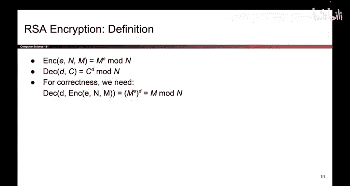

# UCB《计算机安全｜CS 161. Computer Security 2025》中英字幕 - P152：-Cryptography6, Video 8- Hybrid Encryption.zh_en - GPT中英字幕课程资源 - BV1VhEhzMEPL

So we've now shown two public key encryption schemes， public key encryption is great。

 it allows Alice and Bob to communicate securely， even though they don't have a shared secret。

But there are some issues。 One issue is that public key encryption is slow。

 We've talked about this before。 You saw all those operations like taking exponents mod P or multiplying two large prime numbers together or selecting two large prime numbers。

 Those are all operations that are far slower than symmetric key operations like shifting bits or taking exhors。

 Those are much faster。The other issue with public key encryption that we haven't explicitly called out yet。

 but we'll call out now is that it is limited to encrypting small messages and to see why。

 let's go back and look at the way these schemes were defined。So if we look at algamal encryption。

 we can see that the message is actually defined mod P。

 and that means that you are limited to encrypting messages between 0 and p minus1 if you try to encrypt larger messages it becomes ambiguous when Bob decrypts So if Aliceice encrypts M or M plus p or M plus 2 p or M plus 3p and so on and so forth。

 all of those messages when decrypted by Bob will reduce to M mod p they're all equivalent mod p and it's not clear which one Alice meant to send so this means that the messages that Alice wants to send are limited to numbers between0 and p minus1。

If we look at RSA encryption， we have the same problem。

The messages are defined mod n， so that means that all messages sent must be between 0 and n1 and because n is some number that's 2000 to 4 thousand0 bits。

 This means that the message that Aliceice sends must be at most a few thousand bits and likewise in Algamal the message is limited to several thousand0 bits。

 but that's not a lot of data， so that's a big issue with public key cryptography。

 you cannot encrypt a lot of data at once。

So to solve that we can use something called hybrid encryption that tries to get the benefits of both public key encryption and symmetric key encryption。

 and it works something like this when Alice wants to send a message to Bob the first thing she does is she takes a symmetric key that she generates K。

 she encrypts K using public key encryption and that's okay because K is a pretty small value and she sends that over to Bob。

And then the second thing she does is she takes her really long message。

 She encrypts it really quickly using the symmetric key K。

 Here's where the benefits of symmetric key encryption come in。

 And then she sends the encrypted message to Bob。 So when Bob receives the message。

 he receives two things。 First， he receives the encrypted key。

 And what he does is he uses public key cryptography to unlock the symmetric key。

 And now that he has the symmetric key， he can use it to quickly decrypt the large original message that Alice sent。

 So it's two parts。 First， you encrypt a symmetric key。 that uses public key encryption。

 Then you encrypt the message itself using the symmetric key。 And when Bob decrypts。

 he first uses public key to unlock the symmetric key K。 And once the symmetric key K is unlocked。

 he can decrypt the overall message。 That's called hybrid encryption。

 it honestly sounds more confusing than it actually is。

Especially once you start to play with it and maybe implement it in your project。 So this is great。

 It allows us to encrypt large amounts of data very quickly using symmetric encryption。

 but Alice and Bob don't have to share a key ahead of time。 So that's great。

 and this is actually what a lot of cryptographic systems use today。😊。

