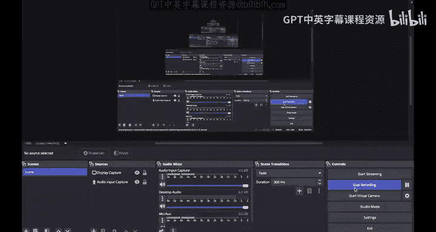

# UCB《计算机安全｜CS 161. Computer Security 2025》中英字幕 - P154：-Cryptography6, Video 10- Digital Signatures - Implementations.zh_en - GPT中英字幕课程资源 - BV1VhEhzMEPL

One implementation of digital signatures is RSA signatures。

So if we look at the way that we did RSA encryption， we took M， we raised it to the E power mod n。

 then we raised it to the D power mod n， and we got the original message M back。

 but there wasn't really anything special about starting with E and then doing D afterwards。

 If we took M raised it to the D power and then raised that result to the E power we would still get the original M back based on the proof that we did So that's the idea behind RSA signatures。

 We're going to use the same correctness proof from RSA encryption。

 but we'll do the steps in reverse。 We'll start with D and then raised to the E power to verify So more formally it looks like this The key generation algorithm is exactly the same as RSA encryption。

 the public key is N product of two primes and E and the private key is D which is the inverse of E mod P minus-1 Q minus-1。

All the same things。Now， to sign a message， you take in the private key D and the message M and you compute M to the D mod N。

 So you're raising to the D power first。 You're doing the steps in opposite order。Now to verify。

 you take in the public key E and N， the message M， and the signature。

 and remember the signature is M to the D。To verify that the signature is correct。

 you take the signature and you raise the signature to the E power。

 and if the signature has not been tampered with， then the result should be signature to the E power。

 which is M to the D raised to the E。We saw that the E and D cancel and we should get the original message back。

 so to verify if a signature is correct， you take the signature。

 you raise it to the E power and see if you get the original message back。

 It's just like RSA encryption， but you start with D。 then you apply E later。

 and one final note in order to support arbitrarily long messages， we don't raise M to the D power。

 we raise hash of M to the D power， And when we raise to the E power， we compare against hash of M。

 this allows signing arbitrarily long messages。Recall that there was a diiffy Hemanbased public key encryption scheme called Algamal encryptncion。

 Similarlyly， there is also a diiffy Hemanbased digital Sign scheme called DSA signatures Now to be honest。

 this scheme is a good deal more complicated than the other ones we've shown today。

 So we're not going to test you on it。 It's not in scope for this class。

 but if you are curious we have left some extra slides here that you can check out。 So again。

 not going to read these out loud， but check them out if you are interested。

So that just about sums it up for public key cryptography， remember that in public key cryptography。

 everyone has a public key and a corresponding private key that only they know to encrypt messages。

 use the public key to encrypt and the private key to decrypt。

 and we want similar security properties as symmetric key encryption such as IND CP security Elgamal is an encryption scheme based on the Diffyhelman key exchange but think of Bob as taking a nap during the encryption。

 so Alice does all the work during the encryption and then Bob wakes up and does his part of the Diffyhelman Exchange when he is decrypting。

We also showed RSA， which is another form of public key encryption， and we proved that it is correct。

 and we showed that the security of it is based on the fact that factoring large numbers is hard。

 and remember that the lecture version of Elgamal and RSA that we showed is not INDCPA secure by itself。

 additional padding which introduces randomness and other subtle bugs must be fixed before these schemes are truly INDCPA secure。

Now these schemes are great but they are slow and they have limitations to the length of the message that you can encrypt and that's why we each introduced hybrid encryption。

 you encrypt a symmetric key， then you use the symmetric key to encrypt the actual message that you want and this gives you the benefits of both public key encryption and symmetric key encryption and finally we talked about digital signatures which provide integrity and authenticity in the asymmetric key model and we showed that RSA digital signatures use the same idea as RSA encryption but you start by using the private key to sign then everyone uses the public key to verify and remember that adding a hash allows you to sign arbitrarily large messages。

So that's it for public key cryptography， it's getting kind of hot in the soundproof booth。

 so I'm going to get out of here and I hope you have a good rest of your day See you next time。

