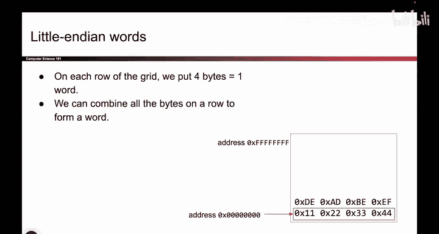
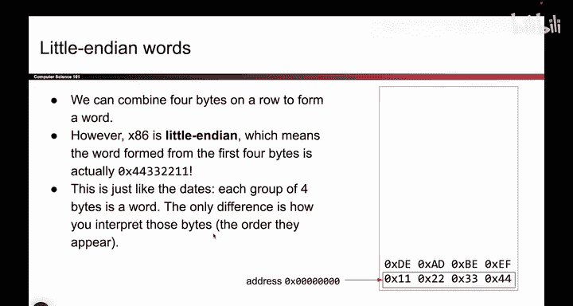
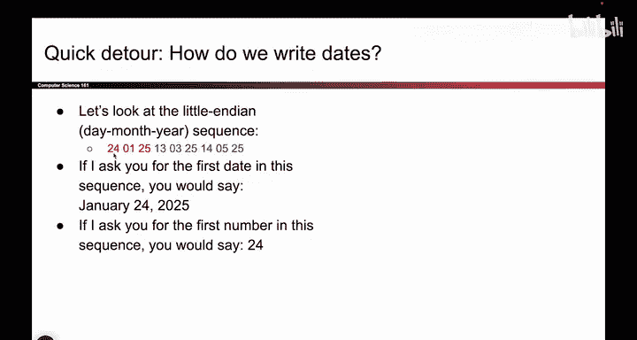
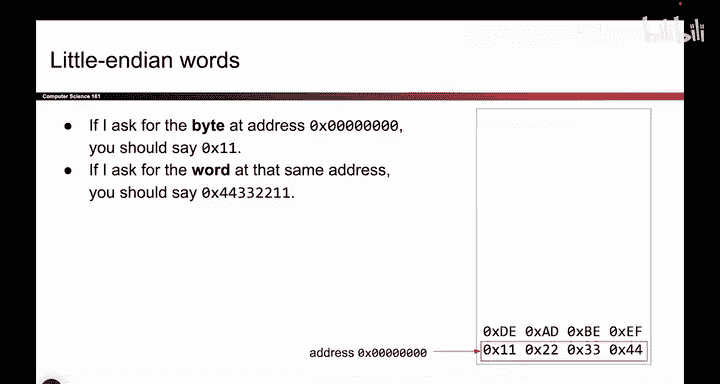
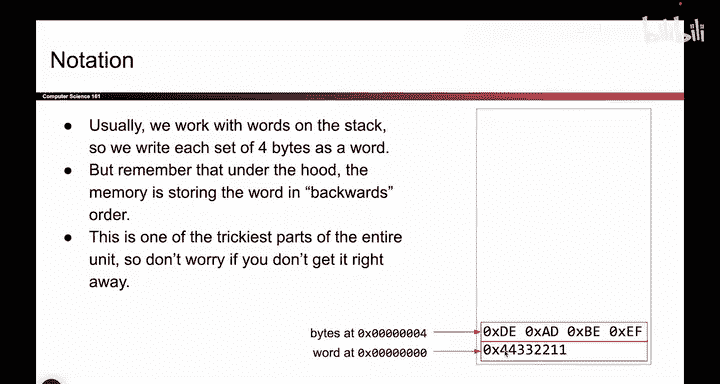

# UCB《计算机安全｜CS 161. Computer Security 2025》中英字幕 - P17：-MemSafety1, Video 3- Endianness.zh_en - GPT中英字幕课程资源 - BV1VhEhzMEPL

O。One more kind of annoying topic that we have to tackle before we can really get into how functions get called is And and this。

 It's annoying。 People always get tripped up by it， but it's something we should talk about。

 So remember from before， we had that nice twodisal grid where we can store memory。

 It's technically just a one dimensional array， but we drew it as a two dimensional grid to look nice。

 And we said that every row of this grid fits 4 bys。 So here's a byte， here's another byte and so on。

 And each byte has a unique address in memory。 So when you put something in that big array of memory。

 it has a unique address。 for example， this by here，1，1， that's that address 0。

 this byte is that address 1。 This bitete is that address 4。😊，And so on。

But sometimes you want to represent data that takes more than a single byte to represent。

 So say you want to represent a number， like an integer。 Well。

 it could be the case that you need more than one B to represent your integer。

 So sometimes what you really want to do is you want to take multiple bytes and combine them to represent something more sophisticated。

 more intelligent。 So instead of reading the bytes one at a time。

 sometimes you want to read the bytes4 at a time。 And this introduces a question that we have to answer。

 which is if I want to read these four bys as a single unit of data。

 I don't want to read the byte separately， I want to read them together because I want to combine them and read them as something interesting like an integer。

 how do I read these bytes as a unit of four bys。 Like what order do I read these bytes in。

 So to answer this question， I'm gonna take a little detour and give you an analogy。

 So let's say there are three dates and you want to communicate them to your。

riendSo you want to communicate to your friend today's date， the date of your midterm。

 the date of your final exam。 But you need to do so only by writing down numbers。

 So you can't write like the word January。 That's not allowed。 So one question is。

 how do you tell your friend these dates。Like， what numbers do you send to your friend。

 So one possibility is I could write the year first， and then the month and then the day。

 so I could write 25，0，1，24。 that represents today's date of January 24，2025。

 And then I do the same thing for the second date and the third date。

 But that's not the only way I could have done it。 So maybe you prefer。

 if I write day month year instead。 So now I'm writing the 24，1， That's the day， and then the01。

 That's the month。 and then the 25。 That's the year。

 So you could have also sent these numbers to your friend。

The question is， which one is better， Maybe you have strong opinions about this。 But ultimately。

 it doesn't really matter which one we use。 The really important thing is that you and I both agree on which one we're using。

 So if you say what you're using year month day， I had also better agree that we are using year month day。

 And that way， when we send numbers to each other。 we know what dates we're trying to represent。

 So you can pick whichever one you want。 You just have to be consistent with your friend。

So it turns out this little exercise that we did is exactly the problem we had from before。

 You have a blob of multiple numbers， like multiple bytes。

 And you want to read this as something more intelligent， like a date。 And the question is。

 in what order do you read these three numbers。 Do you read them year month day or do you read them day month year。

 And the order that you decide to read these determines whether your system is big Indian or little Indian。

 And again， both are okay。 The important thing is just that you agree with everyone else on whether we're using big Indian or little Indian。

 So in both cases， you're reading a chunk of three numbers as something more sophisticated。

 like a date。 And the only difference is how you interpret the numbers。

 What order does the year month day。😊，Appear。

O。So to take the analogy back to our original problem。

 which was reading these for bytes as something like word or an integer。 Well。

 we can play the same trick as before。 So I could either read these starting from the highest address and going down。

 In that case， I would create a number like 4，4，3，3，2，2，1，1。

 or I could have started at the bottom and read 1，1，2，2，3，3，4，4。 And again， either one is okay。

 just like the dates， we just have to agree on one。 And it turns out x 86。

 which is what what we will use in this class， is little Indianian。

 So what that means is when you have this sequence of 4 bytes。

 you should start by reading from the very top。Address， this is your most significant byte。

 So it's the byte that starts up here。 So when I want to read these four things as like an integer or a word。

 what I will do is I'll start by reading the 4，4 and then the 3，3 and then the 2，2 and then the 1，1。

 And it'll kind of feel like you're going backwards It'll feel a little bit confusing that I have to read the number like this。

 But the reason why we're doing it is because of this N D in this problem that we had to solve。😊。

So that's Indian and this， it's going to trip you up once or twice， but you'll get the hang of it。

Okay。So one final point about endn this before I move on is when you have enddnness。

 I can read chunks of bytes like chunks of three numbers as something like a date。 So I could say。

 hey， what's the first date， and you would read three numbers in the specified order and you'd produce a date but you can still ask for individual numbers。

 I could still say， hey， what's the first number， forget dates or anything more sophisticated。

 just tell me the first number。 and you would say 24， that's the first number。

 not thinking about dates or anything， I just want the first number。

 So in the same way that I can also read this is just raw numbers。

 I can also read these bytes in memory as raw numbers。 So if someone says。

 hey give me the byte at address 0， you would say， what's 11。 there it is。

 that's the byte living at address 0，0。 But if I want to word which is a chunk of 4 bytes that can be combined to form something like an integer。

 then you'd have to read from right to left and say 4，4，3，3，2，2，1，1 because。

Someone wants a unit of four B combined together to form something more intelligent。

 So both of these are valid interpretations of accessing things from memory。

 just depends on what you want to access the raw number or the date or the integer。

O。So finally， one final thing is， I guess I said the final earlier。 This is the real final thing。

 Sometimes when people write words， they get lazy。 and instead of writing， you know，1，1，2，2，3，3，4，4。

 and then reading it backwards。 Sometimes people will just write the word like this as shorthand。

 Just remember that under the hood in memory， the 1，1 gets stored at the lowest address。

 and then the 2，2， and then the 3，3 and then the 4，4。 It is tricky。

 But I wanted to call that out so that we don't get confused。😊。

